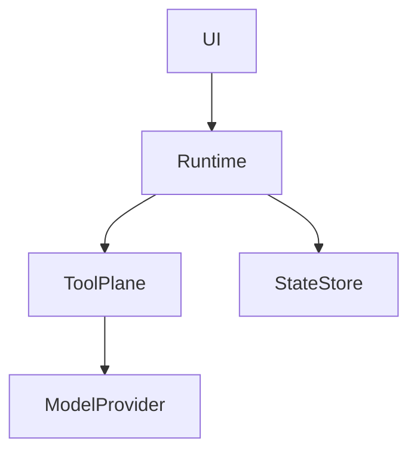

### Task 2: 撰写“解耦、控制面、事件与可追溯”专题

**Files:**
- Create: `docs/ai-coding/coding-agents/design-principles/ui-runtime-decoupling.md`
- Create: `docs/ai-coding/coding-agents/design-principles/tool-protocol-and-control-plane.md`
- Create: `docs/ai-coding/coding-agents/design-principles/event-log-state-and-auditability.md`
- Create: `docs/ai-coding/coding-agents/vendor-notes/claude-code-source-map.md`
- Create: `docs/ai-coding/coding-agents/vendor-notes/opencode-source-map.md`
- Create: `docs/ai-coding/coding-agents/vendor-notes/codex-source-map.md`

**Interfaces:**
- Consumes: 本地源码目录 `claude-code-src/`、`opencode/`、`codex/`
- Produces: 第一组核心专题页与源码地图页

- [ ] **Step 1: 提炼三家在 UI、runtime、protocol、state 上的分层边界**

```md
## 这个机制解决什么问题
## 三家怎么拆 UI 与 runtime
## 为什么 control plane 比 prompt 更关键
```

- [ ] **Step 2: 为每篇专题加入至少一张 Mermaid 图**



- [ ] **Step 3: 写源码地图页，列出每家与该专题直接相关的模块**

Run: `rg --files <repo> | rg '(tool|protocol|state|event|session|thread|goal|ui|tui|app-server)'`
Expected: 每家文档都能给出清晰的模块入口

- [ ] **Step 4: 自检是否避免写成“只是 prompt 工程”**

Run: `rg -n "prompt.*获胜|只是 prompt|单靠 prompt" docs/ai-coding/coding-agents/design-principles`
Expected: 没有把系统能力错误简化为纯提示词工程


