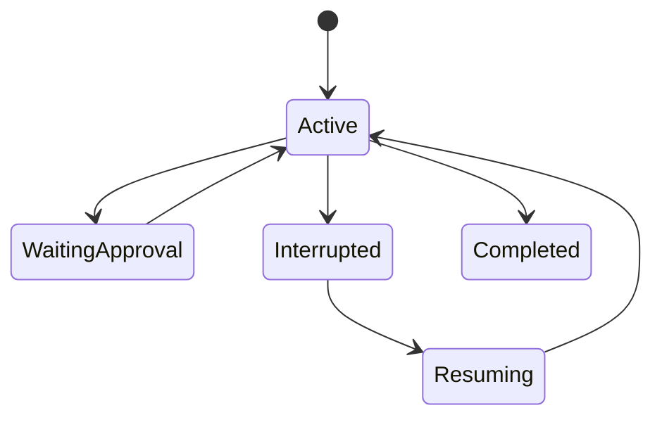

### Task 3: 撰写“中断恢复、权限审批、沙箱隔离”专题

**Files:**
- Create: `docs/ai-coding/coding-agents/design-principles/interrupt-resume-and-traceability.md`
- Create: `docs/ai-coding/coding-agents/design-principles/permission-approval-and-human-override.md`
- Create: `docs/ai-coding/coding-agents/design-principles/sandbox-and-execution-isolation.md`

**Interfaces:**
- Consumes: 现有 `agent-task-and-goal-strategies.md`、`source-evidence-and-code-index.md`、公开 issue 与官方文档
- Produces: 第二组核心专题页

- [ ] **Step 1: 明确区分中断、暂停、恢复、续跑、可追溯**

```md
中断是当前回合被打断，恢复是从保存状态继续，续跑是系统主动开启下一轮，可追溯是事后能回放执行依据。
```

- [ ] **Step 2: 用 Mermaid 画状态流或时序图**



- [ ] **Step 3: 写清楚 approval policy、human override、sandbox scope 的差别**

Run: `rg -n "approval|permission|sandbox|escalation|goal|resume" docs/ai-coding/coding-agents/design-principles`
Expected: 三个概念有清晰边界，没有混写

- [ ] **Step 4: 纳入真实公开失效面**

```md
- cancel 后继续跑
- hook 校验失败导致无法正常停止
- 非交互环境与桌面环境的命令边界不同
```


