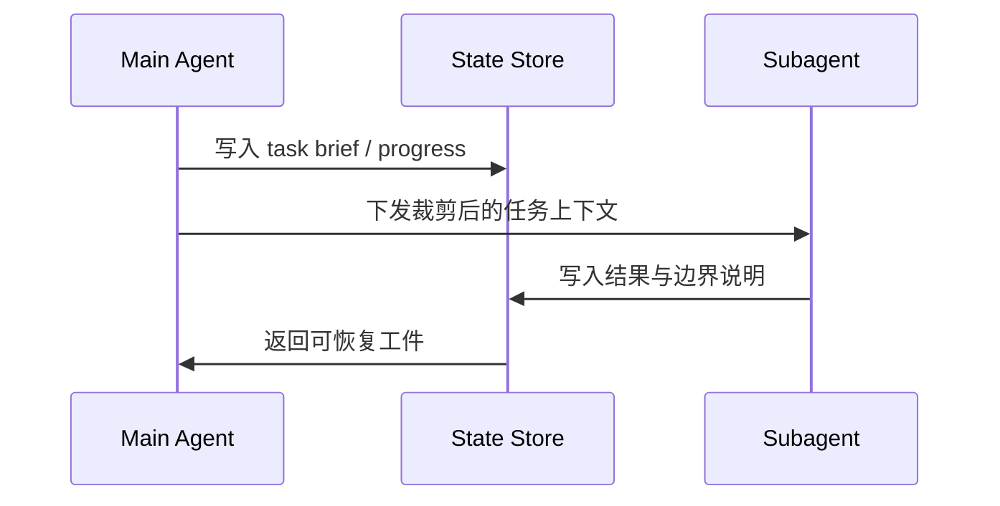

### Task 4: 撰写“上下文、记忆、subagent 与评估”专题

**Files:**
- Create: `docs/ai-coding/coding-agents/design-principles/context-management-and-compaction.md`
- Create: `docs/ai-coding/coding-agents/design-principles/memory-rules-and-project-instructions.md`
- Create: `docs/ai-coding/coding-agents/design-principles/subagent-handoff-and-orchestration.md`
- Create: `docs/ai-coding/coding-agents/design-principles/evaluation-observability-and-regression.md`
- Create: `docs/ai-coding/coding-agents/design-principles/retry-recovery-and-failure-handling.md`

**Interfaces:**
- Consumes: 本地源码中的 context/session/thread/goal/todo/task 模块，以及公开资料中的经验和问题讨论
- Produces: 第三组核心专题页

- [ ] **Step 1: 写清楚“规则文件、记忆、上下文压缩”三者的边界**

```md
规则文件是高优先级约束，记忆是跨会话或跨线程状态，上下文压缩是 token 预算下的重排与丢弃策略。
```

- [ ] **Step 2: 用 Mermaid 画上下文预算与 subagent handoff 图**



- [ ] **Step 3: 总结 retry 与 recovery 的设计原则**

Run: `rg -n "retry|recover|context|compact|todo|task|goal|subagent" docs/ai-coding/coding-agents/design-principles`
Expected: 能覆盖重试边界、失败分类、恢复证据和子代理交接

- [ ] **Step 4: 写出评估与回归章节**

```md
至少覆盖：恢复后重复执行、压缩后丢目标、审批策略绕过、subagent 漏交接。
```


