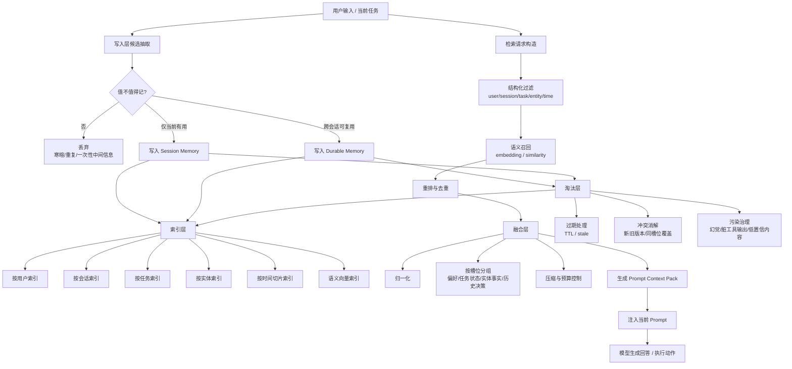
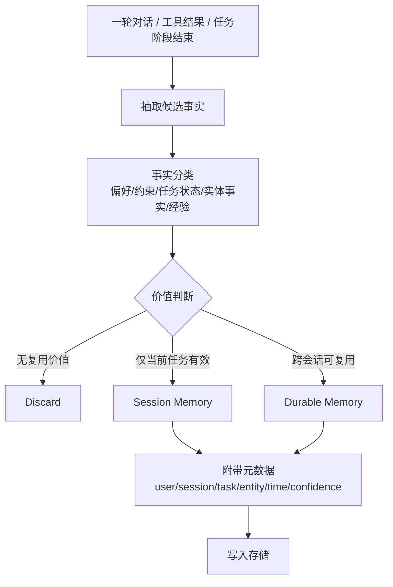
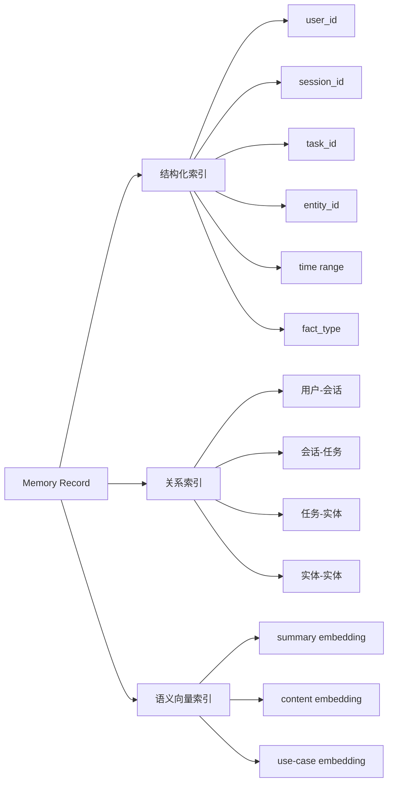
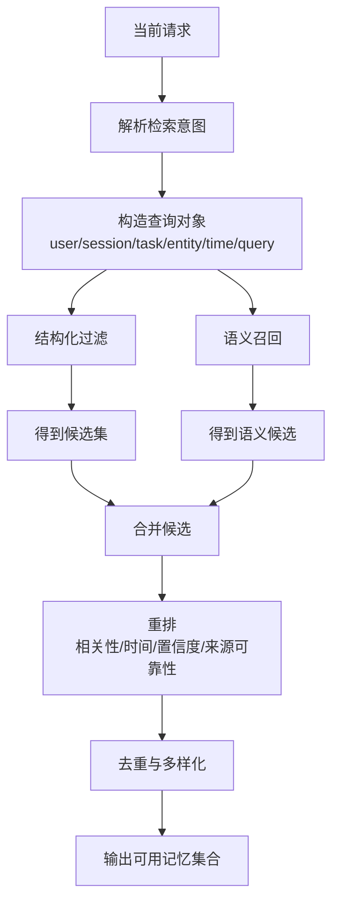
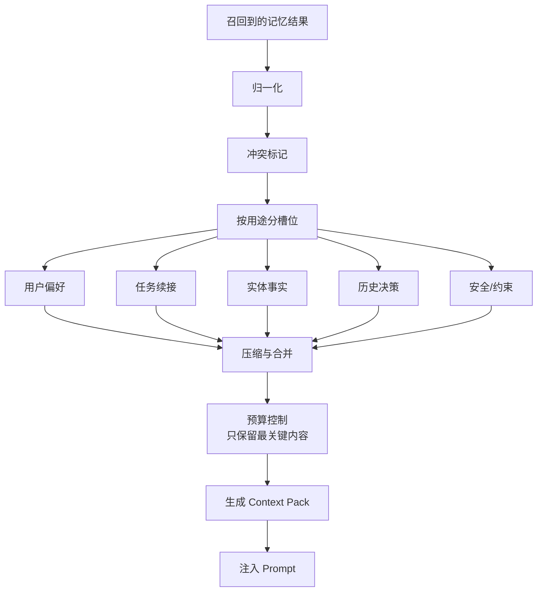
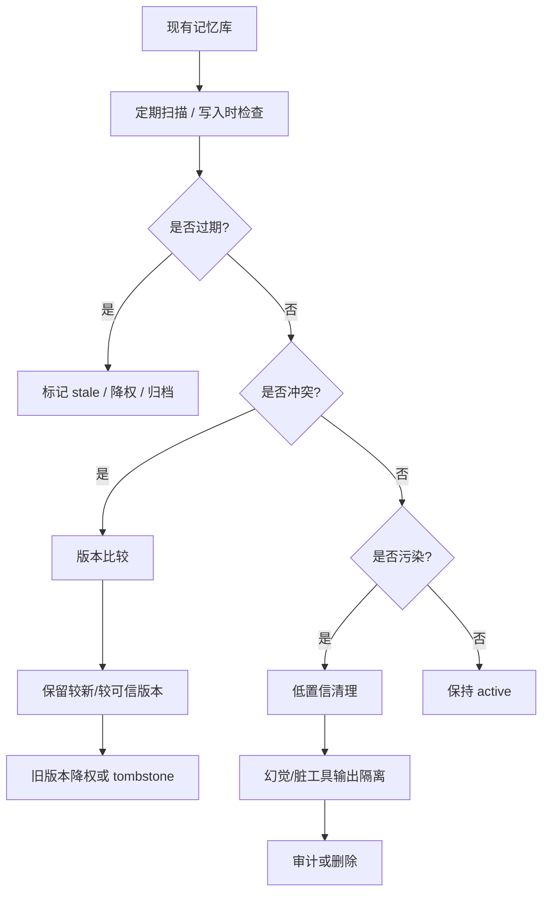
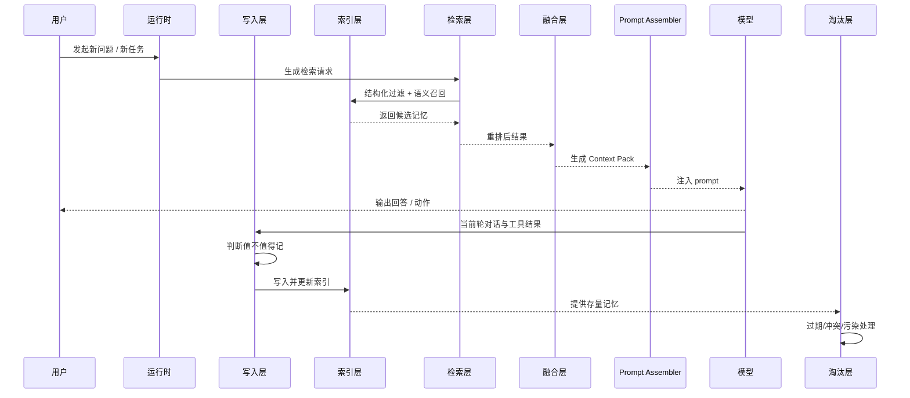

可以，直接用流程图来解释这套“五层记忆系统”。

## 总体流程图

---

## 这张图怎么理解

### 1. 写入层

不是把所有对话都存起来，而是先做一次判断：

* 这句话是不是长期有用
* 只是当前任务临时有用
* 还是纯噪声

所以写入层本质上是一个“记忆闸门”。

---

## 写入层内部流程图

### 核心点

写入层只保存“事实”，不保存整段聊天原文。
比如：

* “用户喜欢先看结论，再看细节” → 值得记
* “谢谢你，明白了” → 不值得记
* “这次报错根因是连接池耗尽” → 值得记
* “我先试试看” → 不值得记

---

## 2. 索引层

索引层不是一个单独向量库，而是多维索引系统。

### 核心点

索引层要支持两种能力同时存在：

* **切片能力**：先按用户、会话、任务、实体、时间缩小范围
* **模糊能力**：再用语义相似度把相关事实召回出来

---

## 3. 检索层

检索层不是“直接 top-k 相似搜索”，而是组合式检索。

### 这里为什么一定要两段式

因为只做结构化过滤会漏掉“措辞不一样但意思相关”的内容。
只做语义召回又会把别的任务、别的实体、很久以前的旧事实也带进来。

所以合理的顺序通常是：

**先过滤，再召回，再重排。**

---

## 4. 融合层

融合层是整个系统最容易被忽视的一层。

它的职责不是“把检索结果拼起来”，而是把它们转换成模型真正能吃的 prompt 上下文。

### 为什么要融合层

因为模型并不擅长直接消费一堆原始数据库记录。
模型更擅长消费这种格式：

* 用户偏好
* 当前任务延续信息
* 当前实体的关键事实
* 相关历史决策
* 冲突与不确定点

也就是说，融合层做的是 **“机器可检索” → “模型可理解”** 的转换。

---

## 5. 淘汰层

淘汰层不是垃圾桶，而是质量控制系统。

### 淘汰层主要解决三件事

**过期**

* 旧任务状态不能一直当真
* 环境事实可能变更

**冲突**

* 新旧事实不一致
* 同一实体同一槽位只能有一个主版本

**污染**

* 模型猜的内容被误写进去
* 工具长输出里的噪声被当作事实
* 一次性中间推理混进长期记忆

---

## 把五层串成一条完整执行链

---

## 一句话总结这套流程图

这套系统不是：

**“用户说了什么，我都存起来。”**

而是：

**“用户和系统产生了很多信息，我先筛选出值得保留的事实；再把这些事实做多维索引；在需要时用过滤+语义联合召回；再压缩成模型可消费的上下文；最后持续清理过期、冲突和污染。”**

所以它的目标不是“记得多”，而是：

**在正确时刻，拿回正确事实。**

如果你要，我下一条可以继续给你一版 **更适合放进文档/汇报里的架构图**，比如“模块框图版”或者“带数据库与服务边界的部署图版”。
