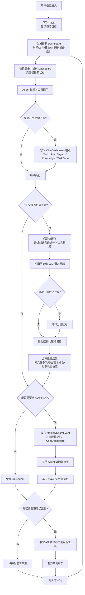

可以把这篇文章里的“上下文管理策略”理解成一条持续运行的 Agent 上下文流水线：**先保留最新环境、清理过时信息、在超限前压缩历史、把关键节点单独锚定、把重复结果进一步合并、在多 Agent 间共享压缩记忆、再按需动态扩展工具集合**。文章将其总结为七个策略：上下文压缩、保留、替换、锚定、合并、共享、工具动态扩展。([CSDN博客][1])

这张图对应的核心逻辑可以简化成 4 层：

### 1. 先让 Agent 永远看到“最新现场”

文章提出用 **Dashboard 固定区域** 来聚合当前时间、最近操作、IDE 状态、终端状态、浏览器状态和操作指引，减少 Agent 反复调用工具“回头查历史”的成本。实践中，这样做能减少无效状态查询，并提升执行效率。([CSDN博客][1])

同时，系统会做 **上下文替换**：找到最新用户消息，把新的 `<dashboard>` 注入进去，并删除历史消息里已经过时的 dashboard，只让模型看到“此时此刻”的状态，而不是一堆陈旧快照。这样既节省 token，也避免 Agent 基于旧状态做决策。([CSDN博客][1])

### 2. 一旦上下文变长，就压缩“旧历史”而不是压缩“最新状态”

文章强调不是简单截断，而是做 **LLM 驱动的语义压缩**：保留任务概览、已完成步骤、当前状态、下一步计划等关键内容；并保留最近对话和最后一次工具调用作为 **热缓存**。如果一次压缩仍超长，就继续 **递归分批压缩**。对图片等多模态内容，还会先提取再还原。([CSDN博客][1])

也就是说，系统的原则是：

**最新状态直接保留，旧历史语义浓缩，极端情况下递归压缩。** ([CSDN博客][1])

### 3. 把“重要节点”单独锚定，防止目标漂移

仅靠压缩还不够，因为任务目标、计划更新、关键发现、检索到的知识等，可能散落在长对话里。所以文章引入 **ChatDashboard / 上下文锚定**，把这些关键信息按类型收集成结构化内容，例如 Task、Plan、Agent、Knowledge、TaskDone，并在压缩时作为 `<conversation_context>` 参考。这样压缩模型更容易判断哪些信息必须保留。([CSDN博客][1])

这个策略的作用其实是：

**压缩负责“瘦身”，锚定负责“定向”。**
没有锚点，压缩可能越压越偏；有锚点，任务目标和关键脉络更不容易丢。这个也是文章强调“防止目标漂移”的原因。([CSDN博客][1])

### 4. 再把重复内容折叠，并支持协作和扩容

文章在压缩之后，又做了一层 **上下文合并**：
同一个文件被修改很多次，不必都保留；重复试错的命令，不必全量记录；但“失败 → 解决 → 成功”的 troubleshooting 序列要完整保留。为此它把文件操作、命令执行等结构化成 XML，再按优先级合并。文章称这能在压缩后继续减少 30% 到 40% 的 token。([CSDN博客][1])

在多 Agent 场景里，系统通过 **MemoryShareEvent** 共享“压缩后的记忆 + ChatDashboard”，这样新 Agent 不必重新探索项目和环境。共享的是压缩记忆，而不是整段历史，因此不会把上下文再次撑爆。([CSDN博客][1])

最后，文章还把工具管理也纳入上下文管理：面对 100+ 工具，如果全塞进 prompt，会占掉大量 token。所以它用 **工具依赖 DAG**，只先启用基础工具；当 Agent 使用某些工具后，再逐步解锁依赖它们的高级工具，而且“只增不删”。这样把工具描述也做成了按需加载。([CSDN博客][1])

---

## 一句话总结这篇文章的策略框架

这篇文章的思路不是“单点优化上下文”，而是把上下文当成一个持续演化的系统来管理：

**保留最新现场 → 清理过时快照 → 压缩旧历史 → 锚定关键节点 → 合并重复结果 → 在 Agent 间共享 → 按需扩展工具。** ([CSDN博客][1])

如果你愿意，我可以继续把它改成一版更适合汇报的版本，比如：

1. “产品经理能看懂”的极简流程图
2. “工程实现版”的分层架构图
3. “PPT 一页图”样式的中文版图示

[1]: https://blog.csdn.net/2401_84204413/article/details/153682309 "〖万字长文〗AI Agent上下文管理七大策略：从压缩到动态扩展的完整指南！_ai agent中上下文压缩模型选哪个-CSDN博客"
