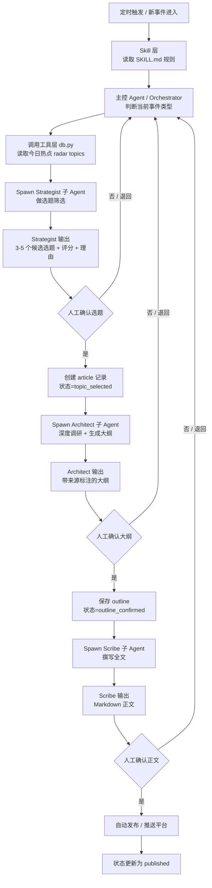
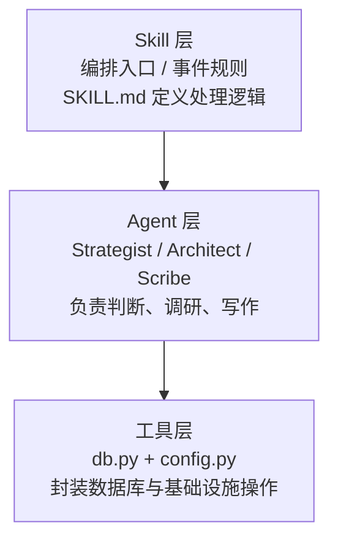
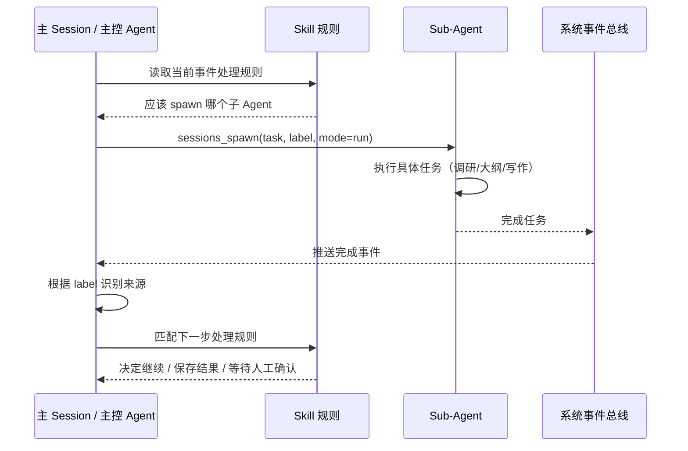
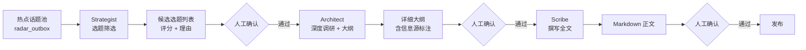
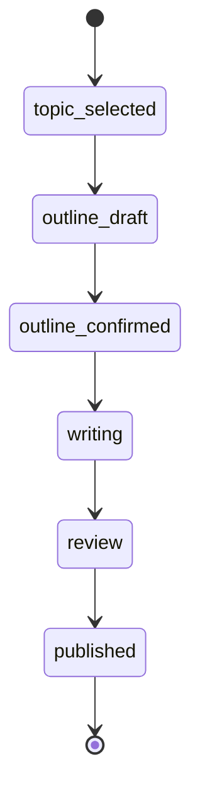
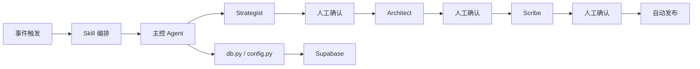

我先按文章里的实现，给你整理成两个流程图：一个看**多 Agent 编排**，一个看**任务状态机**。由于原始微信链接无法直接打开，我参考了两篇内容高度一致的公开镜像/转载来还原结构。([cnblogs.com][1])

## 1）整体多 Agent 编排流程图

这套系统的主线是“**事件驱动 + 三次人工卡点**”：定时触发后，主控 Agent 依据 `SKILL.md` 中的事件规则编排流程，依次调用 Strategist、Architect、Scribe 三个执行 Agent；每个关键产出都需要人工确认后才能进入下一步，最后自动发布。([cnblogs.com][1])

---

## 2）三层架构图

文章把系统拆成三层：
**Skill 层**负责“流程规则与编排入口”，**Agent 层**负责“思考与执行”，**工具层**负责“数据库和基础设施抽象”。这样做的原因是安全、可测、可维护：Agent 不直接接触数据库凭证或 SQL，而是通过 `db.py` 子命令间接操作 Supabase。([cnblogs.com][1])

---

## 3）Sub-Agent 接力机制流程图

这是文章里最关键的一段。

文章中明确说，主 Agent 并不自己完成所有任务，而是通过 `sessions_spawn(...)` 拉起子 Agent；子 Agent 完成后，系统会自动把“完成事件”推回主 Session，主 Agent 再根据 `label` 识别是哪个任务完成，并按照 Skill 规则决定下一步。这就是整条 Pipeline 能持续“接力”跑下去的关键。([cnblogs.com][1])

---

## 4）三个执行 Agent 的职责分工图

三个 Agent 分工非常清晰：
Strategist 只做“选题判断”，输入是热点话题，输出是候选主题和评分；Architect 只做“调研 + 大纲”，且强调必须先调研再产出大纲；Scribe 则基于确认后的大纲与材料撰写完整文章。([cnblogs.com][1])

---

## 5）任务状态机流程图

文章的数据层使用 Supabase，并在 `articles` 表里通过 `status` 字段维护文章生命周期。文中给出的状态流转是：`topic_selected → outline_draft → outline_confirmed → writing → review → published`。这让系统在任何时刻都知道一篇文章处于哪一个阶段。([cnblogs.com][1])

---

## 6）你可以把这篇文章总结成一句话

它不是“一个万能 Agent 写到底”，而是：

**Skill 负责编排规则，主控 Agent 负责调度，Sub-Agent 负责单点执行，工具层负责安全落库，人类在关键节点做确认。** ([cnblogs.com][1])

## 7）如果你想拿去做分享，可以直接用这版极简图

如果你要，我可以继续把它整理成一页更适合 PPT 的“架构图版”，或者改成 draw.io / PlantUML 风格。

[1]: https://www.cnblogs.com/jarvis-ai-lab/p/19838203 "用 AI Agent 搭建微信公众号全自动内容 Pipeline：从选题到发布的事件驱动架构实战 - xiaochuran_ai - 博客园"
