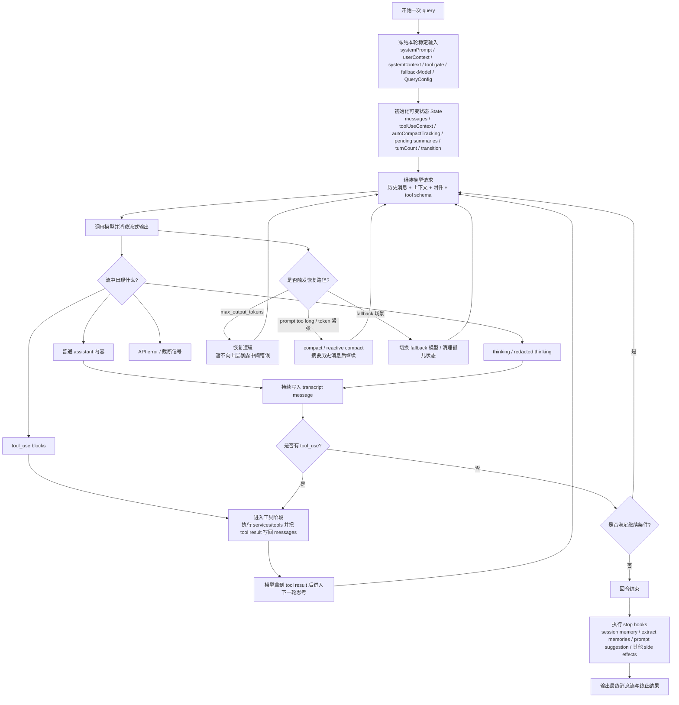

我没法直接打开你给的微信文章原文，所以这里是基于可访问的参考资料对 **queryloop / Query Loop** 的交叉整理：主要依据 AzrMedit0x 的源码拆解文章，并用公开的 Claude Code 技术解析与第三方总结做了相互印证。整体上，**query loop 不是“调用一次模型拿一次结果”**，而是一个围绕消息流、工具调用、压缩与恢复机制构建的**状态机循环**。([azrmedit0x.top][1])

## 一张流程图看懂 queryloop

## 用业务语言解释这张图

### 1) 先“冻住”本轮不会变的输入

进入 `query()` 后，系统先快照化一组稳定输入，比如 `systemPrompt`、`userContext`、`systemContext`、是否允许用工具、fallback model 和 `QueryConfig`。连一些运行期开关也会被快照化，例如是否启用流式工具执行、是否发送 tool use summary、是否开启 fast mode。这样做是为了让**同一轮 query 的行为稳定**，不被中途设置变化打断。([azrmedit0x.top][1])

### 2) 再维护一份显式可变状态

`query.ts` 会显式维护 `State`，其中包括 `messages`、`toolUseContext`、`autoCompactTracking`、`pendingToolUseSummary`、`stopHookActive`、`turnCount`、`transition` 等。也就是说，query loop 的推进依赖的是**显式状态迁移**，而不是散落在代码各处的隐式全局变量。([azrmedit0x.top][1])

### 3) 主循环每轮都做四件事

每一轮的主干非常稳定：

1. 组装模型输入：把历史消息、上下文、附件和工具 schema 拼成请求。
2. 消费模型的流式输出：输出里可能有普通文本、thinking、tool use、错误信号。
3. 执行工具：如果模型发出了 `tool_use`，就进入工具层执行，并把 `tool_result` 写回消息历史。
4. 判断是否继续：如果刚拿到工具结果、需要 continuation、发生输出截断恢复，或者刚做完 compact，就继续下一轮。([azrmedit0x.top][1])

### 4) 它把“消息”当成第一公民

在这个体系里，request start、assistant streaming 片段、tool use / tool result、compact 边界、恢复消息、tool use summary，都会进入同一条事件流。因此它既能被 TUI 消费，也能被 SDK/结构化 I/O 消费，还能服务远端会话同步。换句话说，**query loop 的统一抽象不是函数回调，而是消息流**。([azrmedit0x.top][1])

### 5) 工具调用不是外挂，而是主路径的一部分

AzrMedit0x 的 Query Loop 文和后续“工具契约与注册 / 工具执行与状态传播”系列共同说明：工具不是简单函数，而是带有 schema、提示文案和执行约束的运行时对象；query loop 看到 `tool_use` 后，会把控制权转到工具执行层，再把结果重新塞回消息历史，驱动模型继续思考。公开技术解析还补充了一个关键点：在 Claude Code 的工程实践里，某些“并发安全”的读类工具甚至可以在流式输出尚未结束时就提前执行，以减少总延迟。([azrmedit0x.top][2])

### 6) 恢复路径不是异常分支，而是内建能力

这是 query loop 最值得借鉴的地方之一。资料显示它至少内建了几类恢复路径：

* `max_output_tokens`：有专门恢复逻辑，并且会**暂不把中间错误暴露给上层**，避免调用方误以为整个会话已经失败。
* `prompt too long` 或 token 紧张：进入 `compact / reactive compact`，把历史消息摘要化，再继续执行。
* 模型不可用或过载：会触发 fallback 相关路径。

这说明在它的设计里，**压缩、恢复、fallback 都是主路径的一部分**，而不是边角补丁。([azrmedit0x.top][1])

### 7) 一轮结束后还没完全结束

回合完成后，`stop hooks` 还可能触发 session memory、memory extraction、prompt suggestion 等后处理逻辑。所以“query 完成”不只是得到最后一条 assistant message，而是**完成整轮副作用处理后**才真正结束。([azrmedit0x.top][1])

## 你可以把 queryloop 理解成这个公式

**queryloop = 消息状态机 + 模型流式采样 + 工具行动闭环 + 压缩/恢复机制 + 回合结束钩子**。这个总结与 AzrMedit0x 对 `query.ts` 的描述一致，也和公开技术解析中“外层 QueryEngine 管会话、内层 queryLoop 管一次完整思考-行动-观察循环”的说法相吻合。([azrmedit0x.top][1])

## 如果你要把它讲给团队听，可以用这三句话

1. **它不是一次请求，而是一个 while-loop 状态机。**
2. **它的核心单位不是字符串，而是消息流。**
3. **工具、压缩、恢复都不是异常处理，而是主执行路径。** ([azrmedit0x.top][1])

要是你愿意，我下一条可以直接把它改写成一版更适合 PPT 的“4 页讲稿版”，或者画成更适合文档粘贴的横向流程图。

[1]: https://www.azrmedit0x.top/2025/03/31/src-architecture/02-core-runtime/01-query-loop/ "02.1 Query Loop | AzrMedit0x,冥思构造体"
[2]: https://www.azrmedit0x.top/2025/03/31/src-architecture/02-core-runtime/02-tool-contract-and-registry/ "02.2 工具契约与注册 | AzrMedit0x,冥思构造体"
