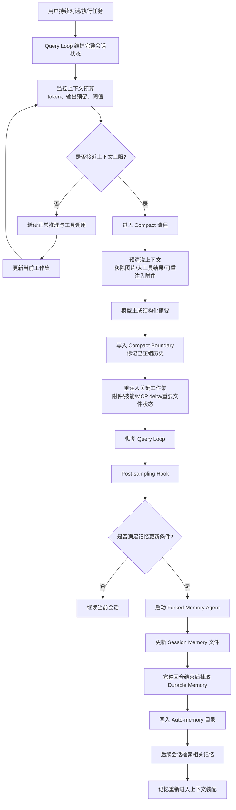
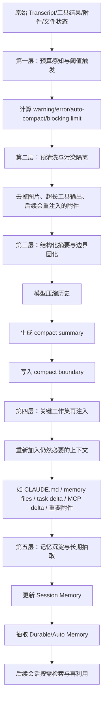
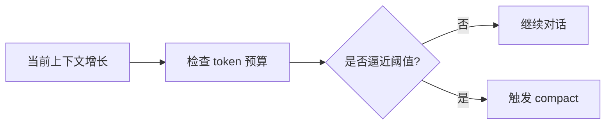
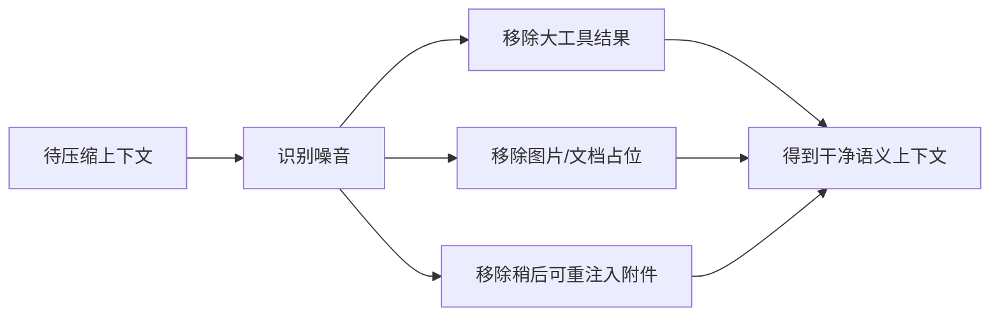
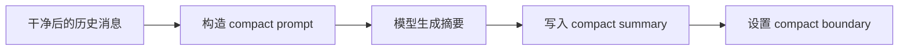
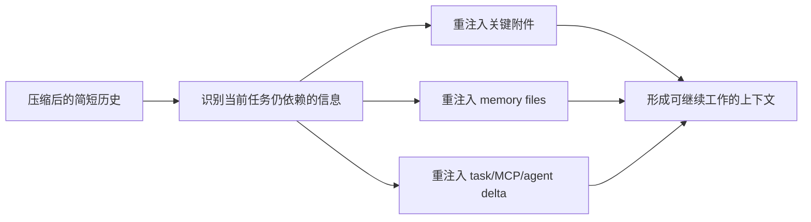
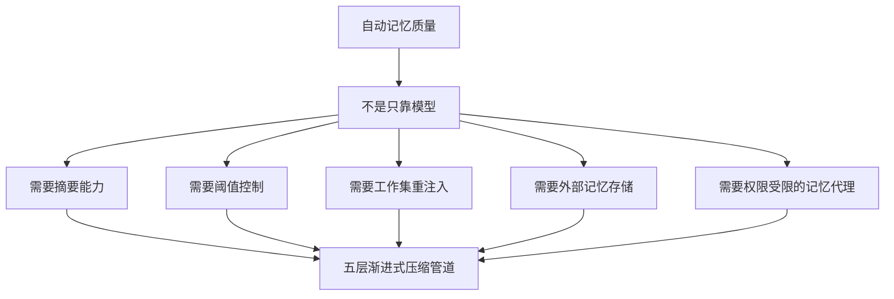

可以，下面我用两个流程图分别说明：

1. **Claude Code 如何保证“自动记忆质量”**
2. **五层渐进式压缩管道如何工作**

---

## 一、自动记忆质量保障机制

### 这张图想表达什么

核心不是“模型自己记住”，而是四个模块一起保证质量：

* **模型**：负责摘要、提炼、改写
* **Runtime**：负责何时触发压缩、何时恢复
* **Attachments/工作集系统**：负责把重要上下文重新挂回去
* **Memory 存储层**：负责把可复用信息沉淀成外部记忆

所以它更像：

**模型 = 压缩器**
**Runtime = 调度器/质控器**
**Attachments = 工作集装配器**
**Memory Store = 长期存储器**

---

## 二、五层渐进式压缩管道

---

## 三、把“五层”再翻成更容易理解的人话

### 第 1 层：先判断“现在该不该压”

这一层解决的是：**时机问题**。
压太早，丢细节。压太晚，直接爆窗。

---

### 第 2 层：先把垃圾和噪音清掉

这一层解决的是：**别让模型拿脏输入做摘要**。
否则摘要器会把注意力浪费在不该记的内容上。

---

### 第 3 层：把长历史压成“可恢复”的结构化摘要

这一层解决的是：**不是随便写一段总结，而是生成带边界的会话状态**。
这样系统知道哪些历史已经被压缩。

---

### 第 4 层：把真正重要的工作集放回去

这一层最关键。
因为**摘要只保留“故事梗概”还不够，系统还得保留“继续干活需要的工作集”**。

---

### 第 5 层：把临时上下文变成长期记忆

这一层解决的是：**从“当前能继续聊”升级到“以后还能复用”**。

---

## 四、两部分之间的关系

也就是说：

* **“自动记忆质量”** 是目标
* **“五层渐进式压缩管道”** 是实现这个目标的主干机制

---

## 五、一句话总结

如果只靠模型能力，Claude Code 最多做到“会总结”。
但它真正做到的是：

**会在对的时机压缩 → 压缩前清洗噪音 → 压成可恢复结构 → 把关键工作集补回 → 把值得保留的信息沉淀成长期记忆。**

所以它不是“模型自动记忆”，更准确说是：

**模型压缩 + runtime 调度 + 工作集重注入 + 外部 memory 存储** 的联合系统。

如果你要，我下一条可以把这两张流程图改成 **更适合发公众号/博客的横向架构图版本**。
