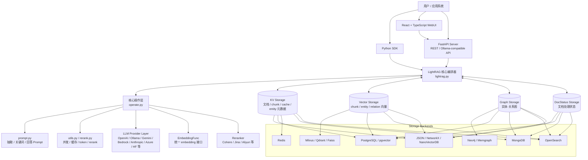
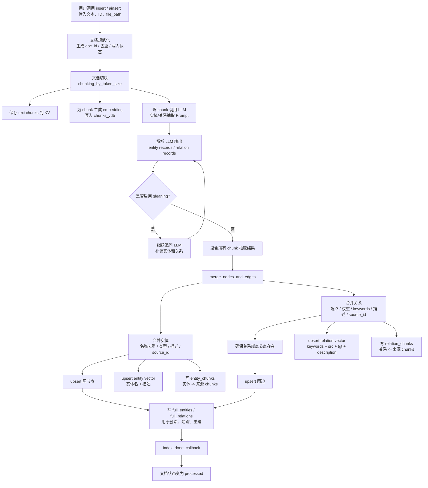
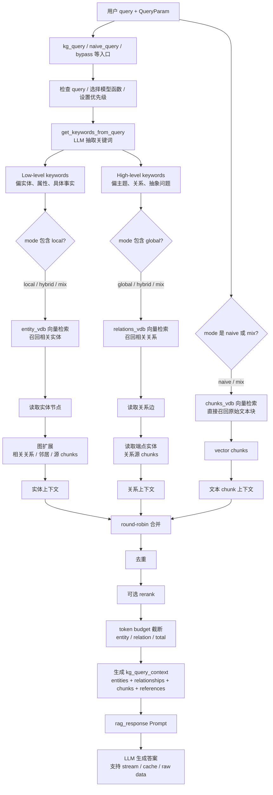
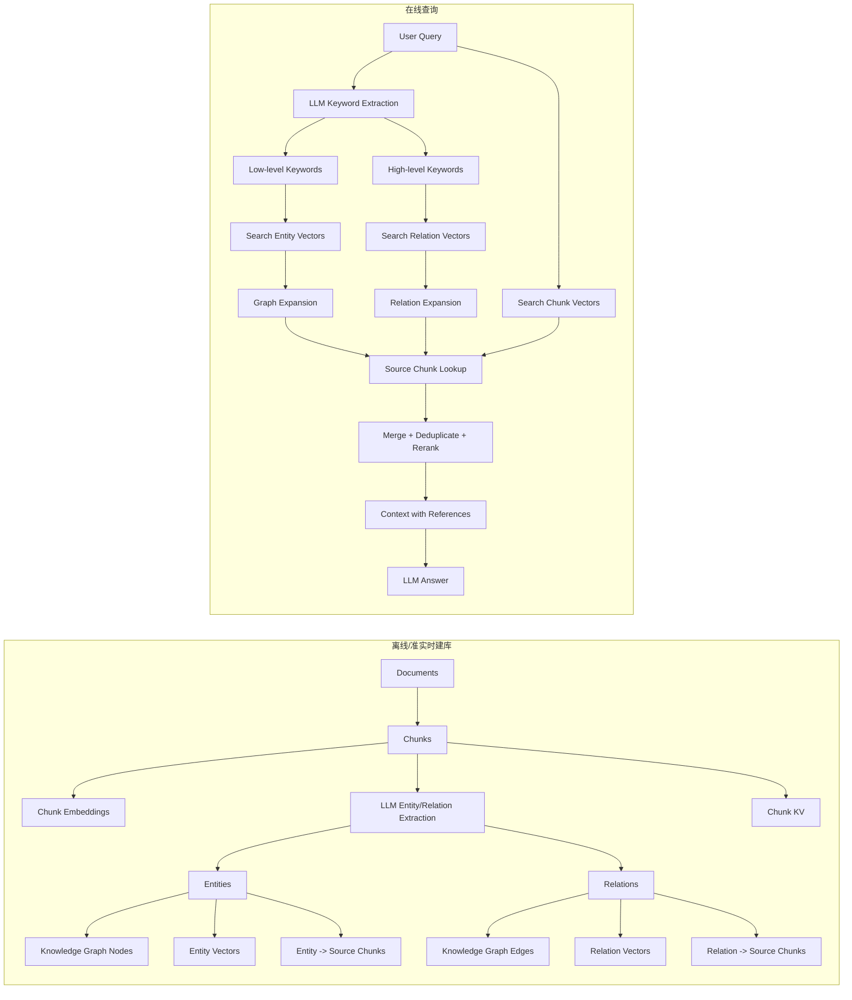
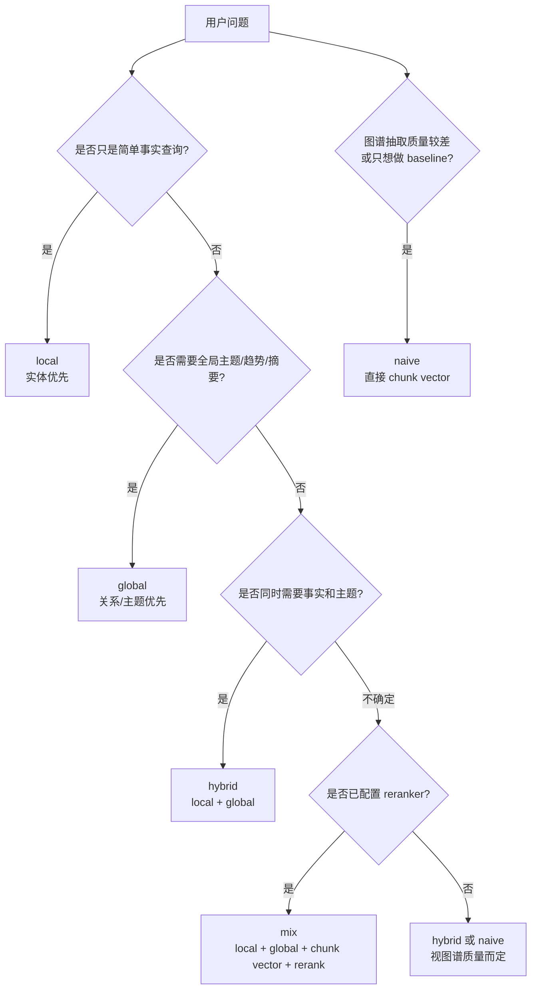
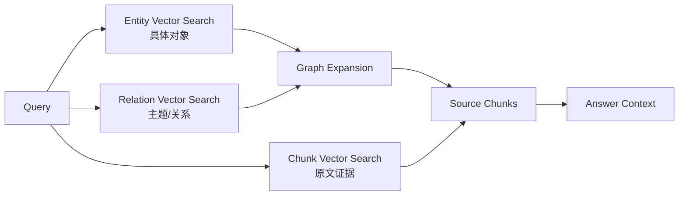
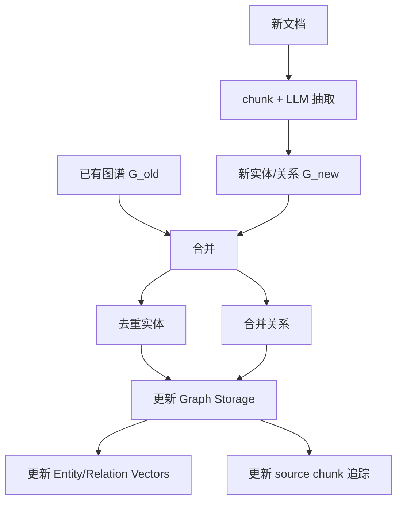
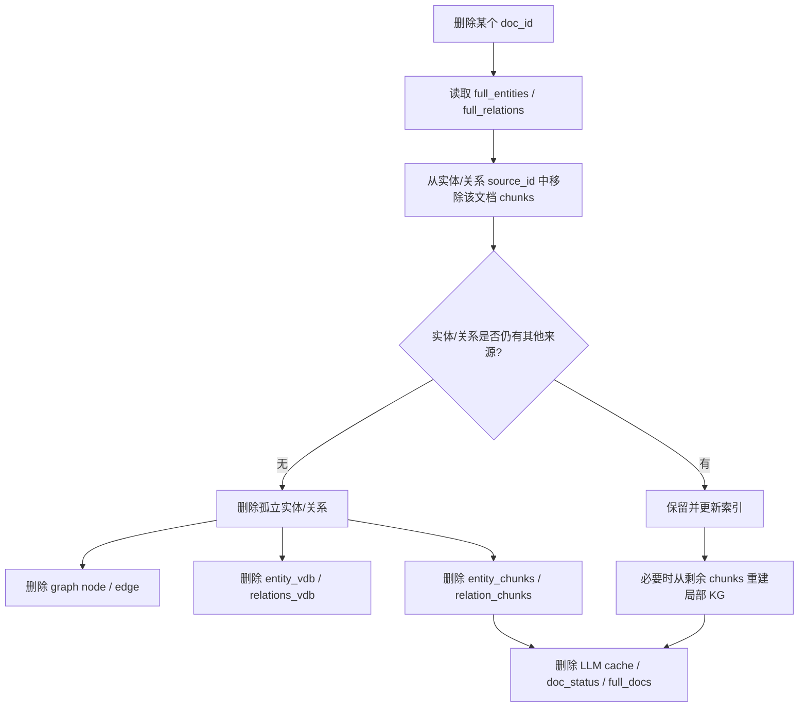
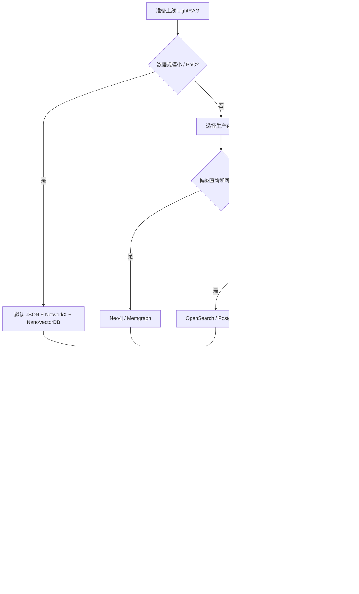

下面是对 **HKUDS/LightRAG** 的项目级分析。我的总体判断是：**LightRAG 不是单纯“向量库 + chunk 检索”的 RAG 框架，而是一个以实体—关系图谱为核心索引、向量检索为召回手段、再用 LLM 做关键词分解和答案生成的 Graph-enhanced RAG 系统**。它的核心价值在于把文档切块后的局部语义，进一步抽取成实体、关系、主题关键词和可追溯文本片段，从而同时支持“事实型精确查询”和“主题型全局查询”。论文也明确把它定位为结合图结构与向量检索、支持低层/高层双层检索和增量更新的 RAG 框架。([arXiv][1])

---

## 1. 项目定位与当前状态

LightRAG 的 README 标题是 **“Simple and Fast Retrieval-Augmented Generation”**，但从代码和论文看，它已经发展成一个较完整的 RAG 平台：包含 Python SDK、FastAPI Server、React/TypeScript WebUI、Ollama-compatible API、多后端存储、多 LLM/Embedding/Reranker 适配，以及面向生产的 Docker、环境向导、认证、评测和可观测性集成。README 显示项目已经支持 WebUI 进行文档索引、知识图谱探索和 RAG 查询，也支持通过 Server 提供 API 和 Ollama 兼容接口。([GitHub][2])

截至我查看仓库时，项目最新 release 为 **v1.4.15，发布日期为 2026-04-19**；README 近期更新还提到 OpenSearch 统一存储、Docker 本地部署 embedding/reranking/storage、RAGAS、Langfuse、文档删除自动重建知识图谱、引用支持、MongoDB、PostgreSQL、Neo4J、WebUI 等功能。([GitHub][2])

---

## 2. 总体架构

LightRAG 的核心分层可以概括为：



代码结构上，`lightrag.py` 是主编排入口，`operate.py` 承担实体/关系抽取、chunking、多模式检索和答案生成等核心逻辑；`base.py` 定义存储抽象；`kg/` 目录提供 JSON、NetworkX、Neo4j、PostgreSQL、MongoDB、Redis、Milvus、Qdrant、Faiss、Memgraph、OpenSearch 等实现；`llm/` 目录提供多家模型服务适配；`api/` 目录是 FastAPI Server；WebUI 则是 React 19 + TypeScript。([GitHub][3])

---

## 3. 四类核心存储：LightRAG 的状态模型

LightRAG 不是只维护一个向量库，而是把 RAG 索引拆成四类存储：

| 存储类型               | 作用                              | 典型内容                                                          |
| ------------------ | ------------------------------- | ------------------------------------------------------------- |
| KV Storage         | 保存文档、chunk、LLM cache、实体/关系辅助元数据 | full docs、text chunks、LLM cache、entity chunks、relation chunks |
| Vector Storage     | 保存可检索向量                         | chunk 向量、entity 向量、relation 向量                                |
| Graph Storage      | 保存知识图谱                          | 节点=实体，边=关系                                                    |
| Doc Status Storage | 保存文档处理状态                        | queued、processing、processed、failed 等状态                        |

官方架构说明中明确列出这四类存储：`KV_STORAGE` 用于 LLM cache、文本块和文档信息；`VECTOR_STORAGE` 用于实体、关系和 chunk embeddings；`GRAPH_STORAGE` 用于实体—关系图；`DOC_STATUS_STORAGE` 用于处理状态。同时，项目通过 workspace 隔离不同数据集，文件型后端用子目录，数据库型后端则通过前缀、字段或 payload 隔离。([GitHub][3])

抽象接口也能看出这种设计：`BaseVectorStorage` 定义 embedding、cosine threshold、query/upsert/delete 等能力；`BaseKVStorage` 定义 get/upsert/delete/filter_keys；`BaseGraphStorage` 定义节点、边、度数、批量读取等图操作。([GitHub][4])

---

## 4. 建库 / Indexing 流程详解

LightRAG 的建库流程可以理解为：**文档 → chunk → LLM 抽取实体/关系 → 合并去重 → 图谱索引 + 向量索引 + 源 chunk 追踪**。



### 4.1 文档切块

`operate.py` 中的 `chunking_by_token_size` 先对文本 tokenization，然后按 `chunk_token_size - chunk_overlap_token_size` 的步长滑窗切块。`LightRAG` 默认配置中，chunk token size 是 **1200**，overlap 是 **100**；论文实验也采用了 1200 token chunk size。([GitHub][5])

这一步输出的 chunk 包含：

* `tokens`
* `content`
* `chunk_order_index`

这些 chunk 随后会被保存到 KV 存储，并可写入 chunk 向量库，供 `naive` 或 `mix` 检索使用。([GitHub][5])

### 4.2 实体与关系抽取

LightRAG 的关键不是只把 chunk embedding 后丢进向量库，而是对每个 chunk 调用 LLM 做结构化抽取。代码中的 `extract_entities` 会使用实体抽取 prompt、语言、实体类型、`entity_extract_max_gleaning` 等配置，并通过 cache 包装 LLM 调用；如果设置了 gleaning，会继续让 LLM 补充遗漏实体/关系。([GitHub][5])

论文对这一步的描述是：先把文档切块，然后用 LLM 从每个 chunk 中抽取实体和关系，并基于这些实体关系构建知识图谱；LLM 还会为每个实体、关系生成描述性文本，后续可以作为向量检索和答案生成上下文。([ar5iv][6])

### 4.3 实体/关系合并与去重

抽取结果会进入 `merge_nodes_and_edges`。这个函数先聚合所有 chunk 的节点和边，然后在并发控制与 keyed locks 保护下分别合并实体和关系，最后写入图存储、向量存储和辅助 KV。代码中可以看到它对实体和关系分别分阶段处理，并在取消、异常和并发任务清理上做了处理。([GitHub][5])

合并关系时，LightRAG 会确保关系两端节点存在；如果某个端点缺失，会创建 `UNKNOWN` 节点，并同步写入 entity vector 和 entity chunk storage。关系向量内容由 `keywords`、源实体、目标实体和描述拼接而成，同时会删除正反方向旧向量 ID 后再 upsert，降低重复边带来的不一致。([GitHub][5])

---

## 5. RAG 查询流程详解

LightRAG 的查询流程不是“query → embedding → top-k chunks → LLM”这么简单。它会先把用户问题拆成低层关键词和高层关键词，再根据不同模式走实体检索、关系检索、chunk 检索或组合检索。



### 5.1 关键词抽取：低层关键词 vs 高层关键词

论文里把 LightRAG 的检索分成低层和高层：低层检索面向具体实体、属性和关系；高层检索面向广泛主题、摘要性问题和全局关联。查询时，系统会从用户问题中抽取 local/low-level keywords 和 global/high-level keywords，再分别匹配实体和关系。([ar5iv][6])

代码中的 `kg_query` 会调用 `get_keywords_from_query` 获取 high-level 和 low-level keywords；如果关键词为空，还会对短查询进行 fallback。之后 `_build_query_context` 会构建上下文，并支持 `only_need_context`、`only_need_prompt`、流式输出、查询缓存、用户自定义 prompt 和 history。([GitHub][5])

### 5.2 查询模式

LightRAG 主要有以下查询模式：

| 模式       | 核心思路                                           | 适用问题                       |
| -------- | ---------------------------------------------- | -------------------------- |
| `local`  | 用低层关键词检索实体，再通过图关系和源 chunk 扩展上下文                | “某个实体是什么”“A 与 B 的具体关系”     |
| `global` | 用高层关键词检索关系，再反查相关实体和文本                          | “这个文档集合主要讨论哪些主题”“有哪些趋势/模式” |
| `hybrid` | 同时走 local 和 global，融合实体与关系上下文                  | 需要事实 + 主题综合的问题             |
| `mix`    | 在 hybrid 基础上加入直接 chunk vector 检索，通常配合 reranker | 通用推荐模式，兼顾图谱和原文召回           |
| `naive`  | 直接 chunk vector 检索，类似传统 RAG                    | 简单问答、baseline、图谱质量不确定时     |
| `bypass` | 查询参数中存在的模式，用于绕开常规检索路径的场景                       | 特殊调用或调试场景                  |

项目说明中明确列出 `local`、`global`、`hybrid`、`naive`、`mix` 五类核心 query modes，并推荐在启用 reranker 时使用 `mix`。`QueryParam` 代码中还定义了 `bypass`，并把默认模式设为 `mix`。([GitHub][3])

### 5.3 实体、关系和 chunk 的三路召回

`_perform_kg_search` 会根据模式决定是否执行 local、global 和 vector chunk 检索。它会预先批量计算 query、低层关键词、高层关键词的 embedding，减少重复 embedding 调用；local 模式走 `_get_node_data`，global 模式走 `_get_edge_data`，mix 模式还会执行 chunk vector search。最后，local/global 召回的实体和关系会进行 round-robin 合并和去重。([GitHub][5])

直接 chunk 检索由 `_get_vector_context` 完成，它会使用 `chunk_top_k` 或 `top_k` 查询 `chunks_vdb`，并返回 chunk 内容、创建时间、文件路径、source type 和 chunk ID。([GitHub][5])

### 5.4 从图谱召回到原文 chunk

LightRAG 的图谱不是孤立的。实体和关系都保留了 `source_id`，也就是它们来自哪些 chunk。查询时系统先找到实体/关系，再回到原文 chunk，构建可喂给 LLM 的文本证据。

关系相关 chunk 的处理逻辑包括：

1. 从关系的 `source_id` 找到关联 chunk；
2. 跳过已经被 entity chunks 覆盖的重复内容；
3. 统计 chunk 出现次数；
4. 根据 `kg_chunk_pick_method` 使用向量相似度或权重轮询选择 chunk；
5. 批量读取 chunk 内容，并标记 `source_type="relationship"`。([GitHub][5])

之后 `_merge_all_chunks` 会把 vector chunks、entity chunks、relation chunks 进行 round-robin 合并并按 chunk ID 去重。顺序上，vector chunks 代表 naive/mix 的直接召回，entity chunks 代表 local 路径，relation chunks 代表 global 路径。([GitHub][5])

### 5.5 上下文构造、token 控制与引用

LightRAG 会分别对实体上下文、关系上下文和总 prompt 做 token 控制。`_apply_token_truncation` 使用 `max_entity_tokens`、`max_relation_tokens` 对实体和关系列表截断；`_build_context_str` 会计算 system prompt、KG context、query 和 buffer 的 token 占用，动态分配可用于 chunks 的 token 预算，然后生成包含 entities、relationships、text chunks 和 references 的上下文。([GitHub][5])

这点很重要：很多 RAG 系统在 top-k 之后直接拼 prompt，容易超上下文或截断不稳定；LightRAG 把实体、关系、chunk 三类材料分别预算化，再统一构造成最终 prompt。

---

## 6. RAG 内部数据流：从文档到答案

下面这个图把建库和查询放在一起看：



LightRAG 的关键设计是：**向量库负责召回，图谱负责组织和扩展，KV 负责原文追溯，LLM 负责抽取关键词和最终生成**。这与传统 Naive RAG 的“向量检索 chunk”相比，多了结构化语义层；与 GraphRAG 的社区摘要式方法相比，它更偏在线按需检索实体/关系，而不是强依赖预生成社区报告。论文也指出 LightRAG 通过实体/关系级检索降低了 GraphRAG 社区遍历和报告生成的开销。([ar5iv][6])

---

## 7. 查询模式的推荐决策



实际使用上，我会这样选：

* **默认生产问答**：`mix`
* **有 reranker**：优先 `mix`
* **只查某个实体、术语、人物、机构、函数、概念**：`local`
* **问“整体有哪些趋势/主题/关系网络”**：`global`
* **对比多个概念、要求既有事实又有全局关系**：`hybrid` 或 `mix`
* **文档刚接入、图谱质量还没验证**：先用 `naive` 做 baseline，再比较 `mix`

项目文档也给出类似建议：`mix` 在启用 reranker 时被推荐，并且 QueryParam 示例中展示了 `mode="mix"`、`top_k`、`chunk_top_k`、实体/关系/总 token 限制、`enable_rerank=True` 等参数。([GitHub][3])

---

## 8. 实现亮点

### 8.1 图谱索引 + 向量检索的组合

LightRAG 的核心亮点是把文本 chunk 转成实体—关系图谱，同时给实体、关系、chunk 都建立向量索引。这样一个 query 可以同时从三个层面召回：



论文把这称为 graph-based text indexing 和 dual-level retrieval：低层检索针对具体实体和关系，高层检索针对抽象主题和跨文档关联。([ar5iv][6])

### 8.2 增量更新能力

传统 GraphRAG 类系统常见问题是图谱重建成本高。LightRAG 论文强调它支持增量更新：新文档抽取出的实体和关系会形成新图，然后与原图的节点、边集合合并，避免全量重建。([arXiv][1])



### 8.3 文档删除与图谱重建

LightRAG 近期 README 明确提到支持文档删除，并自动重新生成知识图谱。代码中删除流程会清理不再有来源的实体、关系向量、关系 chunk、图节点、entity vector、entity chunks、LLM cache、full_entities、full_relations、doc_status 和 full_docs 等数据。([GitHub][2])



这对生产系统很关键，因为真实知识库会频繁新增、修改、删除文档；如果 RAG 索引不能精确回收旧信息，就容易回答过时内容。

### 8.4 Reranker 集成

LightRAG 的 chunk 处理阶段支持 reranking。`process_chunks_unified` 会在 `enable_rerank` 且存在 query/chunks 时调用 reranker，并用 `chunk_top_k` 作为 top_n。`rerank.py` 中提供了 Cohere、Jina、Aliyun 等 rerank 实现，并统一返回 `index` 与 `relevance_score` 格式。([GitHub][7])

这让 `mix` 模式更有价值：先宽召回实体、关系和原文 chunk，再用 reranker 压缩到更高质量的上下文。

### 8.5 异步、并发与优先级控制

LightRAG 的实现大量使用 async。`insert` 同步接口内部会调 `ainsert`，核心查询也有 async 路径。工具层提供了带优先级、并发限制和 timeout 层级的 async function wrapper；embedding 函数也有维度校验与统一封装。([GitHub][8])

在大规模 indexing 时，这类设计很重要：实体抽取、embedding、向量库写入和图谱合并都可能是高延迟 I/O，如果没有异步和并发控制，吞吐会很差；如果没有 keyed locks，实体/关系合并又容易出现并发写冲突。

### 8.6 多后端存储与部署灵活性

项目默认可以用 JSON、NetworkX、NanoVectorDB 这类轻量本地存储快速启动；生产环境则可以切到 PostgreSQL、Neo4j、MongoDB、Qdrant、Milvus、Redis、OpenSearch 等。`pyproject.toml` 也把 API、离线存储、离线 LLM 等能力拆成 extra dependencies。([GitHub][8])

---

## 9. 典型使用流程

### 9.1 Server / WebUI 方式

README 给出的安装和启动路径包括 PyPI/uv/pip 安装、构建前端、复制 `.env`、运行 `lightrag-server`，也支持 Docker Compose。Server 负责提供 WebUI 和 API，WebUI 可做文档索引、知识图谱探索和 RAG 查询。([GitHub][2])

```bash
uv tool install "lightrag-hku[api]"
cp env.example .env
lightrag-server
```

源码开发方式大致是：

```bash
git clone https://github.com/HKUDS/LightRAG.git
cd LightRAG
make dev
make env-base
lightrag-server
```

### 9.2 Python SDK 方式

官方项目说明强调：实例化 `LightRAG` 后，需要调用 `await rag.initialize_storages()` 初始化存储，然后再执行 `ainsert` 和 `aquery`。([GitHub][3])

```python
import asyncio
from lightrag import LightRAG, QueryParam
from lightrag.llm.openai import gpt_4o_mini_complete, openai_embed

async def main():
    rag = LightRAG(
        working_dir="./rag_storage",
        llm_model_func=gpt_4o_mini_complete,
        embedding_func=openai_embed,
    )

    await rag.initialize_storages()

    await rag.ainsert(
        ["LightRAG uses a graph-based index for retrieval augmented generation."],
        ids=["doc-001"],
        file_paths=["notes/lightrag.md"],
    )

    result = await rag.aquery(
        "LightRAG 的 RAG 检索流程是什么？",
        param=QueryParam(
            mode="mix",
            top_k=60,
            chunk_top_k=20,
            max_entity_tokens=6000,
            max_relation_tokens=8000,
            max_total_tokens=30000,
            enable_rerank=True,
            include_references=True,
        ),
    )

    print(result)

    await rag.finalize_storages()

asyncio.run(main())
```

---

## 10. 和传统 RAG / GraphRAG 的差异

| 维度    | Naive RAG            | GraphRAG 类方法            | LightRAG                          |
| ----- | -------------------- | ----------------------- | --------------------------------- |
| 基本索引  | chunk embedding      | 图谱 + 社区/摘要              | chunk + entity + relation + graph |
| 检索对象  | 文本块                  | 社区、实体、关系、摘要             | 实体、关系、文本块                         |
| 查询理解  | 通常直接 embedding query | 可能有 query decomposition | LLM 抽取 low/high-level keywords    |
| 全局问题  | 较弱                   | 强                       | global / hybrid 支持                |
| 事实定位  | 依赖 chunk 命中          | 依赖图谱和摘要                 | local 实体检索 + 源 chunk              |
| 增量更新  | 简单                   | 可能昂贵                    | 论文明确强调增量更新                        |
| 工程复杂度 | 低                    | 高                       | 中高，但封装较完整                         |

论文实验对比了 NaiveRAG、RQ-RAG、HyDE、GraphRAG 等 baseline，并在农业、计算机科学、法律和混合数据集上报告了 win-rate 对比。README 中也复述了 LightRAG 在多个数据集和评估维度上优于这些 baseline 的结果。([ar5iv][6])

---

## 11. 生产落地建议



我建议：

1. **PoC 阶段**用默认本地存储即可，先验证 chunk size、实体类型、query mode 和 reranker 效果。
2. **生产阶段**不要长期依赖 JSON/NetworkX/NanoVectorDB；应根据规模切换 PostgreSQL、OpenSearch、Neo4j、Qdrant、Milvus、MongoDB 等后端。
3. **embedding 模型一旦上线不要随便换**。项目说明明确提醒 embedding 必须一致，换 embedding 模型需要清理 vector storage。([GitHub][3])
4. **索引阶段不要用太弱的 LLM**。项目说明建议至少 32B 级模型、上下文至少 32KB，推荐 64KB，并提醒 indexing 阶段避免 reasoning model。([GitHub][3])
5. **默认优先试 `mix + reranker`**，再和 `local`、`global`、`hybrid`、`naive` 做离线评测。

---

## 12. 需要注意的风险与局限

LightRAG 的优势也带来一些成本：

* **索引成本高于 Naive RAG**：每个 chunk 都要做 LLM 实体/关系抽取，还可能做 gleaning。
* **图谱质量依赖 LLM 抽取质量**：实体歧义、别名、关系方向、关系粒度都会影响检索。
* **配置项较多**：chunk size、overlap、entity types、top_k、chunk_top_k、token budget、reranker、storage backend 都会影响效果。
* **embedding 一致性要求高**：实体、关系、chunk 向量必须使用同一套稳定策略，否则检索结果会混乱。
* **复杂查询仍依赖最终 LLM 的推理和忠实性**：图谱和 chunk 只能提供证据，不能自动保证回答完全正确。

因此，LightRAG 更适合这样的场景：文档集合中存在大量实体、概念、组织、人物、方法、事件或跨文档关系；用户问题既包括局部事实，也包括全局主题、趋势和关联分析。对于非常简单的 FAQ 或短文档问答，Naive RAG 可能已经足够。对于企业知识库、科研论文库、法律/政策文档、代码文档、产品资料库这类关系密集型知识库，LightRAG 的图谱增强检索会更有发挥空间。

[1]: https://arxiv.org/abs/2410.05779 "[2410.05779] LightRAG: Simple and Fast Retrieval-Augmented Generation"
[2]: https://github.com/HKUDS/LightRAG "GitHub - HKUDS/LightRAG: [EMNLP2025] \"LightRAG: Simple and Fast Retrieval-Augmented Generation\" · GitHub"
[3]: https://github.com/HKUDS/LightRAG/blob/main/CLAUDE.md "LightRAG/CLAUDE.md at main · HKUDS/LightRAG · GitHub"
[4]: https://raw.githubusercontent.com/HKUDS/LightRAG/main/lightrag/base.py "raw.githubusercontent.com"
[5]: https://raw.githubusercontent.com/HKUDS/LightRAG/main/lightrag/operate.py "raw.githubusercontent.com"
[6]: https://ar5iv.org/html/2410.05779v3 "[2410.05779] LightRAG: Simple and Fast Retrieval-Augmented Generation"
[7]: https://raw.githubusercontent.com/HKUDS/LightRAG/main/lightrag/utils.py "raw.githubusercontent.com"
[8]: https://raw.githubusercontent.com/HKUDS/LightRAG/main/lightrag/lightrag.py "raw.githubusercontent.com"
