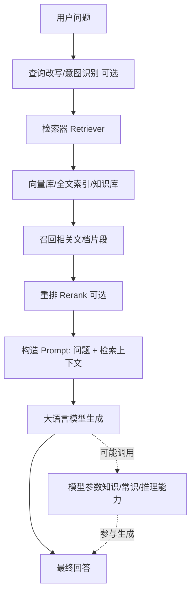
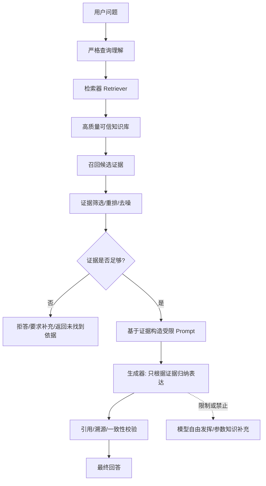
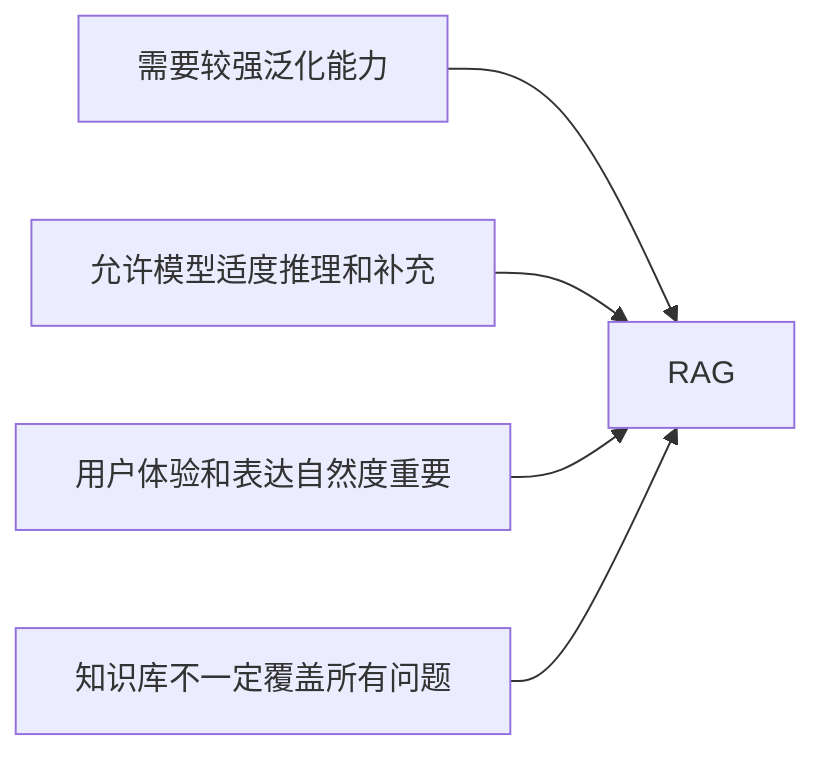
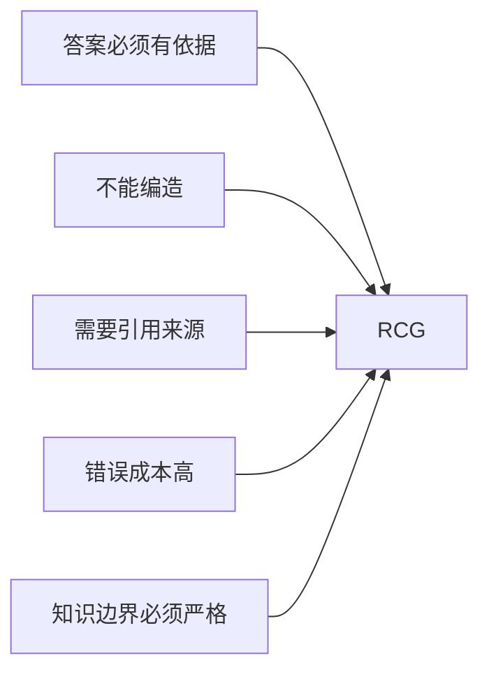
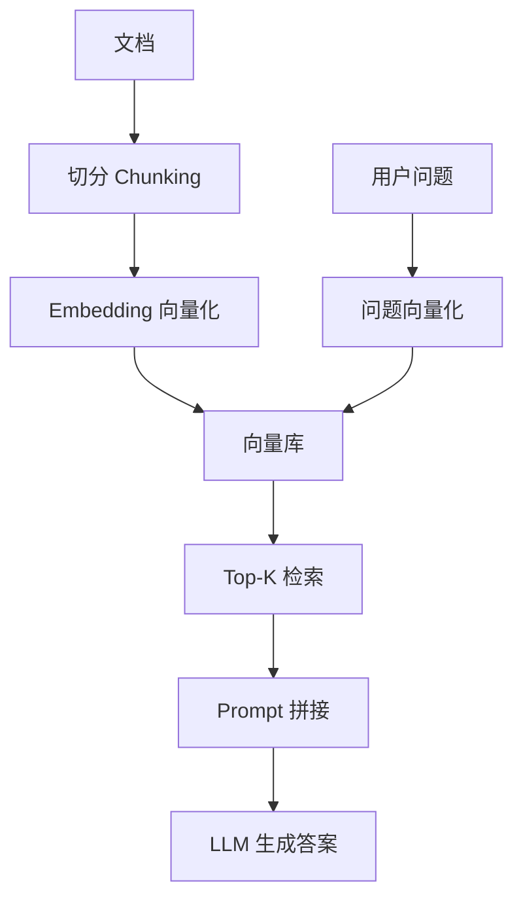
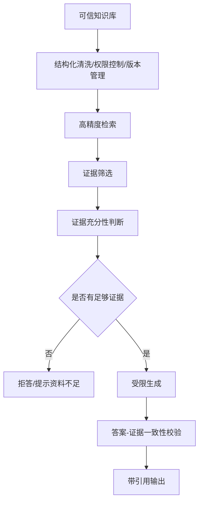

下面把 **RAG** 和 **RCG** 按当前常见用法来区分。需要先说明：**RAG 是论文和工业界都比较稳定的术语**；**RCG（Retrieval-Centric Generation，检索中心生成）更多是近年中文社区/工程讨论中的概念化说法，并不像 RAG 那样有统一、公认的标准定义**。RAG 的经典定义来自 Lewis 等人在 NeurIPS 2020 的工作：把预训练生成模型的“参数记忆”和外部检索索引的“非参数记忆”结合起来生成答案。([arXiv][1]) 中文资料中对 RCG 的常见解释是：尽量让答案的知识来源以检索结果为中心，弱化或限制大模型凭自身参数知识自由发挥。([CSDN][2])

## 一句话区别

**RAG = 检索增强生成**：先检索相关资料，再把“问题 + 检索内容”交给大模型生成。模型可以综合检索资料和自身语言能力/参数知识。

**RCG = 检索中心生成**：检索结果是主要甚至唯一知识依据，大模型更像“组织语言、归纳证据、按资料作答”的组件，目标是更强可控、更低幻觉、更可追溯。

---

## RAG 流程图



**RAG 的关键点**：
检索内容是“增强材料”，不是绝对边界。模型通常仍会利用自身已有知识、语言能力和推理能力，所以答案可能更自然、更泛化，但如果约束不好，也可能出现“检索材料没说但模型补充了”的情况。

---

## RCG 流程图



**RCG 的关键点**：
检索器和知识库承担“记忆”和“事实来源”的核心角色；生成模型主要负责理解问题、组织答案、压缩总结和表达。中文资料中也提到，纯靠 prompt 很难真正让大模型完全不用内部参数知识，因此更严格的 RCG 往往需要工程上的强约束、证据校验、拒答机制，甚至使用更小的受控生成模型。([CSDN][2])

---

## 核心差异对比

| 维度    | RAG                            | RCG                          |
| ----- | ------------------------------ | ---------------------------- |
| 全称    | Retrieval-Augmented Generation | Retrieval-Centric Generation |
| 中文    | 检索增强生成                         | 检索中心生成                       |
| 知识来源  | 外部检索 + 模型参数知识                  | 以外部检索结果为主                    |
| 大模型角色 | 生成、推理、补充、整合                    | 解释问题、归纳证据、组织语言               |
| 检索器角色 | 辅助增强                           | 核心事实来源                       |
| 幻觉风险  | 比纯 LLM 低，但仍可能有                 | 理论上更低，但依赖约束实现                |
| 泛化能力  | 较强                             | 较受知识库范围限制                    |
| 可追溯性  | 中等，取决于引用设计                     | 更强，强调证据链                     |
| 适合场景  | 通用问答、客服、知识助手、搜索增强              | 法务、金融、医疗、合规、企业制度问答等高准确场景     |
| 主要风险  | 检索错、上下文污染、模型自由补充               | 检索不到就答不好，答案可能保守、生硬           |

---

## 更形象的理解

可以把两者看成两种“资料使用方式”：

**RAG 像开卷考试**：
学生可以查资料，也可以用自己脑子里的知识来回答。答案灵活，但可能把资料外的内容也写进去。

**RCG 像证据审查报告**：
只能根据卷宗里的证据下结论。没有证据就不能编，必须说明依据或拒答。

---

## 什么时候用 RAG，什么时候用 RCG？

用 **RAG**，当你需要：



例如：企业知识助手、产品客服、技术文档问答、营销内容生成、通用研究助手。

用 **RCG**，当你需要：



例如：合同条款问答、财务制度解释、医疗指南辅助、审计问答、公司政策问答、投研资料摘要。

---

## 技术实现上的主要区别

### RAG 的典型实现



RAG 的重点通常是：切分策略、embedding 模型、召回质量、rerank、prompt 模板、引用生成和上下文窗口管理。

### RCG 的典型实现



RCG 的重点通常是：知识库质量、证据覆盖率、来源可信度、拒答策略、引用溯源、一致性校验、权限和版本控制。

---

## 总结

**RAG 关注“让大模型借助检索变强”**，核心是增强生成能力。
**RCG 关注“让检索结果主导生成”**，核心是事实约束和可追溯。

可以简单记成：

```text
RAG：检索是增强项，LLM 仍是生成中心。
RCG：检索是事实中心，LLM 是表达和归纳工具。
```

在真实业务里，很多系统不是纯 RAG 或纯 RCG，而是一个连续谱：
普通知识问答偏 RAG；合规、金融、法务、医疗等高风险场景会越来越偏 RCG。

[1]: https://arxiv.org/abs/2005.11401?utm_source=chatgpt.com "Retrieval-Augmented Generation for Knowledge-Intensive NLP Tasks"
[2]: https://blog.csdn.net/qq_43128256/article/details/140044395?utm_source=chatgpt.com "大模型RAG、ROG、RCG概念科普 - CSDN博客"
