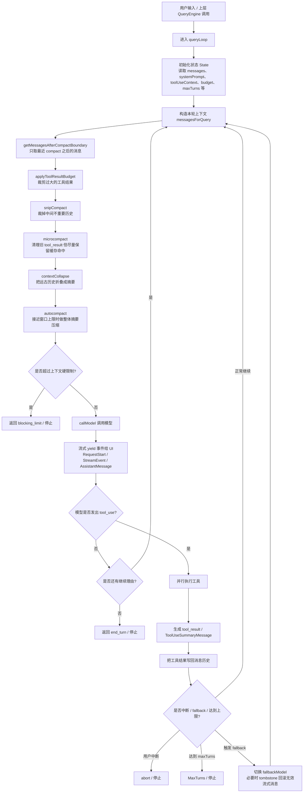

我没能直接打开你给的微信公众号原文链接，但根据多篇对同一篇内容的拆解，文章描述的 **queryLoop** 本质上是 Claude Code 的 **Agent 主循环**：它不断执行“准备上下文 → 调模型 → 执行工具 → 把结果喂回模型 → 决定是否继续”，直到任务完成或触发终止条件。文中还强调了它为什么用 **AsyncGenerator** 做实时事件流输出，以及它在上下文压缩、工具并行执行、fallback、预算与熔断方面的设计。([掘金][1])

下面用流程图来介绍这套系统：

可以把它理解成 4 个层次：

**1. 外层是一个“会转圈的 Agent 循环”**
`queryLoop` 不是一次请求一次响应，而是一个持续迭代的循环。每一轮模型看到最新上下文和工具结果，决定下一步要不要继续调用工具；只要它还在“行动”，循环就继续。([掘金][1])

**2. 进入模型前，要先做“上下文瘦身”**
文章把这一段描述成一个多级漏斗：先截断 compact 边界前的历史，再裁剪超大的工具结果，再做 snip / microcompact / contextCollapse / autocompact。目标不是一次性暴力压缩，而是按成本从低到高逐层处理，尽可能在不损伤关键信息的前提下，把上下文控制在模型窗口内。([掘金][1])

**3. 中间是“模型流式输出 + 工具执行”**
模型调用开始后，`queryLoop` 会边收 token 边 `yield` 事件给 UI，所以界面能实时显示“正在思考”“正在输出”。当模型产出完整的 `tool_use` 指令后，系统开始执行工具，并把工具结果重新塞回消息历史，进入下一轮推理。这个设计让系统表现得像一个会观察、行动、再观察的 agent。([掘金][1])

**4. 最外面包着一层“防失控机制”**
文章特别强调 4 类保护：

* **maxTurns**：防模型无限循环。
* **blocking limit check**：防上下文溢出。
* **abortController**：用户中断时，模型调用和工具执行都能立刻停。
* **fallback + tombstone**：流式过程中若主模型失败，可切到降级模型，并把已经输出但不完整的无效消息从 transcript 里回滚掉。([掘金][1])

如果你想把这张图拿去做汇报，我建议直接用这一句总结：

> **queryLoop = 一个带实时输出、上下文压缩、工具闭环和熔断保护的 Agent 主循环。**
> 它让系统不断执行“理解任务 → 调工具 → 观察结果 → 继续推理”，直到完成任务或命中停止条件。 ([掘金][1])

我也可以把这张图改成更适合 PPT 的“横向泳道图”版本。

[1]: https://juejin.cn/post/7627001206729392169?utm_source=chatgpt.com "queryLoop：Claude Code 源码的 Agent 运作引擎queryLoop ..."
