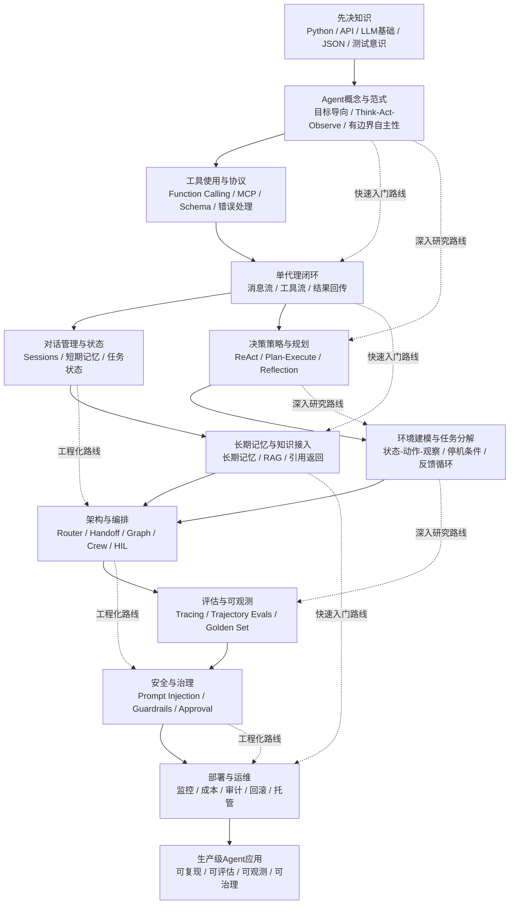

# AI Agent 应用开发学习历程与知识体系分析报告

## 执行摘要

本报告以用户给定的 AIInfra《AI 智能体》目录结构为骨架，将其“引入—组成—Planning—应用—总结/反思”的课程组织方式，与 Hugging Face Agents Course、Microsoft 的 AI Agents for Beginners、LangChain Academy、roadmap.sh 的 AI Agents 路线图结合，重构出一条更适合具备基础编程与机器学习知识开发者的学习路径。AIInfra 的公开目录本身已经把 Agent 学习拆成“LLM 遇到 Agent、组件、Planning、应用原理、问题与未来”五段；Hugging Face 课程则强调“理解智能体—工具与行动—Think/Act/Observe—构建第一个智能体—发布”；Microsoft 的课程提供多语言课程与 Python 代码样例；LangChain Academy 则把 LangGraph 学习推进到部署；roadmap.sh 给出了“设计、构建、交付 AI Agents”的路线图式组织方式。综合这些资源，可以形成一条更系统、也更工程化的学习历程。citeturn8view1turn12view0turn12view1turn10search3turn21view0

对于已经具备基础编程与机器学习知识的开发者，最有效的学习顺序不是一开始就堆多智能体框架，而是先掌握 Agent 的最小闭环：模型、消息、工具、状态、观察与决策；随后再进入状态持久化、长期记忆、规划与反思、多智能体与工作流、评估与安全、部署与运维。这个顺序既符合 LangGraph 文档“先理解 models 与 tools，再上 orchestration”的建议，也符合 Microsoft Agent Framework 从“第一个 Agent→工具→多轮会话→记忆与持久化→工作流→托管”的递进方式。citeturn8view2turn11view2

从学习产出看，真正有价值的目标不是“会用几个 Agent 框架”，而是能够独立构建一个**可复现、可评估、可观测、可治理、可部署**的 Agent 应用。OpenAI Agents SDK 将 Agents、Tools、Handoffs、Guardrails、Sessions、Tracing 作为核心概念；LangGraph 把 durable execution、human-in-the-loop、memory、deployment 作为关键能力；LangSmith 与 OpenAI Evals 都强调把评估前置到开发流程中。由此可知，AI Agent 开发的知识体系，已经从“Prompt 技巧”转向“Agent 工程”。citeturn8view6turn5search3turn5search4turn11view8turn11view9turn17search1

基于上述资料，本报告建议将学习路线分成五个阶段，总体建议时长约为 **十到二十周**；如果只追求快速形成可演示原型，可压缩到 **两到四周**；如果以研究复现和论文理解为目标，可扩展到 **八到十六周**；如果以组织级工程落地为目标，则应把重点放到 **评估、安全、运维与治理**，总时长通常在 **十到二十周**更合理。这里的时间不是固定标准，而是结合课程幅度、论文深度与典型工程练习量给出的推荐估计。相关阶段设计见后文。citeturn12view0turn12view1turn10search3turn11view2

## 研究基线与适用对象

本报告的默认假设与用户要求一致：目标受众是**具备基础编程与机器学习知识的开发者**，通常已经熟悉 Python、基本 API 调用、常见数据结构、监督学习/深度学习基础、以及对 LLM 有入门级理解。报告关注的不是“训练底座模型”，而是“如何把 LLM、工具、状态、知识和工作流组织成可用 AI Agent 应用”。这一定位也与 roadmap.sh 对 AI Engineer 的界定一致，即更偏向把预训练模型与现成工具应用到产品与流程中，而不是从头训练新模型。citeturn21view1

本报告使用的“路线图式”基线来自四类资源。第一类是中文友好的公开课程：AIInfra 的《AI 智能体》系列、Hugging Face Agents Course 的中文页、Microsoft AI Agents for Beginners 中文页；第二类是官方框架文档：LangGraph、OpenAI Agents SDK、Microsoft Agent Framework、Semantic Kernel、CrewAI、Dify、LlamaAgents；第三类是原始论文：ReAct、Toolformer、Generative Agents、Voyager、Reflexion、AgentBench；第四类是工程治理资料：LangSmith AgentEvals、OpenAI Evals、OWASP LLM Top 10、NIST AI RMF。这样做的目的是避免单一框架视角，把“研究模式、工程能力、生产治理”统一到一个学习框架里。citeturn8view1turn12view0turn12view1turn8view2turn8view6turn11view2turn11view5turn11view4turn8view7turn13view0turn13view1turn13view2turn13view3turn12view10turn12view5turn11view8turn11view9turn17search11turn8view5

下表给出本报告建议的学习目标与先决知识。表中“资源”列中的引文可直接作为链接打开原文。

| 维度 | 建议内容 |
| --- | --- |
| 学习目标 | 最终能够独立完成一个具备工具调用、状态管理、知识接入、评估、可观测、安全控制与部署能力的 Agent 应用；中间目标包括理解 Agent 范式、完成单代理闭环、实现有状态工作流、建立评估与安全基线。相关框架文档都把 tools、memory、workflows、guardrails、tracing 视为核心能力。citeturn8view2turn8view6turn11view2turn11view5 |
| 目标受众 | 具备基础编程与机器学习知识的开发者；若来自 Web/后端团队，可优先走应用工程路线；若来自算法/研究团队，可优先走论文复现路线。roadmap.sh 对 AI Engineer 的描述也更偏向“使用预训练模型与既有工具解决问题”。citeturn21view1 |
| 推荐产出 | 一个可部署的 Agent 应用、一个评估集与回归测试脚本、一份安全与治理清单、一份架构说明文档。OpenAI、LangSmith、Dify 都把 tracing、evals、observability、monitoring 纳入生产开发常规。citeturn5search2turn11view9turn16search6 |
| 学习风格 | 优先“做中学”，每个模块都以一个最小可运行项目收尾；路线图式学习最适合把知识模块与项目里程碑绑定。AIInfra、Microsoft、Hugging Face、LangChain Academy 都采用按模块推进并配套代码/练习的组织方式。citeturn8view1turn12view1turn12view0turn10search3 |

| 先决知识 | 重要性 | 说明 |
| --- | --- | --- |
| Python 基础 | 必备 | 目前多数主流 Agent 框架以 Python 为主入口，包括 LangGraph、OpenAI Agents SDK、AutoGen、CrewAI、LlamaIndex、Semantic Kernel。citeturn8view2turn8view6turn11view0turn11view4turn11view5turn7search5 |
| HTTP / REST / JSON Schema | 必备 | 工具调用、本地/远程 API、MCP、结构化输出都依赖接口与 schema 思维。MCP 规范明确基于 JSON-RPC 通信，并围绕上下文与工具暴露展开。citeturn11view7turn14search2 |
| 基础 LLM 知识 | 必备 | 需要理解提示词、上下文窗口、工具选择、结构化输出、模型局限。LangGraph 也明确建议在上手 orchestration 前先理解 models 与 tools。citeturn8view2 |
| 数据结构与状态建模 | 必备 | Agent 不是单轮对话，而是有状态流程；短期记忆、长期记忆、会话状态、任务状态都依赖清晰的数据结构设计。citeturn5search3turn14search0 |
| Linux / Docker / 环境管理 | 推荐 | 一旦涉及工具执行、部署、长任务、代码执行或自托管，这些知识会迅速变成刚需。AutoGen 与 OpenAI Agents SDK 都提供了容器/代码执行相关能力。citeturn11view0turn8view6 |
| 检索与数据库基础 | 推荐 | 绝大多数业务 Agent 都需要知识接入、RAG、日志或状态存储。Dify 与 LlamaIndex 都把文档接入和知识工作流作为核心能力。citeturn2search5turn8view7 |
| 软件测试与日志意识 | 推荐 | Agent 应用强依赖 evals、tracing、回归测试与观测数据；没有这些能力，很难做可靠性改进。citeturn11view8turn11view9turn5search2 |
| 安全与隐私基础 | 推荐 | Prompt Injection、数据泄露、工具副作用、越权调用是 Agent 时代的常见风险。OWASP 与 NIST 都把这些问题上升到系统治理层。citeturn17search11turn16search3turn8view5 |

## 知识体系与学习资源

从知识结构上看，AI Agent 应用开发可以分成三层。第一层是**范式层**，即什么是 Agent、Agent 与 Chatbot 的区别、ReAct/Tool Use/Reflection 等核心模式；第二层是**工程层**，即工具调用、状态管理、知识接入、工作流编排、多代理协作、评估与可观测；第三层是**生产治理层**，即安全、审计、人机协作、部署、成本与运维。AIInfra 的目录、Hugging Face 的 Think/Act/Observe、Microsoft Agent Framework 的逐步教程、OpenAI Agents SDK 的核心概念，都体现了这一“从概念到工程再到生产”的递进关系。citeturn8view1turn12view0turn11view2turn8view6

下表给出推荐的核心知识模块、关键技能点、资源与练习。中文优先；若没有可靠中文原始资料，则列英文原文并标注难度。

| 核心模块 | 关键技能点 | 优先学习资源 | 典型练习 / 项目建议 |
| --- | --- | --- | --- |
| Agent 概念与范式 | 理解 Agent 与普通对话系统的差异；理解 autonomy、tool use、goal-directed loop、Think→Act→Observe；掌握“有边界的自主性”观念。 | 中文：AIInfra《AI 智能体》总览、Hugging Face Agents Course 中文导论（入门）。英文：OpenAI Agents Cookbook 主题页（中）。citeturn8view1turn12view0turn12view4 | 用一个 LLM + 两个工具实现“天气 + 计算器”助理，并明确写出系统边界、允许动作与退出条件。 |
| 工具使用与协议 | 设计工具 schema；处理工具错误、重试、超时；理解 function calling、工具路由、MCP；理解“工具是 Agent 与环境的接口”。 | 官方：OpenAI Agents Quickstart / Agents 核心概念（中）；MCP 规范（中）；原始论文：Toolformer（英文，难）。citeturn1search2turn8view6turn11view7turn13view1 | 为 Agent 接入搜索、数据库查询、文件读取三个工具，并比较“自由回答”与“强制工具调用”在稳定性上的差异。 |
| 对话管理、状态与记忆 | 区分短期记忆、长期记忆、会话状态、用户画像、任务状态；理解持久化与摘要；学会避免“记忆污染”。 | 官方：LangGraph Memory（中）；OpenAI Sessions（中）；原始论文：Generative Agents 关于 observation / memory / reflection（英文，难）。citeturn5search3turn14search0turn13view2 | 做一个多轮客服 Agent：要求记住当前工单状态、用户偏好与上一步工具结果，并实现会话恢复。 |
| 决策策略、规划与反思 | 掌握 ReAct、plan-and-execute、reflection、self-critique、routing；理解何时应该“先计划后执行”，何时不需要复杂规划。 | 原始论文：ReAct（英文，难）、Reflexion（英文，难）；AIInfra 的 Planning 章节目录；OpenAI orchestration / handoffs（中）。citeturn13view0turn12view10turn8view1turn5search11turn5search1 | 用同一任务分别实现“直接回答”“ReAct”“带反思的 ReAct”，比较任务成功率、工具调用次数与延迟。 |
| 环境建模与任务分解 | 把环境抽象为状态、可行动作、观察反馈与目标约束；学习任务拆解、循环控制、停止条件；理解为什么真实世界环境会放大 Agent 失误。 | 原始论文：Generative Agents（英文，难）、Voyager（英文，难）、AgentBench（英文，难）。citeturn13view2turn13view3turn12view5 | 为一个模拟任务环境设计状态机，例如“网页信息搜集 → 证据校验 → 输出摘要”，强制要求每步都有 observation。 |
| 架构、编排与多智能体 | 学会单代理、主管理代理 + 专家代理、图工作流、handoff、router、crew、human-in-the-loop；知道何时该上多代理，何时单代理足够。 | 官方：LangGraph 概览（中）；OpenAI Agents 的 orchestration / handoffs（中）；CrewAI 文档（中）；Microsoft Agent Framework 教程（中）。citeturn8view2turn5search11turn5search1turn11view4turn11view2 | 做一个“分诊代理 + 检索代理 + 写作代理”的三角色系统，并为高风险工具加入人工审批。 |
| 知识接入与 RAG | 区分“工具调用”与“知识检索”；掌握文档索引、检索、重排、引用返回、grounding；理解 Agent 何时该查库而不是凭记忆回答。 | 中文：Dify 介绍与 RAG / 工作流能力（入门）；LlamaIndex / LlamaAgents 文档（中）。citeturn16search2turn2search5turn8view7turn7search5 | 做一个面向特定领域的知识问答 Agent，强制返回证据来源，并在无证据时回退为“无法确认”。 |
| 评估、调试与可解释性 | 学会 final-answer eval、trajectory eval、LLM-as-a-judge、离线数据集、线上 tracing；理解“可解释性”更多来自轨迹、状态与工具日志，而不是泄露链路推理。 | 官方：LangSmith trajectory evals（中）；OpenAI Evals（中）；OpenAI Tracing（中）；原始论文：ReAct 强调更可解释的轨迹。citeturn11view8turn11view9turn5search2turn13view0 | 建一套三十到五十条 golden cases，至少覆盖工具正确率、引用准确率、失败回退率，并用 tracing 检查每次改 prompt 的影响。 |
| 安全、伦理与治理 | 掌握 prompt injection、data leakage、过度授权、工具副作用、人工审批、最小权限、审计日志、责任边界；理解“安全不等于只做内容审核”。 | 官方：OWASP Top 10 for LLM Apps 2025、OWASP Prompt Injection 条目；OpenAI Guardrails / Human Review；NIST AI RMF。citeturn17search11turn16search3turn17search4turn17search0turn8view5 | 为 Agent 加入输入防护、输出防护、写操作审批、日志审计和红队攻击脚本，并记录误报与漏报。 |
| 部署、运维与成本管理 | 掌握容器化、环境变量、版本化、日志、预算、延迟、降级策略、异常恢复、回滚；理解生产化重点是稳定性与治理而非“炫技”。 | 中文：Dify 平台与监控能力；Azure Foundry Agent Service；LangSmith 平台；LangChain Academy 的部署模块。citeturn8view3turn9search1turn16search1turn10search3 | 把一个有用的 Agent 服务部署到测试环境，设置 tracing、预算阈值、失败回退与人工接管机制。 |

如果时间有限，建议至少覆盖前六个模块；如果目标是生产落地，则八到十个模块都不应跳过。特别需要强调的是，**MCP、评估、可观测、安全审批**在 2026 年已经不是“可选高级话题”，而是主流框架与平台共同支持的能力：OpenAI Agents SDK、AutoGen、Dify、Azure Foundry 都直接支持或对接 MCP；OpenAI、LangSmith、Dify 都把 tracing / evals / observability 放在核心位置。citeturn14search2turn11view0turn8view3turn9search1turn5search2turn11view9turn16search6

## 学习历程设计

分阶段学习的原则是：**先单代理闭环，再状态与记忆，再规划与环境建模，再多代理与工作流，最后才是评估、安全、运维**。这一顺序同时得到多个官方路线的支持：LangGraph 文档建议先理解 models / tools；Microsoft Agent Framework 的官方教程从 first agent 到 host your agent 逐步推进；LangChain Academy 先讲基础与构建，再进入部署；Hugging Face 先讲基础，再让学习者构建并发布第一个 Agent。citeturn8view2turn11view2turn10search3turn12view0

| 学习阶段 | 建议时间 | 阶段目标 | 里程碑任务 | 评估方法 |
| --- | --- | --- | --- | --- |
| 基础共识与最小 Agent | 约一到两周 | 建立 Agent 心智模型，完成第一个“能调用工具”的单代理。 | 复现一个天气/搜索/计算器 Agent；理解 Think→Act→Observe；能清楚解释 Agent 与 Chatbot 的区别。 | 用十条固定样例检查工具是否被正确调用；人工复核是否存在“明明该调用工具却没有调用”的情况。 |
| 单代理闭环与状态管理 | 约一到两周 | 把“单轮可用”提升到“多轮稳定”，理解会话与短期记忆。 | 为 Agent 加入 sessions / memory；在工具失败后可恢复；实现简单状态机。 | 用二十条多轮对话数据测试状态连续性；统计遗忘、幻觉补全、状态串线比例。 |
| 规划、反思与环境建模 | 约两到四周 | 学会使用 ReAct、计划-执行、反思等模式，并理解环境反馈。 | 对同一任务实现 direct / ReAct / reflection 三个版本；做一次简化环境建模。 | 比较成功率、延迟、成本、工具调用次数与失败模式；写出模式选择结论。 |
| 多代理、工作流与知识接入 | 约三到六周 | 进入图编排、handoff、RAG、路由与人工审批。 | 实现“分诊 + 检索 + 生成”的三角色系统；引入知识库与引用返回。 | 设计三十到五十条 golden cases，既测最终答案，也测路由与工具轨迹。 |
| 评估、安全与生产化 | 约三到六周 | 建立可复现的评估、安全与运维基线。 | 为现有应用加入 tracing、offline eval、红队攻击脚本、审批机制、部署脚本与监控。 | 用回归测试、红队通过率、延迟预算、成本预算、人工满意度共同验收。 |

为了适应不同目标，建议同时保留三条替代路径。

| 路线 | 适合人群 | 建议时长 | 路线重点 | 推荐交付物 |
| --- | --- | --- | --- | --- |
| 快速入门路线 | 需要尽快做出演示或业务 PoC 的开发者 | 约两到四周 | 以 Dify、OpenAI Agents SDK、Hugging Face Agents Course 为主，优先做出一个有用 Agent，再补基础理论。citeturn8view3turn1search2turn12view0 | 一个已发布的 Agent Demo、最小使用说明、十到二十条测试样例。 |
| 深入研究路线 | 想系统理解 Agent 模式与论文脉络的研究型开发者 | 约八到十六周 | 以 ReAct、Toolformer、Generative Agents、Voyager、Reflexion、AgentBench 为主，尽量自己实现简化版。citeturn13view0turn13view1turn13view2turn13view3turn12view10turn12view5 | 一份论文复现笔记、一个对比实验仓库、一份 benchmark 报告。 |
| 工程化路线 | 面向企业内落地、强调可靠与治理的技术团队 | 约十到二十周 | 以 LangGraph / Microsoft Agent Framework / Semantic Kernel / LangSmith / OpenAI Tracing / OWASP / NIST 为主。citeturn8view2turn11view2turn11view5turn17search1turn5search2turn17search11turn8view5 | 一个带评估、监控、审批、部署脚本、回滚方案的生产骨架。 |

一个很实用的判定标准是：**如果你还没有建立稳定的单代理闭环与评估集，不要急着上多代理。** 多代理会增加编排复杂度、状态复杂度与错误传播路径，而并不会自动提升可靠性。LangGraph、OpenAI、CrewAI、Microsoft 的官方材料都把“先掌握基本构件，再做复杂工作流”放在前面。citeturn8view2turn11view2turn11view4turn8view6

## 工具链与关键选型

如果只给出一个默认建议，我会推荐下面这套“足够稳妥”的入门工程栈：**Python 作为主语言 + 一个主编排框架 + 一个可观测/评估工具 + 一个部署平台 + MCP 作为工具/上下文接入标准**。之所以这样建议，是因为主流框架都已围绕这些要素形成共识：Python 生态最完整；LangGraph、OpenAI Agents SDK、Microsoft Agent Framework、Semantic Kernel、CrewAI、LlamaIndex 都有完善的 Python 路径；MCP 已成为多个框架共同支持的开放协议；评估与 tracing 是生产化前提。citeturn8view2turn8view6turn11view2turn11view5turn11view4turn8view7turn11view7turn11view9turn5search2

| 工具链类别 | 推荐首选 | 常见替代项 | 选择建议 |
| --- | --- | --- | --- |
| 主语言 | Python。citeturn8view2turn8view6turn11view0turn11view4turn11view5 | TypeScript / JavaScript、.NET、Java。OpenAI Agents SDK、LlamaIndex、Microsoft 生态都提供多语言路径。citeturn7search2turn11view5turn11view2 | 若你要快速接触最多 Agent 框架与论文复现，优先 Python；若团队以 Web 为主，可在前端/边缘场景补 TS。 |
| 编排框架 | LangGraph、OpenAI Agents SDK、Microsoft Agent Framework。citeturn8view2turn8view6turn11view2 | CrewAI、Semantic Kernel、LlamaAgents；AutoGen 更适合历史理解或迁移。citeturn11view4turn11view5turn8view7turn11view1 | 只选一个主框架深挖，不要同时追四五个。 |
| 快速产品化平台 | Dify。citeturn8view3turn16search2 | Azure Foundry Agent Service、LlamaCloud、Hugging Face Spaces。citeturn9search1turn8view7turn12view0 | 需要低代码与中文体验时优先 Dify；需要企业云治理时看 Azure Foundry。 |
| 工具 / 上下文协议 | MCP。citeturn11view7turn14search2 | 框架本地函数工具、OpenAPI 规范。citeturn8view6turn11view5 | 2026 年应把 MCP 视为必学协议，而非边缘知识。 |
| 测试与评估 | LangSmith AgentEvals、OpenAI Evals。citeturn11view8turn11view9 | AutoGen Bench、平台内自定义评估。citeturn11view1 | 从第一版 demo 就建立 eval 数据集，后续每次改动都做回归。 |
| 监控与可观测 | OpenAI Tracing、LangSmith、Dify observability/LLMOps。citeturn5search2turn17search1turn16search6 | Azure Foundry 可观测能力。citeturn9search1 | 没有 tracing，就很难真正调试 Agent。 |
| 发布与托管 | Hugging Face Spaces、Dify、Azure Foundry。citeturn12view0turn8view3turn9search1 | LlamaCloud / 自托管。citeturn8view7 | 学习初期先追求可发布、可试用、可回收日志，不必过早追求复杂分布式。 |

下面是当前主流关键选项的比较。表中的“学习难度”和“适用场景”是基于官方文档、课程组织与生态状态做出的综合判断。

| 选项 | 主要优点 | 主要局限 | 适用场景 | 学习难度 | 社区与生态 | 主要资源 |
| --- | --- | --- | --- | --- | --- | --- |
| LangGraph | 低层级、可控、适合长任务与有状态工作流；强调 durable execution、human-in-the-loop、memory、deployment。citeturn8view2turn5search3turn5search4 | 抽象较底层，需要开发者自己设计图结构与状态。 | 复杂工作流、高控制要求、生产级多步骤 Agent。 | 中到高 | 高。LangChain Academy 有完整课程，GitHub 生态活跃。citeturn12view2turn18search10 | 官方文档与课程。citeturn8view2turn12view3 |
| OpenAI Agents SDK | 概念面清晰，内置 Agents、Tools、Handoffs、Guardrails、Sessions、Tracing；适合快速做出多 Agent 工作流。citeturn8view6turn5search2turn14search0 | 相对更偏 SDK 路线，对复杂自定义图控制不如 LangGraph 自由。 | 快速原型、多 Agent 协作、需要内置 tracing/guardrails 的应用。 | 低到中 | 高。GitHub 公共仓库更新活跃，官方 Cookbook 内容多。citeturn8view6turn12view4 | Quickstart、Agents、Cookbook。citeturn1search2turn5search7turn12view4 |
| Microsoft Agent Framework | 官方教程路径清晰：first agent → tools → multi-turn → memory → workflows → host；面向企业与多语言。citeturn11view2turn9search2 | 生态仍在快速演进，若不在微软栈内，学习材料的心智成本略高。 | 企业内业务流程、.NET/Python 团队、需要云端托管和治理。 | 中 | 高。文档与 GitHub 仓库都较活跃。citeturn11view2turn9search2 | 官方文档与 GitHub。citeturn11view2turn9search2 |
| Semantic Kernel | 模型无关、支持插件、内存、规划、多 Agent；跨 Python / .NET / Java，偏企业工程。citeturn11view5turn11view3 | 概念面较宽，若只做轻量 Agent 可能显得偏重。 | 企业集成、插件式封装、微软生态工程化。 | 中到高 | 高。微软长期维护，企业导向明显。citeturn11view5 | Microsoft Learn 与 GitHub。citeturn11view3turn11view5 |
| CrewAI | 对“角色协作、多代理团队、flows”表达直观；内置 guardrails、memory、knowledge、observability。citeturn11view4 | 框架风格较强；对于极细粒度自定义状态图，灵活性不如 LangGraph。 | 角色分工明显的业务协作流程、需要快速组织多 Agent 的场景。 | 中 | 高。文档完整，社区讨论活跃。citeturn11view4turn19search2 | 官方文档。citeturn11view4 |
| Dify | 中文友好；从构思、开发、部署到监控一体化；可视化画布、RAG、Agent、LLMOps 都齐。citeturn8view3turn16search2turn16search6 | 对底层运行时、图执行细节和深度自定义不如代码框架自由。 | 快速 PoC、业务团队协作、低代码/半低代码产品化。 | 低到中 | 很高。中文社区与产品化生态尤其强。citeturn8view3turn7search9 | 中文官网与文档。citeturn8view3turn16search2 |
| LlamaAgents / LlamaIndex | 在文档工作流、知识处理、事件驱动编排、分支/并行/HIL/observability 上表达清晰。citeturn8view7turn11view6 | 更偏知识与文档任务，如果你的任务与文档/检索关系不强，优势没那么明显。 | 知识密集型 Agent、文档处理、RAG 与多步骤知识工作流。 | 中 | 高。LlamaIndex 开源与云产品并行发展。citeturn8view7turn7search6 | 官方文档与中文页面。citeturn8view7turn7search5 |
| AutoGen | 历史影响大，对多 Agent 研究与实验社区启发很强；Core/AgentChat/Extensions 分层明确。citeturn11view0turn11view1 | **目前处于 maintenance mode**，微软官方已建议新项目优先看 Microsoft Agent Framework。citeturn11view1 | 学习多 Agent 演化脉络、维护老项目、研究历史模式。 | 中 | 高，但更适合“学习/迁移”而不是“首选新项目”。citeturn11view1turn19search3 | 官方文档与仓库说明。citeturn11view0turn11view1 |

若只给出一个面向大多数开发者的选型建议，可以简单概括为：**想要最大控制与长期工程能力，用 LangGraph；想要最快做出结构清晰的多 Agent 工作流，用 OpenAI Agents SDK；想在中文环境快速落地 PoC，用 Dify；若在微软企业栈中交付，用 Agent Framework 或 Semantic Kernel；如果任务明显以知识文档为中心，可优先考虑 LlamaAgents。** 这个判断来自它们各自官方文档对目标能力、教程组织与平台定位的公开表述。citeturn8view2turn8view6turn8view3turn11view2turn11view5turn8view7

## 评估、安全与最佳实践

Agent 应用最容易被低估的部分，不是“怎么写 Prompt”，而是“如何证明它可靠、可解释、可回归并且安全”。LangSmith 的 trajectory evals 直接指出，很多 Agent 行为只有在真实 LLM 下才会显现，例如会不会调用正确工具、提示修改是否改变整条执行轨迹；OpenAI Evals 则把评估放到模型与系统迭代的常规流程中。与此同时，OWASP 和 NIST 都表明，Agent 风险不仅是内容层面的“答错”，还包括提示注入、数据泄露、越权行动、错误自动化与治理缺口。citeturn11view8turn11view9turn17search11turn8view5

| 评估维度 | 关注什么 | 典型方法 |
| --- | --- | --- |
| 任务成功率 | 整体任务是否完成，是否达到预期业务结果。 | 基于 golden set 的 pass/fail 评估；对复杂任务可加人工 rubric。OpenAI Evals 与 AgentBench 都适合做任务层评估。citeturn11view9turn12view5 |
| 工具调用正确率 | 工具是否被正确选择、参数是否正确、是否存在无意义调用。 | 逐条记录 tool call；对固定流程做 trajectory match。citeturn11view8 |
| 轨迹质量 | 不仅看最终答案，也看执行路径是否合理。 | LangSmith trajectory eval、LLM-as-a-judge、参考轨迹匹配。citeturn11view8turn16search5 |
| 事实 grounding / 引用质量 | Agent 是“知道”还是“查到”；引用是否真实可追溯。 | 强制证据返回；对引用做抽样核查；知识型任务优先测 grounding 而不是文风。Dify 与 LlamaIndex 都强调知识工作流。citeturn2search5turn8view7 |
| 延迟 | 多步 Agent 往往更慢，必须知道慢在哪里。 | tracing 看模型、工具、handoff、重试、审批等待。OpenAI Tracing 明确记录这些事件。citeturn5search2 |
| 成本 | 调用次数、上下文膨胀、多代理 fan-out 是否导致成本失控。 | 统计每次 run 的 token / 工具开销 / 重试次数；设预算阈值。OpenAI guardrails 也把“先跑廉价防护，避免昂贵模型浪费”作为设计点。citeturn17search4 |
| 安全违例率 | 提示注入、数据泄露、危险工具调用是否发生。 | 红队样例、对抗提示、审批绕过测试；参考 OWASP LLM Top 10。citeturn17search11turn16search3 |
| 人工接管与恢复能力 | High-risk 操作能否暂停、审批、恢复。 | 使用 human review / interrupt / approval flow；验证暂停后能否恢复原状态。citeturn17search0turn5search14 |

| 常见挑战 | 典型症状 | 解决策略 |
| --- | --- | --- |
| 提示注入与间接注入 | Agent 被网页、文档、用户输入中的恶意指令劫持，越权调用工具或泄露系统信息。citeturn16search3turn17search3 | 把输入防护、输出防护、工具级防护与最小权限结合；对外部内容做隔离与清洗；对有副作用工具加人工审批。citeturn17search4turn17search0 |
| 工具 schema 脆弱与副作用难控 | 参数错位、无效调用、重复调用、误写数据库或误发消息。 | 使用严格 schema、幂等设计、回滚机制、阻塞式 guardrails；对写操作强制 approval。citeturn17search4turn17search0 |
| 状态爆炸与记忆污染 | 会话越长越容易跑偏，旧上下文污染新任务。 | 把短期记忆、长期记忆和知识检索分开设计；定期摘要；只持久化必要状态。citeturn5search3turn14search0turn13view2 |
| 过早多智能体化 | Agent 越拆越多，最终调不通，也难评估。 | 在单代理已稳定且评估集已成形后，再引入 handoff / crew / graph；只为明确分工而不是“为了炫酷”拆分角色。官方教程普遍从单 Agent 起步。citeturn11view2turn1search2turn11view4 |
| 只看最终答案，不看轨迹 | 最终答案偶尔正确，但过程非常脆弱，稍改 prompt 就崩。 | 引入 trajectory eval、tool trace、状态转移检查；用 tracing 做根因分析。citeturn11view8turn5search2 |
| 评估不可复现 | 每次结果都不一样，团队难以协作迭代。 | 建立固定数据集与回归脚本，区分 deterministic check 与 LLM judge；把 eval 作为 CI/CD 一部分。citeturn11view9turn11view8 |
| 成本与延迟失控 | 多代理、长上下文、反复重试让系统很慢也很贵。 | 先用轻量 guardrails 过滤；明确停机条件；必要时用 router 限制模型与工具数量；监控每条 run 的预算。citeturn17search4turn5search2 |

实践上，最值得坚持的最佳实践有五个。第一，**从一个真实有用的单代理任务开始**，例如“内部知识问答”“工单分流”“研究摘要”，不要从“万能通用助手”开始。第二，**把工具契约写得比 prompt 更明确**：结构化输入、结构化输出、明确副作用。第三，**在调 Prompt 前先接 tracing**，否则你并不知道问题出在模型、工具、路由、记忆还是上下文。第四，**高风险动作一律默认有人类审批或可中断机制**。第五，**评估必须既看结果，也看轨迹**。这些原则分别和官方 tracing、guardrails、human review、trajectory eval 指南一致。citeturn5search2turn17search4turn17search0turn11view8

伦理与安全上，应特别注意三件事：一是**透明披露**，用户应知道自己面对的是自动化 Agent，哪些动作会触发外部系统；二是**最小化数据使用与日志脱敏**，因为 NIST AI RMF 强调把 trustworthiness 融入设计、开发、使用与评估全过程；三是**建立责任边界**，把“建议、检索、写草稿”和“执行不可逆操作”区分开来。对后者，应优先采取 human-in-the-loop 或审批机制，而不是把高自主权直接暴露到生产环境。citeturn8view5turn17search0turn5search14

## 流程图与可视化建议

下面的流程图把学习路径与模块依赖关系放到同一张图里。其排序逻辑来自 AIInfra 的“引入—组件—Planning—应用—总结”，结合 Hugging Face 的 Think/Act/Observe、LangGraph 的“先 models / tools 再 orchestration”、Microsoft Agent Framework 的“first agent → tools → memory → workflows → host”。也就是说，**Agent 学习更像是一条依赖链，而不是平铺的模块清单**。citeturn8view1turn12view0turn8view2turn11view2

如果你希望文档中再嵌入一到三张辅助图，建议优先用**官方页面中已有的示意图或截图**，因为它们最容易和后续学习资源保持一致。点击下表中的引文即可打开对应页面。

| 建议配图 | 适合放置章节 | 推荐原因 | 图源页面 |
| --- | --- | --- | --- |
| Hugging Face Agents Course 的 Unit 1 planning 图 | 适合作为全文总览图 | 这是最适合作为“学习起点”的基础规划图，能直观对应“概念—工具—workflow—发布”的入门路径。 | Hugging Face 中文课程导论页。citeturn12view0 |
| OpenAI Agents SDK README 中的 Tracing UI 截图 | 适合“评估与可观测”章节 | 能直观看到模型调用、工具调用、handoff、guardrails 等运行事件，非常适合解释“为什么 Agent 调试不能只看最终答案”。 | OpenAI Agents SDK GitHub README。citeturn8view6turn5search2 |
| LlamaIndex / LlamaAgents 的 agent flow 图 | 适合“工作流与多智能体”章节 | 适合解释 agent workflow、单代理与多代理编排，以及事件驱动执行。 | LlamaIndex 中文/英文文档页。citeturn7search5turn11view6 |
| AIInfra《AI 智能体》课程页 | 适合作为“参考路线图来源” | 若你想保留“roadmap 风格”出处，这个页面最适合用作“中文路线图参照”的文内说明。 | AIInfra GitHub 目录页。citeturn8view1turn20view0 |

## 结论

综合公开课程、官方文档与原始论文，可以得出一个相当稳定的判断：**AI Agent 应用开发的核心，不是框架数量，而是对“工具、状态、决策、环境、评估、安全、运维”这七类能力的系统掌握。** AIInfra 提供了很好的中文知识骨架；Hugging Face 与 Microsoft 提供了友好的课程式入口；LangGraph、OpenAI Agents SDK、Microsoft Agent Framework、Semantic Kernel、CrewAI、Dify、LlamaAgents 则代表了当前工程实现的主流路径；ReAct、Toolformer、Generative Agents、Voyager、Reflexion、AgentBench 则是理解这些路径背后设计思想的研究基础。citeturn8view1turn12view0turn12view1turn8view2turn8view6turn11view2turn11view5turn11view4turn8view3turn8view7turn13view0turn13view1turn13view2turn13view3turn12view10turn12view5

如果把整条学习路线压缩成一句话，那就是：**先学会做一个可靠的单代理，再学会把它做成有状态系统，再学会把它评估、治理并部署。** 这条路径比“直接堆多代理框架”和“只研究 Prompt 技巧”都更稳，因为它与当前官方文档的组织逻辑、平台能力结构和生产治理要求高度一致。对于大多数开发者而言，真正的毕业标准不是“会多少个 Agent 名词”，而是你是否已经拥有一个**可观测、可复现、可回归、可审批、可上线**的 Agent 应用。citeturn8view2turn11view2turn5search2turn11view8turn17search0turn8view5