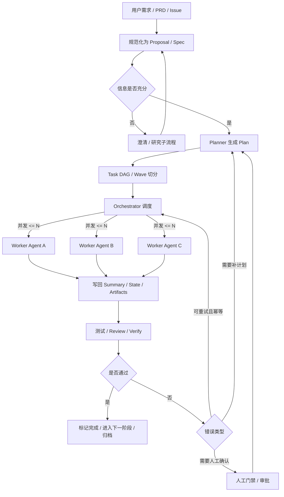

这是一份关于 `get-shit-done` (GSD) 及同类 AI 编码工作流编排工具的深度分析报告。已根据你的要求移除了原文中的乱码字符，并保留了所有核心内容。

### GSD 与同类 AI 编码工作流编排工具分析报告

#### 执行摘要
`get-shit-done` 不是传统意义上依赖数据库、队列和常驻服务的“工作流引擎”，而是一套运行在 AI 编码代理之上的**元提示与文件化编排框架**：用户通过 `/gsd-*` 命令进入工作流，工作流再调用专门代理、CLI 查询层和 `.planning/` 目录中的状态文件完成规划、执行与验证。它的核心不是“服务端调度器”，而是“可被代理读取与回写的工程化工件层”。

从实现逻辑看，GSD 的关键优势在于四点：**薄编排器**、**新鲜上下文的子代理执行**、**文件化持久状态**、以及**多重门禁**。它把真正的重量工作下沉到子代理与查询层，主编排器只负责装载上下文、分派任务、收集结果、更新状态和推进路由；同时用 `.planning/STATE.md`、`ROADMAP.md`、`config.json` 等工件保存项目记忆，并通过 plan-checker、verifier、UAT、hook、prompt guard、context monitor 等机制压制上下文漂移和执行失真。

与 GSD 相比，`superpowers` 更像**技能驱动的方法学框架**，强强调研、规格澄清、红绿重构 TDD、代码评审和分支收尾；`claude-task-master` 更像**任务系统 + MCP 工具服务器**，强调 PRD 解析、任务列表、下一步任务、研究模型和上下文预算控制；`Spec Kit` 更像**可扩展的 SDD 平台**，把核心流程、扩展、预设、项目本地覆盖组织成一套可组合框架；`OpenSpec` 则走**轻量、迭代、工件驱动**路线，弱化僵硬门禁，突出 brownfield 友好与多工具兼容。

#### 研究范围与来源
本报告优先使用**官方仓库 README、官方文档、包清单与源码文件**；只有在说明版本迁移、发布耦合、schema 漂移等“工程教训”时，才补充引用官方 changelog 与 issue。具体覆盖对象包括：`gsd-build/get-shit-done`、`obra/superpowers`、`eyaltoledano/claude-task-master`、`github/spec-kit` 与 `Fission-AI/OpenSpec`。这些项目都围绕 AI 编码代理的命令、技能、CLI 或 MCP 集成展开，因此本报告将其归入“AI 编码工作流编排/规格驱动开发框架”一类，而不是传统的服务端工作流引擎。

#### Get Shit Done 深度拆解
GSD 的官方架构很清楚：**Command Layer → Workflow Layer → Agent Layer → CLI Tools Layer → `.planning/` 文件系统**。也就是说，命令文件只是用户入口；真正的编排逻辑写在 `get-shit-done/workflows/*.md`；工作流通过 `gsd-sdk query` 或遗留 `gsd-tools.cjs` 查询、修改状态，再结合专门代理执行计划；所有持久信息则落在项目内 `.planning/`。官方还把这套系统定义为“context engineering + multi-agent orchestration + spec-driven development + state management”的组合。

从生命周期看，GSD 的主干流程是：`/gsd-new-project` 初始化项目上下文和 `.planning` 目录，随后每个 phase 经过 `discuss-phase → ui-phase → plan-phase → execute-phase → verify-work → ship`，最后再进行里程碑审计与归档。命令文档也明确说明 `new-project` 会生成 `PROJECT.md`、`REQUIREMENTS.md`、`ROADMAP.md`、`STATE.md` 和 `config.json`，而 `execute-phase` 则是“瘦编排器”：发现计划、按波次分组、生成子代理、收集结果并推进状态。

GSD 的**任务定义**并不是一套数据库表，而是 phase 目录里的 `PLAN.md` 工件。`sdk/src/query/phase.ts` 的 `phasePlanIndex` 会遍历 phase 目录里的 `*-PLAN.md` 与 `*-SUMMARY.md`，从 frontmatter 中读取 `wave`、`autonomous`、`files_modified` 等字段，并通过 XML `<task>` 标签或旧式 `## Task N` 标题统计 task 数量，同时判断哪些 plan 尚未完成摘要，从而形成 `plans / waves / incomplete / has_checkpoints` 这些对编排器友好的结构化视图。结合架构文档中“按依赖切成 wave”的设计，可以看出 GSD 是先在规划阶段把依赖折叠成波次，再由执行阶段消费这些波次。

GSD 的**调度与执行逻辑**体现出典型的“薄编排器 + 厚 worker”思路。命令包装层明确要求 orchestrator 保持精简，并把主上下文预算控制在约 15%，而子代理使用新鲜上下文完成 plan 自身的真正执行；`sdk/src/query/init.ts` 的 `initExecutePhase` 会在执行前一次性取回 phase 信息、里程碑、状态路径、配置、模型别名等所需上下文，供工作流装配执行载荷。官方架构也强调，workflow 文件“从不做重活”，只负责加载上下文、分派专门代理、收集结果、更新状态。

GSD 的**配置与状态管理**是它最有辨识度的部分。官方文档明确说所有状态都在 `.planning/` 下，以 Markdown/JSON 可读文件保存，“no database, no server, no external dependencies”；配置写在 `.planning/config.json`，并且遵循 `absent = enabled` 规则，缺省键通常按启用处理。配置 schema 中又把 `workflow`、`hooks`、`parallelization`、`git`、`gates`、`safety`、`features`、`intel` 等全部暴露出来，包括 `parallelization.max_concurrent_agents` 默认值 3。

#### 同类项目对比
这几类项目虽然都在做“让 AI 编码代理更工程化”，但切入点并不相同：GSD 偏完整生命周期编排；Superpowers 偏技能驱动的方法学；Task Master 偏任务系统与编辑器/MCP 集成；Spec Kit 偏可扩展 SDD 平台；OpenSpec 偏轻量 artifact-guided 工作流。

| 项目 | 语言与运行时 | 执行模型 | 主要扩展点 | 部署模式 | 典型用例 |
| :--- | :--- | :--- | :--- | :--- | :--- |
| **Get Shit Done** | Node.js / TypeScript SDK + Markdown prompt assets；Node `>=22`。 | 命令 → workflow → query layer → 子代理；phase/plan/wave 驱动；文件化持久状态。 | commands、workflows、agents、references、templates、hooks、SDK query registry。 | `npx get-shit-done-cc` 安装；多运行时适配到 Claude/Codex/Copilot/Gemini/OpenCode/Kilo 等。 | 规格驱动、多 phase、多代理、可恢复的 AI 编码流程。 |
| **Superpowers** | 以 skills 资产为主，仓库语言以 Shell/JS 为主；npm 包元数据极简。 | 技能自动触发：先澄清规格，再写计划，再进入 subagent-driven development、TDD、review、收尾分支。 | Skills library、`writing-skills`、宿主代理初始指令。 | Claude 官方插件市场可安装，也可按仓库说明接入。 | 想把 TDD、review、worktree、并行子代理做成“默认行为”的团队。 |
| **Claude Task Master** | TypeScript/Node；Node `>=20`；依赖 MCP、AI SDK、多模型 provider、locking 等。 | PRD 解析 → 任务列表 → next/show/expand/research；MCP server 或 CLI 驱动。 | MCP 工具集配置、模型配置、工具装载模式。 | MCP 接入编辑器，或 `npm install -g task-master-ai` CLI。 | 需要持续维护任务队列、让编辑器/代理围绕任务运转。 |
| **Spec Kit** | Python CLI；Python `>=3.11`。 | `constitution → specify → plan → tasks → implement` 的 SDD 流程。 | Extensions、Presets、Project-local overrides。 | `pipx` / `uvx` / 本地 CLI 初始化；再向代理注入 slash commands 或 skills。 | 需要强规范、强可配置、强社区扩展的规格驱动开发体系。 |
| **OpenSpec** | TypeScript/Node；Node `>=20.19.0`。 | `/opsx:propose` 生成 proposal/specs/design/tasks，`/opsx:apply` 实施，`/opsx:archive` 归档；强调 fluid not rigid。 | 配置 profile、命令集更新、多工具适配；扩展面较轻。 | `npm install -g @fission-ai/openspec`，`openspec init`，项目内 `openspec update`。 | 想要轻量规格层、brownfield 友好、少门禁但保留工件约束的团队。 |

#### 通用思路与设计权衡
把这几个项目放在一起看，它们其实共享一个非常稳定的通用逻辑：**把需求固化成仓库工件，把工件转成计划，把计划切成任务，再由编排器把任务发给代理执行，最后再把结果、状态、验证与归档回写到仓库。** GSD 的 `.planning/`、Spec Kit 的 `.specify` 体系、OpenSpec 的 `openspec/changes/...` 工件目录，以及 Task Master 围绕 PRD/任务的命令集，都在做同一件事：用可审计工件替代“只存在于聊天记录里的上下文”。

这类工具常见的**设计模式**可以概括成五类：
1.  **薄编排器模式**：让 orchestrator 只做上下文装配、路由和 gate，把编码、验证、review 交给 fresh-context worker。
2.  **文件即状态机**：把状态写入 Markdown/JSON，既让代理可读，也让人类与 Git 可审计。
3.  **工件优先于会话**：Spec Kit 和 OpenSpec 都要求主要语义先落到 spec/design/tasks，再进入实现。
4.  **上下文预算即运行时资源**：GSD 有 context monitor，Task Master 有工具装载档位。
5.  **能力通过安装适配**：GSD 的安装器适配多运行时，Spec Kit 用 extensions/presets。

**权衡**也很典型。文件化状态的优点是透明、可恢复、git 友好，但缺点是特别容易出现 schema 漂移；GSD 之所以引入 `config-schema` parity guard，就是在给这一代价补课。另一方面，像 OpenSpec 这样更 fluid 的系统，降低了流程阻力，但会减少强门禁带来的过程确定性。

#### 自建工作流最佳实践清单
下面这张清单把 GSD 及对比项目中已经验证过的模式，翻译成自建系统时应优先落地的工程项。

| 维度 | 建议 | 参考模式 |
| :--- | :--- | :--- |
| **接口设计** | 把命令入口、查询层、状态变更层分开；入口只做参数语义，查询层返回结构化对象，错误分类单独建模。 | GSD 的 `QueryRegistry`、`GSDError`、`QUERY-HANDLERS` 约定。 |
| **工件与状态** | 先定义你的 canonical artifacts：`spec`、`plan`、`task`、`state`、`summary`、`verification`。 | GSD 的 `.planning/*`、OpenSpec 的 `proposal/specs/design/tasks`。 |
| **Schema 管理** | 让文档、校验器、消费者共享单一事实源；对 docs↔code 做 parity test。 | GSD 的 `config-schema.ts` 与相关 parity 测试。 |
| **错误与重试** | 只重试幂等步骤；把“输入错误”“阻塞状态”“执行失败”“用户中断”区分开。 | GSD 的错误分类与 `data.error` 约定。 |
| **并发与资源限制** | 用 DAG 或 wave 控制依赖；给并发数、工具数、上下文预算设硬限制。 | GSD 的 wave + `max_concurrent_agents`。 |
| **持久化与锁** | 所有 durable write 都要有锁、原子写或临时目录切换；尽量提供 dry-run / diff 能力。 | GSD 的 `.lock`、state 锁、`pipeline.ts` dry-run 克隆与 diff。 |
| **监控与告警** | 至少监控：上下文占用、当前阶段、当前任务、重试次数、失败原因。 | GSD 的 statusline/context monitor。 |
| **权限与审计** | 给命令和代理都做最小权限工具集；对 destructive/external-service 操作加确认。 | GSD 的 command/agent `allowed-tools`、安全 hook。 |

#### 流程图与示例代码
下面这张流程图抽象了 GSD、Superpowers 等工具的共同结构，推荐作为自建系统的蓝图。



**TypeScript 示例代码**
这是一段简化的示例，展示如何定义任务、做波次调度、保存状态并实现错误分类与重试。

```typescript
import { promises as fs } from "node:fs";

type TaskStatus = "pending" | "running" | "done" | "failed";
type WorkflowContext = { projectDir: string; maxConcurrent: number; stateFile: string; };

type TaskDef = { 
    id: string; 
    deps: string[]; 
    retryable: boolean; 
    maxAttempts: number; 
    run: (ctx: WorkflowContext) => Promise<void>; 
};

class WorkflowError extends Error { 
    constructor( message: string, public kind: "validation" | "blocked" | "execution" ) { 
        super(message); 
        this.name = "WorkflowError"; 
    } 
}

type PersistedState = { 
    tasks: Record<string, { status: TaskStatus; attempts: number; error?: string }>; 
};

// 状态读写与波次执行逻辑...
```

#### 结论
如果你的目标是做一套**完整、可恢复、跨多次会话运行的 AI 编码编排体系**，GSD 提供了最完整的参考样本。如果你更在意**开发方法学默认化**，Superpowers 值得看；如果更在意**任务系统与编辑器内操作效率**，Task Master 更合适。

对“自己做工作流”这件事，最终结论是：**先把工件、状态、错误和验证做好，再追求自动化深度。** 最稳妥的默认架构是：**文件化工件作为控制平面、薄 orchestrator、波次/拓扑调度、最小权限 worker、显式错误分类、锁与原子写、上下文与事件观测。**

```typescript
import { promises as fs } from "node:fs";

type TaskStatus = "pending" | "running" | "done" | "failed";

type WorkflowContext = {
  projectDir: string;
  maxConcurrent: number;
  stateFile: string;
};

type TaskDef = {
  id: string;
  deps: string[];
  retryable: boolean;
  maxAttempts: number;
  run: (ctx: WorkflowContext) => Promise<void>;
};

class WorkflowError extends Error {
  constructor(
    message: string,
    public kind: "validation" | "blocked" | "execution",
  ) {
    super(message);
    this.name = "WorkflowError";
  }
}

type PersistedState = {
  tasks: Record<string, { status: TaskStatus; attempts: number; error?: string }>;
};

async function loadState(path: string): Promise<PersistedState> {
  try {
    return JSON.parse(await fs.readFile(path, "utf8")) as PersistedState;
  } catch {
    return { tasks: {} };
  }
}

async function saveState(path: string, state: PersistedState): Promise<void> {
  const tmp = `${path}.tmp`;
  await fs.writeFile(tmp, JSON.stringify(state, null, 2), "utf8");
  await fs.rename(tmp, path);
}

function readyTasks(tasks: TaskDef[], state: PersistedState): TaskDef[] {
  return tasks.filter((t) => {
    const current = state.tasks[t.id]?.status ?? "pending";
    if (current === "done" || current === "running") return false;
    return t.deps.every((dep) => state.tasks[dep]?.status === "done");
  });
}

async function runTask(task: TaskDef, ctx: WorkflowContext, state: PersistedState): Promise<void> {
  const record = state.tasks[task.id] ?? { status: "pending" as TaskStatus, attempts: 0 };
  state.tasks[task.id] = record;

  for (let attempt = record.attempts + 1; attempt <= task.maxAttempts; attempt++) {
    record.status = "running";
    record.attempts = attempt;
    record.error = undefined;
    await saveState(ctx.stateFile, state);

    try {
      await task.run(ctx);
      record.status = "done";
      await saveState(ctx.stateFile, state);
      return;
    } catch (err) {
      const message = err instanceof Error ? err.message : String(err);
      record.error = message;
      record.status = "failed";
      await saveState(ctx.stateFile, state);

      if (!task.retryable || attempt === task.maxAttempts) {
        throw new WorkflowError(`任务 ${task.id} 失败：${message}`, "execution");
      }

      // 简单退避；真实系统应加入 jitter、错误码与人工门禁
      await new Promise((r) => setTimeout(r, 500 * attempt));
    }
  }
}

export async function executeWorkflow(tasks: TaskDef[], ctx: WorkflowContext): Promise<void> {
  const state = await loadState(ctx.stateFile);

  while (true) {
    const remaining = tasks.filter((t) => (state.tasks[t.id]?.status ?? "pending") !== "done");
    if (remaining.length === 0) return;

    const ready = readyTasks(tasks, state);
    if (ready.length === 0) {
      throw new WorkflowError(
        "没有可执行任务：可能存在循环依赖，或需要人工处理失败任务。",
        "blocked",
      );
    }

    // 一个“波次”：依赖已满足的任务里，取并发窗口大小
    const wave = ready.slice(0, ctx.maxConcurrent);

    const results = await Promise.allSettled(
      wave.map((task) => runTask(task, ctx, state)),
    );

    const failed = results.find((r) => r.status === "rejected");
    if (failed) {
      // 真实系统里，这里可以接 review / verify / manual-approval 分支
      throw failed.reason;
    }
  }
}
```
