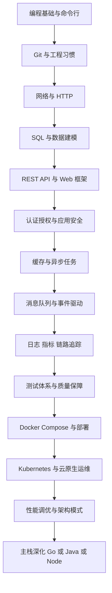
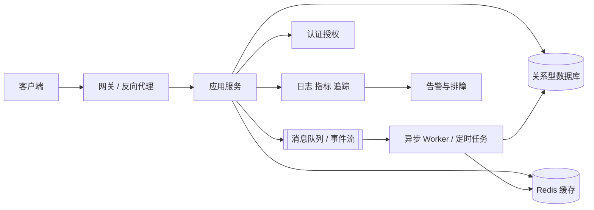
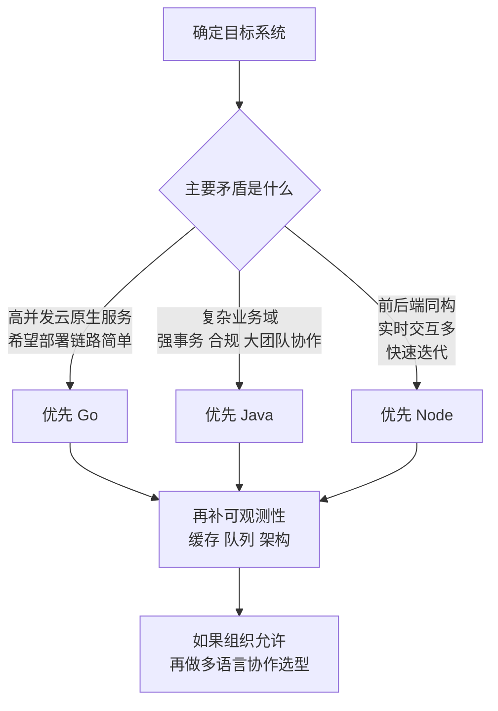
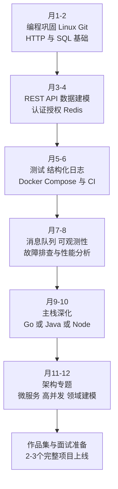

# 传统后端学习历程与 Go Java Node 知识体系深度分析

## 执行摘要

本文以“有编程基础、每周投入约10小时、目标在6—12个月成长到中级后端”为假设，先搭出传统后端的通用知识骨架，再对 Go、Java、Node 的运行时、并发、框架、工程化与运维差异做系统比较。核心结论是：先学通用后端，再选一门主栈深挖；Go 偏云原生效率，Java 偏复杂企业系统，Node 偏前后端协同与实时 I/O。  

## 研究范围与关键假设

这份报告面向“后端初学者到中级工程师”，默认读者已经掌握至少一门编程语言的基础语法，但缺少系统化后端知识框架。未指定行业时，我将目标场景假设为通用 Web/API 与企业服务端开发，而非数据工程、嵌入式、纯前端 BFF 或重度算法岗。时间投入默认每周约 10 小时，目标是用 6—12 个月达到“能独立设计、实现、测试、部署一个生产感知型后端服务”的水平。这个节奏与 roadmap.sh 对后端入门路径的建议一致：先掌握一门后端语言、包管理、关系型数据库、CRUD、REST API、认证授权与 Git，并通过大量项目巩固。citeturn12view0

从研究方法看，我优先采用四类来源：第一是 roadmap.sh 及其 Backend、Go、Java、Node.js 路线图，作为“学习路径骨架”；第二是官方文档，作为“事实依据”；第三是成熟开源项目与官方样例，作为“工程落地参照”；第四是开发者调查，用于校准生态热度与真实使用面。2025 年 Stack Overflow 开发者调查共使用了 49,009 份、来自 177 个国家的响应，因此适合用来观察语言与框架层面的相对流行度，但不应被误读为唯一选型标准。citeturn35view1turn11search22turn12view1turn12view2turn11search2

为了避免“学栈不学后端”的常见误区，本报告把“传统后端”定义为一条完整请求链路上的能力集合：网络与 HTTP、数据建模与数据库、缓存与消息队列、认证授权与应用安全、日志监控与链路追踪、测试治理、容器化与部署、以及从单体到分布式的架构模式。HTTP 本身是 Web 上数据交换的基础应用层协议，采用客户端—服务器模型并通过请求/响应报文通信；OAuth 2.0 定义授权框架，OpenID Connect 则在其上补充身份层；OpenTelemetry 提供厂商中立的 traces、metrics、logs 可观测性框架。这些共同构成今天后端工程的最小公共语言。citeturn23view0turn23view8turn23view9turn23view5

下表明确本报告采用的假设边界：

| 项目 | 假设 |
|---|---|
| 目标读者 | 有编程基础，但需要系统化后端学习路径 |
| 时间投入 | 每周约 10 小时 |
| 学习周期 | 6—12 个月 |
| 目标水平 | 能独立做中小型生产感知型后端服务 |
| 主要场景 | Web API、企业应用、微服务/单体后端 |
| 选型方式 | 先学通用后端，再深挖一门主栈，另外两门做横向理解 |

## 传统后端通用知识体系

roadmap.sh 的 Backend 路线把“语言、包管理、数据库、API、认证、Git、项目”串成一条非常实用的主线；如果再补上缓存、消息队列、可观测性、测试、安全和部署，就能得到更接近真实工作的后端学习路径。建议把学习目标分成三层：**入门层**关注“能让请求跑通”；**进阶层**关注“能让服务长期稳定运行”；**专家层**关注“能在复杂流量、复杂组织和复杂架构里持续演进”。citeturn12view0turn23view0turn23view2turn23view3turn23view5turn24search0turn23view7

下图把这条路线压缩成一个 roadmap 风格主流程。它沿用 roadmap.sh 的“先语言、后数据、再 API 与认证”的骨架，但把测试、可观测性、运维和架构放进了主路径，而不是作为附录。citeturn12view0turn23view5turn23view11turn24search1turn23view7

下表是按“知识域 × 学习阶段”整理的通用后端知识体系。表中的“阶段要求”是课程设计建议；“典型工具/主资源”列则对应官方文档与权威资料，便于你按需回溯。  

| 知识域 | 入门层重点 | 进阶层重点 | 专家层重点 | 典型工具与主资源 |
|---|---|---|---|---|
| 网络与 HTTP | 搞懂 TCP/IP、端口、DNS、请求/响应、状态码、Header、Cookie、JSON、幂等性 | 掌握 Keep-Alive、缓存头、反向代理、超时、重试、分页、限流、文件上传、SSE/WebSocket 适用边界 | 理解 TLS、HTTP/2/3、连接复用、背压、网关治理与协议兼容 | MDN HTTP 概述、API 调试器、抓包工具 citeturn23view0 |
| 关系型数据库与建模 | 会建表、主外键、索引、CRUD、基本 JOIN、事务概念 | 理解范式/反范式、执行计划、锁、隔离级别、迁移、读写分离与分页优化 | 能做高并发写入、索引策略、分区分库、数据一致性治理 | PostgreSQL / MySQL 官方手册 citeturn23view1turn25search0 |
| 缓存与键值型数据 | 会把 Redis 用作缓存，理解过期、回源、击穿/穿透/雪崩 | 会用 Hash/List/Set/Sorted Set/Stream；理解分布式锁、限流、排行榜 | 能设计缓存一致性、热点治理、多级缓存与流式事件处理 | Redis 官方数据类型文档 citeturn23view2 |
| 消息队列与异步 | 理解“为什么异步”；会做任务解耦、削峰与重试 | 掌握生产者/消费者、消费位点、死信、幂等、顺序性和可重放 | 能设计事件驱动架构、最终一致性、补偿与高可用集群 | Kafka 官方介绍文档 citeturn23view3 |
| 认证授权与安全 | 区分认证与授权；理解 Session、Token、JWT、密码哈希、CSRF/XSS/SQLi 基础 | 掌握 OAuth 2.0 角色与流程、OIDC 身份层、RBAC/ABAC、密钥管理、接口鉴权 | 能做零信任边界、细粒度授权、审核与安全基线 | OAuth 2.0、OIDC、OWASP ASVS、OWASP Authorization Cheat Sheet citeturn23view8turn23view9turn23view4turn23view10 |
| 日志、指标、链路追踪 | 能打结构化日志，区分错误日志与业务日志 | 会采集 metrics / traces / logs，建立请求 ID、基础仪表盘和告警 | 能定义 SLI/SLO、做容量评估、问题归因和跨服务排障 | OpenTelemetry、Spring Actuator 等 citeturn23view5turn13view0 |
| 测试与质量保障 | 会写单元测试、接口测试、表驱动测试/断言、基本 Mock | 掌握集成测试、测试金字塔、测试数据隔离、覆盖率与回归 | 会做契约测试、混沌/压测、质量门禁、真实依赖测试 | Fowler 测试金字塔、Spring Boot Testing、node:test、Go testing/fuzzing citeturn23view11turn21view2turn30view6turn31view1 |
| 部署与运维 | 会写 Dockerfile、环境变量、健康检查、日志输出到 stdout | 会用 Compose 管理多容器、本地联调、CI/CD、灰度/回滚、Secrets | 会用 Kubernetes 做弹性伸缩、配置管理、可观测性接入与集群安全 | Docker 容器与 Compose、Kubernetes 官方文档 citeturn24search0turn24search1turn23view7 |
| 架构模式与性能 | 理解分层架构、单体优先、三层职责、中间件位置 | 会做 DDD 轻量实践、领域服务、模块边界、异步任务与读写分离 | 会权衡单体与微服务、事件驱动、服务治理、熔断、配置中心、服务发现 | roadmap.sh Backend、Spring Cloud、CloudWeGo/微服务框架文档 citeturn12view0turn20view3turn28search0 |

如果把“传统后端”画成一张关系图，最重要的不是记住某个框架，而是看清楚请求如何穿过网关、服务、数据库、缓存、队列与可观测性链路。真正成熟的学习往往发生在你能把这张图和自己的项目逐一对应起来的时候。HTTP 提供外部接口，数据库保存事实状态，Redis 和消息队列分别承担“加速”和“解耦”，而认证、安全、日志、指标和链路追踪则是横切面。citeturn23view0turn23view2turn23view3turn23view8turn23view5

从学习顺序上看，**入门阶段不要急着上微服务**。先把单服务里的请求流转、数据建模、缓存、鉴权和测试做扎实，再进入消息、观测、容器化与分布式治理，会节省大量返工时间。roadmap.sh 也明确提醒：项目实践是固化理解的关键。citeturn12view0turn23view11

## Go Java Node 后端知识与技能体系

三种技术栈共享相同的后端知识底盘，但由于运行时与工程生态不同，它们的学习重心并不一样。Go 更像“以简驭繁”的云原生服务语言；Java 更像“以平台和框架组织复杂性”的企业系统语言；Node 更像“以前后端同构与高 I/O 并发驱动效率”的 Web 语言。roadmap.sh 的 Go 路线强调标准库、清晰语法和并发；Java 路线强调 JVM、并发和内存管理；Nest 文档则直接指出，Node 使 JavaScript 成为前后端共通语言，而 Nest 构建在 Express/Fastify 之上，用于高效、可扩展、企业级服务端应用。citeturn12view1turn12view2turn12view8

先看整体技能面貌：

| 维度 | Go 后端 | Java 后端 | Node 后端 | 依据 |
|---|---|---|---|---|
| 语言与运行时 | 语法相对简洁，标准库能力强，模块系统内建，强调清晰和效率 | 以 JVM 为核心，泛型、JLS/JVM 体系完整，适合长期维护的大型系统 | 运行在 Node.js，支持 ESM 与 CommonJS，天然继承 JavaScript/TypeScript 生态 | citeturn12view1turn12view4turn12view2turn15search1turn30view1turn12view8 |
| 并发模型 | goroutine + channel；并发表达直接，但要警惕竞态与 goroutine 生命周期 | 平台线程 + 虚拟线程；虚拟线程适合 thread-per-request，且不应做线程池化 | Event Loop + Worker Pool；CPU 密集任务要交给 worker_threads，多进程扩展可用 cluster | citeturn14view3turn14view2turn12view5turn30view0turn12view7turn30view2 |
| Web 框架 | `net/http` 是根基；Gin 偏轻量高性能；go-zero、Kratos、CloudWeGo 更偏微服务与治理 | Spring Boot 是事实标准，覆盖 Web、Data、Security、Actuator、测试等 | Express 简洁灵活；Fastify 偏性能；Nest 更适合团队化、模块化、企业风格开发 | citeturn5search3turn20view0turn20view1turn28search0turn21view0turn13view0turn21view2turn5search1turn5search2turn12view8 |
| 依赖与工程化 | Go Modules 是官方依赖管理；`gofmt`/`goimports` 几乎是默认纪律 | Maven 强于企业依赖管理与 BOM；Gradle 强于构建灵活性与版本目录 | npm workspaces / pnpm workspace 适合 monorepo；lockfile 对可重复安装很关键 | citeturn14view0turn14view4turn13view3turn13view4turn30view4turn30view5turn22search7 |
| 数据访问 | 常见路线是标准库 SQL 或 GORM；更强调理解 SQL 与上下文传递 | Spring Data JPA、MyBatis、事务、自动配置与 starter 化整合成熟 | Prisma 强类型体验好；TypeORM 功能广，适合 TypeScript/JavaScript 数据层 | citeturn20view2turn19search1turn21view0turn20view4turn20view5 |
| 性能与调优 | `pprof`、基准测试、`-race`、fuzzing 都在官方工具链中，排障闭环短 | JFR/JMC、`jcmd`、G1/GC 调优、Actuator/Micrometer，工具极成熟 | 重点是避免阻塞事件循环、定位内存泄漏、把 CPU 活迁到 Workers；诊断常围绕 Event Loop/GC/进程模型 | citeturn14view1turn14view2turn31view0turn15search2turn16search1turn16search0turn13view0turn21view1turn30view0turn30view3 |
| 测试体系 | `go test` 一体化体验强，原生支持 benchmark、coverage、fuzz | JUnit + Spring Boot Test + Testcontainers 组合完整，企业可维护性强 | `node:test` 已可用；Jest/Vitest 生态成熟；Docker/Testcontainers 与 Playwright 适合集成/E2E | citeturn31view1turn31view0turn21view2turn15search4turn31view3turn30view6turn32view2turn32view3turn32view1turn32view4 |
| 部署与容器化 | Docker 对 Go 有专门指南，多阶段构建和小镜像很常见 | Spring Boot 直接支持 Cloud Native Buildpacks，经 Maven/Gradle 可生成兼容 Docker 的镜像 | 常见是容器化部署；进程保活可用 PM2；多核扩展可结合 cluster 或容器副本 | citeturn6search9turn13view1turn22search4turn30view2turn24search0 |
| 常见实践与反模式 | 实践：gofmt、显式错误处理、最小接口、`context`；反模式：把 `panic` 当流程控制、共享可变状态、goroutine 泄漏 | 实践：starter/auto-config、外部化配置、Actuator、测试切片；反模式：滥用线程池思维对待虚拟线程、混用阻塞代码与不适配的异步框架 | 实践：保持回调/任务短小、锁定依赖、模块化框架；反模式：阻塞事件循环、把 CPU 计算留在主线程、放任依赖漂移 | citeturn14view4turn14view3turn12view5turn21view3turn13view0turn30view0turn30view4turn22search7turn12view8 |
| 社区与企业采用场景 | 官方与企业案例集中在后端、平台、微服务、基础设施；国内云原生社区里 CloudWeGo 也很活跃 | Java 与 Spring 长期服务企业应用、合规要求和复杂组织协作；企业支持能力最强 | Node.js 在 Web 框架层使用面很广，适合全栈团队、BFF、实时服务与快速交付 | citeturn27search0turn28search0turn28search3turn29search5turn29search1turn29search4turn35view0turn36view3turn27search8turn12view8 |

如果把它们放回“同一套通用后端能力”里看，差异会更清楚。下面这张表回答的是：在相同知识点上，三门语言分别会把你带向哪里。  

| 通用知识点 | Go 的侧重点 | Java 的侧重点 | Node 的侧重点 | 学习提示 |
|---|---|---|---|---|
| HTTP/API | 先用标准库理解 Handler、中间件、上下文，再引入 Gin 一类轻框架 | 重点理解 Spring MVC/校验/异常处理/Actuator，把接口组织成可运维的业务边界 | 先学 Express 中间件，再学 Nest 的模块化抽象与团队协作方式 | 如果你是初学者，先用“轻框架 + 明确分层”最稳妥。citeturn5search1turn5search3turn21view0turn13view0turn12view8 |
| 数据库 | 更强调 SQL、连接池、上下文取消和显式控制；ORM 常作为辅助而非替代 | 更强调事务、ORM/Mapper 选择、仓储抽象与大量 starter 集成 | 更强调类型安全与代码生成体验，尤其在 TypeScript 团队里 | 三栈都必须补数据库原理；不要把 ORM 当数据库知识的替代品。citeturn20view2turn19search1turn20view4turn20view5turn23view1turn25search0 |
| 缓存与异步 | 适合做高并发缓存服务、任务 Worker、基础设施组件 | 适合深度接入 Redis/Kafka、事务消息、企业集成与服务治理 | 适合 I/O 密集异步任务、通知服务、实时网关，但 CPU 重任务要转移 | 学缓存和消息时，先记“幂等、重试、顺序、可观测”。citeturn23view2turn23view3turn20view3turn30view0 |
| 认证授权 | 常见做法是保持实现简洁、把鉴权中间件和上下文传播做好 | Java 在 OAuth2/OIDC、企业 SSO、合规场景里集成最成熟 | Node 倾向中间件式鉴权，适合 Web 团队快速整合前后端身份流 | 安全学习不要绑死在某个框架，要先掌握 OAuth2/OIDC 与 OWASP。citeturn23view8turn23view9turn23view4turn23view10 |
| 日志与监控 | `pprof` + 指标 + tracing 组合直接，适合快速定位热点和竞态 | Actuator、Micrometer、JFR/JMC 构成最成熟的企业观测链 | 重点排查 Event Loop 阻塞、内存泄漏、进程重启与负载分配 | 观测能力是中级后端分水岭，建议在第二阶段就接入。citeturn14view1turn14view2turn13view0turn21view1turn15search2turn30view0turn30view3 |
| 部署运维 | 包装与部署路径通常更直接，适合云原生服务和 CLI/内部工具 | 构建链与运行时更丰富，但也更重视配置治理、健康检查和合规支持 | 启动快、部署轻，但常要搭配进程管理、容器副本与依赖治理纪律 | 真正的“运维成本”来自故障诊断与组织复杂度，而不只是启动命令。citeturn6search9turn13view1turn22search4turn24search1turn23view7 |

如果只给每门语言提炼一条最关键的学习建议，我会这样说。**Go**：先学官方工具链，再学并发与 profiling，尽量把复杂度留给架构而不是语言本身；官方文档里 Generics、Modules、Fuzzing、pprof、Race Detector 都是必修项。citeturn12view4turn14view0turn31view0turn14view1turn14view2

**Java**：不要只学“会写 Controller”。真正的 Java 后端能力在于理解 JVM、线程模型、依赖治理、自动配置、可观测性与测试体系。Spring Boot 的价值并不只是“快速起项目”，而是把嵌入式服务器、配置、健康检查、指标、安全、测试等非功能性能力变成统一工程平台；虚拟线程则要求你重新理解线程池习惯。citeturn21view0turn13view0turn21view2turn12view5turn15search2turn16search1

**Node**：真正的门槛不是语法，而是异步心智模型和运行时边界。Node 的强项来自非阻塞 I/O 和前后端语言统一，但它要求你严格避免阻塞事件循环，把 CPU 密集工作迁移到 Worker，把依赖治理、工作区和测试规约做得比“脚本时代”更严谨。citeturn12view6turn30view0turn12view7turn30view1turn30view4turn30view5turn30view6

## 综合对比与选型结论

先看生态热度。按 2025 年 Stack Overflow 调查，在“编程语言”维度，Java 的使用比例高于 Go；在“Web frameworks and technologies”维度，Node.js、Express、Spring Boot、NestJS、Fastify 分别都有明显存在感，其中 Node.js/Express 在专业开发者中的使用比例高于 Spring Boot，而 Spring Boot 仍是大型企业 Java 后端生态的核心框架之一。调查样本覆盖 177 个国家、49,009 份响应，因此它适合用来观察“广义使用面”，但不等于“你的团队最优解”。citeturn35view1turn35view0turn36view3

下面这张表不是统一基准测试结果，而是结合官方运行时与框架文档做出的工程化判断。它更适合用来做**学习与选型决策**，而不是拿来代替压测。  

| 维度 | Go | Java | Node | 结论 |
|---|---|---|---|---|
| 原始执行画像 | 通常具备较低运行时复杂度与很好的部署简洁性 | 在 warm-up 后常有很强吞吐与成熟 GC/JIT 能力 | I/O 密集型吞吐优秀，但 CPU 密集任务必须转移 | 追求“轻运维 + 高并发服务”时 Go 很占优；复杂事务型系统 Java 更稳；实时 I/O 场景 Node 很强。citeturn12view1turn14view1turn12view5turn16search0turn30view0turn12view7 |
| 并发模型可理解性 | 高，goroutine/channel 直观 | 中，平台线程 + 虚拟线程 + 框架抽象共存 | 中，Event Loop/Worker Pool 初学者常踩坑 | “容易写出并发代码”不等于“容易写对并发代码”，但 Go 的心智模型最统一。citeturn14view3turn12view5turn30view0 |
| 开发效率 | 中高，代码量少但很多基础设施要自己做取舍 | 中，平台能力最全，但抽象层多、配置也多 | 高，前后端协同强，迭代快，原型到产品路径短 | 小团队/全栈团队通常会觉得 Node 更顺手；规范化大团队通常受益于 Java；偏基础设施团队往往喜欢 Go。citeturn12view8turn21view0turn20view0 |
| 生态成熟度 | 高，云原生和基础设施强 | 很高，企业框架、中间件、测试、可观测性最完整 | 高，Web 与工具生态极强，但依赖管理纪律要求高 | 如果你的业务边界复杂、组织庞大，Java 的“生态厚度”优势最明显。citeturn28search0turn21view0turn20view3turn30view4turn22search7 |
| 学习曲线 | 语言曲线缓，系统曲线陡 | 语言、JVM、Spring 多层叠加，整体最陡 | 语法曲线缓，异步与工程纪律曲线后置 | 初学者如果急于“快上手”，Node/Go 体感更友好；想做长期企业后端，Java 值得前期多投入。citeturn12view1turn12view2turn30view0turn30view1 |
| 运维成本 | 往往较低，构建与发布路径直接 | 中到较高，但监控、诊断、支持与合规能力最强 | 中，启动轻，但事件循环、内存与依赖治理要严控 | 小团队更容易驾驭 Go；制度化企业有能力把 Java 的复杂性转化为优势；Node 需要额外工程纪律。citeturn6search9turn13view1turn15search2turn13view0turn30view3turn22search4 |
| 典型适用场景 | 云原生微服务、API 服务、平台工具、基础设施、网关 | 复杂领域模型、交易系统、企业中台、强合规系统 | BFF、实时通知、协同应用、全栈 Web、I/O 密集服务 | 没有“万能语言”，只有“最适合当前组织与问题”的语言。citeturn27search0turn28search3turn29search5turn29search1turn12view8turn35view0 |

如果你的目标是**尽快形成系统化后端能力**，我更推荐这样选：

第一类，选择 **Go**。适合你想主攻云原生、微服务、网关、平台服务、基础设施，或者你更偏好“语言简单、运行时直接、部署链路短”的工程风格。roadmap.sh 对 Go 的定位就非常贴近这一点：标准库成熟、并发支持强、适合可扩展服务；官方案例与 CloudWeGo 也说明它在生产级微服务里非常活跃。citeturn12view1turn27search0turn28search0turn28search3

第二类，选择 **Java**。适合你面向复杂业务域、企业中后台、强事务、高合规、大团队协作、长期演进的系统。Java 路线真正的优势不只是语言本身，而是 JVM + Spring + 测试 + 可观测性 + 企业支持的完整平台化能力。Oracle 仍把 Java 描述为企业与开发者的首选开发平台，Spring 生态也持续提供企业级安全、合规、支持与超长期维护。citeturn29search5turn29search1turn29search4turn12view2

第三类，选择 **Node**。适合你所在团队前后端协同非常紧密、产品节奏快、实时交互多、BFF/聚合层多、需要用同一门语言覆盖前后端，或者你希望先用较低语法门槛进入后端。Node 的关键收益来自非阻塞 I/O 和 Web 生态，而 Nest 又把这种生态进一步组织成更适合多人协作的大型后端工程。citeturn12view8turn12view6turn30view0turn27search8turn36view3

如果你问“能不能三门一起学”，我的结论是：**可以横向比较，但不要三门并修成主栈**。更合理的做法是：先用 2—3 个月补齐通用后端底座，再选一门主栈做 2—3 个完整项目；其余两门只做到“能读懂、能跑 demo、能说清差异”。这样学习效率最高，知识迁移也最完整。这个建议与 roadmap.sh 强调的“项目驱动成长”是同一逻辑。citeturn12view0turn11search13

下图给出一个实用的选型流程。它更像工程决策树，而不是语言鄙视链。  

## 学习资源与优先级

如果只能给你一套“先学什么、后看什么”的资源清单，我会优先推荐下表。它尽量满足“优先官方、优先权威、优先中文可得性”的要求。  

| 层级 | 通用后端 | Go | Java | Node |
|---|---|---|---|---|
| 入门 | roadmap.sh Backend；MDN HTTP；Docker 容器基础 citeturn12view0turn23view0turn24search0 | A Tour of Go；Effective Go；Go Modules Reference citeturn12view4turn14view0 | roadmap.sh Java；Spring Boot Overview；Spring PetClinic citeturn12view2turn21view0turn10search6 | roadmap.sh Node.js；Node Learn Event Loop；Nest 文档；Express 中间件文档 citeturn11search2turn12view6turn12view8turn5search1 |
| 进阶 | PostgreSQL/MySQL；Redis；Kafka；OAuth2/OIDC；OWASP ASVS；OpenTelemetry citeturn23view1turn25search0turn23view2turn23view3turn23view8turn23view9turn23view4turn23view5 | Race Detector；pprof；Go Fuzzing；GORM；Kratos / go-zero / CloudWeGo citeturn14view2turn14view1turn31view0turn20view2turn20view1turn20view0turn28search0 | Virtual Threads；JFR/JMC；Maven/Gradle；Spring Boot Testing；Spring Cloud；MyBatis citeturn12view5turn15search2turn13view3turn13view4turn21view2turn20view3turn19search1 | Don’t Block the Event Loop；worker_threads；npm workspaces / pnpm；node:test；Prisma / TypeORM；Fastify citeturn30view0turn12view7turn30view4turn30view5turn30view6turn20view4turn20view5turn5search2 |
| 实战 | Compose；Kubernetes；Test Pyramid；Testcontainers 思路 citeturn24search1turn23view7turn23view11turn31view3turn31view2turn32view1 | roadmap.sh Go Projects；Gin / CloudWeGo 示例 citeturn11search4turn10search5turn28search0 | Spring PetClinic、Spring Cloud、Testcontainers for Java citeturn10search6turn20view3turn31view3 | Nest sample、Node Best Practices、Testcontainers for Node、Playwright citeturn10search3turn10search4turn32view1turn32view4 |

如果你更习惯用书来建立完整心智模型，下面这些书很值得进入书单。它们不是“版本说明”，而是“知识框架补全器”。Go 方向优先《The Go Programming Language》；Java 方向优先《深入理解 Java 虚拟机》；通用后端与系统设计优先《Designing Data-Intensive Applications》；Node 方向优先《Node.js 设计模式》。其中 DDIA 已有持续更新的中文翻译项目，适合作为架构层长期参考。citeturn34search5turn34search9turn34search4turn34search7turn33search1

就中文资源友好度而言，Go 与 Node 都有较好的中文文档镜像或社区翻译，Java/Spring 则有较完整的中文参考站。对于初学者，这意味着你完全可以先用中文构建概念，再回到英文官方文档校准细节。尤其是 Spring 中文参考、pnpm 中文文档、CloudWeGo 中文站、Kratos / go-zero 文档，对国内学习者非常友好。citeturn5search9turn30view5turn28search0turn20view1turn20view0

## 学习路线图与实践项目

roadmap.sh 对后端与语言学习都反复强调一件事：**项目是学习的压缩器**。只看文档，你会知道“有这些概念”；真正把用户、鉴权、缓存、异步、监控、容器化串起来之后，你才会知道它们为什么会同时出现。citeturn12view0turn11search4turn11search10turn11search11

下面给出一条按“每周 10 小时、6—12 个月”设计的 roadmap 风格路线。推荐做法是：**前半段学通用后端，后半段深挖主栈**。  

如果时间只能覆盖 6 个月，我建议把目标收束为三件事：第一，做出一个“带数据库+鉴权+缓存+测试+容器化”的单体项目；第二，再做一个“带消息队列+观测+部署”的增强项目；第三，把其中一个项目用主栈做一次性能与工程化重构。这样往往比“东一榔头西一棒子地刷三门语言教程”更接近真实成长。citeturn12view0turn23view5turn24search1

最后是实践项目清单。为了让它真的能被执行，我按难度分级，并明确了重点知识点和评估标准。你不必全部完成；但至少做完前 6 个，再从后 4 个里选 2 个，已经足以形成一份可信的后端作品集。  

| 难度 | 项目 | 推荐主栈 | 重点练习知识点 | 最低交付标准 | 优秀评估标准 |
|---|---|---|---|---|---|
| 简单 | Todo / 任务管理 API | 任意 | REST、CRUD、数据建模、分页、参数校验、错误码 | 有 OpenAPI 文档，能跑 Docker Compose，本地可一键启动 | 单元测试覆盖核心逻辑，接口幂等明确，日志结构化 |
| 简单 | 用户注册登录服务 | Java / Node / Go | 密码哈希、JWT、RBAC、刷新令牌、审计日志 | 支持注册/登录/登出/权限校验 | 能解释 OAuth2/OIDC 与 JWT 边界，具备限流与锁定策略 |
| 简单 | 博客 / CMS 后端 | Java / Node | 富文本、标签分类、搜索、文件上传、缓存 | 完整后台 API，读接口接入 Redis 缓存 | 有后台审核流、缓存失效策略与集成测试 |
| 中等 | 订单 + 库存服务 | Java / Go | 事务、库存扣减、幂等、重试、状态机 | 能处理下单、取消、支付回调模拟 | 引入消息队列做异步补偿，能够展示最终一致性设计 |
| 中等 | 通知中心 | Node / Go | 异步任务、邮件/短信/站内信、模板、失败重试 | 至少支持两种通知通道 | 失败进入死信队列，有重试退避和告警面板 |
| 中等 | 带缓存的热点内容服务 | Go / Java / Node | Redis、热点 Key、缓存击穿/穿透/雪崩、限流 | 读多写少接口具备缓存层 | 能通过压测展示缓存前后差异，并说明一致性方案 |
| 中等 | 可观测性增强 API | Go / Java | 指标、日志、链路追踪、健康检查、SLO | 接入 metrics/logs/traces，暴露健康检查 | 能按 traceId 排障，有仪表盘与错误预算阐释 |
| 较难 | 实时排行榜 / 聊天网关 | Node / Go | WebSocket/SSE、Redis 排行榜、在线状态、背压 | 支持实时推送或实时排名 | 在多连接压测下仍稳定，有断线重连和限流策略 |
| 较难 | CI/CD + 容器化交付项目 | 任意 | Docker、Compose、GitHub Actions 或同类流水线 | 自动测试、自动构建镜像、自动部署到测试环境 | 支持蓝绿/滚动发布、回滚、健康检查失败熔断 |
| 高难 | 微服务毕业设计 | 主栈任选，允许混栈 | 网关、配置、注册发现、消息驱动、可观测性、部署 | 至少拆成用户/订单/通知/网关四个服务 | 能说明为什么拆、如何治理、何处不该继续拆 |

如果你需要一个更实用的执行顺序，我建议这样安排：先做 **Todo API** 建立最小闭环；第二个项目做 **用户登录服务**，把安全补上；第三个项目做 **订单+库存**，学事务和幂等；第四个项目做 **可观测性增强 API**，把“能运行”升级成“能排障”；最后再做一个 **微服务毕业设计** 或 **实时服务** 作为作品集压轴。这样从“功能正确”一路推进到“工程可靠”，最符合真实后端成长路径。citeturn12view0turn10search6turn10search3

综合全文，最重要的对比结论可以浓缩成三句话。**Go** 适合把后端学成一套清晰的系统工程；**Java** 适合把后端学成一套可长期支撑复杂业务的企业平台能力；**Node** 适合把后端学成一套高迭代、高协作、I/O 友好的 Web 工程体系。对初学者而言，最佳策略不是盲目追逐“最强语言”，而是先把传统后端的公共能力学扎实，再围绕你的目标岗位与团队环境，选择一门最符合场景的主栈。citeturn12view1turn12view2turn12view8turn29search5turn35view0