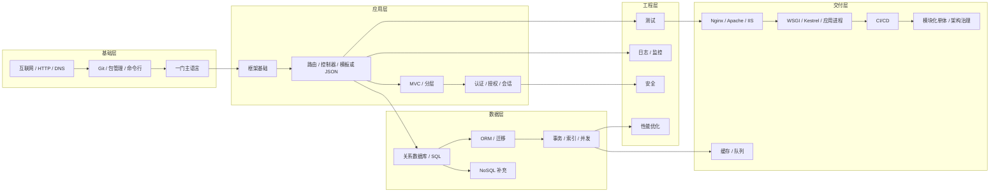
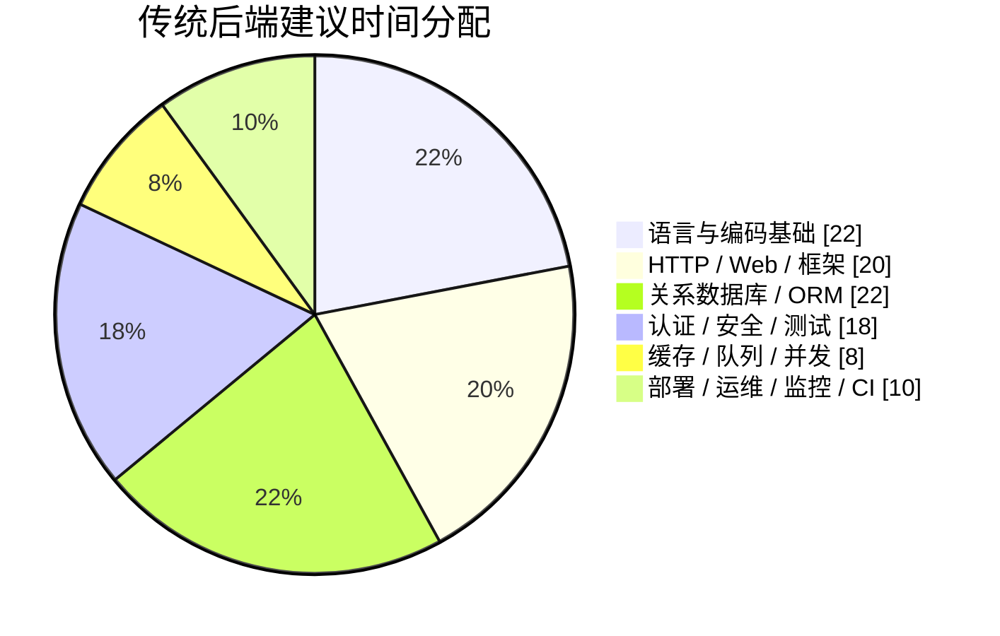
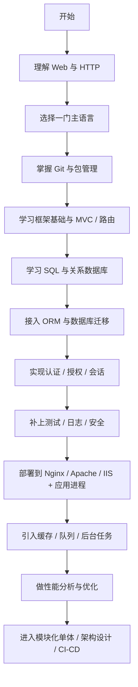

# 传统后端学习历程与知识体系分析报告

## 执行摘要

如果把 roadmap.sh 看作“后端学习的全景地图”，那么传统后端最合理的主干并不是把整张图一次性学完，而是先完成一条更窄、更能交付的经典路径：**一门语言 → Git 与包管理 → HTTP 与请求/响应 → 关系型数据库与 SQL → 框架与 ORM → 认证/会话 → 测试/日志/安全 → 在单台服务器或虚拟机上部署 → 再扩展到缓存、队列、性能优化、CI/CD 与架构治理**。roadmap.sh 自己在 FAQ 给初学者的建议顺序，实际上就是先语言、包管理、关系数据库 CRUD、框架、REST API、认证鉴权与 Git；而它的完整路线图同时又覆盖了微服务、消息代理、容器、Kubernetes、Service Mesh、Observability 等更广阔主题，这说明它更像“边界地图”，而不是一份严格的入门课表。citeturn40view0turn38view0

对“经典后端”最有帮助的补充路线，来自 **The Odin Project** 与 **MDN**。The Odin Project 的 Rails 课程把 **MVC、PostgreSQL、Active Record、Migrations、Validations、Sessions/Cookies/Auth、Deployment、API** 串成了连续项目；NodeJS 课程则把 **Express、PostgreSQL、Prisma ORM、Authentication、API Security、Testing、Deployment** 放进完整工程节奏里。MDN 的 server-side 模块则从“什么是服务端编程、动态请求如何流动、如何选框架、安全入门”讲起，再进入 Django 与 Express 教程，非常适合建立 web 后端的基本心智模型。citeturn39view0turn6view3turn6view4turn6view5

**freeCodeCamp** 和 GitHub 上的路线仓库更适合当“项目驱动补充”。freeCodeCamp 的后端认证明确围绕 **npm、Node/Express、MongoDB/Mongoose** 与五个微服务项目展开，适合快速形成“API + 项目提交 + 自动测试”的手感，但它对传统关系型数据库、MVC 样式和传统服务器部署强调较弱。GitHub 上的 `saidamir98/Backend-Roadmap` 则很强调 **任务、实践、Go、REST、PostgreSQL、Swagger、gRPC、Docker**，但当前公开 README 中对认证/会话、Nginx、CI/CD 等传统后端常见能力并没有形成完整显性模块。citeturn7search1turn29view4turn29view3turn29view5turn29view1

把这些来源整合起来，最稳妥的结论是：**传统后端应当“关系型数据库优先、单体优先、会话优先、可运维优先”**。这并不意味着拒绝 NoSQL、消息队列或 CI/CD，而是意味着它们应该出现在**第一个可部署的单体项目之后**，而不是在第一个 CRUD 项目之前。Martin Fowler 的 “Monolith First” 与 AWS、Azure 对单体/分层架构的说明，也都支持先把单体与分层做扎实，再谈拆分与云原生迁移。citeturn5search0turn5search1turn18search3turn18search5

## 来源比较与整合

本报告综合了五类原始路线：**roadmap.sh、GitHub 路线仓库、freeCodeCamp、The Odin Project、MDN**。它们分别代表了全景路线图、社区实践路线、免费认证式课程、项目驱动课程和浏览器/协议视角的基础教程，因此组合起来，既能避免只学“某一语言生态”的视野偏差，也能避免只学“概念地图”却没有项目落地。citeturn40view0turn29view4turn7search1turn39view0turn6view3turn6view4

| 来源 | 显性学习主线 | 强项 | 对传统后端的偏差或空白 |
|---|---|---|---|
| roadmap.sh | 语言、Git、RDBMS、ORM、API、安全、测试、CI/CD 一路扩展到微服务、消息代理、容器、Kubernetes、可观测性 | 适合做全景地图与查漏补缺 | 范围极宽，且官方明确说明部分顺序“不严格”；初学者容易过早进入分布式主题 |
| GitHub 后端路线仓库 | CS 基础 → Git → Node/REST → PostgreSQL/SQLX → Swagger → protobuf/gRPC → Docker | 任务驱动、实操感强 | 现代 REST/Go/微服务倾向明显；认证/会话、Nginx、CI/CD 在当前页面中未形成完整显性模块 |
| freeCodeCamp | npm → Node/Express → MongoDB/Mongoose → 五个后端认证项目 | 免费、项目驱动、测试反馈清晰 | 技术栈偏 Node+Mongo；关系型数据库、传统 MVC、传统部署强调较弱 |
| The Odin Project | Rails MVC + PostgreSQL + Active Record + Sessions/Cookies/Auth + Deployment；NodeJS + Express + PostgreSQL + Prisma + API Security + Testing | 最接近经典后端成长路径，项目连续性强 | MQ、CI/CD、复杂基础设施不是主线 |
| MDN | Server-side first steps → 动态请求与安全 → Django/Express 教程 | 非框架宣传口径，更适合建立 Web 基础心智模型 | 更像基础教育模块，不是职业化全景图；缓存、队列、CI/CD 覆盖弱 |

下表只按各来源当前公开页面中的**显性内容**打分：页面直接列出则记为“明确”，通过案例或路径间接覆盖则记为“部分”，没有形成明确模块则记为“未指定”。这张表最适合用来判断：**你的学习计划应该从哪一类资源吸收什么内容**。citeturn38view0turn29view4turn7search1turn39view0turn6view3turn6view4

| 能力维度 | roadmap.sh | GitHub 路线仓库 | freeCodeCamp | The Odin Project | MDN |
|---|---|---|---|---|---|
| 语言选择 | 明确 | 明确 | 部分 | 明确 | 部分 |
| Web / HTTP 基础 | 明确 | 部分 | 部分 | 明确 | 明确 |
| 关系型数据库 / SQL | 明确 | 明确 | 未指定 | 明确 | 部分 |
| NoSQL | 明确 | 部分 | 明确 | 未指定 | 未指定 |
| ORM | 明确 | 未指定 | 明确 | 明确 | 部分 |
| 认证 / 授权 | 明确 | 未指定 | 未指定 | 明确 | 部分 |
| 会话 / Cookie | 明确 | 未指定 | 未指定 | 明确 | 部分 |
| 测试 | 明确 | 明确 | 部分 | 明确 | 部分 |
| 缓存 / MQ | 明确 | 部分 | 未指定 | 未指定 | 未指定 |
| 部署 / 运维 | 明确 | 部分 | 未指定 | 明确 | 部分 |
| 架构风格 | 明确 | 部分 | 未指定 | 明确 | 部分 |
| CI/CD | 明确 | 未指定 | 未指定 | 未指定 | 未指定 |

把五条路线整合后，我建议形成三条非常明确的学习原则。第一，**只深挖一门后端语言和一个主框架**。roadmap.sh 的 FAQ 直接建议初学者先学一门后端语言，再学包管理、关系数据库 CRUD、框架、REST API 与认证；MDN 也建议先学 server-side first steps，再去选 Django 或 Express 这样的具体框架；The Odin Project 把 NodeJS 与 Rails 分成独立路径，也是同一个思想。citeturn40view0turn6view5turn6view4turn6view3turn39view0

第二，**传统后端应当“关系型数据库优先，NoSQL 次之”**。roadmap.sh 同时列了 Relational Databases 与 NoSQL Databases，但 FAQ 的入门顺序先强调关系数据库与 CRUD；The Odin NodeJS 与 Rails 课程都把 PostgreSQL 放进主线；MDN 的 Django 生态也天然偏 ORM + 关系数据库；freeCodeCamp 则可以提供 MongoDB/Mongoose 的补充视角。这样整合出来的结果，就是先把 SQL、索引、事务、迁移、ORM 学扎实，再把 MongoDB/Redis 当成场景化补充，而不是第一数据库。citeturn40view0turn38view0turn6view3turn39view0turn10search0turn7search1

第三，**把会话式 Web、服务端模板和传统部署重新放回主线**。HTTP 语义本身是无状态的，但经典 Web 应用通过 Cookie 和 Session 管理登录态；Django 的认证系统明确处理用户、权限和基于 cookie 的用户会话；Rails 课程和安全指南把 Sessions/Cookies/Auth 作为显性教学模块；Laravel 的 `web` 路由默认就带有 session state 与 CSRF protection。这些都说明“经典后端”不是只有 REST API，它同时包括表单、模板、会话和服务器端页面。citeturn19search1turn21search0turn21search9turn39view0turn21search4turn34search17turn34search1

## 传统后端知识体系

在本报告里，“传统后端”指的是：**以单体或模块化单体为主，按 MVC 或分层/N-tier 组织业务逻辑，运行在单台或少量服务器/VM 上，以 HTTP 请求/响应为核心交互，以关系型数据库为第一数据源，并在需要时逐步引入缓存、消息队列和少量 NoSQL 组件**。AWS 把 monolithic architecture 明确称为一种“traditional software development model”；Azure 也指出 N-tier 在传统本地系统里非常常见；而 Rails、ASP.NET Core MVC、Django WSGI 部署文档都仍然维持着这种经典路径。citeturn5search1turn18search3turn18search5turn10search2turn35search6

这条路线并不落后。它的价值在于：**你可以先把一个系统完整建出来、测起来、跑起来、部署起来、监控起来**，然后再决定是否要拆。Martin Fowler 的 “Monolith First” 之所以长期被引用，本质就是因为在你还没有模块边界、测试习惯、运维纪律与性能基线之前，过早进入微服务只会把复杂度放大。roadmap.sh 的完整图里当然包括 Microservices、Serverless、Service Mesh、Kafka、Kubernetes，但它同时也保留了 Monolithic Apps、Web Servers、Basic Infrastructure Knowledge、Authentications、Observability 这些“传统后端”必修项。citeturn5search0turn38view0

从语言和框架层面看，经典后端今天仍然有清晰的主流选择：**Java/Spring Boot、Python/Django 或 FastAPI、PHP/Laravel、Ruby/Rails、C#/ASP.NET Core MVC、JavaScript/Node + Express**。这些官方文档与课程都指向一个共同事实：传统后端不是绑定某一门语言，而是绑定一组通用能力——路由、控制器、模板或 JSON 输出、数据库访问、认证授权、测试、部署与运维。citeturn12search1turn11search0turn11search1turn32search0turn11search3turn10search1turn10search4turn11search6turn10search3turn10search2turn33search4

从协议与状态层面看，你必须把 **HTTP、REST/OpenAPI、认证授权、会话管理** 放在同一个知识簇里学。HTTP 的核心是客户端—服务器通信与无状态语义；OpenAPI 提供 API 描述规范；OAuth 2.0 解决授权委托；而经典服务端框架又都提供了围绕 Session、Cookie、CSRF、表单与权限的现成机制。对传统后端而言，这些内容不是分散的知识点，而是一整套“用户请求如何进来、系统如何记住用户、接口如何被组织和暴露”的工作流。citeturn19search0turn19search1turn19search2turn19search3turn21search0turn9search1turn34search0turn34search1turn21search2

从数据与运维层面看，经典后端仍然以 **RDBMS + ORM + 迁移 + 事务 + 索引 + 缓存 + 可运维部署** 为主线。PostgreSQL 与 MySQL 官方文档把 SQL、教程、并发控制、性能调优都放在核心位置；Django、Rails、Laravel、EF Core、SQLAlchemy 都把 ORM 与迁移看作日常开发方式；Redis 同时能扮演缓存、流式处理和消息代理角色；RabbitMQ 则是更明确的队列系统。部署上，Nginx、Apache、IIS 与 WSGI/Kestrel/应用服务器的配合，仍然是传统后端的现实基本功。citeturn13search0turn13search17turn23search0turn23search5turn28search8turn10search0turn20search2turn20search5turn20search0turn11search6turn22search6turn15search0turn14search4turn14search9turn14search10turn35search3turn35search5

质量保障方面，传统后端的最低配也不应只是“能跑”。它至少还要包括 **自动化测试、日志、指标、监控、性能分析与 Web 安全基线**。pytest 与 JUnit 解决测试基座，Python logging、Spring Boot Actuator、Prometheus 与 OpenTelemetry 解决日志、健康检查、指标与观测，OWASP Top 10 则提供了 Web 安全的底线共识。对经典后端来说，这些不是“大厂附加题”，而是“能不能在出错时定位问题”的分水岭。citeturn16search4turn16search3turn16search1turn24search1turn16search2turn24search0turn16search0

下表把传统后端的关键知识域压缩成一张可执行的能力清单；其中“后置”不代表不重要，而是代表**不应该挤在第一个完整项目之前**。

| 知识域 | 传统后端中的位置 | 学习重点 | 建议优先级 |
|---|---|---|---|
| 语言 | 主轴 | 选一门主语言学深，理解类型、异常、集合、I/O、并发基础 | 核心 |
| 框架 | 主轴 | 路由、中间件、控制器、视图/模板、依赖注入、配置 | 核心 |
| HTTP / REST | 主轴 | 请求/响应、状态码、Header、Cookie、表单、REST 约束、OpenAPI | 核心 |
| 数据库 | 主轴 | 建模、SQL、表关系、索引、约束、事务、隔离级别 | 核心 |
| NoSQL | 扩展 | 文档型、键值型、适用场景，而不是先修课 | 后置 |
| ORM / 迁移 | 主轴 | 模型、查询、关联、迁移、验证、N+1 问题 | 核心 |
| 认证 / 授权 | 主轴 | 登录、退出、RBAC、策略、OAuth/OIDC 基础 | 核心 |
| 会话管理 | 经典特征 | Cookie、Session Store、CSRF、防篡改、过期策略 | 核心 |
| 缓存 | 性能关键件 | 页面/片段/对象缓存、缓存失效、会话缓存 | 重要 |
| 消息队列 / 后台任务 | 扩展能力 | 邮件、报表、异步任务、重试、死信 | 重要 |
| 事务与并发 | 正确性关键件 | ACID、锁、MVCC、幂等、并发冲突 | 重要 |
| 部署 | 交付主轴 | Nginx/Apache/IIS、WSGI/Kestrel、环境变量、HTTPS | 核心 |
| 日志与监控 | 运维主轴 | 结构化日志、健康检查、指标、告警、Trace | 重要 |
| 测试 | 质量主轴 | 单元测试、集成测试、接口测试、数据库测试 | 核心 |
| 性能优化 | 演进能力 | EXPLAIN、索引、查询裁剪、连接池、缓存前置 | 重要 |
| 安全 | 底线能力 | OWASP、输入校验、鉴权边界、密钥管理、限流 | 核心 |
| 设计模式 | 组织能力 | MVC、Service、Repository、Factory、Strategy 等 | 重要 |
| 架构风格 | 组织能力 | MVC、分层、N-tier、模块化单体；微服务后置 | 重要 |
| CI/CD | 支撑能力 | 构建、测试、发布流水线，作为第一个完整项目之后的增强 | 重要 |
| 运维基础 | 支撑能力 | Linux、进程管理、代理、备份恢复、基础网络知识 | 重要 |

把下面的代码块原样放进支持 Mermaid 的 Markdown 渲染器即可渲染；GitHub 已明确支持在 Markdown 文件、Issue、PR、Discussion 和 Wiki 中使用 `mermaid` 围栏代码块。citeturn30search0turn30search2



## 学习阶段与时间规划

下面这张分期表，是把 roadmap.sh 的建议顺序、MDN 的“先 first steps 再选框架”、The Odin Project 的项目化节奏、freeCodeCamp 的五个后端认证项目，以及 roadmap.sh beginner/intermediate/advanced project difficulty 合并之后形成的传统后端版本。它的核心思想很简单：**先做出能部署的单体，再做出更稳、更快、更容易运维的单体**。citeturn40view0turn6view5turn39view0turn6view3turn7search1turn36view0

| 阶段 | 目标 | 必学主题清单 | 推荐学习顺序 | 估计学习时长 | 典型练习 / 项目建议 | 可测量里程碑 |
|---|---|---|---|---|---|---|
| 入门 | 独立做出一个能登录、能 CRUD、能部署的经典单体后端 | Git、一门语言、HTTP、路由、控制器、模板或 REST、SQL、ORM、迁移、表单验证、Session/Cookie、基础测试 | Web/HTTP → Git → 语言 → 框架基础 → SQL → ORM/迁移 → 认证/会话 → 基础测试 → 首次部署 | **160–220 小时**；按每周 10–12 小时约 **12–16 周** | 个人博客、Todo/Expense Tracker、联系人管理、留言板、简易 CMS；最好包含登录与管理后台 | 能独立部署到 1 台 VM；完成注册/登录/退出；完成至少 8 个 CRUD 页面或接口；写出至少 20 个自动化测试；能解释一次请求如何抵达控制器、如何落库、如何返回响应 |
| 进阶 | 把单体做成“像样的工程” | 分层、RBAC、文件上传、邮件发送、Redis 缓存、后台任务、API 安全、集成测试、事务、索引、EXPLAIN、反向代理、HTTPS、基础 CI | 模块拆分 → 数据库优化 → 缓存 → 队列/后台任务 → 安全加固 → 测试补全 → 反向代理与 HTTPS → 基础流水线 | **240–320 小时**；按每周 10–12 小时约 **16–24 周** | 库存系统、论坛、预约系统、博客 API + 管理端、简化电商后台 | 至少对 2 个慢查询做 EXPLAIN 前后对比；引入 Redis 缓存；引入 1 个后台任务；接入 HTTPS；核心领域覆盖率达到自己设定的最低线；能写部署文档与环境配置说明 |
| 专家 / 架构师 | 建立“模块化单体 + 可运维 + 可演进”的系统观 | 模块边界、依赖方向、设计模式、DDD 的战术模式、幂等与并发、可观测性、容量评估、备份恢复、SLO/告警、CI/CD、架构评审、故障演练 | 先模块化 → 再性能与可观测性 → 再交付治理 → 最后才讨论是否拆服务 | **320–500 小时**；按每周 10–12 小时约 **24–40 周** | 模块化单体电商、票务/预约系统、SaaS 后台、ERP 子域系统 | 完成架构图、ADR、部署 Runbook、备份恢复演练、压力测试报告、安全清单；能说明哪些模块未来有必要拆分，哪些不该拆 |

上表的时间不是官方承诺，而是基于这些路线的广度、项目量和传统后端实际需要达到的工程深度所做的综合估算。若按每周 25–30 小时的高强度学习执行，总周期通常可以压缩到 **6–9 个月**；但无论用时快慢，都不建议把“微服务、Kubernetes、Service Mesh”抢到“事务、测试、部署、日志”之前。citeturn38view0turn5search0





## 人群适配建议

虽然知识域基本一致，但不同背景的学习者不应该使用完全相同的节奏。特别是当 roadmap.sh 这种全景图把 Kubernetes、Kafka、GraphQL、gRPC、Service Mesh、Observability 都铺开时，真正重要的不是“看到了多少主题”，而是**你当前最缺哪块地基**。对传统后端而言，最危险的错位通常不是“学少了”，而是“学得太散、太早谈架构、太晚做工程”。citeturn38view0turn5search0

| 学习者背景 | 建议总时长 | 重点调整 | 可延后主题 |
|---|---|---|---|
| 零基础 | 12–18 个月 | 把时间集中在一门语言、HTTP、SQL、框架、会话认证、部署基本功；先做服务端渲染或简单 REST，再补更复杂 API 规范 | 微服务、Kubernetes、gRPC、复杂可观测性、分布式事务 |
| 有前端经验 | 8–12 个月 | 你通常已经理解 HTTP、表单、浏览器与接口调用，所以应把更多时间投入 SQL、事务、ORM、RBAC、会话与服务端安全 | HTML/CSS 深挖、多语言横跳 |
| 有运维经验 | 8–10 个月 | 你可压缩 Linux、Nginx、部署与监控入门时间，但要补足代码组织、测试策略、数据库建模、ORM 与业务边界设计 | 过早研究高阶基础设施自动化 |
| 想转架构师 | 18–24 个月 | 核心不是多学几门技术，而是做出一个真正可演进的模块化单体：有边界、有 ADR、有监控、有性能基线、有恢复方案 | 过早拆服务、把“分布式”误当成“架构成熟” |

如果你的目标是“以后做架构师”，我最强烈的建议仍然是：**先做深模块化单体，再谈拆分**。Azure 的 N-tier 指南明确把分层/N-tier 视为传统系统的自然演进路径；Fowler 也明确主张 monolith first。对学习者来说，这个建议的现实含义是：在你还没能稳定处理事务、权限、缓存失效、部署、日志、备份与故障定位之前，谈微服务大多只是术语熟悉，而不是架构能力。citeturn18search3turn5search0

## 路线表与资源清单

下面把**可复制的学习路线表**和**资源清单**合并在一起。表中合计列出了 **20 个以上**的高质量资源，中文与英文混合；其中 **P0** 表示必学，**P1** 表示阶段核心，**P2** 表示按需后置。多语言或多框架资源并列时，意思不是让你并行学完，而是让你**先定一条主线，再把其它资源当对照系**。这也符合 roadmap.sh “Pick a Language”和 MDN “先学 first steps 再选框架”的思路。citeturn38view0turn6view5

| 主题 | 子主题 | 优先级 | 资源类型 | 推荐资源链接 | 预计时长 |
|---|---|---:|---|---|---:|
| 路线总览 | 后端全景、查漏补缺 | P0 | 路线图 | roadmap.sh Backend Roadmap citeturn40view0 | 4–6h |
| 项目练习池 | 初中高级项目分层 | P0 | 项目集 | roadmap.sh Backend Projects citeturn36view0；freeCodeCamp Back-End Development and APIs citeturn7search1；The Odin Project NodeJS / Rails 项目线 citeturn6view3turn39view0 | 40–80h |
| 对照路线 | 社区路线与基础教程对照 | P1 | 路线图 / 教程 | `saidamir98/Backend-Roadmap` citeturn29view4turn29view3；MDN Server-side website programming citeturn6view4 | 6–8h |
| Web 基础 | 请求/响应、无状态、动态请求 | P0 | 文档 / 规范 | MDN HTTP 概述 citeturn19search0；RFC 9110 HTTP Semantics citeturn19search1；MDN Server-side first steps citeturn6view5 | 8–10h |
| Git 与命令行 | Git 工作流、命令行习惯 | P0 | 书 / 文档 | Pro Git 中文版 citeturn37search1；Git Reference citeturn37search0；Git 命令行说明 citeturn37search11 | 10–12h |
| 语言基础 | 选一门主语言做主线 | P0 | 文档 / 教程 | Dev.java Learn Java citeturn12search1；Python Tutorial citeturn11search0；PHP Getting Started citeturn11search1；Ruby 20分钟体验 citeturn32search0；C# 指南 citeturn11search3 | 40–60h |
| 框架入门 | 选一个主框架 | P0 | 文档 / 教程 / 课程 | Spring Boot Getting Started citeturn10search1；Django 中文文档 / 初识 Django citeturn10search0turn10search4；Laravel Documentation citeturn11search6turn34search7；Rails Getting Started citeturn10search3；ASP.NET Core MVC 入门 citeturn10search6；Express Routing / Hello World citeturn33search0turn33search10 | 30–50h |
| 数据库基础 | 关系型优先，NoSQL 补充 | P0 | 文档 / 教程 | PostgreSQL Tutorial citeturn13search0；MySQL Getting Started citeturn13search17；MongoDB Get Started citeturn13search6 | 30–40h |
| ORM 与迁移 | 模型、关联、迁移、查询 | P1 | 文档 / 教程 | SQLAlchemy Unified Tutorial citeturn20search8；EF Core 概述 / 入门 citeturn20search5turn20search9；Active Record Basics citeturn20search2；Django Models citeturn20search3；Laravel Eloquent / Documentation 目录 citeturn34search7 | 20–30h |
| API 设计 | REST、OpenAPI、路由组织 | P1 | 规范 / 教程 | OpenAPI Specification citeturn19search2；Spring RESTful Web Service Guide citeturn10search5；Express Routing citeturn33search0；FastAPI Tutorial citeturn33search1 | 12–18h |
| 认证与会话 | 登录态、权限、Cookie、Session | P0 | 文档 / 课程 | Django 用户认证 / Sessions citeturn21search0turn21search9；Laravel Authentication / Session citeturn34search0turn34search1；ASP.NET Core Authentication / Authorization citeturn21search2turn21search8；Rails Sessions Cookies and Authentication citeturn9search1；OAuth 2.0 citeturn19search3 | 20–28h |
| 安全基线 | 常见 Web 风险与框架防护 | P0 | 标准 / 指南 | OWASP Top 10 2021 citeturn16search0；Spring Securing a Web Application citeturn28search3；Securing Rails Applications citeturn21search1；Django Deployment Checklist citeturn32search2 | 16–24h |
| 测试 | 单元、集成、数据库与接口测试 | P0 | 文档 / 教程 | pytest Get Started citeturn16search4；JUnit 5 User Guide citeturn16search3；The Odin Project Testing Express 模块 citeturn6view3 | 16–24h |
| 缓存与队列 | Redis、页面缓存、后台任务 | P1 | 文档 / 教程 | Redis Quick starts citeturn22search6；Django Cache Framework citeturn22search0；RabbitMQ Tutorials citeturn15search0；Laravel Queues citeturn34search2 | 18–26h |
| 部署与运维 | 反向代理、应用服务器、Checklist | P0 | 文档 / 操作指南 | Nginx Beginner’s Guide citeturn14search4；Django WSGI Deployment / How to deploy Django citeturn35search6turn35search0；ASP.NET Core Proxy / IIS / Nginx / Apache 配置 citeturn35search5；Apache HTTP Server Docs citeturn14search9；IIS 文档 citeturn14search10 | 24–32h |
| 性能与并发 | EXPLAIN、索引、MVCC、事务 | P1 | 文档 / 教程 | PostgreSQL Performance Tips / EXPLAIN / Concurrency Control citeturn28search0turn28search8turn23search5；Django Transactions / DB Optimization citeturn23search2turn28search9；Java Concurrency 文档 citeturn23search7 | 20–28h |
| 监控与可观测性 | 日志、指标、追踪、健康检查 | P1 | 文档 / 教程 | Python logging citeturn16search1；Prometheus Getting started citeturn16search2；OpenTelemetry Language APIs & SDKs citeturn24search0；Spring Boot Actuator citeturn24search1 | 16–24h |
| 架构与设计 | MVC、分层、N-tier、单体优先 | P1 | 书 / 文章 / 架构指南 | Azure N-tier Architecture Style citeturn18search3；Monolith First citeturn5search0；Patterns of Enterprise Application Architecture citeturn25search1turn25search5；Clean Architecture citeturn25search2 | 20–30h |
| CI/CD | 自动构建、测试、发布 | P1 | 文档 / 教程 | GitHub Actions 快速入门 citeturn17search3；Jenkins Pipeline Getting Started citeturn17search1；GitLab CI/CD Quick Start citeturn17search2 | 12–18h |

下面附上一份可直接保存为 `.csv` 文件的版本。资源链接使用官方或原始来源链接，便于你直接导入 Excel、Numbers 或 LibreOffice 继续细化学习计划。

```csv
阶段,主题,子主题,优先级,资源类型,预计时长,推荐资源,链接
总览,路线总览,后端全景与查漏补缺,P0,路线图,4-6h,roadmap.sh Backend Roadmap,https://roadmap.sh/backend
总览,项目总览,项目池与难度分层,P0,项目集,6-8h,roadmap.sh Backend Projects,https://roadmap.sh/backend/projects
总览,对照路线,社区任务驱动路线,P1,路线图,4-6h,saidamir98 Backend Roadmap,https://github.com/saidamir98/Backend-Roadmap
入门,Web基础,服务端第一步,P0,教程,6-8h,MDN Server-side first steps,https://developer.mozilla.org/en-US/docs/Learn_web_development/Extensions/Server-side/First_steps
入门,HTTP,HTTP概览与请求响应,P0,文档,6-8h,MDN HTTP Overview,https://developer.mozilla.org/zh-CN/docs/Web/HTTP/Guides/Overview
入门,版本控制,Git基本工作流,P0,书/文档,10-12h,Pro Git 中文版,https://git-scm.com/book/zh/v2
入门,语言基础,Java 主线,P1,文档/教程,40-60h,Dev.java Learn Java,https://dev.java/learn/
入门,语言基础,Python 主线,P1,文档,40-60h,Python Tutorial,https://docs.python.org/3/tutorial/
入门,语言基础,PHP 主线,P1,文档,30-40h,PHP Getting Started,https://www.php.net/manual/en/getting-started.php
入门,语言基础,Ruby 主线,P1,教程,12-20h,Ruby 20分钟体验,https://www.ruby-lang.org/zh_cn/documentation/quickstart/
入门,语言基础,C# 主线,P1,文档,30-40h,C# 指南,https://learn.microsoft.com/zh-cn/dotnet/csharp/
入门,框架基础,Spring Boot 路线,P1,教程,20-24h,Spring Boot Getting Started,https://spring.io/guides/gs/spring-boot
入门,框架基础,Django 路线,P1,文档,24-30h,初识 Django,https://docs.djangoproject.com/zh-hans/6.0/intro/overview/
入门,框架基础,Laravel 路线,P1,文档,24-30h,Laravel Documentation,https://laravel.com/docs/13.x/documentation
入门,框架基础,Rails 路线,P1,教程,24-30h,Rails Getting Started,https://guides.rubyonrails.org/getting_started.html
入门,框架基础,ASP.NET Core MVC 路线,P1,教程,24-30h,ASP.NET Core MVC 入门,https://learn.microsoft.com/zh-cn/aspnet/core/tutorials/first-mvc-app/start-mvc?view=aspnetcore-10.0
入门,框架基础,Express 路线,P1,文档,16-24h,Express Routing,https://expressjs.com/en/guide/routing.html
入门,数据库,关系型数据库优先,P0,文档/教程,24-30h,PostgreSQL Tutorial,https://www.postgresql.org/docs/current/tutorial.html
入门,数据库,MySQL 入门,P1,文档,16-24h,MySQL Getting Started,https://dev.mysql.com/doc/mysql-getting-started/en/
进阶,数据库补充,NoSQL 补充视角,P2,文档,10-16h,MongoDB Get Started,https://www.mongodb.com/docs/get-started/
进阶,ORM,Python ORM 路线,P1,文档/教程,12-18h,SQLAlchemy Unified Tutorial,https://docs.sqlalchemy.org/en/20/tutorial/
进阶,ORM,.NET ORM 路线,P1,文档,12-18h,EF Core Overview,https://learn.microsoft.com/zh-cn/ef/core/
进阶,ORM,Rails ORM 路线,P1,文档,10-16h,Active Record Basics,https://guides.rubyonrails.org/active_record_basics.html
进阶,API设计,REST 与 OpenAPI,P1,规范/教程,12-18h,OpenAPI Specification,https://spec.openapis.org/
进阶,认证授权,用户认证与权限,P0,文档,16-24h,Django 用户认证,https://docs.djangoproject.com/zh-hans/6.0/topics/auth/
进阶,会话管理,Session 与 Cookie,P0,文档,10-14h,Laravel Session,https://laravel.com/docs/12.x/session
进阶,安全,Web 安全基线,P0,标准,16-24h,OWASP Top 10,https://owasp.org/Top10/2021/
进阶,测试,Python 测试基座,P0,文档,8-12h,pytest Get Started,https://docs.pytest.org/en/stable/getting-started.html
进阶,测试,Java 测试基座,P1,文档,8-12h,JUnit 5 User Guide,https://docs.junit.org/5.10.5/user-guide/
进阶,缓存,Redis 基础,P1,文档,10-16h,Redis Quick Starts,https://redis.io/docs/latest/develop/get-started/
进阶,消息队列,后台任务与消息系统,P1,教程,12-18h,RabbitMQ Tutorials,https://www.rabbitmq.com/tutorials
进阶,部署,反向代理与传统部署,P0,文档,16-24h,Nginx Beginner's Guide,https://nginx.org/en/docs/beginners_guide.html
进阶,部署,Django 传统部署,P0,文档,8-12h,Django WSGI Deployment,https://docs.djangoproject.com/zh-hans/6.0/howto/deployment/wsgi/
进阶,部署,.NET 反向代理与 IIS/Poxy,P1,文档,8-12h,ASP.NET Core Proxy and Load Balancer,https://learn.microsoft.com/zh-cn/aspnet/core/host-and-deploy/proxy-load-balancer?view=aspnetcore-10.0
专家,性能优化,Explain/索引/查询计划,P1,文档,12-18h,PostgreSQL Using EXPLAIN,https://www.postgresql.org/docs/current/using-explain.html
专家,事务并发,事务与 MVCC,P1,文档,12-18h,PostgreSQL Transactions,https://www.postgresql.org/docs/current/tutorial-transactions.html
专家,监控,指标与告警,P1,文档,12-18h,Prometheus Getting Started,https://prometheus.io/docs/prometheus/latest/getting_started/
专家,可观测性,Tracing 与标准化埋点,P1,文档,10-16h,OpenTelemetry Language APIs,https://opentelemetry.io/docs/languages/
专家,架构,单体优先与分层架构,P1,文章/架构指南,12-18h,Monolith First,https://martinfowler.com/bliki/MonolithFirst.html
专家,架构,企业应用架构模式,P1,书/目录,16-24h,Patterns of Enterprise Application Architecture,https://martinfowler.com/books/eaa.html
专家,架构,软件结构与依赖方向,P1,书,16-24h,Clean Architecture,https://www.informit.com/store/clean-architecture-a-craftsmans-guide-to-software-structure-9780134494166
专家,CI_CD,自动化流水线,P1,文档,12-18h,GitHub Actions Quickstart,https://docs.github.com/zh/actions/get-started/quickstart
```