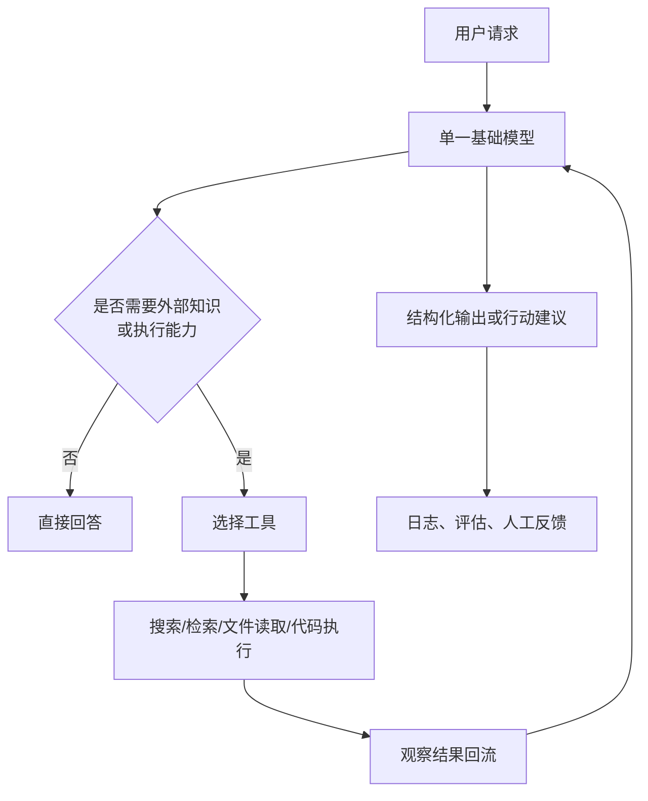
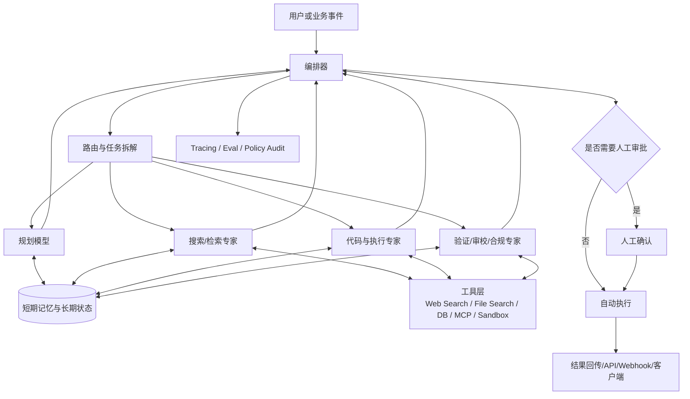

# 基模与 AI Agent 发展方向分析报告

## 执行摘要

本报告基于 Infrasys-AI 的应用层与 Agent 分层视角，结合 Anthropic、OpenAI、Meta、Moonshot AI Kimi、DeepSeek 的官方文章、系统卡、API/开发者文档与研究页面，对截至 **2026-05-01** 的基础模型与 AI agent 方向做交叉分析。核心结论是：前沿竞争的重心，已经从“单纯堆参数”转向“系统化能力组合”，即 **MoE 或模块化架构、推理时计算扩展、工具使用、长上下文、记忆/缓存、多模态、部署优化、安全治理与生态协议** 的联合作战。Anthropic 与 OpenAI 的公开材料更强调“推理 + 工具 + 安全 + 可控”；Meta、DeepSeek 与 Kimi 则更愿意公开其 **MoE、长上下文、服务架构、训练优化与开放生态** 细节。citeturn2view1turn21view0turn20view0turn26view1turn30view0turn7view0turn15view1turn17view0turn37view0turn46search2

在 AI agent 层面，当前最受青睐、最先形成产品闭环的方向，不是“完全通用自主智能体”，而是 **代码与软件工程 agent、搜索/检索增强与深度研究、企业工作流自动化、行业决策支持与文档处理**。这既来自模型本身在代码、长文档、多步推理上的成熟，也来自企业预算与真实工作流的牵引：Anthropic 的使用数据表明 Claude 3.7 Sonnet 上线后，编码、教育、科学、医疗等用途占比上升；Microsoft 2025 Work Trend Index 显示，46% 的领导者表示其组织已在用 AI agents 自动化工作流；Menlo Ventures 的 2025 企业报告则显示，**应用层已占 2025 年企业生成式 AI 支出的过半比例**，其中代码类应用是最强 breakout 类别。citeturn21view3turn42view0turn44view1

就产品形态而言，未来不会是“纯客户端”或“纯服务端”的单选题，而更像是 **“客户端做入口，服务端做执行与治理”** 的组合。Claude Code、Kimi Code、Meta AI app/眼镜这类客户端形态，在获取本地上下文、降低交互摩擦、形成高频习惯方面更强；而 OpenAI Responses/Agents SDK、Claude API、Kimi Open Platform、DeepSeek API 这类服务端形态，在 **后台执行、审计追踪、权限管理、跨系统集成、企业合规与持续付费** 上更有优势。若按 **近中期收入与企业预算** 看，服务端/网页型 agent 的市场潜力更大；若按 **用户规模与入口价值** 看，客户端/嵌入式助手的触达潜力更大。最佳商业结构不是二选一，而是“**多端入口 + 服务端执行平面**”。citeturn21view0turn28view0turn28view1turn35view0turn36view0turn37view3turn44view0turn44view1

## 方法与数据来源

本报告采用了与 Infrasys-AI/AIInfra 相近的应用层观察框架。该仓库在 **07Application** 中将应用层组织为 Prompt Engineering、RAG、AI Agent、Fine Tuning、多模态、伦理等主题，在 **08AIAgent** 中则专门展开 agent 的概念、组成、提示设计、工具调用、记忆、规划、自主性、评估与伦理议题。因此，本报告先看基础模型，再看 agent 架构、任务形态与产品化，并把比较维度显式扩展为：**模型架构、训练数据与数据治理、训练方法、多模态能力、可解释性与可控性、安全与对齐、部署与推理优化、开源与闭源生态、商业化路径与定制化能力、法规与合规风险**；对 agent 部分，则重点比较 **任务类型、代理架构、交互方式、评估指标与基准、开发者工具链与平台趋势**。citeturn1view0turn2view1

资料选择遵循“**官方/原始资料优先**”原则。主要官方来源包括：Anthropic 的 Claude 发布文、system card、MCP 与 interpretability/alignment 研究页面（英文）；OpenAI 的模型发布文、Responses API、Agents SDK、Preparedness Framework、Model Spec（英文）；Meta 的 Llama 4 官方公告、Meta AI app 公告与 Llama developer/responsible-use 指南（英文/官方多语言页面）；Moonshot AI/Kimi 的研究索引、开放平台、产品页与技术博客（中文为主，少量英文产品页）；DeepSeek 的透明度中心、研究仓库、API 文档与发布页（中英双语）。在官方资料披露不足处，补充了 **Stanford HAI 2025 AI Index、Microsoft 2025 Work Trend Index、Menlo Ventures 2024/2025 企业与消费 AI 报告** 等高质量二级资料。citeturn21view0turn20view0turn28view0turn27view0turn7view0turn35view0turn37view0turn46search2turn18view0turn45search3turn42view0turn44view1turn44view0

本报告还明确两个未指定但必须显式声明的假设：其一，**时间窗口假设截至 2026-05-01**；其二，**行业范围默认按通用/跨行业分析**，不预设单一垂直行业。需要说明的是，Anthropic 与 OpenAI 对参数规模和部分训练细节公共披露较少；Meta、DeepSeek、Moonshot 在架构与工程细节公开度更高。因此，下文中的“厂商差异”既反映技术路线差异，也反映“**公开披露策略差异**”。这一点本身就是生态竞争的一部分。citeturn20view0turn21view0turn26view1turn7view0turn15view1turn37view0

## 基模的发展方向

### 架构与训练范式的变化

当前样本里最清晰的共识，是基础模型的前沿不再只是“把一个稠密 Transformer 做到更大”，而是转向“**更强的单位算力利用率**”。Meta 在 Llama 4 首次公开强调采用 **MoE**，其中 Scout 为 **17B active / 16 experts / 10M context**，Maverick 为 **17B active / 128 experts**，Behemoth 作为更大“教师模型”继续训练；DeepSeek-V3 与 DeepSeek-R1 则沿用 **671B total / 37B active** 的 MoE 路线；Moonshot 的 Moonlight 为 **16B total / 3B active** 的 MoE，2026 年开放平台又把 K2 公布为 **1T total / 32B active** 的 MoE 基座。与之相对，Anthropic 和 OpenAI 的近年官方稿件更少强调“参数数值”，而更强调混合推理、长程任务完成度、代码能力、工具使用和安全性，这意味着公开竞争指标已经从“总参数”转向“激活参数、推理时计算、工具调用质量、上下文利用率和工程吞吐”。citeturn7view0turn15view1turn17view0turn12view1turn46search2turn20view0turn21view0turn26view1turn30view0

训练方法同样发生了显著重构。Anthropic 在 Claude 3.7 Sonnet system card 中公开写到：模型使用公开互联网数据、第三方非公开数据、标注/承包商数据与内部生成数据，并通过 **Constitutional AI、偏好训练与持续分类器** 做安全与有用性对齐；OpenAI 在 o3/o4-mini 发布文中明确表示，o3 的能力提升来自继续扩大 **强化学习训练与推理时计算**，并把“何时使用工具”纳入 RL；DeepSeek-R1 则把“**少量标注 + 大规模 RL**”作为公开卖点，甚至先推出不经 SFT 预热的 R1-Zero，再用冷启动数据与双阶段 RL/SFT 管线修正可读性与语言混杂问题；Meta 的 Llama Developer Use Guide 则把 **RLHF/RLAIF** 当成开发者可复用的责任式微调范式；Kimi 的研究线从 **K1.5 的 RL 扩展**、到 **Muon 优化器的大规模训练实践**、再到 **MoBA 长上下文注意力**，形成了一条“训练算法与系统工程同步优化”的路线。citeturn20view0turn30view0turn17view0turn31search1turn37view0turn12view1turn12view0

这说明“训练范式”已经从过去常说的“预训练 + SFT + RLHF”三段式，演化为更复杂的组合工程：**预训练 + 指令微调 + RLHF/RLAIF/CAI + 蒸馏 + 任务后训练 + 工具后训练 + 部署期优化**。OpenAI o3/o4 训练其“何时用工具”，Anthropic Claude 4 把“extended thinking with tool use”作为新能力，DeepSeek V3 则把从 R1 蒸馏出的推理模式回注到标准 LLM 上，Kimi 进一步把超长上下文与 agent 工具调用绑定到平台层。基础模型的“智能”越来越不是裸模型本体，而是 **模型 + 训练策略 + 工具策略 + 推理策略** 的复合体。citeturn21view0turn30view0turn17view1turn37view0turn46search2

### 数据治理、多模态、可解释与安全可控

数据治理正在从“幕后合规工作”变成前台差异化卖点。Anthropic 公开说明 Claude 3 系列**未使用用户或 API 客户提交的 prompt/output 数据作为训练数据**，并遵循 robots.txt、避免访问受密码保护页面；DeepSeek 区分了**公开数据与授权数据**，声明会删除敏感信息、去标识化用户输入并提供数据使用退出权；OpenAI 在 Responses API 发布文中重申，哪怕数据存储在 OpenAI 上用于 tracing/evals，**默认也不会用商业数据训练模型**；Meta 的指南则明确要求开发者按用途、地区和内部法律流程做风险评估；Moonshot 则通过 **kimi-latest 与 moonshot-v1 稳定线分离** 的做法，直接回应“产品快速迭代”与“API 稳定性/可预测性”之间的张力。citeturn20view0turn18view0turn28view0turn31search1turn10search2

多模态方面，2024—2026 年的一个突变是：多模态不再是单独陈列的“附加能力”，而开始成为 agent 回路的一部分。Meta 把 Llama 4 定义为**首批原生多模态 open-weight 模型**；OpenAI o3/o4-mini 则强调“**think with images**”，能在推理链中直接整合图像，并联用搜索、Python、文件与图像生成工具；GPT‑4.1 又把 **1M context、Video‑MME、图像理解** 与 agent 场景绑定；Moonshot 官方首页与平台页把多模态理解、视觉推理、Audio、Docs/Sheets/PPT/Website/Deep Research 直接并到同一产品面板中；Anthropic 则通过 computer use、文件访问与工具调用把视觉/界面操作纳入 agent 能力；DeepSeek 的 V3 首发时尚不支持多模态输入输出，但其后续 API 和 agent 工具栈已明显向“可插拔工具 + 兼容协议”推进。citeturn7view0turn30view0turn26view1turn36view0turn46search2turn23view0turn15view1turn38search4

可解释性与可控性上，厂商分化非常明显。**Anthropic 是这组样本里最系统地把 mechanistic interpretability 做成公开主线的厂商**：它公开了在 Claude Sonnet 中提取数百万 feature 的研究，也开展了“hidden objectives 审计”等 alignment audit 工作；但 Anthropic 同时又公开提醒，**可见 chain-of-thought 不等于完全 faithful 的真实内部推理**。OpenAI 更偏向“行为层可控”路线：Model Spec 强调 **chain of command、用户/开发者可定制边界、知识自由与 staying in bounds**，Responses API 又补上 reasoning summaries、encrypted reasoning items 与 tracing。DeepSeek 重点做的是透明度说明与训练方法披露，Meta 强调层级式安全与系统级缓解，Moonshot 的公开研究则更多集中在 RL、长上下文、训练优化和服务架构，而非细粒度神经机制解释。由此可见，未来“可解释性”可能分成两条路：**神经机制可解释** 与 **工程行为可审计**，后者在商业落地中会更快普及。citeturn23view1turn23view2turn23view0turn29view0turn28view1turn18view0turn31search1turn37view0

安全与对齐也从“回复是否拒绝”升级为“**是否能在工具、长链路、跨系统执行中保持边界**”。Anthropic 在 Claude 3.7 system card 中专门讨论了 prompt injection、computer use 风险、extended thinking 的 faithfulness、reward hacking 与 agentic contexts；Claude Opus 4 发布时又主动启用了 **ASL‑3** 保护；OpenAI 更新了 Preparedness Framework，把高风险能力划分为 Biological/Chemical、Cybersecurity、AI Self-improvement 等 tracked categories；DeepSeek 的透明度页也强调幻觉、误用、隐私与红队测试；Meta 的责任式指南则明确要求定义 content policy 与 agent use policy。一个明显趋势是：**安全从模型内生对齐，走向“模型对齐 + 工具权限 + 执行沙箱 + 追踪审计 + 人类审批”的系统安全**。citeturn47view1turn21view1turn28view2turn18view0turn31search1

### 部署优化、生态开放与商业化

部署与推理优化已经成为基础模型竞争力本身。DeepSeek-V3 把 **FP8 训练、MTP 模块、原生 FP8 权重、60 TPS 吞吐** 写到了发布文与仓库主页中；Moonshot 用 **Mooncake**、**Context Caching**、**MoBA** 和 **Muon** 把 KV cache、长上下文、训练效率和成本一起做成研究与平台功能；OpenAI 的 Responses API 在 2025 年就开始把 **web search、file search、computer use、background mode、encrypted reasoning items** 纳入“agentic applications”的默认栈；Anthropic Claude 4 同步发布 code execution tool、MCP connector、Files API 与 **最长一小时 prompt caching**；Meta 在 Llama 4 Scout 上直接把“**单 H100 可运行**”作为 selling point。基础模型的“可用性”因此越来越取决于服务系统设计，而不只是预训练后的离线 benchmark。citeturn15view1turn17view1turn13view0turn12view0turn12view1turn28view1turn21view0turn7view0

生态上，正在形成两条主线并逐渐汇流。第一条是 **API-first、闭权重但强工具/强治理** 的路线，Anthropic 与 OpenAI 最典型；第二条是 **open-weight、可下载、可私有化部署，同时保留云 API 服务** 的路线，Meta、DeepSeek 与 Moonshot 的部分研究产物更靠近这一侧。值得注意的是，这两条线并不是严格对立：Anthropic 推出了开放的 **MCP**；OpenAI 在 Responses API 中支持 remote MCP server；DeepSeek 与 Kimi 都主动做 **OpenAI/Anthropic-compatible API**；Stanford HAI 2025 也指出，到 2025 年初 open-weight 与 closed 模型的性能差距已经从一年前的 8.04% 缩小到 1.70%，而推理成本和硬件效率也在快速改善。换句话说，未来生态胜负点不只在“开源还是闭源”，更在于 **谁能占协议、工具、集成位和场景位**。citeturn21view2turn28view1turn46search3turn46search6turn45search2turn45search12

## AI agent 的发展方向

### 当前最受青睐的任务类型

下表给出截至 2026-05-01 更受青睐的 agent 任务类型判断。这里的“受青睐”，不是抽象学术热词，而是综合了 **官方发布重心、真实使用数据、企业预算流向和产品化成熟度** 后的结论。

| 任务类型 | 当前偏好度 | 证据与判断 |
|---|---|---|
| 代码助手与软件工程 agent | 最高 | Anthropic Claude 4 直接把 coding、agent workflows、Claude Code 作为核心卖点；GPT‑4.1 与 o3/o4-mini 强调 coding、repo navigation、tool use；Anthropic 经济指数显示编码使用占比上升；Menlo 2025 显示代码类应用占部门级 AI 支出的 **55%**，约 **40 亿美元**，并称其为首个 killer use case。 citeturn21view0turn26view1turn30view0turn21view3turn44view1 |
| 搜索/检索增强与深度研究 | 很高 | OpenAI 把 web search、file search、computer use 作为 agent 核心内置工具；Anthropic 以 MCP 把外部数据源接入标准化；Kimi 把“深度研究”做成显式产品面板；DeepSeek 也提供工具调用、兼容协议与 agent 接入指南。更重要的是，这类任务天然需要最新信息与可验证引用，和模型能力演进方向高度一致。 citeturn28view0turn21view2turn36view0turn37view1turn38search0turn38search4 |
| 企业工作流自动化 | 很高 | Microsoft 2025 Work Trend Index 显示 46% 的领导者已在用 agents 自动化工作流，重点落在客户服务、营销、产品开发；Meta 官方案例也显示基于 Llama 的支持工单/文档抽取 agent 在企业中已经形成清晰 ROI。 citeturn42view0turn31search2turn39search4 |
| 决策支持与行业专业助手 | 高 | GPT‑4.1 被 Thomson Reuters 用于多文档法律审阅；Kimi 平台把法律与合规、金融投研、AI for Science 作为重点场景；Anthropic 的 Claude 3.7 Sonnet 上线后，教育、科学、医疗用量占比上升；Menlo 2025 显示医疗是垂直 AI 花费最高行业。 citeturn26view1turn46search2turn21view3turn44view1 |
| 个人助手与多端伴随式助手 | 高触达、较强入口价值 | Meta AI app 明确押注 app + web + glasses 的连续体验与个人化记忆；Kimi 也在 app、桌面端、浏览器插件与网站功能上做多端布局。此类方向用户规模大、频率高，但 Menlo 2025 消费 AI 报告也显示，消费端当前仍有显著“使用高、付费低”的变现缺口。 citeturn35view0turn36view0turn44view0 |
| 机器人控制与具身 agent | 中长期重要，短期不如软件 agent 受宠 | 在本次样本中，官方重心明显仍集中在代码、文档、搜索、工作流和多端助手，而不是大规模机器人控制平台。最接近具身入口的是 Meta 的眼镜/语音/设备协同，但整体资源投放仍偏“软件 agent + 伴随式硬件”。因此它在研究上重要，但在当前商业优先级上不如软件代理。 citeturn35view0turn21view0turn28view0turn36view0 |

### 代理架构正在从单模型助手走向工具化系统

官方平台的一个共同信号非常重要：**先做单一、聚焦、可追踪的 agent，再在必要时做多 agent 编排**。OpenAI 的 Agents SDK 文档明确建议“从一个 focused agent 开始”，只有当工具面、审批策略、guardrail、输出类型或模型类型真的不同，才拆分成多个 specialist；Anthropic 的 Claude 4 则把“extended thinking with tool use、parallel tool use、improved memory”放在一个更强的单模型回路里；Moonshot 官方研究页又同时出现 **Agent Swarm** 与 **Kimi Code 子代理并行任务**，说明多 agent 已经从“研究概念”走向“特定场景下的 scale-out 手段”。因此，当前主流工程范式不是“默认多 agent”，而是：**单 agent 是默认，multi-agent 是在并行化、策略隔离、专业分工或异构模型编排时才启用的高级形态**。citeturn27view2turn21view0turn37view0turn37view3

上图更像 Claude 4、GPT‑4.1、o3/o4、多数 Kimi/DeepSeek 开放平台调用的“默认形态”：**一个强模型 + 若干工具**。它的优点是上下文一致、实现简单、trace 清晰、失败面收敛；缺点是当任务跨部门、跨权限域、跨模型专长时，单体 prompt 很快膨胀，且治理粒度不够细。Anthropic 与 OpenAI 都在公开材料里把“工具使用 + 记忆 + 文件/代码能力”内收进这个单模型 loop，说明它仍然是 2025—2026 的主流主干。citeturn21view0turn28view0turn30view0

多模型/工具化 agent 的核心，不在于“模型数量更多”，而在于 **权限边界、角色边界与可审计边界更清晰**。OpenAI 的 handoff/guardrail/local context 设计就是这种思路；Anthropic 的 MCP 把外部系统接入统一化；Kimi 的 Agent Swarm 则给出“scale out, not just up”的明确方向；DeepSeek 甚至把“接入 Claude Code/OpenCode/OpenClaw”等第三方 agent 工具做成文档入口。这表明未来 agent 竞争很可能围绕 **协议层、编排层与工具层** 展开，而不仅仅是模型分数。citeturn27view2turn21view2turn37view0turn38search4

### 交互方式、评估方法与平台工具链

交互方式也在明显分层。**对话式界面**仍然是获客和教育市场的主入口，Meta AI app、Kimi app/桌面端、Claude Code、DeepSeek app/网页都说明这一点；但真正进入生产环境时，能力往往要以 **API、嵌入式组件、后台任务、Webhook、IDE 插件、终端 CLI** 等方式植入现有工作流。Meta 用 app/web/glasses 连续体验做消费者入口，Anthropic 用 Claude Code 深入工程师终端和 IDE，Kimi 同时押注 app、桌面与 Kimi Code，OpenAI 则把 Responses API、Agents SDK、background mode、sandbox agents 作为平台主轴。可以说，agent 的交互方式正在从“聊天 = 产品本身”变成“**聊天只是触发器，真正的产品是工作流嵌入**”。citeturn35view0turn36view0turn37view3turn27view0turn28view1

评估方面，当前已经形成一个相对稳定的指标群：**编码** 看 SWE‑bench Verified、Terminal‑bench、Aider/LiveCodeBench；**开放环境代理** 看 OSWorld；**工具调用/决策** 看 Tau‑Bench、BrowseComp/HLE 一类任务；**长上下文** 看 Graphwalks、LongBench v2、RULER、Video‑MME；**安全** 看 system card、Preparedness/RSP 类评估与红队测试。更值得注意的是，官方平台越来越把 **tracing、observability、reasoning summary、approval flow、sandbox** 当成“评估的一部分”，说明单一 benchmark 已不足以衡量 agent 的商业可靠性。未来真正关键的 KPI 会是：**任务完成率、可重复性、审计可回放性、工具误用率、人工接管率、成本/延迟**。citeturn21view0turn26view1turn30view0turn23view0turn16search0turn28view0turn28view1turn27view0

## 厂商对比

下表总结五家厂商在关键维度上的差异。需要强调的是：这里比较的不仅是“能力”，也是“**他们愿意公开什么**”。

| 厂商 | 代表公开资料 | 模型架构与参数公开度 | 数据治理与训练方法 | 多模态、工具与 agent 信号 | 生态与商业化特征 |
|---|---|---|---|---|---|
| Anthropic | Claude 3.7 Sonnet System Card、Claude 4、MCP、经济指数、interpretability 研究（英文） citeturn20view0turn21view0turn21view2turn21view3turn23view1turn23view2 | 参数规模公开度低，但强调 **hybrid reasoning**、长程 coding 与 agent workflows；公开讨论 visible thinking 的收益与局限。 citeturn20view0turn21view0turn23view0 | 明确说明数据来源构成、未用用户/API prompt-output 训练；使用 Constitutional AI、偏好训练、持续分类器；对齐与审计公开度高。 citeturn20view0turn23view2 | Claude 4 支持 extended thinking with tool use、parallel tools、memory、Files API、Claude Code；MCP 成为连接外部系统的重要开放协议。 citeturn21view0turn21view2 | 闭权重、API 与 Claude Code 双线推进；在 coding 和 agent 入口很强，安全治理和可解释研究是显著壁垒。 citeturn21view0turn21view1 |
| OpenAI | GPT‑4.1、o3/o4-mini、Responses API、Agents SDK、Preparedness Framework、Model Spec（英文） citeturn26view1turn30view0turn28view0turn27view0turn28view2turn29view0 | 参数规模不公开，但 **1M context、RL 扩展、thinking with images、tool-aware reasoning** 非常明确；强调实用性能、成本与延迟曲线。 citeturn26view1turn30view0 | 更强调行为规范和部署治理：Model Spec、Preparedness、reasoning summaries、encrypted reasoning items、business data 默认不训练。 citeturn29view0turn28view2turn28view1 | Responses API 把 web/file/computer use、background mode、sandbox、MCP 接到一起；Agents SDK 对单 agent 到多 agent 的演化路径公开得最完整。 citeturn28view0turn28view1turn27view2 | 闭权重、平台化最强，目标是把 agent 组件做成“开发基础设施”；企业落地重在 tracing、审批、沙箱与内置工具。 citeturn28view0turn27view0 |
| Meta | Llama 4 官方公告、Meta AI app、Llama 3 herd 论文、Llama Developer Use Guide（官方/原始资料；英文及官方多语言页） citeturn7view0turn35view0turn40search0turn31search1 | 公开度高：Llama 4 明确转向 **MoE + native multimodality + very long context**，并强调部署效率。 citeturn7view0 | Developer guide 明确涉及 RLHF/RLAIF、layered safety、agent use policy 与按地区/用例评估。 citeturn31search1 | 一边推进 app/web/glasses 的个人助手入口，一边维持可下载模型生态；官方案例也显示其在客服、文档抽取等企业 agent 上已有落地。 citeturn35view0turn31search2turn39search4 | open-weight/下载生态是 Meta 的最大差异化；其商业优势在分发网络与硬件/社交入口，而非纯 API。 citeturn7view0turn35view0 |
| Kimi | Moonshot 研究索引、技术博客、开放平台、Kimi/Kimi Code 产品页（中文为主） citeturn37view0turn12view0turn12view1turn13view0turn46search2turn37view3 | 研究公开度高：从 **K1.5 RL 扩展、MoBA 长上下文、Muon 训练优化、Moonlight MoE、K2/K2.6 Agent/coding** 形成连续路线。 citeturn37view0turn12view0turn12view1turn46search2 | 明显重视平台稳定性与产品线分层：kimi-latest 对齐产品快速实验，moonshot-v1 保持 API 稳定；企业侧强调数据合规、隐私与 SLA。 citeturn10search2turn46search2 | 官方产品面板把 Agent、Agent Swarm、Website、Docs、PPT、Sheets、Deep Research、Kimi Code 并列，说明其 agent 布局是“模型 + 生产力入口 + 工具网络”。 citeturn36view0turn37view0turn37view3 | 兼具 ToC 助手与 ToB 平台属性；在中文场景、代码、研究、长上下文与多步工具调用上组织得非常激进。 citeturn36view0turn46search2 |
| DeepSeek | V3/R1 研究仓库、发布文、透明度中心、API 文档（中英双语） citeturn15view1turn17view0turn17view1turn18view0turn16search2turn46search3 | 公开度高：V3/R1 均明确是 **MoE**，V3 公开 FP8 与 MTP，R1 公开 RL-first reasoning 路线与 MIT 蒸馏许可。 citeturn15view1turn17view0turn17view1 | 透明度中心对公开/授权数据、PII 处理、退出权、误用风险和红队/安全评估有较完整说明。 citeturn18view0 | API 提供 Tool Calls、硬盘缓存、OpenAI/Anthropic-compatible 格式，还专门写了接入 Claude Code/OpenCode/OpenClaw 的指南。 citeturn38search0turn38search3turn46search3turn38search4 | open-weight + 低价 API + 协议兼容是其核心进攻姿势；更像“高性价比模型后端 + 灵活生态插槽”。 citeturn15view1turn16search2turn46search3 |

从上述对比可以看到一个很关键的行业事实：**“模型公司”的定义正在分裂。** Anthropic、OpenAI 更像“高治理强平台的闭权重系统公司”；Meta 更像“open-weight + 分发入口公司”；Kimi 与 DeepSeek 则越来越像“高性价比基础模型 + 兼容协议 + 工具化平台”的组合。也因此，未来竞争的主战场很可能不是单点 benchmark，而是 **协议位、入口位、工作流位和行业位**。citeturn21view2turn28view1turn35view0turn37view0turn46search3

## 开发者建议与产品形态判断

### 对不同语言开发者的建议

就开发者工具成熟度而言，**Python 与 TypeScript/JavaScript** 仍然是官方 agent SDK 最完整的两条主线。OpenAI Agents SDK 明确提供 Python 与 TypeScript 两套快速开始路径；DeepSeek 与 Kimi 都明确提供 **OpenAI-compatible** 接口，DeepSeek 还提供 Anthropic-compatible 格式；Anthropic 推动的 MCP 则为跨语言工具接入提供了更稳定的协议层。这意味着，对大多数团队来说，最现实的技术组织方式不是“所有语言都追求官方 agent SDK”，而是“**用 Python/TS 做 agent 控制平面，用兼容 API、MCP、JSON Schema、HTTP/Webhook 做语言解耦**”。citeturn27view1turn46search5turn46search3turn46search6turn21view2

| 开发者类型 | 更稳妥的技术路线 | 适合的 agent 重点 |
|---|---|---|
| Python 开发者 | 直接拥抱官方 agent/runtime、sandbox、检索和 eval 生态；适合先做研究原型，再逐步服务化。 | 深度研究、数据分析、工作流自动化、代码代理后台 |
| TypeScript / JavaScript 开发者 | 把 agent 作为产品前后端一体化能力，尤其适合 web、插件、IDE 扩展、边缘接口。 | 网页助手、浏览器 agent、协同工具、嵌入式 UI agent |
| Go / Java / Kotlin / C# 开发者 | 不必强求“原生 agent SDK”，更适合把模型层封装为统一网关，通过 OpenAI-compatible / MCP / HTTP 协议稳定接入。 | 企业中台、合规网关、流程编排、审批与审计集成 |
| Rust / C++ 开发者 | 更适合做工具执行层、沙箱、推理加速、代理基础设施，而非第一时间承担 prompt/orchestration 主逻辑。 | 高性能执行器、隔离沙箱、推理网关、边缘 agent runtime |
| 多语言团队 | 明确分层：模型调用协议化、工具接口 schema 化、业务状态本地化、审批链路可回放。 | 从单 agent 到多 agent 的渐进式演进 |

如果要给一个非常实操的结论：**研究/原型阶段优先 Python，产品界面与插件阶段优先 TypeScript，企业集成与治理用 Go/JVM/.NET 做外围控制层，性能敏感层用 Rust/C++ 做执行器**。这不是因为其他语言“不行”，而是因为当前主流厂商的官方资料与生态成熟度，就是沿着这条路径组织的。citeturn27view0turn27view1turn46search3turn46search6turn21view2

### 客户端 agent 还是服务端 agent

从官方产品路线看，客户端与服务端正在同时扩张，但各自承担的职责不同。

| 形态 | 代表产品形态 | 优势 | 主要问题 | 市场判断 |
|---|---|---|---|---|
| 客户端型 agent | Claude Code、Kimi Code、Meta AI app / AI glasses / desktop-style assistant citeturn21view0turn37view3turn35view0turn36view0 | 最容易获得本地文件、代码库、用户即时意图与高频反馈；交互摩擦低，习惯形成快；特别适合开发者与个人知识工作者。 | 权限边界复杂；企业集中治理难；多系统集成和后台任务编排不如服务端自然。 | **入口价值大、留存强、适合开发者与消费者高频使用。** citeturn21view0turn37view3turn35view0 |
| 服务端/网页型 agent | OpenAI Responses API / Agents SDK、Claude API、Kimi Open Platform / Kimi Claw、DeepSeek API citeturn28view0turn27view0turn21view0turn46search2turn38search4turn46search3 | 易做后台执行、审批流、追踪审计、权限管控、跨系统编排、稳定 SLA；企业更愿意按 seat / usage / workflow 付费。 | 冷启动时离用户略远；缺少本地上下文时体验可能弱于客户端。 | **近中期收入与企业价值更大，尤其在工作流自动化和垂直流程中。** citeturn44view1turn42view0 |
| 混合型 | 客户端触发 + 服务端执行 + 审批/缓存/记忆/追踪统一在云端 | 同时拥有入口粘性与企业治理，最符合当前厂商路线。 | 系统复杂度最高，需要严格的权限与状态设计。 | **最可能成为主流终局。** citeturn21view0turn28view1turn35view0turn36view0 |

如果问题是“**哪部分市场潜力更大**”，我的判断是：

**按收入与短中期企业预算看，服务端/网页型 agent 更大。** Menlo 2025 企业报告显示，2025 年企业生成式 AI 支出已达 **370 亿美元**，其中 **190 亿美元**流向应用层，而且 **76% 的 AI 用例是购买而非内部自建**；Microsoft 的 Work Trend Index 也显示，企业已经在客户服务、营销与产品开发中大规模推进 agents。企业要的不是“一个会聊天的窗口”，而是“一个可审计、可嵌入、可计费、可复盘的业务执行单元”。citeturn44view1turn42view0

**按用户规模与入口价值看，客户端/嵌入式 agent 更大。** Menlo 2025 消费 AI 报告估算，过去六个月内使用过 AI 的全球用户大约已达 **17 亿到 18 亿**，其中日活跃用户约 **5 亿到 6 亿**；Meta 也在用 app、web 与 glasses 打通连续体验，说明多端伴随式助手是消费市场的主入口。但同一份报告也指出，消费 AI 当前总市场约 **120 亿美元**，付费转化仅约 **3%**，所以“使用规模大”并不等于“收入更大”。citeturn44view0turn35view0

因此，最值得押注的不是“客户端”或“服务端”的标签，而是这个组合策略：**客户端负责触达、上下文采集与高频交互；服务端负责长任务执行、工具编排、模型路由、审计日志、缓存记忆与组织级治理。** 这实际上也正是 Anthropic、OpenAI、Meta、Kimi 当前产品线共同收敛的方向。citeturn21view0turn28view1turn35view0turn36view0

## 结论与建议

### 当前更受青睐的研究与工程方向

下表按优先级给出截至 2026-05-01 更值得投入的方向、原因、挑战与落地建议。

| 优先级 | 方向 | 为什么更受青睐 | 主要挑战 | 落地建议 |
|---|---|---|---|---|
| 高 | 代码与软件工程 agent | 官方发布、真实使用与企业预算三重共振；Claude 4、GPT‑4.1、o3/o4、Kimi Code 都在加码；Menlo 2025 显示代码类是应用层最强 breakout。 citeturn21view0turn26view1turn30view0turn37view3turn44view1 | 仓库级上下文、测试环境、误改代码、审批流 | 先从 PR 生成、代码审查、测试修复做起，再扩到多文件重构与持续后台任务 |
| 高 | 搜索/RAG/深度研究 | 几乎所有主流平台都在补 web/file/MCP/search；这类 agent 最容易形成“可验证、有来源、可复现”的价值闭环。 citeturn28view0turn28view1turn21view2turn36view0 | 检索质量、引用污染、权限边界 | 明确分离“检索层、证据层、生成层”，让引用与答案一起输出 |
| 高 | 企业工作流自动化 | 企业买单意愿强、ROI 清晰；Microsoft 与 Meta 官方案例都显示客服、IT、营销、文档流程已进入 production。 citeturn42view0turn31search2turn39search4 | 流程例外、审批责任、系统集成成本 | 先做高频、结构清晰、风险可控的流程，如工单、报表、通知、合同初审 |
| 高 | 长上下文、缓存、记忆 | GPT‑4.1 的 1M context、Llama 4 Scout 的 10M、Kimi 的 MoBA/Context Caching、DeepSeek 的 disk cache 都说明“记忆/上下文工程”已成基本盘。 citeturn26view1turn7view0turn12view0turn13view0turn38search3 | 长上下文并不天然等于高质量利用；状态污染严重 | 不要迷信上下文窗口，优先做摘要压缩、分层记忆、显式缓存与 state 管理 |
| 中高 | 推理与工具交错执行 | OpenAI o3/o4、Anthropic Claude 4、Kimi 长思考/K2 Thinking 都在证明：真正高价值的 agent 不是“会想”，而是“会想并会动手”。 citeturn30view0turn21view0turn11view1turn46search2 | 工具误用、延迟、成本不可控 | 先限制工具集合和 reasoning budget，再逐步放开自主度 |
| 中高 | 多模态 agent | 图像、界面、视频、文档、表格与代码已经进入同一工作流；这会直接扩展到设计、客服、教育、设备助手和文档生产。 citeturn30view0turn26view1turn7view0turn36view0turn46search2 | 评估困难、输入噪声大、UI 变动快 | 从“文档+图表+截图+网页”这类相对稳定的软多模态场景切入 |
| 中高 | 可解释、可审计、可控 | 模型越能执行工具，企业越在意 trace、approval、policy audit；Anthropic 与 OpenAI 的公开方向都在强化这一点。 citeturn23view1turn23view2turn21view1turn28view1turn29view0 | 可解释性常落后于能力增长 | 把 tracing、reasoning summary、guardrail、回放日志当成产品功能，而不是调试附属品 |
| 中 | 开放协议与模型可替换性 | MCP、OpenAI-compatible、Anthropic-compatible、第三方 agent 工具接入正在形成协议化趋势，降低模型切换成本。 citeturn21view2turn28view1turn46search3turn38search4 | 协议兼容不等于行为兼容 | 设计 provider abstraction，避免把 prompt、工具 schema、状态机写死在某一家厂商上 |
| 中 | 多 agent / swarm | 价值真实存在，但适合并行、异构或高权限分层场景，不适合作为所有项目默认起点。 citeturn27view2turn37view0turn37view3 | 系统复杂度指数级上升 | 只在并行收益明确、角色差异清晰、单 agent 失败率较高时引入 |
| 中低 | 机器人控制与具身 agent | 长期战略重要，但在本次样本的官方资源重心里仍弱于软件与知识工作流 agent。 citeturn35view0turn21view0turn28view0 | 真实世界反馈慢、集成成本高、安全边界复杂 | 先从“屏幕/浏览器/设备控制”过渡，不要一开始就追求全物理自治 |

### 总体判断

如果把这份报告压缩成一句话，那就是：**基础模型的演进，正在从“更大的语言模型”变成“更强的执行系统内核”；AI agent 的演进，正在从“会聊天的助手”变成“能被审计、能接工具、能嵌工作流、能持续交付结果的软件层”。** Anthropic 和 OpenAI 在闭权重、高治理、高平台化上走得更远；Meta 在 open-weight 与多端入口上最有辨识度；Kimi 与 DeepSeek 则在中文生态、协议兼容、长上下文、成本效率和高性价比工具化上冲得最猛。citeturn21view0turn28view0turn35view0turn37view0turn46search3

对研发团队的建议可以概括为三点。其一，**模型选择不要只看 benchmark，要看工具可用性、成本曲线、数据策略、日志能力和组织适配度**。其二，**agent 设计先单体后编排，先 workflow 后 autonomy，先 traceability 后规模化**。其三，**产品形态优先做“客户端入口 + 服务端控制平面”的混合结构**：开发者用 Claude Code/Kimi Code/IDE/CLI 进入，企业在服务端统一做权限、状态、记忆、审计和后台执行。这样的架构既符合当前厂商路线，也最贴近真实商业回报。citeturn27view2turn21view0turn28view1turn37view3turn44view1turn44view0