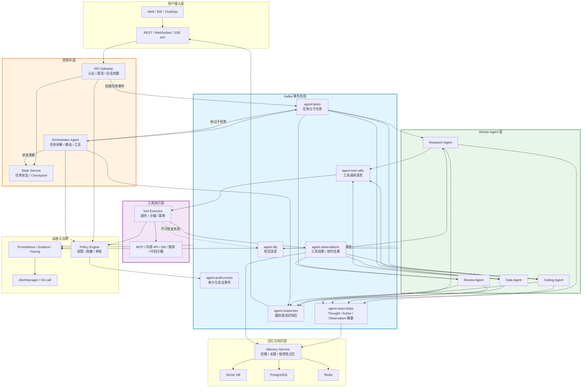
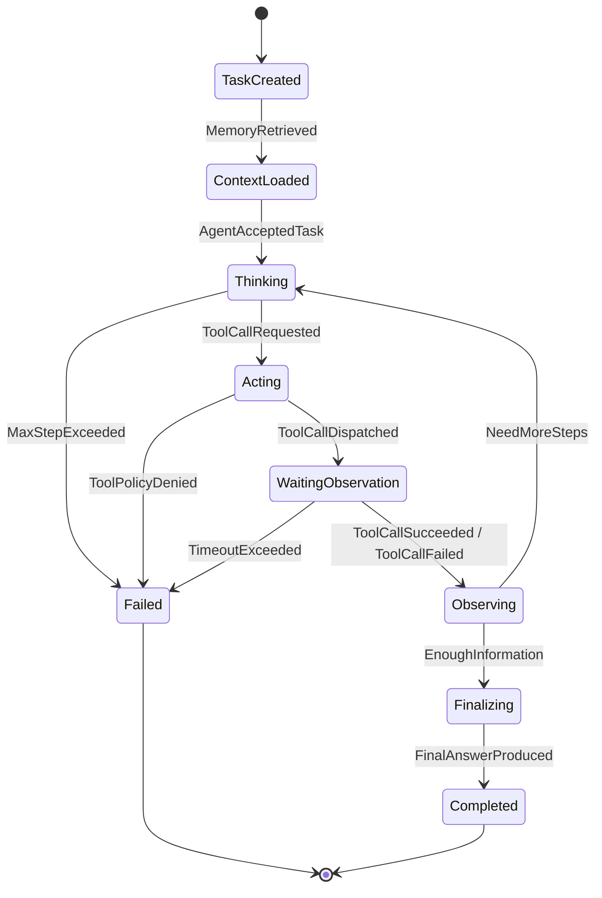
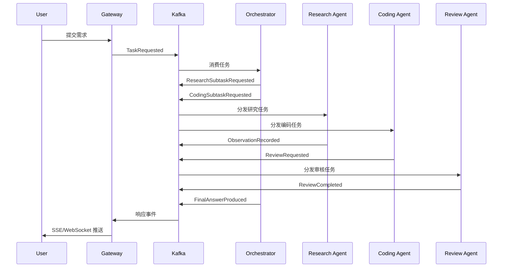

# Kafka 驱动的多 Agent 协作系统设计

> 面向生产级后端 Agent 平台：把 ReAct Loop、工具调用、多 Agent 协作和审计追踪拆成可回放、可扩展、可治理的 Kafka 事件流。

---

## 目录

1. [设计目标与适用边界](#1-设计目标与适用边界)
2. [为什么在多 Agent 系统里引入 Kafka](#2-为什么在多-agent-系统里引入-kafka)
3. [整体架构](#3-整体架构)
4. [Topic 与事件模型](#4-topic-与事件模型)
5. [ReAct Loop 的事件化状态机](#5-react-loop-的事件化状态机)
6. [多 Agent 协作模式](#6-多-agent-协作模式)
7. [消息契约与 Schema 演进](#7-消息契约与-schema-演进)
8. [分区、顺序与 Consumer Group 设计](#8-分区顺序与-consumer-group-设计)
9. [可靠性、幂等与故障恢复](#9-可靠性幂等与故障恢复)
10. [状态存储、记忆与事件回放](#10-状态存储记忆与事件回放)
11. [背压、限流与成本控制](#11-背压限流与成本控制)
12. [安全、权限与审计](#12-安全权限与审计)
13. [可观测性指标](#13-可观测性指标)
14. [落地路线与检查清单](#14-落地路线与检查清单)
15. [适用场景与替代方案](#15-适用场景与替代方案)

---

## 1. 设计目标与适用边界

本文讨论的不是“用 Kafka 传几条任务消息”，而是把 Agent 系统设计成**事件驱动的异步协作平台**。Kafka 在其中承担三类职责：

- **任务总线**：用户请求、子任务、协作请求通过 Topic 分发。
- **状态日志**：ReAct 的 Thought、Action、Observation、Final Answer 都落成可回放事件。
- **解耦边界**：Orchestrator、Worker Agent、Tool Executor、Memory Service、Audit Service 通过事件契约协作，而不是互相同步调用。

### 1.1 典型规模假设

| 维度 | 建议假设 |
|------|----------|
| Agent 类型 | 3 个以上，如 Research、Coding、Review、Data、Ops |
| 并发会话 | 数十到数千，单个会话可能运行数分钟到数小时 |
| 工具调用 | 外部 API、数据库、代码沙箱、MCP Server、企业内部系统 |
| 合规要求 | 需要完整执行链路、可审计、可重放、可定位责任 |
| 部署形态 | Kubernetes + Kafka + PostgreSQL/Redis + 对象存储/向量库 |

### 1.2 核心非目标

- 不追求每一步都低于 100ms 的极低延迟。
- 不把 Kafka 当成 Agent 的唯一状态库；长状态仍应写入 PostgreSQL、Redis、对象存储或向量库。
- 不用 Kafka 替代工作流引擎。复杂 DAG、补偿事务、人工审批仍可由 Temporal、Argo Workflows、LangGraph Checkpointer 等组件承载。

---

## 2. 为什么在多 Agent 系统里引入 Kafka

传统 Agent 后端常见做法是：API Server 收到请求后同步调用 Orchestrator，Orchestrator 再同步调用 Worker 和工具。这个模型在原型阶段简单，但进入生产后会遇到明显瓶颈。

| 问题 | 同步编排的表现 | Kafka 事件化后的收益 |
|------|----------------|----------------------|
| LLM 延迟不可控 | HTTP 线程或任务协程长时间挂起 | 请求入队即返回 `task_id`，后台异步推进 |
| 工具调用易失败 | 单个工具超时拖垮整条链路 | Action 与 Observation 解耦，可独立重试 |
| Agent 强耦合 | 新增 Worker 需要改 Orchestrator 调用逻辑 | 新 Agent 订阅对应 Topic 或 Consumer Group |
| 中间态不可追溯 | Thought/Action 只在内存或日志里 | 每一步成为事件，可回放、审计、调试 |
| 峰值流量难扛 | 上游直接压到 LLM/API Provider | Kafka Lag 成为缓冲层和背压信号 |
| 多语言协作困难 | Python/Node/Java 服务接口不统一 | 统一 Schema 契约即可跨语言消费 |

关键点是：**Kafka 不是让 Agent 更聪明，而是让 Agent 系统在规模化后仍然可控。**

---

## 3. 整体架构



### 3.1 组件职责

| 组件 | 核心职责 | 不应承担的职责 |
|------|----------|----------------|
| API Gateway | 认证、限流、创建会话、推送响应 | 长时间执行 ReAct |
| Orchestrator | 任务拆解、Agent 路由、结果聚合、全局超时 | 直接执行所有工具 |
| Worker Agent | 专业领域推理、局部 ReAct Loop、产出中间结果 | 保存全局唯一状态 |
| Tool Executor | 工具调用、沙箱、超时、重试、结果标准化 | 做复杂任务规划 |
| State Service | 会话状态、Checkpoint、幂等记录、进度查询 | 存储大体积日志正文 |
| Memory Service | 从事件流抽取记忆、检索上下文、沉淀经验 | 参与强一致事务 |
| Policy Engine | 权限校验、敏感操作审批、脱敏 | 替代业务逻辑 |

---

## 4. Topic 与事件模型

Topic 不宜按“每个 Agent 一个 Topic”无限扩张。更稳妥的做法是按**事件语义**建 Topic，用 `agent_type`、`task_type`、`tenant_id`、`priority` 等字段进行路由。

### 4.1 推荐 Topic 划分

| Topic | Producer | Consumer | 用途 | 保留策略 |
|-------|----------|----------|------|----------|
| `agent.tasks` | Gateway、Orchestrator、Agent | Orchestrator、Worker Agent | 用户任务、子任务、协作请求 | 3-14 天 |
| `agent.react.steps` | Worker Agent、Orchestrator | Memory、Audit、Observability | ReAct 中间态、推理摘要、步骤状态 | 7-30 天 |
| `agent.tool.calls` | Worker Agent | Tool Executor | 外部工具调用请求 | 1-7 天 |
| `agent.observations` | Tool Executor、Worker Agent | Worker Agent、Orchestrator | 工具结果、协作结果、环境反馈 | 7-30 天 |
| `agent.responses` | Orchestrator、Worker Agent | Gateway、Notification | 最终回复、流式输出、状态变更 | 1-7 天 |
| `agent.memory.events` | Memory Service、Agent | Memory Service、Search Indexer | 记忆写入、修正、失效、索引更新 | 30 天以上 |
| `agent.audit.events` | 所有关键服务 | Audit Sink、SIEM | 权限、审批、数据访问、安全事件 | 按合规要求 |
| `agent.dlq` | 所有 Consumer | DLQ Processor、On-call | 死信与人工介入 | 30-90 天 |

### 4.2 事件命名规范

建议把事件分成“命令型”和“事实型”：

| 类型 | 示例 | 含义 |
|------|------|------|
| Command | `TaskRequested`、`ToolCallRequested`、`ReviewRequested` | 希望某个消费者做一件事 |
| Event | `TaskAccepted`、`ToolCallSucceeded`、`ObservationRecorded` | 已经发生的事实 |

命令型消息可以被拒绝、重试或过期；事实型消息不应被下游修改，只能追加新的纠正事件。

### 4.3 统一事件包络

所有 Topic 建议共享同一层 envelope，业务字段放在 `payload` 中。

```json
{
  "event_id": "evt_01HZY7T4B4Y6J9V6P2K9E5S8V8",
  "event_type": "ToolCallRequested",
  "event_version": 1,
  "occurred_at": "2026-05-28T10:30:21.123Z",
  "tenant_id": "tenant_acme",
  "user_id": "user_123",
  "session_id": "sess_456",
  "task_id": "task_789",
  "parent_task_id": "task_001",
  "agent_id": "coding-agent-3",
  "agent_type": "coding",
  "trace_id": "trace_abc",
  "correlation_id": "corr_tool_001",
  "causation_id": "evt_previous",
  "priority": "normal",
  "payload": {}
}
```

关键字段说明：

| 字段 | 用途 |
|------|------|
| `event_id` | 全局唯一，Consumer 幂等去重的主键 |
| `session_id` | 会话级顺序与前端订阅标识 |
| `task_id` | 单个任务或子任务的生命周期标识 |
| `parent_task_id` | 任务拆解后的父子关系 |
| `trace_id` | 跨服务链路追踪 |
| `correlation_id` | Action 与 Observation、协作请求与协作结果的关联 |
| `causation_id` | 当前事件由哪个上游事件触发，用于回放因果链 |
| `event_version` | Schema 演进版本 |

---

## 5. ReAct Loop 的事件化状态机

传统 ReAct 可以写成内存循环：

```text
while not done:
    thought = llm.reason(context)
    action = parse_tool_call(thought)
    observation = tool.execute(action)
    context.append(observation)
```

Kafka 化以后，循环被拆成可持久化的状态机：



### 5.1 ReAct 阶段到 Topic 的映射

| ReAct 阶段 | Kafka Topic | 事件类型 | 关键字段 | 说明 |
|------------|-------------|----------|----------|------|
| Task | `agent.tasks` | `TaskRequested` | `task_id`、`task_type`、`input` | 用户任务或子任务入口 |
| Thought | `agent.react.steps` | `ThoughtRecorded` | `step_id`、`summary`、`token_usage` | 记录推理摘要，不建议保存敏感完整思考链 |
| Action | `agent.tool.calls` | `ToolCallRequested` | `tool_name`、`arguments`、`correlation_id` | 异步触发工具 |
| Observation | `agent.observations` | `ToolCallSucceeded` / `ToolCallFailed` | `correlation_id`、`result_ref`、`error` | 恢复下一轮 ReAct |
| Final | `agent.responses` | `FinalAnswerProduced` | `content`、`citations`、`is_complete` | 推送最终结果 |

### 5.2 为什么不建议把完整 Chain-of-Thought 全量落库

工程上只需要保存可解释、可审计、可重放的**推理摘要和决策依据**，而不是模型完整隐藏思考过程。推荐记录：

- 输入上下文引用，如检索到的文档 ID、工具返回结果 ID。
- 决策摘要，如“需要调用代码搜索工具定位函数定义”。
- 选择的工具、参数、结果摘要。
- 置信度、风险标签、人工审批结果。
- Token、耗时、模型版本、Prompt 版本。

这样既满足排障和审计，也降低隐私泄露、Prompt 注入扩散和存储成本。

---

## 6. 多 Agent 协作模式

多 Agent 通信不要设计成 Agent 之间互相同步 HTTP 调用。更稳定的方式是：所有协作都变成任务事件或观察事件。

### 6.1 中心化调度：Orchestrator 分解任务



适合场景：

- 任务需要明确拆解和汇总。
- 需要统一控制成本、超时、权限。
- 需要全局优先级调度。

### 6.2 去中心协作：Agent 通过事件握手

Coding Agent 需要 Review Agent 时，不直接调用 Review Agent，而是发布：

```json
{
  "event_type": "ReviewRequested",
  "session_id": "sess_456",
  "task_id": "task_review_001",
  "parent_task_id": "task_code_001",
  "agent_type": "review",
  "correlation_id": "corr_review_001",
  "payload": {
    "artifact_ref": "s3://agent-artifacts/task_code_001/diff.patch",
    "review_focus": ["correctness", "security", "tests"],
    "deadline_at": "2026-05-28T10:40:00Z"
  }
}
```

Review Agent 完成后发布 `ReviewCompleted` 到 `agent.observations`：

```json
{
  "event_type": "ReviewCompleted",
  "session_id": "sess_456",
  "task_id": "task_review_001",
  "parent_task_id": "task_code_001",
  "agent_type": "review",
  "correlation_id": "corr_review_001",
  "payload": {
    "status": "approved_with_comments",
    "summary": "发现 1 个边界条件缺失，建议补充空输入测试。",
    "findings": [
      {
        "severity": "medium",
        "file": "src/parser.ts",
        "line": 42,
        "message": "空字符串输入会跳过校验。"
      }
    ]
  }
}
```

### 6.3 广播订阅：旁路能力增强

有些消费者不参与主链路，但可以订阅事件流提供旁路能力：

| 旁路消费者 | 订阅 Topic | 作用 |
|------------|------------|------|
| Memory Extractor | `agent.react.steps`、`agent.observations` | 抽取长期记忆、失败经验、工具使用偏好 |
| Audit Sink | `agent.audit.events`、`agent.tool.calls` | 合规留痕、敏感操作追踪 |
| Cost Analyzer | `agent.react.steps`、`agent.responses` | 汇总模型调用成本 |
| Quality Evaluator | `agent.responses` | 离线评估回答质量 |
| Search Indexer | `agent.memory.events` | 更新向量库和全文索引 |

---

## 7. 消息契约与 Schema 演进

生产系统不建议裸 JSON 随意增删字段。至少需要 JSON Schema；更推荐 Protobuf 或 Avro + Schema Registry。

### 7.1 ToolCallRequested 示例

```json
{
  "event_id": "evt_tool_001",
  "event_type": "ToolCallRequested",
  "event_version": 1,
  "occurred_at": "2026-05-28T10:30:21.123Z",
  "tenant_id": "tenant_acme",
  "user_id": "user_123",
  "session_id": "sess_456",
  "task_id": "task_789",
  "agent_id": "coding-agent-3",
  "agent_type": "coding",
  "trace_id": "trace_abc",
  "correlation_id": "corr_tool_001",
  "payload": {
    "tool_name": "repo.search",
    "tool_version": "1.2.0",
    "arguments": {
      "query": "parseUserInput",
      "path": "src/"
    },
    "timeout_ms": 15000,
    "retry_policy": {
      "max_attempts": 3,
      "backoff_ms": 500
    },
    "idempotency_key": "tool:repo.search:task_789:step_003"
  }
}
```

### 7.2 ToolCallSucceeded 示例

```json
{
  "event_id": "evt_obs_001",
  "event_type": "ToolCallSucceeded",
  "event_version": 1,
  "occurred_at": "2026-05-28T10:30:25.456Z",
  "tenant_id": "tenant_acme",
  "session_id": "sess_456",
  "task_id": "task_789",
  "trace_id": "trace_abc",
  "correlation_id": "corr_tool_001",
  "causation_id": "evt_tool_001",
  "payload": {
    "tool_name": "repo.search",
    "duration_ms": 3120,
    "result_ref": "s3://agent-results/task_789/step_003.json",
    "result_preview": "Found 3 definitions and 8 references.",
    "metadata": {
      "result_count": 11,
      "truncated": false
    }
  }
}
```

### 7.3 Schema 演进规则

| 变更 | 是否兼容 | 规则 |
|------|----------|------|
| 新增可选字段 | 兼容 | Consumer 必须忽略未知字段 |
| 新增必填字段 | 不兼容 | 提升 `event_version`，双写或灰度迁移 |
| 删除字段 | 不兼容 | 先标记 deprecated，确认无消费者依赖后再删除 |
| 字段改名 | 不兼容 | 新增字段并双写一段时间 |
| 枚举新增值 | 可能不兼容 | 老 Consumer 必须有 `unknown` 分支 |
| 语义改变 | 不兼容 | 新事件类型比复用旧字段更安全 |

---

## 8. 分区、顺序与 Consumer Group 设计

Kafka 只能保证**同一 Partition 内有序**，不能保证整个 Topic 全局有序。Agent 系统最常见的错误是没有提前设计消息 Key。

### 8.1 消息 Key 选择

| Topic | 推荐 Key | 原因 |
|-------|----------|------|
| `agent.tasks` | `session_id` 或 `task_id` | 同一会话或任务的生命周期事件有序 |
| `agent.react.steps` | `session_id` | ReAct 步骤顺序对回放很重要 |
| `agent.tool.calls` | `correlation_id` 或 `tool_name` | 前者保证单次调用链有序；后者便于按工具扩容 |
| `agent.observations` | `correlation_id` | Action 与 Observation 精确关联 |
| `agent.responses` | `session_id` | 前端流式输出必须有序 |
| `agent.audit.events` | `tenant_id` 或 `user_id` | 便于租户级审计回放 |

如果一个任务中多个 Agent 并行工作，不要强行要求全局顺序。应该通过 `parent_task_id`、`correlation_id` 和状态机合并结果。

### 8.2 Consumer Group 模型

| Consumer Group | 订阅 Topic | 扩容方式 |
|----------------|------------|----------|
| `orchestrator-v1` | `agent.tasks` | 按分区水平扩容，处理任务拆解与汇总 |
| `worker-coding-v1` | `agent.tasks` | 只处理 `agent_type=coding` 或 `task_type=code_*` |
| `worker-review-v1` | `agent.tasks` | 只处理审核任务 |
| `tool-executor-v1` | `agent.tool.calls` | 按工具类型或负载扩容 |
| `memory-extractor-v1` | `agent.react.steps`、`agent.observations` | 可独立扩容，不影响主链路 |
| `gateway-response-v1` | `agent.responses` | 按会话推送响应 |

注意：同一 Consumer Group 内，一条消息只会被一个实例消费；不同 Consumer Group 会各自收到一份消息。需要广播时使用不同 Consumer Group，不要让多个逻辑消费者混在同一个 Group。

### 8.3 分区数规划

分区数一旦过小，会限制最大并行度；过大则增加 Broker、Consumer Rebalance 和文件句柄开销。建议：

- 以 6、12、24、48 这类可增长的分区数起步。
- `agent.responses` 如果需要严格按会话顺序推送，按 `session_id` 分区。
- 高吞吐工具调用可按工具类别拆 Topic 或按 `tool_name` 分区。
- 不要依赖新增分区后的历史顺序一致性；新增分区会改变 Key 到 Partition 的映射。

---

## 9. 可靠性、幂等与故障恢复

### 9.1 可靠投递基线

Producer 侧建议：

- 开启 `acks=all`。
- 设置合理的 `delivery.timeout.ms` 和 `request.timeout.ms`。
- 使用幂等 Producer，避免网络抖动导致重复写入。
- 发送失败时不要静默丢弃，要写本地 Outbox 或错误日志。

Consumer 侧建议：

- 业务处理成功后再提交 offset。
- 所有副作用操作都带 `idempotency_key`。
- 对外部 API、数据库写入、代码执行等操作建立幂等记录。
- 区分可重试错误和不可重试错误。

### 9.2 幂等表设计

可在 PostgreSQL 中维护一张处理记录表：

```sql
CREATE TABLE agent_event_processing (
  consumer_group TEXT NOT NULL,
  event_id TEXT NOT NULL,
  idempotency_key TEXT,
  status TEXT NOT NULL,
  processed_at TIMESTAMPTZ NOT NULL DEFAULT now(),
  result_ref TEXT,
  error_code TEXT,
  PRIMARY KEY (consumer_group, event_id)
);
```

处理流程：

1. Consumer 收到消息后先插入 `(consumer_group, event_id)`。
2. 如果主键冲突，说明处理过，直接提交 offset。
3. 执行业务逻辑。
4. 成功后更新 `status=processed` 并提交 offset。
5. 失败时按错误类型重试、延迟重试或进入 DLQ。

### 9.3 重试与 DLQ

推荐把重试分成三层：

| 层级 | 场景 | 策略 |
|------|------|------|
| 进程内快速重试 | 网络瞬断、429、短暂 5xx | 2-3 次指数退避 |
| 延迟重试 Topic | 下游服务短时间不可用 | `agent.retry.1m`、`agent.retry.10m`、`agent.retry.1h` |
| DLQ | Schema 不兼容、权限拒绝、超过最大步数 | 写入 `agent.dlq`，触发告警或人工处理 |

DLQ 消息必须包含原始消息、失败原因、消费者名称、重试次数和最后异常摘要。

```json
{
  "event_type": "DeadLetterRecorded",
  "payload": {
    "source_topic": "agent.tool.calls",
    "source_partition": 3,
    "source_offset": 98127,
    "consumer_group": "tool-executor-v1",
    "failure_type": "PolicyDenied",
    "failure_message": "Tool repo.write requires human approval.",
    "attempts": 3,
    "original_event_ref": "s3://agent-dlq/evt_tool_001.json"
  }
}
```

### 9.4 ReAct 死循环防护

每个任务都应有硬性边界：

- `max_steps`：最多 ReAct 步数。
- `max_tool_calls`：最多工具调用次数。
- `max_tokens`：单任务最大 Token 消耗。
- `deadline_at`：任务绝对截止时间。
- `budget_usd`：租户、用户或任务级成本上限。

超过边界后发布 `TaskFailed` 或 `HumanInterventionRequired`，不要让 Worker 无限消费和生产事件。

---

## 10. 状态存储、记忆与事件回放

Kafka 是日志，不是查询型状态库。Agent 平台通常需要三类状态：

| 状态类型 | 示例 | 推荐存储 |
|----------|------|----------|
| 热状态 | 当前步骤、等待的 `correlation_id`、SSE 订阅 | Redis |
| 强一致状态 | 任务生命周期、幂等记录、审批状态 | PostgreSQL |
| 大对象 | 工具结果、代码 diff、长文档、模型输出全文 | S3/MinIO |
| 语义记忆 | 用户偏好、项目经验、工具失败教训 | Vector DB + PostgreSQL |

### 10.1 Checkpoint 设计

Worker 每完成一个 ReAct 步骤后，写入 Checkpoint：

```json
{
  "session_id": "sess_456",
  "task_id": "task_789",
  "agent_id": "coding-agent-3",
  "step_id": "step_003",
  "state": "waiting_observation",
  "waiting_for": "corr_tool_001",
  "context_ref": "s3://agent-checkpoints/task_789/step_003.json",
  "updated_at": "2026-05-28T10:30:21.123Z"
}
```

如果 Worker 崩溃，新实例从 State Service 读取最近 Checkpoint，再从 `agent.observations` 找到对应 `correlation_id` 的结果，继续下一轮。

### 10.2 事件回放

事件回放主要用于：

- 重建某个任务的执行链路。
- 复现线上 Bug。
- 离线评估不同 Prompt 或模型版本。
- 从历史事件中重新抽取记忆。

回放时需要注意：

- 对工具调用要区分“重放历史结果”和“重新执行工具”。
- 对外部有副作用工具默认只回放 Observation，不重新执行 Action。
- 回放环境应使用独立 Consumer Group，避免污染生产 offset。
- Prompt、模型版本、工具版本都应被记录，否则很难复现。

---

## 11. 背压、限流与成本控制

Kafka Lag 不是单纯的故障信号，也是调度信号。Agent 平台应根据 Lag、LLM 额度、工具错误率动态调节消费速度。

### 11.1 限流维度

| 维度 | 控制目标 |
|------|----------|
| 用户级 | 防止单用户占满资源 |
| 租户级 | 控制企业客户预算 |
| Agent 类型 | 避免高成本 Agent 挤压低成本 Agent |
| 工具级 | 尊重外部 API QPS、RPM、TPM |
| 模型级 | 避免 LLM Provider 限流 |
| 优先级 | 高优先级任务优先消费 |

### 11.2 背压动作

| 信号 | 动作 |
|------|------|
| `agent.tool.calls` Lag 上升 | 增加 Tool Executor，或降低 Worker 产生 Action 的速度 |
| LLM 429 增多 | 降低 Consumer poll 数量，增加退避，切换低优先级任务到便宜模型 |
| 单租户预算接近上限 | 降级模型、减少并行子任务、要求人工确认 |
| DLQ 激增 | 暂停相关 Consumer Group，避免错误扩散 |
| `agent.responses` Lag 上升 | 优先保障响应推送 Consumer，避免用户端长时间无反馈 |

### 11.3 优先级队列实现

Kafka 本身没有严格优先级队列。可选方案：

- 按优先级拆 Topic：`agent.tasks.high`、`agent.tasks.normal`、`agent.tasks.low`。
- Consumer 先 poll 高优先级 Topic，再处理普通 Topic。
- 低优先级任务设置更短 TTL 或更严格预算。
- Orchestrator 在任务拆解阶段根据用户、场景、SLA 写入 `priority`。

---

## 12. 安全、权限与审计

多 Agent 系统的风险不只来自用户输入，还来自 Agent 之间传递的事件。安全控制必须放在事件边界上。

### 12.1 权限检查点

| 检查点 | 必做校验 |
|--------|----------|
| Gateway 创建任务 | 用户身份、租户配额、输入大小、敏感内容 |
| Orchestrator 分发任务 | Agent 是否有能力和权限处理该任务 |
| Worker 调用工具 | 工具白名单、参数校验、数据访问范围 |
| Tool Executor 执行 | 沙箱、超时、网络出口、文件系统权限 |
| Memory Service 写入 | PII 脱敏、租户隔离、记忆质量门禁 |
| Response 输出 | 敏感信息过滤、引用来源、合规策略 |

### 12.2 敏感操作审批

以下工具调用应默认进入审批流程：

- 写数据库、删数据、改配置。
- 发邮件、发消息、创建工单、执行支付。
- 写代码仓库、提交 PR、部署服务。
- 访问高敏数据表或跨租户数据。

审批可以通过 `HumanApprovalRequested` 事件实现：

```json
{
  "event_type": "HumanApprovalRequested",
  "payload": {
    "requested_action": "repo.write",
    "risk_level": "high",
    "reason": "Agent wants to modify production deployment manifest.",
    "approval_timeout_ms": 1800000,
    "resume_correlation_id": "corr_approval_001"
  }
}
```

审批通过后再发布 `HumanApprovalGranted` 到 `agent.observations`，Worker 根据 `resume_correlation_id` 继续执行。

---

## 13. 可观测性指标

### 13.1 Kafka 指标

| 指标 | 含义 | 告警建议 |
|------|------|----------|
| Consumer Lag | 消费堆积 | 按 Topic 和 Consumer Group 设置阈值 |
| Rebalance Rate | Consumer Group 重平衡频率 | 频繁 Rebalance 会造成延迟抖动 |
| Produce Error Rate | 生产失败率 | 非零持续出现需要排查 Broker 或网络 |
| Request Latency | Broker 请求延迟 | 关注 P95/P99 |
| Under Replicated Partitions | 副本不足 | 生产高危告警 |

### 13.2 Agent 指标

| 指标 | 说明 |
|------|------|
| `agent_task_duration_seconds` | 任务端到端耗时 |
| `agent_react_steps_total` | 每任务 ReAct 步数 |
| `agent_tool_calls_total` | 工具调用次数，按工具名和状态分组 |
| `agent_llm_tokens_total` | 输入、输出、推理 Token 消耗 |
| `agent_cost_usd_total` | 用户、租户、Agent 类型维度成本 |
| `agent_retry_total` | 重试次数，按错误类型分组 |
| `agent_dlq_total` | 死信数量 |
| `agent_human_approval_total` | 人工审批数量和结果 |

### 13.3 Trace 关联

每条事件必须携带 `trace_id`。推荐 Span 划分：

- `gateway.create_task`
- `orchestrator.plan_task`
- `worker.react.think`
- `worker.react.act`
- `tool_executor.execute`
- `memory.retrieve`
- `memory.write`
- `gateway.stream_response`

这样可以从一次用户请求追到某个 LLM 调用、工具调用、Kafka offset 和最终响应。

---

## 14. 落地路线与检查清单

### 14.1 分阶段落地

| 阶段 | 目标 | 关键产物 |
|------|------|----------|
| P0 原型 | 单 Orchestrator + 1-2 个 Worker 异步执行 | `agent.tasks`、`agent.responses`、基础状态表 |
| P1 可恢复 | ReAct 步骤事件化，支持 Checkpoint 和重试 | `agent.react.steps`、`agent.observations`、幂等表 |
| P2 可治理 | 工具执行层独立，权限、审批、DLQ 完整 | `agent.tool.calls`、Policy Engine、DLQ Processor |
| P3 可观测 | 成本、质量、性能全链路监控 | Metrics、Tracing、Dashboard、告警 |
| P4 可学习 | 从事件流抽取长期记忆和经验 | `agent.memory.events`、Memory Extractor、离线评估 |

### 14.2 设计检查清单

- [ ] 每个 Topic 的 Producer、Consumer、保留时间和 Key 已定义。
- [ ] 所有事件都有 `event_id`、`session_id`、`task_id`、`trace_id`、`correlation_id`。
- [ ] Consumer 处理逻辑具备幂等能力。
- [ ] 外部工具调用有超时、重试、幂等键和权限校验。
- [ ] ReAct Loop 有 `max_steps`、`deadline_at`、预算上限。
- [ ] 完整 Chain-of-Thought 不直接落库，只保存推理摘要和可审计证据。
- [ ] 大对象不放进 Kafka 消息体，只传 `result_ref` 或 `artifact_ref`。
- [ ] DLQ 消息包含原始事件引用和失败上下文。
- [ ] Schema 变更有版本策略和灰度兼容期。
- [ ] Kafka Lag、LLM 429、工具错误率、成本指标都有监控和告警。
- [ ] 高风险工具需要人工审批或策略引擎授权。
- [ ] 回放流程不会重新执行有副作用的工具。

---

## 15. 适用场景与替代方案

### 15.1 推荐使用 Kafka 的场景

- 多 Agent 类型、多语言服务、多团队共同维护。
- 任务耗时长，需要异步执行、断点续跑和状态查询。
- 需要完整审计日志和事件回放。
- 工具调用多、外部依赖不稳定，需要解耦和削峰。
- 需要把主链路与记忆抽取、质量评估、成本分析等旁路能力解耦。

### 15.2 不推荐使用 Kafka 的场景

- 单 Agent 简单问答或低 QPS 原型。
- 业务链路强依赖同步低延迟，端到端必须小于 100ms。
- 团队没有 Kafka 运维能力，也没有托管 Kafka 服务。
- 任务状态很小、协作关系简单，用队列和数据库就能满足。

### 15.3 替代方案对比

| 方案 | 适合场景 | 局限 |
|------|----------|------|
| Redis Streams | 轻量异步队列、低延迟、小团队 | 长期保留、回放和跨团队治理弱 |
| RabbitMQ | 复杂路由、传统任务队列 | 大规模事件日志和回放能力弱于 Kafka |
| Temporal | 强工作流、补偿、长事务、人工审批 | 事件广播和高吞吐日志不是核心优势 |
| LangGraph Checkpointer | 单应用内 Agent 状态机 | 跨服务多 Agent 事件总线能力不足 |
| gRPC Streaming | 低延迟双向通信 | 解耦、削峰、审计回放弱 |

最佳实践通常不是二选一：Kafka 负责事件总线和日志，Temporal/LangGraph 负责复杂工作流状态机，PostgreSQL/Redis 负责查询型状态，向量库负责长期语义记忆。

---

## 总结

Kafka 引入多 Agent 系统的核心价值，是把不可预测的 LLM 推理和工具调用变成**可缓冲、可追踪、可重放、可治理**的事件流。落地时要优先设计清楚 Topic 语义、消息 Key、事件契约、幂等边界和状态存储，而不是只关注“怎么发消息”。

一个生产可用的 Kafka Agent 架构应满足四个条件：

1. **事件可解释**：每个任务从输入到输出都有完整因果链。
2. **处理可恢复**：Worker 崩溃、工具超时、LLM 限流后能继续推进。
3. **协作可扩展**：新增 Agent 和旁路消费者不破坏主链路。
4. **风险可治理**：权限、审批、审计、成本和死循环都有硬边界。
