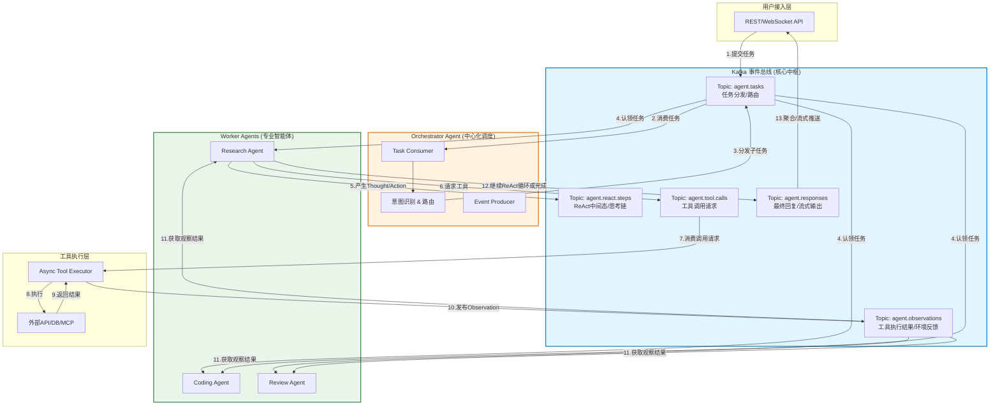

在后端 Agent 开发中，将 **ReAct Loop（推理-行动-观察循环）** 与 **多 Agent 通信** 体系引入 Kafka，本质上是将传统的“同步编排”升级为 **“事件驱动的异步智能体协作”**。Kafka 在这里不仅仅是消息队列，更是 Agent 之间的**共享状态总线**和**解耦中枢**。

以下是基于当前工程实践的深度解析与 Mermaid 架构图。

### 1. 核心设计理念：为什么用 Kafka？

在 ReAct + Multi-Agent 体系中引入 Kafka 主要解决三个痛点：
*   **ReAct 循环的阻塞问题**：LLM 推理和工具执行耗时极不固定，同步 HTTP 调用会导致线程长时间挂起。Kafka 实现“触发即返回”，Agent 消费消息后异步执行 ReAct 步骤。
*   **多 Agent 耦合度过高**：Orchestrator 直接调用 Worker 导致强依赖。Kafka 通过 Topic 实现发布/订阅，新增 Agent 无需修改上游代码。
*   **状态可追溯与容错**：ReAct 的中间态（Thought/Action/Observation）天然适合 Kafka 的日志追加特性，支持断点续跑、回放调试和审计。

### 2. 架构全景图 (Mermaid)

### 3. Kafka 在 ReAct Loop 中的具体嵌入方式

#### 3.1 ReAct 循环的事件化改造
传统 ReAct 是 `while True: think() -> act() -> observe()` 的内存循环。引入 Kafka 后，循环被拆解为**事件驱动的状态机**：

| ReAct 阶段 | Kafka Topic | 消息体关键字段 | 说明 |
| :--- | :--- | :--- | :--- |
| **Thought** | `agent.react.steps` | `{session_id, step_type:"thought", content:"..."}` | 记录推理过程，用于审计和前端展示 |
| **Action** | `agent.tool.calls` | `{session_id, tool_name, params, correlation_id}` | 异步触发工具，correlation_id 用于关联后续 Observation |
| **Observation** | `agent.observations` | `{correlation_id, result, status}` | Worker 消费此消息后恢复 ReAct 循环的下一轮 |
| **Final Answer** | `agent.responses` | `{session_id, content, is_complete}` | 终止循环，通知用户层 |

#### 3.2 多 Agent 通信模式
*   **任务路由（Routing）**：Orchestrator 将用户请求拆解后，通过 `agent.tasks` Topic 的 **Key=agent_type** 进行分区路由，确保特定类型的任务只被对应的 Worker Consumer Group 消费。
*   **协作握手（Handshake）**：当 Coding Agent 需要 Review Agent 审核时，不直接调用，而是向 `agent.tasks` 发送一条 `type: "review_request"` 的消息，Review Agent 消费后将结果写入 `agent.observations`，Coding Agent 通过 `correlation_id` 监听自己的结果。
*   **广播与记忆**：所有 ReAct 步骤消息保留 7 天（或配置 retention），新加入的 Agent 可以通过从头消费来“学习”历史决策链路，实现**事件溯源（Event Sourcing）**式的共享记忆。

### 4. 后端工程落地关键点

1.  **会话亲和性（Session Affinity）**：
    *   Kafka 消息 Key 必须使用 `session_id` 或 `task_id`，保证同一个 ReAct 循环的所有事件进入同一 Partition，严格有序。
2.  **幂等性与去重**：
    *   LLM 可能重试，工具可能超时。Consumer 必须基于 `message_id` 做幂等处理，避免重复调用外部 API 或重复推理。
3.  **背压与限流**：
    *   LLM API 有 RPM/TPM 限制。在 Consumer 端实现令牌桶，当 Kafka Lag 过高时，优先丢弃低优先级任务或动态扩容 Consumer 实例（注意 Partition 数要预留足够）。
4.  **死信队列（DLQ）**：
    *   ReAct 陷入死循环或工具连续失败超过 N 次，消息转入 DLQ，触发告警并人工介入，防止污染主流程。
5.  **Schema Registry**：
    *   强烈建议使用 Avro/Protobuf + Schema Registry 管理 Agent 间消息格式，避免 JSON 字段变更导致上下游 Agent 解析崩溃。

### 5. 适用场景与注意事项

*   **✅ 推荐引入 Kafka**：生产级多 Agent 系统、需要高吞吐/高可用、跨语言 Agent 协作（Python Agent + Java Agent）、需要完整审计日志。
*   **❌ 不推荐**：单 Agent 简单问答、原型验证阶段、对延迟极度敏感（<100ms）的场景（此时用 Redis Pub/Sub 或 gRPC Stream 更合适）。

> **💡 工程提示**：不要为了用 Kafka 而用 Kafka。如果你的 Agent 数量少于 3 个且 QPS < 100，LangGraph/CrewAI 内置的内存通信或轻量级 Redis 可能更高效。Kafka 的价值在于**规模化**和**生产级可靠性**。
