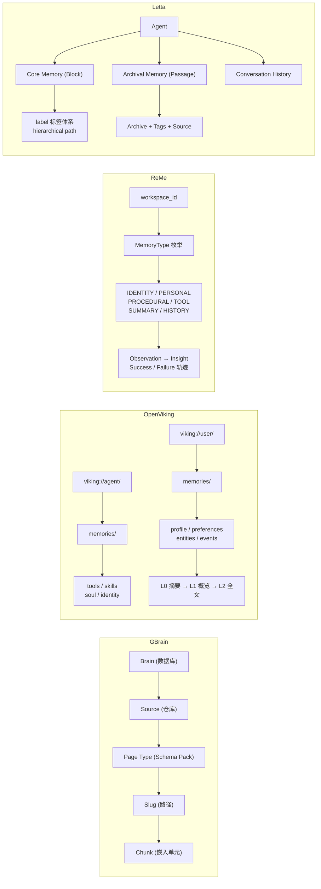
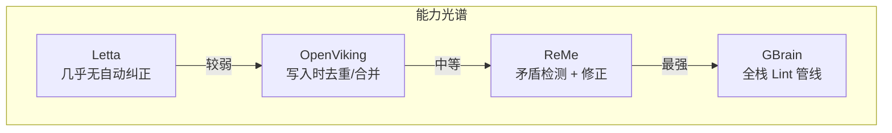
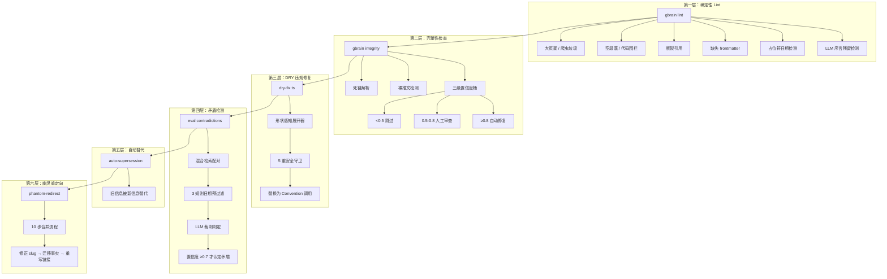
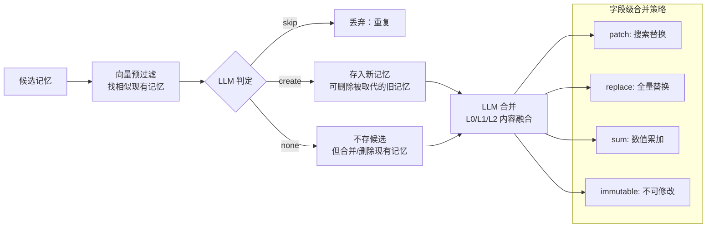
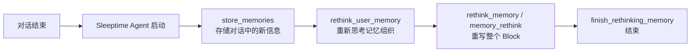
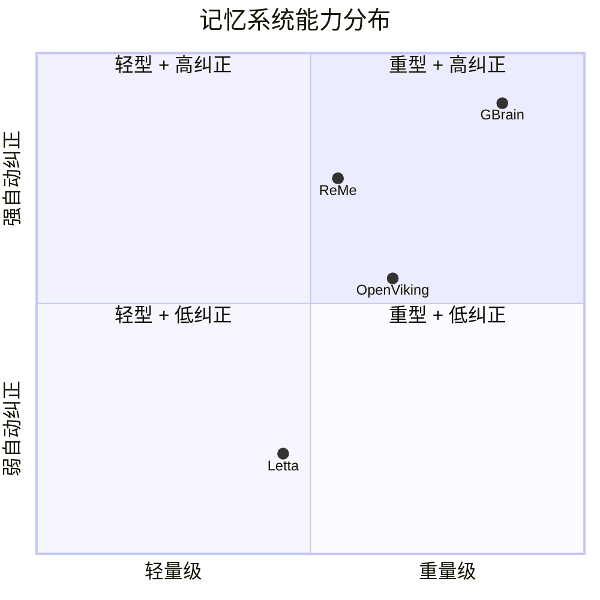
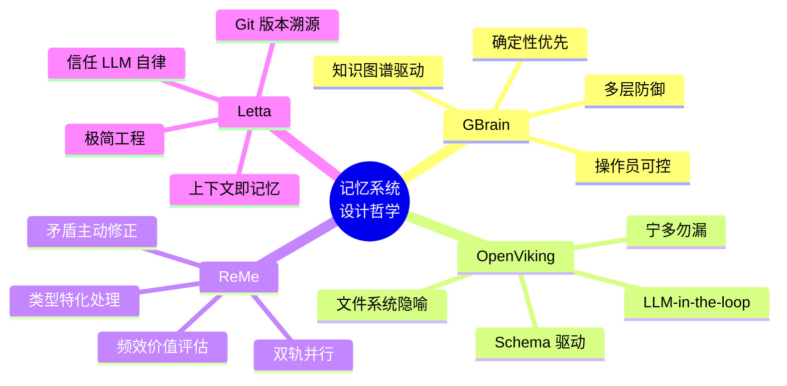

# AI Agent 记忆系统深度分析报告

> 四大开源项目的记忆质量管理、长期组织、自动纠正与检索策略对比

## 目录

- [概述](#概述)
- [一、记忆质量保障：如何确认信息值得入库](#一记忆质量保障如何确认信息值得入库)
- [二、长期记忆组织：如何保持记忆有序](#二长期记忆组织如何保持记忆有序)
- [三、记忆 Lint 与自动纠正：如何发现并修复错误](#三记忆-lint-与自动纠正如何发现并修复错误)
- [四、记忆检索：如何快速找到相关记忆](#四记忆检索如何快速找到相关记忆)
- [五、横向对比总结](#五横向对比总结)
- [六、关键设计启示](#六关键设计启示)

---

## 概述

本报告分析四个开源 AI Agent 记忆系统的内部机制：

| 项目 | 定位 | 记忆载体 | 核心特色 |
|------|------|---------|---------|
| **GBrain** | 个人/团队知识库 | PostgreSQL (Markdown Pages) | 多层确定性 lint + 知识图谱 |
| **OpenViking** | 多租户 Agent 记忆框架 | 虚拟文件系统 (viking://) | LLM-in-the-loop ReAct 去重 + 层级检索 |
| **ReMe** | 对话式 Agent 记忆 | 向量库 + 文件系统双轨 | 矛盾检测与自动修正 + 频效淘汰 |
| **Letta** | 可持久化 Agent 平台 | Block (上下文内) + Passage (归档) | Git 版本控制 + Sleeptime 后台维护 |

---

## 一、记忆质量保障：如何确认信息值得入库

质量保障的本质问题是：**一条信息在写入长期记忆之前，经过了哪些"关卡"？**

### 1.1 四项目质量关卡总览

```mermaid
flowchart TD
    subgraph GBrain["GBrain 质量关卡"]
        G1["① 内容健康检查<br/>assessContentSanity()"] --> G2["② 内容哈希去重<br/>SHA-256 over 标题+正文+标签"]
        G2 --> G3["③ 嵌入跳过标记<br/>超大页面标记 embed-skip"]
        G3 --> G4["④ 事实提取资格门<br/>≥80字 + 合法类型 + 非梦境生成"]
        G4 --> G5["⑤ LLM 结构化提取<br/>显著性过滤 + 置信度评分"]
    end

    subgraph Viking["OpenViking 质量关卡"]
        V1["① LLM 提取<br/>含/不含标准的 prompt"] --> V2["② Pydantic 类型校验<br/>FaultTolerantBaseModel"]
        V2 --> V3["③ JSON 解析容错<br/>失败重试一次"]
        V3 --> V4["④ 未读文件检查<br/>强制先读后写"]
        V4 --> V5["⑤ Schema 约束<br/>operation_mode: add_only"]
    end

    subgraph ReMe["ReMe 质量关卡"]
        R1["① 信息过滤<br/>InfoFilterOp 评分 0-3"] --> R2["② 输入校验<br/>拒绝空字段"]
        R2 --> R3["③ LLM 质量评估<br/>MemoryValidationOp"]
        R3 --> R4["④ 阈值过滤<br/>validation_threshold ≥ 0.5"]
        R4 --> R5["⑤ 内容去重<br/>哈希 + 余弦相似度"]
    end

    subgraph Letta["Letta 质量关卡"]
        L1["① 技术清洗<br/>去除空字节 / 行号污染"] --> L2["② 只读保护<br/>read_only 块不可改"]
        L2 --> L3["③ 精确匹配替换<br/>old_string 唯一性检查"]
        L3 --> L4["④ Prompt 引导<br/>软性 LLM 自律"]
    end
```



### 1.2 GBrain：最严格的多层确定性质检

GBrain 的质量保障分为**硬阻断**、**软阻断**和**LLM 评估**三个层次：

**硬阻断层（零 LLM 调用）：**

- `assessContentSanity()` 在所有入口（CLI import、MCP put_page、sync、webhook）之前运行
- 6 种垃圾模式匹配（Cloudflare 挑战页、验证码、403 页面等）直接抛出 `ContentSanityBlockError`
- 操作员可通过 `~/.gbrain/junk-substrings.txt` 自定义垃圾特征（用子串而非正则，防止 ReDoS）
- SHA-256 内容哈希实现幂等去重，配合 `pages_dedup_partial_index` 索引实现 O(log n) 检测

**软阻断层：**

- 超过 500KB 的页面进入数据库但标记 `embed-skip`，不参与嵌入
- 超过 50KB 的页面产生警告但正常入库

**LLM 评估层：**

- 事实提取时使用结构化 prompt，内嵌**显著性过滤器**：
  - `high`（生命事件、重大承诺）→ 立即提取
  - `medium`（持久偏好、信念）→ 可等待批处理
  - `low`（后勤杂音）→ 直接跳过
- 每条事实附带 0-1 置信度分数，直接第一人称断言 = 1.0，推断/模糊声明更低

### 1.3 OpenViking：LLM 主导 + 类型安全兜底

OpenViking 的哲学是**信任 LLM 判断，但用工程手段兜底 LLM 的格式错误**：

- 提取 prompt 明确列出包含/排除标准："个性化信息"、"长期有效"、"具体明确"才值得记住
- 设计哲学上选择**宁多勿漏**："不确定时就提取，下游去重系统会处理冗余"
- `FaultTolerantBaseModel` 在 Pydantic 验证前自动做类型转换（`"None"` → `None`、字符串 → 数字），防止 LLM 输出格式偏差导致整个提取失败
- JSON 解析失败时重试一次（添加格式错误提示），仍然失败则抛 `RuntimeError` 而非静默跳过

### 1.4 ReMe：LLM-as-Judge 打分制

ReMe 是四个项目中唯一对**每条记忆独立打分**的系统：

- `InfoFilterOp` 用 LLM 对用户消息评分（0-3），只保留 2-3 分的消息
- `MemoryValidationOp` 用 LLM 对提取出的每条记忆做验证，返回 `is_valid`（布尔）和 `score`（浮点）
- 配置化的 `validation_threshold`（默认 0.5）低于阈值的记忆直接丢弃
- 工具调用结果还有额外的二元评分（0.0 或 1.0）

### 1.5 Letta：最轻量的"信任 LLM"方案

Letta 的质量保障最为薄弱：

- **无语义质量验证**——没有置信度评分、没有交叉验证、没有准确性检查
- 仅有技术层面的输入清洗（去除空字节防止 PostgreSQL 编码错误）
- 依赖系统 prompt 中的软性指令："要有选择性地编辑记忆"、"确保日期时间精确"
- `memory_replace` 的精确匹配要求（old_string 必须恰好出现一次）防止模糊编辑

---

## 二、长期记忆组织：如何保持记忆有序

### 2.1 组织架构对比



### 2.2 GBrain：双轴 + 类型分类 + 知识图谱

GBrain 的组织模型是**Brain × Source** 的矩阵：

- **Brain** = 数据库实例（个人 brain 是 `host`，团队 brain 独立部署）
- **Source** = 数据库内的仓库（wiki、gstack、openclaw 等）
- **Page Type** 由 Schema Pack 定义，5 种可组合原语：`entity`、`media`、`temporal`、`annotation`、`concept`
- 页面类型通过文件路径前缀自动推断（`/wiki/analysis/` → analysis 类型）

**知识图谱**是 GBrain 的独特优势：
- 通过正则/启发式提取有类型边（`works_at`、`invested_in`、`founded` 等），**零 LLM 调用**
- Schema Pack 声明 `link_types` 并支持 `inference` 规则（正则模式、页面类型、目标类型）
- 边类型还支持传递闭包推理

**事实存储**采用结构化 Claim：
- 类型化：`event`、`preference`、`commitment`、`belief`、`fact`
- 关联到实体 slug（如 `people/alice`）
- 可选的量化字段：`metric`、`value`、`unit`、`period`（如 MRR、ARR）

### 2.3 OpenViking：URI 虚拟文件系统 + 三级内容抽象

OpenViking 使用 `viking://` URI 方案将记忆组织为**虚拟文件系统**：

**多类型分离存储：**
- 用户侧：`profile.md`、`preferences/{user}/{topic}.md`、`entities/{category}/{name}.md`、`events/{year}/{month}/{day}/{event}.md`
- Agent 侧：`tools/{tool_name}.md`、`skills/{skill_name}.md`、`soul.md`、`identity.md`

**L0/L1/L2 三级内容结构（最精巧的设计）：**

| 层级 | 内容 | 用途 |
|------|------|------|
| L0 (abstract) | 一句话摘要 | 索引和快速查找 |
| L1 (overview) | Markdown 结构化概览 | 浏览和粗筛 |
| L2 (content) | 完整详细叙述 | 深度阅读 |

每次写入后自动生成 `.overview.md` 目录索引文件，提供人类可读的目录概览。

**多租户隔离：** `MemoryIsolationHandler` 按 `user_id` 和 `agent_id` 隔离记忆，计算读写作用域。

### 2.4 ReMe：类型枚举 + 双轨系统

ReMe 有**两套并行的记忆系统**：

**向量系统（ReMe）：**
- 6 种记忆类型：IDENTITY、PERSONAL、PROCEDURAL、TOOL、SUMMARY、HISTORY
- 个人记忆有两层结构：**Observation**（原始观察）→ **Insight**（高层反思）
- 任务记忆按**轨迹分类**：成功/失败轨迹，进一步分段提取
- `when_to_use` 字段是检索触发条件，作为向量嵌入的内容来源

**文件系统（ReMeLight）：**
```
working_dir/
  MEMORY.md              # 长期持久记忆
  memory/YYYY-MM-DD.md   # 每日日志
  dialog/YYYY-MM-DD.jsonl # 原始对话
  tool_result/<uuid>.txt  # 长工具输出缓存
```

### 2.5 Letta：Block + Passage 双层 + Git 版本控制

Letta 的记忆分为**始终在上下文中**和**按需检索**两层：

**Core Memory (Block)：**
- 直接嵌入 LLM 的 system prompt，每轮对话都可见
- 通过 `label` 组织（`human`、`persona`、`system/human` 等）
- 支持标签分类和 `read_only` 标记
- **Git 版本控制**（`GitEnabledBlockManager`）：所有写入先提交 Git，PostgreSQL 为缓存
  - 完整 commit 历史，可回溯任意时间点
  - 支持 undo/redo 检查点机制

**Archival Memory (Passage)：**
- 向量嵌入的文本块，按 Archive 和 Tag 组织
- 可关联到文件来源

---

## 三、记忆 Lint 与自动纠正：如何发现并修复错误

这是四个项目差异最大的领域。**GBrain 有完整的确定性 lint 管线，而 Letta 几乎没有自动纠正机制。**

### 3.1 自动纠正能力光谱



### 3.2 GBrain：最完整的自动纠正体系

GBrain 有**六层**互相协作的纠正机制：



**关键设计亮点：**

1. **共享评估器**：`assessContent()` 函数被 lint、doctor、ingest 三者复用，确保一致性
2. **三级置信度桶**：自动修复（≥0.8）→ 人工审查（0.5-0.8）→ 跳过（<0.5）
3. **矛盾检测置信度双重执行**：LLM 说"矛盾"但置信度 < 0.7 → 强制降级为"不矛盾"
4. **`gbrain doctor`** 运行 20+ 健康检查：图谱覆盖率、嵌入列维度、爬虫逃逸页面等

### 3.3 OpenViking：写入时预防，非定期扫描

OpenViking 的"lint"是**内联在写入流程中**的，没有独立的定期扫描：



**安全网规则（硬编码）：**
- `skip` 不应携带任何子操作
- `create` + 任何 `merge` 操作 → 自动归一化为 `none`
- `create` 只能携带 `delete` 操作
- 同一 URI 的冲突操作被丢弃

**单调性守卫：** 合并统计数据时，如果 `total_calls` 或 `total_executions` 合并后反而减少，则跳过合并（防止 LLM 输出回归）。

### 3.4 ReMe：专用矛盾检测 + 内容修正

ReMe 有两层矛盾处理系统，是四个项目中**唯一能自动改写矛盾内容**的：

**短期矛盾检测 (`ContraRepeatOp`)：**
1. 收集最近 50 条记忆
2. LLM 逐条判定：`Contradiction`（矛盾）/ `Contained`（被包含）/ `None`（无问题）
3. 矛盾和被包含的记忆直接**删除**

**长期矛盾解决 (`LongContraRepeatOp`) — 更智能：**
1. 处理 Insight 级别的记忆
2. LLM 判定时可以附带**修正后的内容**
3. 三种解决策略：
   - 矛盾 + 有修正内容 → 创建新记忆（带 `modified_by: "long_contra_repeat"` 元数据）
   - 矛盾 + 无修正 → 删除
   - 被包含/冗余 → 删除

**Insight 持续更新 (`UpdateInsightOp`)：**
- 新观察到达时，通过 Jaccard 相似度和反思主题匹配找到相关 Insight
- LLM 更新 Insight 内容，元数据记录 `"original_content"` 和 `"update_reason"`

**频效淘汰 (`MemoryDeletion`)：**
- 记忆被检索时 `freq++`，被认为有用时 `utility++`
- 当 `freq ≥ threshold` 且 `utility/freq < threshold` → 删除（"经常被看到但很少有用"）

### 3.5 Letta：Sleeptime Agent 软性维护

Letta 最接近"lint"的是 **Sleeptime Agent**，它是一个对话后运行的后台 Agent：



- 系统 prompt 要求："确保记忆块全面、可读、最新"
- `rethink_memory` 函数可完全重写一个 Block，保留未过时的信息，整合新信息
- **但没有**：自动矛盾检测、过时检测、跨 Block 交叉验证、定期扫描

---

## 四、记忆检索：如何快速找到相关记忆

### 4.1 检索管线对比

```mermaid
flowchart TD
    subgraph GBrain["GBrain 检索管线"]
        GQ["用户查询"] --> G1["意图分类<br/>entity/temporal/event/general"]
        G1 --> G2["查询扩展<br/>Haiku 生成 2 个变体"]
        G2 --> G3["关键词搜索<br/>pg_trgm + ts_rank"]
        G2 --> G4["向量搜索<br/>pgvector 余弦距离"]
        G3 --> G5["RRF 融合 (K=60)"]
        G4 --> G5
        G5 --> G6["源感知加权<br/>originals 1.5x / daily 0.8x"]
        G6 --> G7["后融合 Boost<br/>反链/显著度/时效/图信号"]
        G7 --> G8["外部 Reranker"]
        G8 --> G9["去重 + Token 预算"]
    end

    subgraph Viking["OpenViking 检索管线"]
        VQ["用户查询"] --> V1["意图分析<br/>LLM 生成 QueryPlan"]
        V1 --> V2["全局向量搜索"]
        V2 --> V3["层级递归搜索<br/>优先队列 BFS"]
        V3 --> V4["分数传播<br/>α×child + (1-α)×parent"]
        V4 --> V5["Reranking<br/>THINKING 模式"]
        V5 --> V6["热度融合<br/>频率 + 7天半衰期时效"]
        V6 --> V7["关系遍历<br/>关联资源/技能"]
    end

    subgraph ReMe["ReMe 检索管线"]
        RQ["用户查询"] --> R1["查询构建<br/>LLM 生成优化查询"]
        R1 --> R2["向量余弦搜索<br/>+ 内容去重"]
        R2 --> R3{"记忆类型?"}
        R3 -->|个人| R4["LLM 语义排序"]
        R3 -->|任务| R5["LLM 重排序"]
        R4 --> R6["融合重排序<br/>类型×时间×分数"]
        R5 --> R7["分数阈值过滤"]
        R6 --> R8["LLM 改写<br/>优化上下文表述"]
        R7 --> R8
        R8 --> R9["合并输出"]
    end

    subgraph Letta["Letta 检索"]
        LQ["用户查询"] --> L1{"记忆层?"}
        L1 -->|Core Memory| L2["始终可见<br/>嵌入 system prompt"]
        L1 -->|Archival| L3["混合搜索<br/>向量 + 全文 RRF"]
        L1 -->|Conversation| L4["消息历史搜索<br/>ILIKE / Turbopuffer"]
        L3 --> L5["Tag 过滤"]
        L4 --> L6["时间范围过滤"]
    end
```



### 4.2 GBrain：信号最丰富的混合检索

GBrain 的检索是四个项目中最复杂的，融合了**六种信号**：

| 信号 | 实现 | 效果 |
|------|------|------|
| 关键词 | pg_trgm 相似度 + ts_rank | 精确匹配 |
| 语义 | pgvector 余弦距离 | 模糊匹配 |
| 源权重 | 乘法 boost（originals 1.5x, daily 0.8x） | 偏好高质量来源 |
| 反链 | `1 + 0.05 × log(1 + count)` | 被引用多的页面排名高 |
| 显著度 | 情感权重 + take_count | 重要内容上浮 |
| 时效 | 按路径前缀的半衰期衰减 | 新内容优待 |

**Floor-ratio 门控**是关键保护机制：防止低质量页面仅因元数据 boost 超过高质量页面。

**三种搜索模式：**
- `conservative`：4K token 预算，无扩展，限制 10 条
- `balanced`：12K token 预算，限制 25 条
- `tokenmax`：无限制，LLM 扩展 + Reranker，限制 50 条

### 4.3 OpenViking：层级递归 + 热度衰减

OpenViking 的检索最独特之处是**层级递归搜索**：

1. 全局向量搜索找到初始候选目录
2. 优先队列 BFS 逐层深入
3. **分数传播**：`final_score = α × child_score + (1-α) × parent_score`
4. **收敛检测**：连续 3 轮 top-k 不变时停止

**热度分数**融合两个维度：
- 频率：`sigmoid(log1p(access_count))`
- 时效：7 天半衰期指数衰减
- 最终：`score = (1-α) × semantic + α × hotness`

### 4.4 ReMe：类型特化重排序

ReMe 按记忆类型走不同的重排序路径：

**个人记忆：**
- `FuseRerankOp` 组合三个信号：原始分数 × 类型权重 × 时间相关性
- 类型权重：insight=2.0 > obs_customized=1.2 > observation=1.0 > conversation=0.5
- 时间匹配：查询中的时间关键词命中记忆时间戳 → 2x boost

**任务记忆：**
- 可选的 LLM 重排序
- 基于 `confidence` 元数据和 `validation_score` 的分数阈值过滤

**文件系统检索（ReMeLight）：**
- 向量 + BM25 混合检索（权重 0.7/0.3）

### 4.5 Letta：分层直达

Letta 的检索最为简单直接：

- **Core Memory**：不需要检索，始终在 system prompt 中
- **Archival Memory**：Turbopuffer 混合搜索（向量 + 全文，RRF 融合），或 pgvector SQL 降级方案
- **Conversation History**：Turbopuffer 消息搜索或 ILIKE 文本匹配
- 支持 Tag 过滤（ANY/ALL 模式）和时间范围过滤

---

## 五、横向对比总结

### 5.1 四维能力矩阵



### 5.2 详细对比表

| 维度 | GBrain | OpenViking | ReMe | Letta |
|------|--------|-----------|------|-------|
| **入库前质量检查** | 硬阻断 + 软阻断 + LLM 评分 | LLM 提取 + Pydantic 校验 | LLM 评分 0-3 + 阈值过滤 | 仅技术清洗 |
| **去重机制** | SHA-256 内容哈希 | 向量相似度 + LLM 判定 | 余弦相似度 + MD5 哈希 | 无（仅 Tag 去重） |
| **组织结构** | Brain×Source×Type×Slug | URI 虚拟文件系统 + L0/L1/L2 | 类型枚举 + Observation/Insight | Block + Passage + Git |
| **矛盾检测** | LLM 裁判 + 置信度双重执行 | 写入时 LLM 去重判定 | ContraRepeat + LongContraRepeat | 无 |
| **自动修正** | lint + integrity + DRY + phantom | 字段级合并策略 | 内容改写 + 频效淘汰 | Sleeptime 软性重写 |
| **定期扫描** | lint / doctor / integrity | 无 | 无（管线内联） | Sleeptime Agent |
| **检索复杂度** | 6 信号混合 + 3 模式 | 层级递归 + 热度衰减 | 4-5 级管线 + 类型特化 | 分层直达 |
| **版本控制** | Git (content_hash) | 无 | 元数据时间戳 | Git (完整 commit 历史) |
| **LLM 调用量** | 混合（确定性优先） | 高（提取 + 去重 + 检索） | 高（验证 + 矛盾 + 重排序） | 中（Sleeptime + 检索） |

---

## 六、关键设计启示

### 6.1 值得借鉴的模式

1. **GBrain 的"确定性优先"原则**：能用规则解决的不用 LLM（内容健康检查、哈希去重、DRY 修复），LLM 只用在必须的地方（事实提取、矛盾裁决）。这大幅降低了成本和延迟。

2. **OpenViking 的 L0/L1/L2 三级抽象**：一句话摘要用于索引，结构化概览用于浏览，全文用于深度阅读。这个分层让检索可以在不同粒度上工作。

3. **ReMe 的频效淘汰**：`freq / utility` 比率是判断记忆价值的简洁指标——"经常被检索但很少有用"的记忆自动清除。

4. **Letta 的 Git 版本控制**：记忆的每次变更都有 commit 历史，支持任意时间点回溯和 undo/redo。

### 6.2 共同的挑战

1. **矛盾检测覆盖不全**：只有 GBrain 和 ReMe 有真正的矛盾检测，且都聚焦在特定记忆类型上
2. **缺乏标准化**：每个项目的记忆 schema、检索管线、质量标准完全不同
3. **LLM 依赖的脆弱性**：OpenViking 和 ReMe 的质量保障高度依赖 LLM 判断，存在系统性偏差风险
4. **定期维护的缺失**：除 GBrain 的 lint/doctor 外，没有项目有完整的定期记忆健康扫描

### 6.3 设计哲学差异



---

> 本报告基于对四个项目源码的逐文件分析，覆盖了记忆从入库、组织、维护到检索的完整生命周期。每个项目都有其独特的权衡取舍，没有绝对的最优方案——选择取决于你的 Agent 对记忆精度、成本、延迟和复杂度的具体需求。
