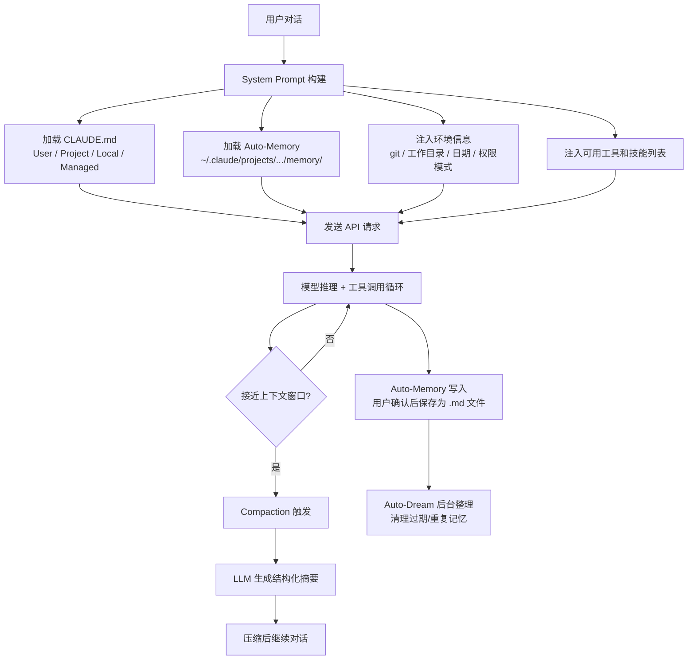
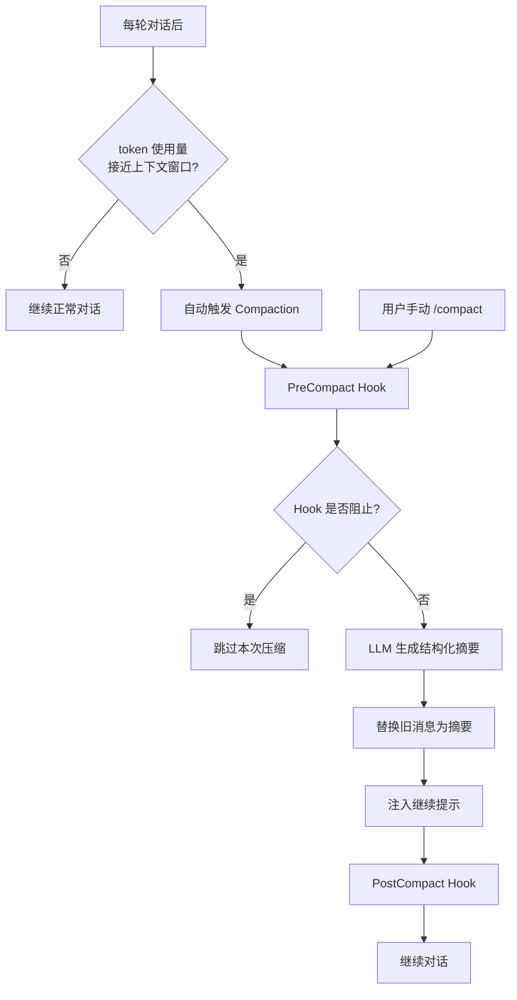
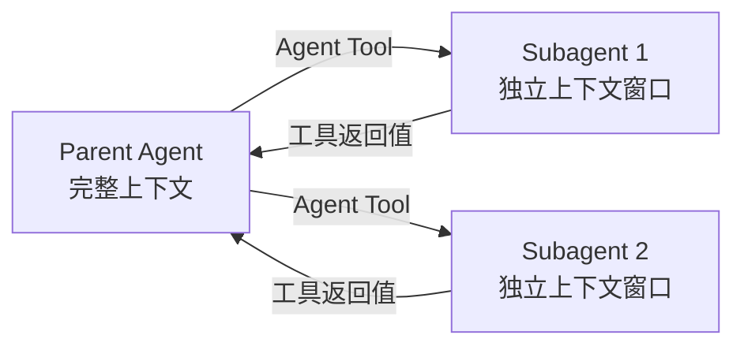

# Claude Code 记忆系统与上下文压缩管道（源码校对版）

> 基于 Claude Code 源码（`src/memdir/`、`src/services/compact/`）、CHANGELOG、Agent SDK 类型定义交叉验证。原文描述的"五层记忆系统"（写入层、索引层、检索层、融合层、淘汰层）在源码中不存在，本文基于实际实现重写。

## 实际架构

Claude Code 的记忆和上下文管理由三个独立但协作的子系统构成：



---

## 一、CLAUDE.md 分层加载

CLAUDE.md 是 Claude Code 的核心配置和指令系统，分为四个层级：

| 层级 | 路径 | 用途 | 优先级 |
|------|------|------|--------|
| User | `~/.claude/CLAUDE.md` | 用户个人全局指令 | 最低 |
| Project | `.claude/CLAUDE.md` | 项目级指令（提交到 git） | 中 |
| Local | `CLAUDE.local.md` | 本地指令（不提交 git） | 高 |
| Managed | 组织管理下发 | 组织策略指令 | 最高 |

通过 `InstructionsLoadedHookInput` 类型确认，`memory_type` 字段只有 `'User' | 'Project' | 'Local' | 'Managed'` 四种。

这些内容在每次 API 调用时通过 system prompt 注入，不是存储在数据库或向量索引中。

---

## 二、Auto-Memory 系统

### 存储方式

记忆存储为**纯 markdown 文件**，路径为 `~/.claude/projects/<sanitized-cwd>/memory/`。

每个记忆文件使用 frontmatter 格式：

```markdown
---
name: short-kebab-case-slug
description: one-line summary
metadata:
  type: user | feedback | project | reference
---

记忆内容...
```

通过 `MEMORY.md` 索引文件组织，每条记录一行，不超过 150 字符。

### 四种记忆类型

| 类型 | 用途 | 何时保存 |
|------|------|----------|
| `user` | 用户角色、偏好、知识水平 | 了解到用户信息时 |
| `feedback` | 用户对工作方式的纠正或确认 | 用户纠正或确认方法时 |
| `project` | 项目进展、目标、决策 | 了解到项目动态时 |
| `reference` | 外部系统资源指针 | 发现外部资源时 |

### 记忆召回（Memory Recall）

在对话中召回相关记忆时，支持两种模式：

- **select**：选择完整文件内容加载
- **synthesize**：使用 Sonnet 模型从多个小记忆中合成一段摘要

### 记忆年龄警告

超过 1 天的记忆会附加警告：

> "This memory is X days old. Memories are point-in-time observations, not live state — claims about code behavior or file:line citations may be outdated."

> **源码中不存在**向量索引、embedding 搜索、多维索引（按用户/会话/任务/实体/时间）等机制。记忆就是纯 markdown 文件，通过目录结构和文件名组织。

---

## 三、Compaction（上下文压缩）管道

这是 Claude Code 最核心的上下文管理机制。

### 3.1 触发机制



### 3.2 压缩提示词结构

压缩时发送给 LLM 的提示要求保留以下结构化章节：

```
1. Initial task — 原始任务描述
2. Key Technical Concepts — 关键技术概念
3. Files and Code Sections — 相关文件和代码（含代码片段）
4. Problem Solving — 问题解决过程
5. User Interactions — 用户交互（安全指令必须逐字保留）
6. Issues/Problems Encountered — 遇到的问题
7. Work Completed — 已完成工作
8. Current Work — 当前进行中工作
9. Context for Continuing Work — 继续工作所需上下文
```

### 3.3 部分压缩

支持两种保留模式：

- **Suffix-preserving**：保留最近的 N 条消息不压缩（热缓存）
- **Prefix-preserving**：保留最早的对话上下文

压缩后注入继续提示："Continue the conversation from where it left off without asking the user any further questions. Resume directly..."

### 3.4 容错与重试

| 机制 | 说明 |
|------|------|
| 重试 | 压缩失败（API 错误等）时自动重试 |
| 熔断器 | 连续 3 次失败后停止重试 |
| Reactive compaction | 首次尝试从溢出大小开始，避免浪费 |
| 多模态处理 | 遇到媒体大小错误时重试剥离图片 |

### 3.5 已知问题与修复

CHANGELOG 记录了大量压缩相关的 bug 修复：

- 压缩后 deferred tools 的 input schema 丢失 → 已修复
- 子代理转录文件在重试时重复写入 → 已修复
- 背景 agent 完成通知在压缩后丢失 → 已修复
- 压缩后 skills 被重新执行 → 已修复
- Token 估算过高导致过早压缩 → 已修复
- 压缩后 rate-limit 升级选项消失 → 已修复
- 压缩后 `CLAUDE_CODE_MAX_OUTPUT_TOKENS` 被忽略 → 已修复

---

## 四、Auto-Dream（后台记忆整理）

Auto-Dream 是一个后台机制，定期清理和整理记忆文件：

- **扫描**记忆文件的最后修改时间
- **合并**重复或高度相似的记忆
- **删除**与当前代码状态矛盾的记忆
- **生成年龄警告**：超过 1 天的记忆附加时效性提醒

> Auto-Dream 的逻辑很简单——定期扫描、清理过期/重复记忆。**不存在**原文描述的"冲突消解"（版本比较、tombstone）、"污染治理"（幻觉隔离、审计删除）等复杂机制。

---

## 五、Agent SDK 上下文隔离

### 子代理上下文模型



关键特征：
- 子 Agent 有**独立的上下文窗口**，不共享父 Agent 的对话历史
- 结果通过**工具调用的返回值**传递，不是异步事件总线
- 子 Agent 可以配置 `memory` 字段加载特定范围的记忆文件（`'user' | 'project' | 'local'`）
- 子 Agent 可以配置独立的 `permissionMode`、`effort`、`model`
- **不存在** "MemoryShareEvent" 或共享压缩记忆的机制

### AgentDefinition 完整参数

```typescript
type AgentDefinition = {
  description: string;        // 何时使用此 agent
  tools?: string[];           // 允许的工具列表
  disallowedTools?: string[]; // 禁用的工具列表
  prompt: string;             // 系统提示
  model?: string;             // 模型选择
  mcpServers?: AgentMcpServerSpec[];
  skills?: string[];          // 预加载的技能
  initialPrompt?: string;     // 自动提交的首轮提示
  maxTurns?: number;          // 最大轮次
  background?: boolean;       // 后台运行
  memory?: 'user' | 'project' | 'local';  // 记忆范围
  effort?: ('low' | 'medium' | 'high' | 'xhigh' | 'max') | number;
  permissionMode?: PermissionMode;
};
```

---

## 六、与虚构"五层记忆系统"的对比

| 原文描述 | 源码实际情况 |
|----------|-------------|
| 写入层：记忆闸门、事实抽取、价值判断 | Auto-Memory 由用户确认后保存，无自动抽取 |
| 索引层：按用户/会话/任务/实体/时间/语义向量索引 | 纯文件目录结构，无任何索引 |
| 检索层：结构化过滤 + 语义召回 + 重排 | 记忆文件直接加载到 system prompt |
| 融合层：槽位分组、冲突标记、预算控制 | 无融合层，文件内容直接使用 |
| 淘汰层：TTL、冲突消解、污染治理 | Auto-Dream 简单清理过期/重复文件 |
| 向量索引 embedding | 不存在 |
| 多维关系索引 | 不存在 |
| 语义相似度搜索 | 不存在 |

---

## 总结

Claude Code 的记忆和上下文管理是一个**务实的文件系统方案**：

1. **CLAUDE.md**：分层指令文件，通过 system prompt 注入
2. **Auto-Memory**：纯 markdown 记忆文件，按目录组织
3. **Auto-Dream**：简单的后台清理机制
4. **Compaction**：LLM 驱动的结构化摘要压缩
5. **Prompt Cache**：通过动态边界分离实现跨用户缓存复用

整个系统的设计哲学是**简单可靠**——用文件系统替代数据库，用 LLM 摘要替代复杂的索引和检索，用目录结构替代多维索引。

> 参考来源：Claude Code CHANGELOG、Agent SDK 类型定义（sdk.d.ts）、Claude Code 二进制字符串分析
