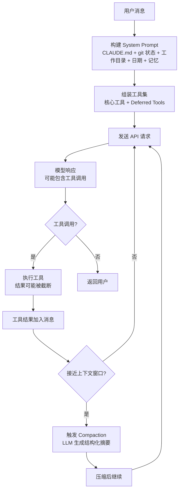

# Claude Code 上下文管理机制（源码校对版）

> 基于 Claude Code 源码（`src/constants/prompts.ts`、`src/services/compact/`、`src/memdir/`）、CHANGELOG、Agent SDK 类型定义交叉验证

## 核心架构概览

Claude Code 的上下文管理并非一个复杂的七层流水线，而是一个**实用且相对简单的系统**，由以下核心组件构成：

1. **System Prompt 动态构建** — 每次 API 调用时注入最新环境状态
2. **Compaction（上下文压缩）** — LLM 驱动的语义压缩，在接近上下文窗口限制时触发
3. **Tool Result Truncation（工具结果截断）** — 防止单次工具输出撑爆上下文
4. **Deferred Tool Loading（延迟工具加载）** — 通过 ToolSearch 按需加载工具 schema
5. **CLAUDE.md + Auto-Memory** — 基于文件的持久化记忆系统

---

## 1. System Prompt 动态构建

Claude Code 每次 API 调用时，都会动态构建 system prompt，注入当前最新状态：

- **工作目录和 git 状态** — 当前路径、分支、最近提交等
- **CLAUDE.md 内容** — 分为 User（`~/.claude/CLAUDE.md`）、Project（`.claude/CLAUDE.md`）、Local（`CLAUDE.local.md`）、Managed（组织管理）四个层级
- **当前日期**
- **记忆文件** — 从 `~/.claude/projects/<sanitized-cwd>/memory/` 加载
- **可用技能（Skills）列表**
- **权限模式和工具列表**

系统使用 `__SYSTEM_PROMPT_DYNAMIC_BOUNDARY__` 标记将动态内容与静态内容分离，以支持跨用户的 **prompt cache** 复用。这意味着只有动态部分（工作目录、git 状态等）在每次请求时变化，静态指令部分可以被缓存。

> **注意：** 源码中不存在 "Dashboard 固定区域"、"ChatDashboard"、"上下文替换" 等概念。系统信息通过 system prompt 注入，而非替换历史消息。

---

## 2. Compaction（上下文压缩）

这是 Claude Code 最核心的上下文管理机制。

### 触发条件

- **自动触发**：当 token 使用接近模型上下文窗口限制时（`autoCompactThreshold`）
- **手动触发**：用户执行 `/compact` 命令，可附带自定义指令

### 压缩方式

调用 LLM 生成结构化摘要，包含以下章节（来自 CHANGELOG 确认）：

| 章节 | 内容 |
|------|------|
| Initial task | 原始任务描述 |
| Key Technical Concepts | 关键技术概念 |
| Files and Code Sections | 相关文件和代码片段 |
| Problem Solving | 问题解决过程 |
| User Interactions | 用户交互（**安全相关指令必须逐字保留**） |
| Issues/Problems Encountered | 遇到的问题 |
| Work Completed | 已完成的工作 |
| Current Work | 当前进行中的工作 |
| Context for Continuing Work | 继续工作所需的上下文 |

### 部分压缩模式

支持两种保留模式：
- **Suffix-preserving**：保留最近的消息不压缩
- **Prefix-preserving**：保留最早的消息不压缩

压缩后会注入继续提示："Continue the conversation from where it left off without asking the user any further questions. Resume directly..."

### 容错机制

- **重试**：如果压缩失败（如 API 错误），会进行重试
- **熔断器**：连续失败 3 次后停止重试（CHANGELOG: "circuit breaker now stops after 3 attempts"）
- **Reactive compaction**：首次压缩尝试会从原始请求的溢出大小开始，避免浪费一轮接近满上下文的重试

### Hook 支持

- **PreCompact**：压缩前触发，可以通过退出码 2 或返回 `{"decision":"block"}` 阻止压缩
- **PostCompact**：压缩完成后触发

### 已知问题（已修复）

- 压缩后 deferred tools 的 input schema 丢失（已修复）
- 子代理转录文件在 prompt-too-long 重试时重复写入（已修复）
- 背景 agent 完成通知在压缩后丢失 output file path（已修复）
- 压缩后 skills 被重新执行（已修复）

---

## 3. 工具结果截断

工具输出有最大限制（约 32MB），超过时截断并显示 "... [output truncated - XKB removed]"。

特定工具有独立限制，例如 `git status` 输出超过 2000 字符会被截断。

MCP 工具结果在整个会话期间保留在上下文中。

---

## 4. Deferred Tool Loading（延迟工具加载）

> **源码中不存在 "工具依赖 DAG" 的概念。**

Claude Code 使用 **Deferred Tool Loading** 机制来减少初始 prompt 中的 token 数量：

- **核心工具**（Read、Edit、Bash 等）始终可用
- **延迟工具**（WebSearch、WebFetch 等）和 MCP 工具通过 `defer_loading` 标记延迟加载
- 用户通过 `ToolSearch` 工具按需加载工具的 schema
- MCP 服务器可以配置 `alwaysLoad: true` 来跳过延迟加载

CHANGELOG 确认了多个相关修复：
- 修复了 deferred tools 在子代理中不可用的问题
- 修复了 ToolSearch 缺少启动后连接的 MCP 工具的问题
- 修复了 `ANTHROPIC_BASE_URL` 下 ToolSearch 被禁用的问题

---

## 5. 多 Agent 上下文隔离

Claude Code 的多 Agent 通信是通过 Agent SDK 的 bridge 机制实现的：

- 子 Agent 有**独立的上下文窗口和系统提示**
- 任务通过 Agent 工具分发，结果通过工具返回值传递
- **不存在** "MemoryShareEvent" 或共享压缩记忆的机制
- 子代理可以通过 `memory` 配置项（`'user' | 'project' | 'local'`）加载特定范围的记忆文件
- 上下文压缩后，背景 agent 的完成通知可能丢失（已修复的 bug）

---

## 6. Auto-Memory 系统

记忆存储在 `~/.claude/projects/<sanitized-cwd>/memory/` 目录下的 markdown 文件中。

- 每个记忆文件有 frontmatter（name、description、type）
- 通过 `MEMORY.md` 索引文件组织
- 支持四种类型：`user`、`feedback`、`project`、`reference`
- 记忆文件超过 1 天会附加年龄警告："This memory is X days old. Memories are point-in-time observations, not live state"
- Auto-Dream 机制定期清理过期、重复的记忆文件

> **源码中不存在**向量索引、语义搜索、多维索引、槽位分组等复杂机制。记忆就是纯 markdown 文件，通过文件路径和文件名组织。

---

## 与其他项目的对比

| 机制 | Claude Code | Codex (Rust) | OpenCode (TypeScript) |
|------|------------|--------------|----------------------|
| 上下文压缩 | LLM 驱动 compaction | 无内置压缩 | 无内置压缩 |
| 工具延迟加载 | ToolSearch + defer_loading | defer_loading 属性 | 无延迟加载 |
| 记忆系统 | CLAUDE.md + Auto-Memory | 无内置记忆 | 无内置记忆 |
| 工具结果限制 | ~32MB 截断 | 由 MCP 协议处理 | 由 MCP 协议处理 |
| System Prompt | 动态构建 + prompt cache | AGENTS.md 静态加载 | AGENTS.md 静态加载 |

---

## 总结

Claude Code 的上下文管理是一个**务实的工程实现**，而非理论上的复杂系统：

- **没有** Dashboard 固定区域或上下文替换
- **没有** ChatDashboard / 上下文锚定
- **没有** MemoryShareEvent 多 Agent 共享
- **没有** 工具依赖 DAG
- **没有** 向量索引或多维索引

实际机制是：**System prompt 动态构建 → LLM 驱动的 compaction → 工具结果截断 → Deferred tool loading → 文件系统记忆**。

> 参考来源：Claude Code CHANGELOG（3946 行）、Agent SDK 类型定义、Claude Code 二进制分析
