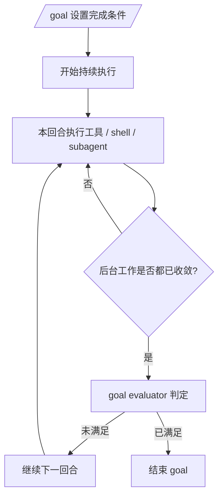
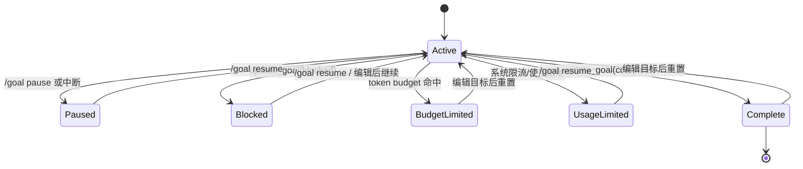
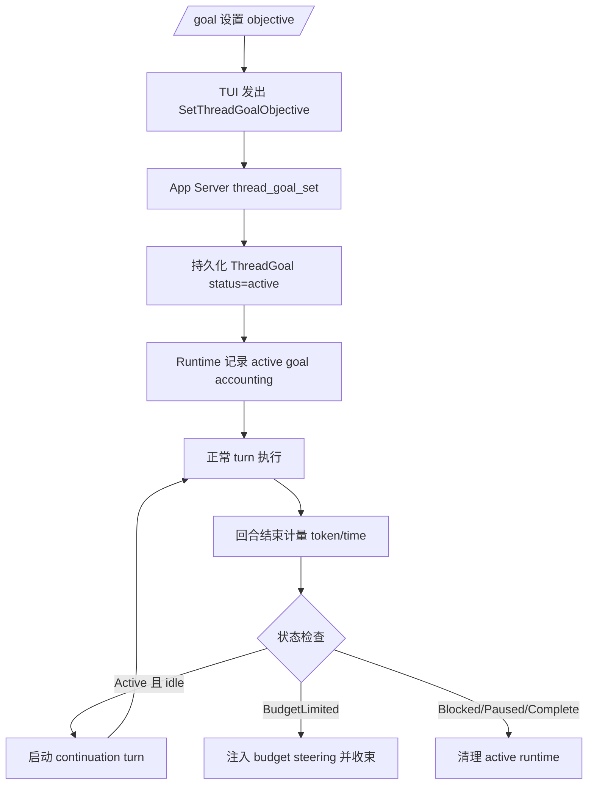

# Claude Code 与 Codex 的 `/goal` 命令策略分析

## 结论先行

两边都把 `/goal` 当成“跨回合持续执行”的控制面，但落点不同：

- `Claude Code` 更像一个 **completion-condition evaluator**。公开证据强调“设定完成条件后持续工作，直到条件满足”，并且专门修过 evaluator 与后台 shell / subagent / hooks 的协同问题。
- `Codex` 更像一个 **持久化 thread goal runtime**。它把 goal 做成线程级状态机，显式保存状态、预算、用量、恢复逻辑、UI 菜单、工具契约与自动 continuation。

这意味着：

- `Claude Code` 的 `/goal` 设计重点是“让 Agent 自主跑完一件事”。
- `Codex` 的 `/goal` 设计重点是“把这件事建模成一个可暂停、可恢复、可计量、可审计的线程目标”。

---

## 证据等级

| 系统 | 证据完整度 | 说明 |
|---|---:|---|
| Claude Code | 中 | 当前目录里主要是公开仓库的 README、插件、命令和 skill 资产，不是完整 CLI 内核源码 |
| Codex | 高 | 当前目录里包含 TUI、app-server、protocol、core、goal extension 的完整实现 |

因此本文对：

- `Claude Code`：**以直接证据为主，必要时做显式推断**
- `Codex`：**以源码实现为准**

---

## 1. Claude Code 的 `/goal` 策略

### 1.1 直接证据

先说明边界：`claude-code/README.md` 展示的是一个公开仓库，重点是安装、插件、示例和文档入口，而不是完整核心实现。这也是为什么仓库里几乎找不到 `/goal` 内部源码。

`claude-code/CHANGELOG.md` 给出了三个关键信号：

1. `2.1.139` 新增 `/goal`
   - “set a completion condition and Claude keeps working across turns until it's met”
   - 支持 `interactive`、`-p` 和 `Remote Control`
   - 有实时 `elapsed/turns/tokens` overlay panel

2. 后续修复说明 `/goal` 不是单次 prompt，而是一个持续 evaluator
   - 修过 “`/goal` evaluator firing while background shells or delegated subagents are still running”

3. `/goal` 与 hooks / managed hooks 有耦合
   - 修过在 `disableAllHooks` 或 `allowManagedHooksOnly` 下 `/goal` 静默挂起的问题

`claude-code/examples/settings/settings-strict.json` 和 `examples/settings/README.md` 还能补强这个判断：`allowManagedHooksOnly` 是一个真实存在的受管设置项，而 changelog 明确说这个设置曾让 `/goal` 挂住。

另外，`claude-code/plugins/plugin-dev/skills/hook-development/SKILL.md` 明确写了 `Stop` / `SubagentStop` 的语义：主 agent 或 subagent 认为自己要停止时，hook 可以 `approve` 或 `block`，并附带 reason / systemMessage。这个机制和 `/goal` 的 bug 特征非常接近。

再往前一步，`claude-code/plugins/ralph-wiggum/README.md` 与 `hooks/stop-hook.sh` 展示了一个非常强的类比实现：通过 Stop hook 拦截退出、检查 completion promise、未完成就阻止退出并把任务继续喂回当前 session。它不是 `/goal` 的直接实现证据，但几乎是仓内最接近的“公开同类机制”。

### 1.2 可以确定的策略

基于直接证据，`Claude Code` 的 `/goal` 至少包含这些策略：

- 把“完成条件”提升为一等概念，而不是只存一段目标文本。
- 命令启动后不是只跑当前回合，而是会 **跨 turns 持续推进**。
- evaluator 在判定“是否继续”前，必须等待后台 shell 和 delegated subagent 收敛，避免过早宣布完成。
- `/goal` 的运行依赖一部分 hook / orchestration 基础设施，所以 hooks 配置异常会影响它的生命周期。
- 这个能力被设计成 **多入口统一能力**，而不是仅限 TUI：同一套语义同时服务交互模式、`-p` 模式和 Remote Control。
- UI 上强调 **持续可观测性**：至少展示 elapsed time、turns、tokens。
- `/goal` 是 **内建命令**，不是插件命令。仓内存在大量插件 command 文件，但没有任何 `/goal` 对应 command 文档或命令定义文件。

### 1.3 合理推断

下面是推断，不是直接源码证据：

- `Claude Code` 的 `/goal` 可能采用一个“回合结束后重新评估是否继续”的控制循环。
- 该循环的核心判定很可能不是“goal status enum”，而是“完成条件是否满足”。
- 它对并发任务的敏感修复，说明它更像 **goal evaluator + orchestration barrier**，而不是单纯的状态字段。
- 如果结合 Stop hook 和 Ralph loop 这个公开类比，一个很合理的实现轮廓是：**Agent 正常工作 -> 准备 stop -> evaluator/hook 风格机制检查 completion condition -> 未满足则阻止停止并继续下一轮**。

### 1.4 Claude Code 心智模型

这套设计更像：**一个围绕完成条件反复调度 Agent 的闭环**。

---

## 2. Codex 的 `/goal` 策略

## 2.1 命令入口不是“继续执行器”，而是“线程目标控制面”

从 `codex/codex-rs/tui/src/chatwidget/tests/slash_commands.rs` 可以直接看出：

- `/goal` 不带参数时，打开 goal menu
- `/goal <text>` 发出 `SetThreadGoalObjective`
- `/goal pause` / `/goal resume` / `/goal clear` 发出对应事件
- `/goal edit` 打开编辑器

并且有几个很重要的输入策略：

- mention 会被保存为纯文本目标，例如 `use $figma for the mockup`
- attached images 会被丢弃，不作为 goal 持久化输入
- 目标文本过长会被直接拒绝，提示“把长说明写进文件再在 goal 中引用”
- 如果 session 还没 materialize/save，TUI 会先排队或直接提示 “The session must start before you can set a goal.”

这说明 TUI 把 `/goal` 明确定义为 **thread metadata / runtime control**，不是直接把整段上下文都塞进长期目标。

## 2.2 Goal 是线程级持久化对象

`codex/codex-rs/protocol/src/protocol.rs` 定义了 `ThreadGoal`：

- `thread_id`
- `objective`
- `status`
- `token_budget`
- `tokens_used`
- `time_used_seconds`
- `created_at`
- `updated_at`

状态枚举为：

- `Active`
- `Paused`
- `Blocked`
- `UsageLimited`
- `BudgetLimited`
- `Complete`

这比“一个 bool 表示是否还在追目标”要严谨得多，说明 Codex 把 `/goal` 设计成 **显式状态机**。

### 2.3 状态机

## 2.4 `/goal` 分成 UI 命令、协议、工具、runtime 四层

### UI / TUI 层

`goal_menu.rs` 和 `goal_status.rs` 说明：

- bare `/goal` 展示摘要面板
- 不同状态暴露不同命令
- footer/status line 会持续显示 token 或 elapsed time
- `Ctrl+C` 中断活跃工作时，会自动把 active goal 标为 paused

### App Server 协议层

`app_server_session.rs` 提供：

- `thread_goal_get`
- `thread_goal_set`
- `thread_goal_clear`

说明 UI 和 runtime 之间不是共享内存，而是通过明确 RPC 协议交互。

### Tool 层

Codex 中存在两套 goal tool 实现：
- `ext/goal/src/spec.rs` + `ext/goal/src/tool.rs` — 使用 `codex_extension_api`
- `core/src/tools/handlers/goal_spec.rs` + `core/src/tools/handlers/goal/{create_goal,get_goal,update_goal}.rs` — 使用 core function tool API

两套实现行为一致，模型侧通过三个工具接触 goal：

- `get_goal`
- `create_goal`
- `update_goal`

其中策略非常克制：

- `create_goal` 只允许在用户明确要求时创建
- 已有 goal 时不能再建新 goal
- `update_goal` 只能标记为 `complete` 或 `blocked`
- `pause/resume/budget-limited/usage-limited` 明确交给用户或系统控制

这是一条很重要的设计原则：**模型不能任意篡改目标生命周期**。

并且 continuation prompt 还额外施加了一个强约束：`blocked` 不是模型觉得难就能随便打的状态，而是要在相同阻塞条件反复出现后才允许上报。

### Runtime / Accounting 层

`core/src/goals.rs` 和 `ext/goal/src/steering.rs` 体现了 Codex 的核心策略：

- 在 turn 开始和结束时记录 token/time 增量
- 命中 token budget 时自动转为 `budget_limited`
- 命中 usage/rate limit 时可转为 `usage_limited`
- goal objective 被外部修改时，向当前回合注入 steering prompt
- budget 命中时，也会注入 steering prompt，要求尽快收束而不是继续扩大工作
- 当线程空闲且 goal 仍为 `active` 时，runtime 才会尝试自动启动 continuation turn
- **只有** Plan mode 会显式忽略 goal continuation（Default/PairProgramming/Execute 三种 mode 都不会忽略）
- continuation 前会再次确认：当前没有 active turn、没有排队输入、thread 非 ephemeral、数据库中的 goal 仍然是 `active`

换句话说，Codex 不是“无限继续”，而是“**在显式预算、状态和注入式 steering 约束下继续**”。

## 2.5 Codex 的持续执行闭环

## 2.6 Codex 的关键设计取舍

### 取舍 1：目标文本要短，细节放文件

`goal_validation.rs` 把 objective 限制为 4000 字符，并明确建议：

> 把更长的说明放进文件，再在 `/goal` 里引用该文件。

这说明 Codex 认为 goal 应该是 **稳定、短小、可计量的 steering anchor**，而不是替代完整 spec。

### 取舍 2：模型只能宣告完成/阻塞，不能自控暂停与恢复

这是为了防止模型把“暂停、恢复、预算耗尽”这些系统语义自说自话。Codex 在这里采用的是 **bounded authority**：模型负责给出完成/阻塞判断，但线程生命周期主控权仍在用户和系统。

### 取舍 3：目标是线程级对象，不是单回合 prompt

这让 `/goal` 可以穿越：

- UI 重启
- thread resume
- 中断恢复
- 预算统计
- telemetry

### 取舍 4：状态变化会反向 steer 当前模型

不是仅仅改数据库，而是把 “objective updated” / “budget limited” 转成新的系统 steering，真正影响接下来的模型行为。

---

## 3. 并排对比

| 维度 | Claude Code | Codex |
|---|---|---|
| 核心抽象 | completion condition | persisted thread goal |
| 持久化建模 | 公开证据不足 | `ThreadGoal` 完整持久化 |
| 状态机 | 公开不可见 | `active/paused/blocked/usageLimited/budgetLimited/complete` |
| 是否自动继续 | 是，跨回合继续 | 是，idle 时 continuation turn |
| 约束方式 | evaluator 判定 + 并发 barrier | 状态机 + budget accounting + steering injection |
| 并发关注点 | 等后台 shell / subagent 结束再评估 | active turn / continuation lock / runtime accounting |
| hook 依赖 | 明显存在 | 有系统工具和 runtime 约束，但 goal 本体更内建 |
| UI 可观测性 | overlay: elapsed/turns/tokens | footer/menu/status line: status/tokens/time |
| 模型自治边界 | 公开证据不足 | 只能 `complete` / `blocked` |

---

## 4. 对 Agent 系统设计的启发

如果你在做自己的 `/goal`：

1. 只做“完成条件循环”会很快跑起来，但对暂停、恢复、预算、可观测性、并发一致性会越来越痛。
2. 只做“状态机”又可能过重，早期体验不如 evaluator 风格直接。
3. 更稳妥的组合是：
   - 上层使用 `goal evaluator / continuation`
   - 下层使用 `persistent goal state + budget accounting + steering injection`

也就是：

- `Claude Code` 更像先把“持续完成任务”做好。
- `Codex` 更像把“持续完成任务的操作系统”做好。

---

## 5. 本次分析使用的关键文件

### Claude Code

- `claude-code/README.md`
- `claude-code/CHANGELOG.md`
- `claude-code/examples/settings/README.md`
- `claude-code/examples/settings/settings-strict.json`
- `claude-code/plugins/plugin-dev/skills/hook-development/SKILL.md`
- `claude-code/plugins/ralph-wiggum/README.md`
- `claude-code/plugins/ralph-wiggum/hooks/stop-hook.sh`

### Codex

- `codex/codex-rs/tui/src/chatwidget/tests/slash_commands.rs`
- `codex/codex-rs/tui/src/chatwidget/slash_dispatch.rs`
- `codex/codex-rs/tui/src/app/thread_goal_actions.rs`
- `codex/codex-rs/tui/src/chatwidget/goal_menu.rs`
- `codex/codex-rs/tui/src/chatwidget/goal_status.rs`
- `codex/codex-rs/tui/src/chatwidget/goal_validation.rs`
- `codex/codex-rs/tui/src/chatwidget/interaction.rs`
- `codex/codex-rs/tui/src/app/event_dispatch.rs`
- `codex/codex-rs/tui/src/app_server_session.rs`
- `codex/codex-rs/app-server/README.md`
- `codex/codex-rs/app-server/src/request_processors/thread_goal_processor.rs`
- `codex/codex-rs/protocol/src/protocol.rs`
- `codex/codex-rs/core/templates/goals/continuation.md`
- `codex/codex-rs/ext/goal/src/spec.rs`
- `codex/codex-rs/ext/goal/src/tool.rs`
- `codex/codex-rs/ext/goal/src/steering.rs`
- `codex/codex-rs/core/src/goals.rs`

---

## 6. 一句话总结

`Claude Code /goal` 更像“让 Agent 围绕完成条件不停跑”；`Codex /goal` 更像“让线程拥有一个可持续、可暂停、可计量、可恢复的目标运行时”。
