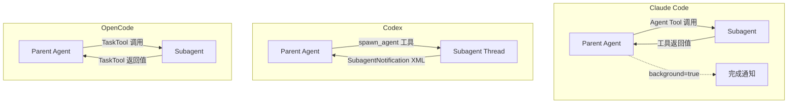

# AI 编码 Agent 多 Agent 机制对比（源码校对版）

> 基于 Claude Code 源码（`src/constants/tools.ts`、`src/coordinator/`）、Agent SDK、Codex（Rust）源码、OpenCode（TypeScript）源码验证。原文描述的是一个微信公众号内容 Pipeline 应用（Strategist/Architect/Scribe），并非 Claude Code 的多 Agent 架构。本文基于三个项目的实际实现重写。

## 三种多 Agent 模型

三个项目的多 Agent 机制设计哲学截然不同：

| 维度 | Claude Code | Codex (Rust) | OpenCode (TypeScript) |
|------|------------|--------------|----------------------|
| Agent 定义 | `AgentDefinition` 配置式 | `spawn_agent` 工具 + 线程模型 | `TaskTool` + Agent 角色系统 |
| 隔离模型 | 独立上下文窗口 | 独立线程 + 子上下文 | 独立 Effect 执行上下文 |
| 通信方式 | 工具返回值 | `SubagentNotification` XML 标签 | `TaskTool` 直接返回 |
| 并发控制 | maxTurns + background 标志 | thread spawn depth limit | Doom Loop 检测（阈值 3） |

---

## 1. Claude Code：Agent 工具 + 配置式定义

### AgentDefinition

Claude Code 通过 `AgentDefinition` 类型定义可复用的 Agent 模板（来自 Agent SDK 类型定义）：

```typescript
type AgentDefinition = {
  description: string;        // 何时使用此 agent
  prompt: string;             // 系统提示
  tools?: string[];           // 允许的工具（缺省继承父级全部工具）
  disallowedTools?: string[]; // 显式禁用的工具
  model?: string;             // 模型选择（'sonnet'|'opus'|'haiku' 或继承）
  skills?: string[];          // 预加载的技能
  initialPrompt?: string;     // 自动提交的首轮提示
  maxTurns?: number;          // 最大 API 轮次
  background?: boolean;       // 后台运行（非阻塞）
  memory?: 'user' | 'project' | 'local'; // 记忆范围
  effort?: 'low' | 'medium' | 'high' | 'xhigh' | 'max' | number;
  permissionMode?: PermissionMode;
  mcpServers?: AgentMcpServerSpec[];
};
```

### 运行时行为

- 子 Agent 有**独立的上下文窗口**，不共享父 Agent 的对话历史
- 结果通过**工具调用的返回值**同步传递
- `background: true` 时非阻塞运行，父 Agent 收到完成通知
- 子 Agent 可以配置独立的 MCP 服务器
- CHANGELOG 确认：修复了"背景子代理在 compaction 后变为不可见"的问题

### 内置 Agent 类型

从 `AgentInfo` 类型可知，Claude Code 支持注册命名 Agent：

```typescript
type AgentInfo = {
  name: string;       // 如 "Explore", "general-purpose"
  description: string;
  model?: string;
};
```

> **源码中不存在** `sessions_spawn()` 函数、"系统事件总线"或 `MemoryShareEvent`。子 Agent 不通过异步事件总线通信。

---

## 2. Codex：线程模型 + spawn_agent

### 线程架构

Codex 使用 ThreadManager 管理 Agent 线程（`codex-rs/core/src/agent/control.rs` + `registry.rs`）：

- 每个 Agent 运行在独立线程中
- `exceeds_thread_spawn_depth_limit` 控制嵌套深度
- `SubagentNotification` 结构体（`codex-rs/core/src/context/subagent_notification.rs`）通过 `<subagent_notification>` XML 标签注入对话上下文

### spawn_agent 工具

在 `multi_agent_v1` 命名空间下（`codex-rs/core/tests/suite/spawn_agent_description.rs`）：

```rust
const SPAWN_AGENT_TOOL_NAME: &str = "spawn_agent";
```

- 子 Agent 通过 `spawn_agent` 工具创建
- 结果通过 `SubagentNotification` XML 标签返回父 Agent
- SQ/EQ 模式（Submission Queue / Event Queue）管理消息流

### 与 Claude Code 的关键差异

| 维度 | Claude Code | Codex |
|------|------------|-------|
| Agent 创建 | 配置式 `AgentDefinition` | 运行时 `spawn_agent` 工具 |
| 结果传递 | 工具返回值 | XML `<subagent_notification>` 标签 |
| 嵌套深度 | 无显式限制（通过 maxTurns 间接控制） | `thread_spawn_depth_limit` 显式限制 |
| 并发模型 | 同步/后台两种模式 | 线程级并发 |

---

## 3. OpenCode：TaskTool + 7 种 Agent 角色

### TaskTool

OpenCode 的多 Agent 通过 `TaskTool` 实现（`packages/opencode/src/tool/task.ts`）：

```typescript
// TaskTool 参数
{
  description: string;
  prompt: string;
  subagent_type?: string;  // Agent 角色类型
  task_id?: string;
}
```

- 子 Agent 结果通过 `TaskTool` 直接返回为工具输出（第 155-166 行）
- 使用 Effect 库管理异步执行

### 7 种 Agent 角色

OpenCode 定义了 7 种内置 Agent 角色（`packages/opencode/src/agent/agent.ts`）：

| 角色 | 用途 |
|------|------|
| `build` | 构建/编译任务 |
| `plan` | 规划和设计 |
| `general` | 通用任务 |
| `explore` | 代码探索 |
| `compaction` | 上下文压缩 |
| `title` | 标题生成 |
| `summary` | 摘要生成 |

### Doom Loop 检测

OpenCode 内置了递归调用保护（`packages/opencode/src/processor.ts`）：

```typescript
const DOOM_LOOP_THRESHOLD = 3;
```

当子 Agent 递归调用超过 3 次时触发保护，防止无限循环。

---

## 4. 通信模式对比



关键差异：
- **Claude Code**：支持后台运行（`background: true`），子 Agent 结果通过通知异步返回
- **Codex**：使用 XML 标签注入上下文，保持对话流的完整性
- **OpenCode**：最简单直接，工具返回值同步传递

---

## 5. Skill 系统

### Claude Code Skills

Skills 是 markdown 格式的指令文件，提供领域特定知识：

- 通过 `AgentDefinition.skills` 字段预加载
- Skills 不是"事件驱动编排器"，而是**指令/知识提供者**
- 编排逻辑在主 Agent 的推理中，不在 Skill 文件中
- 支持 `context: fork` 让子 Agent 继承 Skill 上下文

### Codex Skills

Codex 也有 Skill 系统（`codex-rs/skills/src/lib.rs`），同样是指令/知识提供者。

> **原文错误**：Skills 不是"事件驱动编排规则"。`sessions_spawn()` 函数不存在。子 Agent 结果不通过"系统事件总线"传递。

---

## 6. 设计哲学总结

### Claude Code：配置驱动 + 灵活隔离

- 通过 `AgentDefinition` 声明式定义 Agent
- 独立上下文窗口 + 可配置的工具/模型/权限
- 支持后台运行和完成通知
- 记忆通过文件系统共享（`memory` 字段）

### Codex：线程原生 + 类型安全

- Rust 线程模型提供天然隔离
- `spawn_agent` 工具 + XML 通知的通信模式
- 显式的线程深度限制
- SQ/EQ 模式管理消息流

### OpenCode：简洁直接 + 角色化

- `TaskTool` 一行调用子 Agent
- 7 种内置角色覆盖常见场景
- Doom Loop 检测防止递归失控
- Effect 库管理异步执行

---

> 参考来源：Claude Code Agent SDK 类型定义、Codex `codex-rs/` 完整源码、OpenCode `packages/` 完整源码
