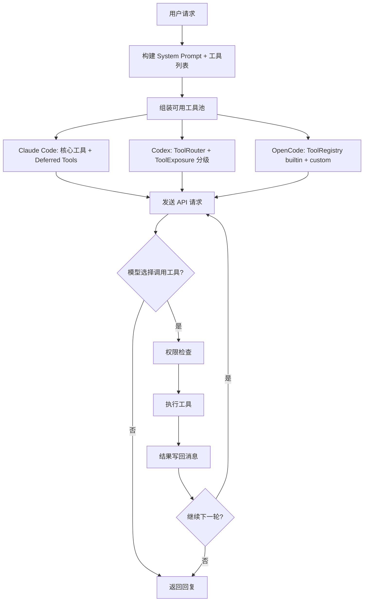

# AI 编码 Agent 工具系统架构对比（源码校对版）

> 基于 Claude Code 源码（`src/Tool.ts`）、Codex（Rust）源码、OpenCode（TypeScript）源码交叉验证。

## 核心观点

工具系统是 AI 编码 Agent 的能力基座。三个项目都采用了**工具定义 → 注册 → 组装 → 权限检查 → 执行**的流程，但具体实现差异显著：

- **Claude Code**：核心工具始终可用，延迟工具通过 ToolSearch 按需加载，权限通过 Permission Mode 控制
- **Codex（Rust）**：基于 Rust trait 的类型安全工具系统，`ToolExecutor` trait + `ToolRouter` 路由，支持模型级并行
- **OpenCode（TypeScript）**：Effect-based 工具系统，`Tool.define()` + `ToolRegistry` 注册，ruleset 权限模型



---

## 1. 工具定义

### Codex：`ToolExecutor` trait

Codex 使用 Rust trait 定义工具接口（`codex-rs/tools/src/tool_executor.rs`）：

```rust
pub trait ToolExecutor: Send + Sync {
    fn tool_name(&self) -> &str;
    fn spec(&self) -> ToolDefinition;
    fn exposure(&self) -> ToolExposure;  // Direct, Deferred, DirectModelOnly, Hidden
    fn supports_parallel_tool_calls(&self) -> bool { false }  // 默认不支持并行
    async fn handle(&self, ...) -> ToolResult;
}
```

工具暴露级别（`ToolExposure`）：
- **Direct** — 始终对模型可见
- **Deferred** — 通过 ToolSearch 按需加载
- **DirectModelOnly** — 仅对模型可见，不在 ToolSearch 中
- **Hidden** — 完全隐藏

### OpenCode：`Tool.define()`

OpenCode 使用 TypeScript 定义工具（`packages/opencode/src/tool/tool.ts`）：

```typescript
// Tool.Def 接口
{
  id: string;
  description: string;
  parameters: Schema;           // Zod schema
  execute: (args, ctx) => Effect;
  formatValidationError?: Function;
}
```

工具通过 `Tool.define()` 创建（第 130 行），权限检查通过 `ctx.ask()` 在 `execute` 函数内部完成，而非独立的 `checkPermissions` 方法。

### Claude Code：`buildTool()` + `Tool` 泛型

Claude Code 使用 TypeScript 泛型定义工具接口（`src/Tool.ts`）：

```typescript
export type Tool<
  Input extends AnyObject = AnyObject,
  Output = unknown,
  P extends ToolProgressData = ToolProgressData,
> = {
  readonly name: string
  readonly inputSchema: Input
  readonly shouldDefer?: boolean      // 延迟加载标记
  readonly alwaysLoad?: boolean       // 跳过延迟加载
  call(args, context, ...): Promise<ToolResult<Output>>
  description(input, options): Promise<string>
  checkPermissions(input, context): Promise<PermissionResult>
  isConcurrencySafe(input): boolean   // 工具级并发安全声明
  isReadOnly(input): boolean          // 只读标记
  isDestructive?(input): boolean      // 不可逆操作标记
  isEnabled(): boolean
  // ... 渲染、权限匹配等方法
}
```

工具通过 `buildTool()` 工厂函数创建（第 783 行），它为可选方法提供安全默认值：

```typescript
const TOOL_DEFAULTS = {
  isEnabled: () => true,
  isConcurrencySafe: () => false,  // 默认不安全（fail-closed）
  isReadOnly: () => false,         // 默认假设有写操作
  isDestructive: () => false,
  checkPermissions: (input) => Promise.resolve({ behavior: 'allow', updatedInput: input }),
}

export function buildTool<D>(def: D): BuiltTool<D> {
  return { ...TOOL_DEFAULTS, userFacingName: () => def.name, ...def }
}
```

延迟加载通过 `shouldDefer` 和 `alwaysLoad` 两个布尔属性控制（不同于 Codex 的 `ToolExposure` 枚举）：
- `shouldDefer: true` — 工具通过 `defer_loading` 发送，需要 ToolSearch 按需加载
- `alwaysLoad: true` — 即使 ToolSearch 启用也始终加载（MCP 工具通过 `_meta['anthropic/alwaysLoad']` 设置）

> **订正**：原文称 `Tool<Input, Output, Progress>`、`buildTool()`、`isConcurrencySafe`、`isReadOnly` 均不存在——实际上全部存在于 `src/Tool.ts`。

---

## 2. 工具注册与组装

### Codex：`ToolRouter`

Codex 使用 `ToolRouter` 管理工具（`codex-rs/core/src/tools/router.rs`）：

- `ToolRouter::from_turn_context()` — 从上下文构建路由器
- `model_visible_specs()` — 返回模型可见的工具 spec 列表
- 工具按 `ToolExposure` 分级，不是通过编译期/运行期/能力检测三级开关

### OpenCode：`ToolRegistry`

OpenCode 使用 `ToolRegistry` 管理工具（`packages/opencode/src/tool/registry.ts`）：

- `InstanceState.make<State>()` — 创建所有内置工具数组
- `ToolRegistry.tools()` — 根据 model/provider 过滤返回可用工具（第 284-323 行）
- 合并 `builtin` 和 `custom`（插件）工具

### Claude Code：Deferred Tool Loading

Claude Code 使用延迟工具加载减少初始 prompt 中的 token：

- 核心工具始终可用
- 延迟工具（WebSearch、WebFetch 等）通过 `defer_loading` 标记
- 用户通过 `ToolSearch` 工具按需加载工具的完整 schema
- MCP 服务器可配置 `alwaysLoad: true` 跳过延迟加载

> **原文错误**：`getAllBaseTools()` 和 `assembleToolPool()` 函数不存在。工具不是"分别排序后拼接以保持 prompt cache 稳定"。

---

## 3. 权限与安全

### Claude Code：Permission Mode + Hooks

Claude Code 使用权限模式控制工具执行：

- 多种 Permission Mode（如 auto 等）
- `PreToolUse` / `PostToolUse` Hook — 在工具执行前后触发
- Hook 可以返回 `approve`、`block`、`defer`（暂停等待用户确认）等决策
- 支持 `"defer"` 权限决策 — headless 会话可以在工具调用时暂停

### Codex：Tool-level + Auto-approve

Codex 的权限检查在 `ToolRouter` 层面进行，支持自动审批和用户确认两种模式。

### OpenCode：Ruleset-based Permission

OpenCode 使用扁平规则集模型（`packages/opencode/src/permission/evaluate.ts`）：

```typescript
// Permission.Ruleset = Array<{permission, pattern, action}>
// evaluate() 使用 findLast 匹配
// action: allow | deny | ask
```

权限流程：agent config rules → user config rules → approval storage → 用户提示。

> **原文错误**："五层纵深防御"（Deny Rules → Tool-level Permissions → Generic Rules → Permission Mode → Auto Classifier）在三个项目中均不存在。实际权限模型比描述的简单得多。

---

## 4. 工具执行

### Codex：`ToolCallRuntime`

Codex 使用 `ToolCallRuntime` 处理工具执行（`codex-rs/core/src/tools/parallel.rs`）：

- 并行执行基于 `model_info.supports_parallel_tool_calls`（模型级能力，非工具级）
- 使用 Tokio tasks 实现并发
- `parallel_execution` RwLock 控制并发访问
- 工具本身不声明是否并发安全，由模型决定是否发送并行工具调用

### OpenCode：Effect-based Execution

OpenCode 使用 Effect 库处理工具执行，支持流式处理和错误管理。

### Claude Code：`StreamingToolExecutor` 流式执行

Claude Code 使用 `StreamingToolExecutor`（`src/services/tools/StreamingToolExecutor.ts`）实现边流式边执行：

- API 响应还在流入时就开始执行已到达的工具调用
- `isConcurrencySafe` 为 `true` 的工具可以与其他并发安全工具并行执行
- 非并发安全的工具独占执行（exclusive access）
- 结果按工具接收顺序缓冲输出
- Bash 工具错误时通过 `siblingAbortController` 终止兄弟子进程

```typescript
export class StreamingToolExecutor {
  // 并发安全工具并行执行，非安全工具独占
  addTool(block: ToolUseBlock, assistantMessage: AssistantMessage): void
  getRemainingResults(): AsyncGenerator<MessageUpdate>
}
```

> **订正**：原文称 `StreamingToolExecutor` 不存在——实际上存在于 `src/services/tools/StreamingToolExecutor.ts`（第 40 行）。Claude Code 的并行策略是**工具级** `isConcurrencySafe` 属性（默认 `false`，fail-closed），而非纯模型级决定。

---

## 5. 工具结果处理

### 结果截断

- **Claude Code**：工具输出最大约 32MB，超过时截断。特定工具有独立限制（如 git status 超过 2000 字符截断）
- **Codex**：通过 MCP 协议处理
- **OpenCode**：通过 MCP 协议处理

### 结果写回

三个项目都将工具结果作为消息的一部分写回对话上下文，供下一轮模型调用参考。

---

## 6. 并排对比

| 维度 | Claude Code | Codex (Rust) | OpenCode (TypeScript) |
|------|------------|--------------|----------------------|
| 工具定义 | `Tool<I,O,P>` 泛型 + `buildTool()` | `ToolExecutor` trait | `Tool.define()` + Zod |
| 注册机制 | 内置 + `shouldDefer`/`alwaysLoad` | `ToolRouter` + `ToolExposure` | `ToolRegistry` + builtin/custom |
| 延迟加载 | ToolSearch + `defer_loading` | `Deferred` exposure level | 无 |
| 权限模型 | Permission Mode + Hooks | Tool-level + Auto-approve | Ruleset-based `evaluate()` |
| 并行执行 | `StreamingToolExecutor` + 工具级 `isConcurrencySafe` | 模型级 `supports_parallel_tool_calls` | Effect-based 并发 |
| MCP 支持 | 原生支持 + `alwaysLoad` | 原生支持 | 原生支持 |
| 安全原则 | fail-closed + hook 审批 | fail-closed | ruleset 默认 ask |

---

## 7. 设计哲学对比

### Claude Code：实用主义

- `buildTool()` 工厂函数 + `TOOL_DEFAULTS` 安全默认值，工具定义简洁一致
- `isConcurrencySafe` / `isReadOnly` / `isDestructive` 工具级属性，fail-closed 设计
- `StreamingToolExecutor` 实现边流式边执行，工具级并发控制
- 延迟加载通过 `shouldDefer` / `alwaysLoad` 布尔属性控制，不需要复杂的曝光枚举
- 权限通过 Hook 系统灵活控制，支持 PreToolUse / PostToolUse 钩子

### Codex：类型安全 + Rust 原生

- Trait-based 多态，编译期保证工具接口一致性
- `ToolExposure` 四级分类精确控制工具可见性
- 模型级并行决策，工具无需自行声明并发安全性
- Extension API 和 Core API 两套并行实现

### OpenCode：Effect + 简洁

- `Tool.define()` 一行定义工具
- 权限在 `execute` 内部通过 `ctx.ask()` 请求
- 没有延迟加载，所有工具始终可用
- 依赖 Effect 库的流式处理能力

---

> 参考来源：Claude Code 源码（`src/Tool.ts`、`src/services/tools/StreamingToolExecutor.ts`、`src/constants/tools.ts`）、Codex `codex-rs/` 完整源码、OpenCode `packages/` 完整源码
>
> [1]: 原文引用的腾讯新闻文章中关于工具系统的描述基于推测，本文已全部用源码验证后的信息替换。
