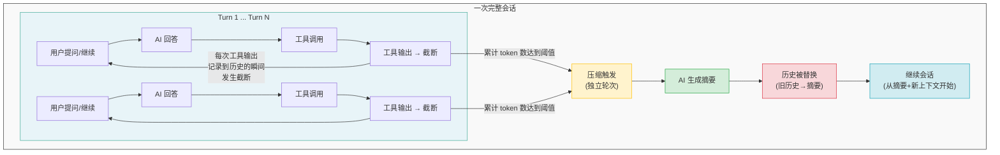

# 长上下文压缩时工具调用输出策略分析

> 分析对象：Claude Code、OpenCode、Codex (OpenAI)
> 分析日期：2026-05-10

---

## 概述

当 AI 编码工具的对话上下文接近模型上下文窗口限制时，会触发**上下文压缩（Compaction）**。压缩的核心矛盾是：工具调用输出（文件内容、命令执行结果、搜索结果等）通常占用大量 token，但在压缩时需要决定是保留、截断还是完全丢弃。本文档分析三个主流工具在此场景下的不同策略。

---

## 1. Claude Code

### 核心文件

- `src/services/compact/compact.ts` - 压缩主逻辑
- `src/services/compact/prompt.ts` - 压缩 Prompt 模板

### 策略：AI 智能提取 + 关键上下文重建

#### 工具输出处理方式

**原始工具输出完全不被保留在摘要中。** Claude Code 将整个历史（包含所有工具调用和输出）发送给 AI（通过 forked-agent 或流式路径），由 AI 生成结构化的 conversation summary。生成的摘要中只保留关键信息（文件路径、代码片段、错误信息等），原始工具输出整体被丢弃。

#### 压缩后上下文恢复机制

压缩后通过附件机制重新注入关键上下文：

1. **文件附件**（`createPostCompactFileAttachments`）
   - 重新读取最近访问的文件（最多 5 个）
   - 每个文件最多 5000 token，总预算 50000 token
   - 通过 `FileReadTool` 重新获取文件内容，避免模型重新读取文件

2. **Skill 附件**（`createSkillAttachmentIfNeeded`）
   - 对已调用的 skill 文件进行逐个截断
   - 每个 skill 最多 5000 token，总预算 25000 token
   - 保留头部内容（setup/usage 指令通常在文件头部）

3. **工具重新宣告**（`getDeferredToolsDeltaAttachment`）
   - 重新发送完整的工具 schema
   - 重新发送 MCP 指令、Agent 列表等

4. **计划文件**（`createPlanAttachmentIfNeeded`）
   - 如果有 plan 文件则重新注入

5. **异步 Agent 附件**（`createAsyncAgentAttachmentsIfNeeded`）
   - 保留仍在运行的异步 Agent 状态
   - 避免模型重复创建相同 Agent

#### Prompt 设计

[compact.ts](file:///home/wunai/Disks/Data/my-project/project-for-reference/claude-code-src/src/services/compact/prompt.ts) 中的总结 Prompt 要求 AI 输出 9 段结构：

1. Primary Request and Intent
2. Key Technical Concepts
3. **Files and Code Sections**（明确要求包含完整代码片段）
4. **Errors and fixes**
5. Problem Solving
6. **All user messages**（非工具结果的用户消息）
7. Pending Tasks
8. Current Work
9. Optional Next Step（要求使用原文引用）

#### 关键特性

- **Prompt Cache 共享**：使用 forked-agent 复用主对话的 prompt cache（system prompt、tools、消息前缀），降低压缩成本
- **PTL 重试**：当压缩请求本身超过 prompt 限制时，逐步丢弃最老的 API-round group 并重试（最多 3 次）
- **流式重试**：可选的流式压缩重试机制（最多 2 次）

---

## 2. OpenCode

### 核心文件

- `packages/opencode/src/session/compaction.ts` - 压缩主逻辑
- `packages/opencode/src/session/message-v2.ts` - 消息转换与截断
- `packages/opencode/src/agent/prompt/compaction.txt` - 压缩 Prompt 模板

### 策略：AI 总结 + 工具输出截断（保留头部）

#### 工具输出处理方式

在压缩过程中，将工具输出**截断到最多 2000 字符**：

```typescript
// compaction.ts:38
const TOOL_OUTPUT_MAX_CHARS = 2_000
```

转换为模型消息时调用 `truncateToolOutput`：

```typescript
// message-v2.ts:326-330
function truncateToolOutput(text: string, maxChars?: number) {
  if (!maxChars || text.length <= maxChars) return text
  const omitted = text.length - maxChars
  return `${text.slice(0, maxChars)}\n[Tool output truncated for compaction: omitted ${omitted} chars]`
}
```

**截断策略**：保留头部，添加截断标记告知模型省略了多少字符。

#### Pruning 机制

OpenCode 实现了独立的**渐进式工具输出清理机制**（`compaction.ts:300-344`）：

1. **触发条件**：当对话历史中工具输出总 token 数超过阈值时
2. **工作方式**：
   - 从后向前遍历消息，累计最近 2 轮对话之前的工具调用输出
   - 保护 `skill` 工具不被裁剪
   - 当超过 `PRUNE_PROTECT`（40000 token）阈值时，将旧的工具输出标记为已压缩
3. **清理效果**：被标记的工具输出在下次转换为模型消息时被替换为 `[Old tool result content cleared]`
4. **执行阈值**：只有裁剪量超过 `PRUNE_MINIMUM`（20000 token）时才真正执行

```typescript
// compaction.ts:36-39
export const PRUNE_MINIMUM = 20_000
export const PRUNE_PROTECT = 40_000
const PRUNE_PROTECTED_TOOLS = ["skill"]
```

#### Tail 保留策略

保留最近 N 轮完整对话不被压缩：

- 默认保留最近 **2 轮**（`DEFAULT_TAIL_TURNS = 2`）
- 保留预算为上下文可用量的 **25%**（2000-8000 token 之间）
- 如果单轮超过预算，会在轮内进一步截断

#### Prompt 设计

[compaction.txt](file:///home/wunai/Disks/Data/my-project/project-for-reference/opencode/packages/opencode/src/agent/prompt/compaction.txt) 要求输出 7 段锚定摘要结构：

| 段落 | 内容 |
|------|------|
| Goal | 任务目标（单句） |
| Constraints & Preferences | 用户约束、偏好、规范 |
| Progress | 已完成 / 进行中 / 阻塞 |
| Key Decisions | 关键决策及原因 |
| Next Steps | 下一步行动 |
| Critical Context | 重要技术事实、错误、开放问题 |
| Relevant Files | 相关文件或目录及原因 |

要求使用简洁的 bullet 形式，保留精确的文件路径、命令、错误字符串和标识符。

#### 关键特性

- **可配置**：`cfg.compaction?.prune` 可开关 pruning，`cfg.compaction?.preserve_recent_tokens` 可自定义保留 token 数
- **增量摘要**：支持更新已存在的 anchored summary，保留仍为真的细节，移除过时信息
- **自动继续**：压缩完成后可自动发送继续消息，无需用户干预

---

## 3. Codex (OpenAI)

### 核心文件

- `codex-rs/core/src/compact.rs` - Inline 压缩逻辑
- `codex-rs/core/src/compact_remote.rs` - Remote 压缩逻辑
- `codex-rs/core/templates/compact/prompt.md` - 压缩 Prompt 模板
- `codex-rs/utils/output-truncation/src/lib.rs` - 输出截断工具
- `codex-rs/utils/string/src/truncate.rs` - 中间截断实现
- `codex-rs/core/src/context_manager/history.rs` - 上下文管理器

### 策略：AI 总结 + 历史裁剪 + 选择性保留

Codex 支持两种压缩模式：

#### Inline 压缩（本地 AI 总结）

1. **整个历史发送给 AI**：包含所有工具调用和输出
2. **用户消息选取**：从后向前选取用户消息，按 token 预算截断
   - 最大 **20000 token**（`COMPACT_USER_MESSAGE_MAX_TOKENS = 20_000`）
   - 超出时使用 `truncate_text` 函数

3. **截断策略**：采用**中间截断（truncate middle）**——保留头部和尾部，省略中间内容
   ```rust
   // 保留开头和结尾，中间用省略号替代
   truncate_middle_with_token_budget(content, tokens)
   ```

4. **格式化截断**：添加总行数前缀告知模型
   ```rust
   fn formatted_truncate_text(content: &str, policy: TruncationPolicy) -> String {
       let total_lines = content.lines().count();
       let result = truncate_text(content, policy);
       format!("Total output lines: {total_lines}\n\n{result}")
   }
   ```

5. **上下文窗口超限处理**：当压缩请求本身超过窗口时，从**头部**移除最老的历史项（保留最近消息和 cache 前缀）

#### Remote 压缩（服务端压缩）

1. **调用 OpenAI `/compact` 端点**，由服务端完成压缩
2. **压缩前裁剪**（`trim_function_call_history_to_fit_context_window`）：
   - 如果历史超出上下文窗口，从**尾部**开始删除 Codex 自动生成的工具项
   - 保留用户消息不被删除
3. **压缩后过滤**（`should_keep_compacted_history_item`）：

   | 保留的项目 | 删除的项目 |
   |-----------|-----------|
   | `assistant` 消息 | `developer` 消息 |
   | `user` 消息 | 非用户内容的 `user` 消息 |
   | `Compaction` / `ContextCompaction` 项 | `FunctionCall` |
   | | `FunctionCallOutput` |
   | | `LocalShellCall` |
   | | `ToolSearchCall` |
   | | `WebSearchCall` |
   | | `ImageGenerationCall` |

   **即远程压缩后的历史中不含任何原始工具调用/输出**，只保留 AI 生成的摘要和压缩标记。

#### Prompt 设计

[prompt.md](file:///home/wunai/Disks/Data/my-project/project-for-reference/codex/codex-rs/core/templates/compact/prompt.md) 要求简洁结构：

```
You are performing a CONTEXT CHECKPOINT COMPACTION. Create a handoff summary for another LLM that will resume the task.

Include:
- Current progress and key decisions made
- Important context, constraints, or user preferences
- What remains to be done (clear next steps)
- Any critical data, examples, or references needed to continue
```

[summary_prefix.md](file:///home/wunai/Disks/Data/my-project/project-for-reference/codex/codex-rs/core/templates/compact/summary_prefix.md) 用于告知模型如何使用历史摘要：

```
Another language model started to solve this problem and produced a summary of its thinking process.
You also have access to the state of the tools that were used by that language model.
```

#### 关键特性

- **两种压缩模式**：Inline（本地 AI）和 Remote（服务端），根据 provider 能力自动选择
- **Hook 系统**：支持 PreCompact 和 PostCompact hooks，可在压缩前后执行自定义逻辑
- **初始上下文注入**：压缩后可选择重新注入初始上下文（system prompt、工具定义等）
- **Analytics 集成**：详细的压缩分析事件，记录压缩前后 token 变化、耗时、状态等

---

## 总体压缩策略：完整输入全景

压缩时发送给 AI 模型的输入包含多个层面的内容。以下是三个工具的具体处理方式：

### Claude Code 压缩输入构成

**压缩前的输入构建流程**：

```
压缩触发 → stripImagesFromMessages → stripReinjectedAttachments
         → getMessagesAfterCompactBoundary → normalizeMessagesForAPI → messagesToSummarize
```

#### 包含的内容

| 类别 | 处理方式 | 说明 |
|------|---------|------|
| **System Prompt** | ✅ 完整包含 | 通过 forked-agent 复用主对话的 system prompt prompt cache |
| **工具定义（Tools）** | ✅ 完整包含 | 通过 forked-agent 复用，所有内置工具 + MCP 工具 schema |
| **用户消息** | ✅ 完整包含 | 所有用户输入的原始文本（通过 `messagesToSummarize` 提取） |
| **工具调用** | ✅ 完整包含 | 所有 tool_use 消息（调用名、参数） |
| **工具输出** | ✅ 完整包含（原始） | 所有 tool_result 的原始内容，包括：文件读取结果、命令执行输出、搜索结果、MCP 工具结果等 |
| **Skill 内容** | ✅ 作为工具输出包含 | Skill 文件内容通过 FileReadTool 结果包含 |
| **MCP 指令** | ✅ 作为工具输出包含 | MCP 工具的调用结果包含在历史中 |
| **代码编辑** | ✅ 作为工具输出包含 | FileEditTool、FileWriteTool 的结果包含在历史中 |
| **内建工具信息** | ✅ 完整包含 | Bash、Grep、Glob 等内建工具的定义和调用结果 |
| **Session Memory** | ⚠️ 特殊处理 | 通过 `SessionMemoryCompact` 独立压缩后作为一条消息注入 |
| **图片** | ❌ 剥离 | `stripImagesFromMessages` 移除所有 image_block |
| **已重新注入的附件** | ❌ 剥离 | `stripReinjectedAttachments` 移除之前压缩周期中重新注入的附件 |

#### Session Memory 特殊处理

Claude Code 的 `SessionMemoryCompact` 对记忆进行独立压缩：
1. 提取所有 `session_memory` / `session_memory_reference` 工具结果
2. 构建独立的 memory-only 摘要 prompt
3. 调用 LLM 生成 `<analysis>` + `<summary>` 结构
4. 将摘要作为一条压缩后消息注入主压缩流程

#### 压缩后重新注入的内容

| 类别 | 重新注入方式 | Token 预算 |
|------|-------------|-----------|
| 最近访问的文件 | `createPostCompactFileAttachments` 重新读取 | 5 文件 × 5000 token = 25000 |
| 已调用 Skill 文件 | `createSkillAttachmentIfNeeded` 头部截断 | 总预算 25000，每文件 5000 |
| 工具 Schema | `getDeferredToolsDeltaAttachment` 完整重新宣告 | 无限制 |
| MCP 指令 | `getDeferredToolsDeltaAttachment` 完整重新注入 | 无限制 |
| Agent 列表 | `getDeferredToolsDeltaAttachment` 完整重新注入 | 无限制 |
| Plan 文件 | `createPlanAttachmentIfNeeded` 重新读取 | 无限制 |
| 异步 Agent 状态 | `createAsyncAgentAttachmentsIfNeeded` | 无限制 |

---

### OpenCode 压缩输入构成

**压缩前的输入构建流程**：

```
压缩触发 → select(head+tail) → toModelMessagesEffect
         → 截断工具输出 → 构建 ModelMessage[] → 发送给 AI
```

#### 包含的内容

| 类别 | 处理方式 | 说明 |
|------|---------|------|
| **System Prompt** | ✅ 包含 | 作为 developer role 消息（`role: "developer", content: [{type:"text", text: system}]`） |
| **工具定义（Tools）** | ✅ 完整包含 | `cfg.tool` 中的所有工具 schema |
| **用户消息** | ✅ 完整包含 | 所有非 compaction 类型的用户消息 |
| **工具调用** | ✅ 完整包含 | `tool_use` part 保持原样 |
| **工具输出** | ⚠️ 截断到 2000 字符 | `truncateToolOutput` 保留头部，添加截断标记 |
| **Skill 内容** | ✅ 包含（不被 pruning 保护） | Skill 工具输出不被 pruning 机制裁剪 |
| **MCP 工具** | ⚠️ 截断到 2000 字符 | 与其他工具输出同等对待 |
| **代码编辑** | ⚠️ 截断到 2000 字符 | 编辑结果截断，只保留头部 |
| **历史 Compaction 摘要** | ✅ 包含 | 已有的 anchored summary 作为上下文 |
| **图片** | ✅ 保留 | 无图片剥离逻辑 |

#### Head + Tail 选择策略

OpenCode 的 `select` 函数将消息分为两部分：

1. **Head（历史部分）**：
   - 排除 Tail 和最近 compaction 部分
   - 可能包含多条用户消息和工具调用
   - 如果总 token 数不足（< headTurns×350），直接取所有消息

2. **Tail（最近部分）**：
   - 保留最近 N 轮完整对话（`DEFAULT_TAIL_TURNS = 2`）
   - 预算为 `preserveRecentBudget`（上下文可用量的 25%，2000-8000 token）
   - 如果单轮超过预算，在轮内截断

#### 压缩后重新注入的内容

| 类别 | 重新注入方式 | 说明 |
|------|-------------|------|
| AI 生成的摘要 | 作为 `type: "compaction"` 消息注入 | 7 段结构摘要 |
| 继续消息 | `cfg.compaction?.autoContinue` | 可选的自动继续消息 |

OpenCode **不会**在压缩后重新读取文件或重新注入工具定义。

---

### Codex 压缩输入构成

**压缩前的输入构建流程（Inline）**：

```
压缩触发 → contextManager.history.for_prompt()
         → collect_user_messages() → content_items_to_text()
         → 构建 summary_text → 发送压缩请求
```

**压缩前的输入构建流程（每轮正常对话）**：

```
build_initial_context() → contextManager.record_items() → for_prompt()
```

#### 正常对话轮次（非压缩时）的输入构成

Codex 每轮对话的初始上下文通过 `build_initial_context` 构建：

| 类别 | 处理方式 | 说明 |
|------|---------|------|
| **Developer 消息** | ✅ 动态构建 | 包含多个子模块，作为 `developer` role 消息 |
| - 权限指令 | ✅ 包含 | 从 `PermissionProfile` 生成 |
| - 开发者指令 | ✅ 包含 | 自定义 developer instructions |
| - 记忆工具指令 | ✅ 条件包含 | 启用 MemoryTool 时包含 |
| - 协作模式指令 | ✅ 条件包含 | 从 `CollaborationMode` 生成 |
| - 实时配置更新 | ✅ 包含 | 模型参数变更通知 |
| - 个性指令 | ✅ 条件包含 | 启用 Personality 时包含 |
| - MCP/Apps 指令 | ✅ 条件包含 | 连接器（Connectors）的可用工具描述 |
| - Skill 指令 | ✅ 条件包含 | 可用 Skill 列表和说明 |
| - 插件指令 | ✅ 包含 | 已加载插件的能力摘要 |
| - Git 提交指令 | ✅ 条件包含 | 启用 CodexGitCommit 时包含 |
| - Guardian 策略 | ✅ 单独注入 | Guardian subagent 的独立 developer 消息 |
| **Contextual User 消息** | ✅ 条件包含 | 用户自定义指令 + 环境上下文 |
| **用户指令** | ✅ 包含 | 从 `user_instructions` 生成 |
| **环境上下文** | ✅ 条件包含 | Shell 信息 + 子 Agent 状态 |

#### 压缩时的输入构成

**Inline 压缩**：

| 类别 | 处理方式 | 说明 |
|------|---------|------|
| **初始上下文** | ❌ 不包含 | 不包含 developer messages |
| **历史项目** | ✅ 经过 `for_prompt()` 处理 | 过滤掉 `is_api_message=false` 的项目 |
| **用户消息** | ✅ 从后向前选取 | 非摘要类型的用户消息 |
| **工具调用** | ✅ 包含 | `FunctionCall`、`LocalShellCall` 等 |
| **工具输出** | ✅ 包含（已截断） | 日常记录时已通过 `TruncationPolicy` 截断 |
| **Compaction 摘要** | ✅ 包含 | 历史压缩摘要 |
| **Token 预算** | 20000 token | `COMPACT_USER_MESSAGE_MAX_TOKENS` |

**Remote 压缩**：

| 类别 | 处理方式 | 说明 |
|------|---------|------|
| **整个历史** | ✅ 发送给 `/compact` 端点 | 由 OpenAI 服务端处理 |
| **压缩前裁剪** | ✅ 删除尾部工具项 | `trim_function_call_history_to_fit_context_window` |
| **用户消息保护** | ✅ 不被删除 | 只删除 Codex 自动生成的工具项 |

#### 压缩后重新注入的内容

| 类别 | 重新注入方式 | 说明 |
|------|-------------|------|
| AI 摘要 | 作为 `ContextCompaction` 项 | 压缩后历史中的唯一摘要项 |
| 初始上下文 | `insert_initial_context_before_last_real_user_or_summary` | 可选，重新注入 developer/user 指令等 |
| Compaction Prefix | 添加到摘要前面 | `summary_prefix.md` 内容 |

Codex **不会**在压缩后重新读取文件或重新注入工具定义（除非显式启用初始上下文注入）。

---

## 对比总结

### 完整压缩输入对比

| 维度 | Claude Code | OpenCode | Codex |
|------|-------------|----------|-------|
| **System Prompt 处理** | forked-agent 复用 cache | developer role 消息 | 正常轮次：developer 消息；压缩时：不包含 |
| **工具定义（Schema）** | forked-agent 复用 | 完整包含 | 正常轮次：包含；压缩时：不包含 |
| **用户消息** | ✅ 完整 | ✅ 完整 | ✅ 完整（20000 token 预算） |
| **工具调用（call）** | ✅ 完整 | ✅ 完整 | ✅ 完整 |
| **工具输出（result）** | ✅ 完整（原始） | ⚠️ 截断到 2000 字符 | ✅ 包含（日常已截断） |
| **Skill 内容** | ✅ 完整 + 独立压缩 | ✅ 完整（不被 pruning） | ✅ 作为 Skill 指令 + 工具输出 |
| **MCP 工具** | ✅ 完整 | ⚠️ 截断 | ✅ 作为 Apps 指令 + 工具输出 |
| **代码编辑结果** | ✅ 完整 | ⚠️ 截断 | ✅ 包含（日常已截断） |
| **Session Memory** | ✅ 独立压缩后注入 | ❌ | ❌ |
| **历史 Compaction 摘要** | ✅ 包含 | ✅ 包含 | ✅ 包含 |
| **图片** | ❌ 剥离 | ✅ 保留 | ⚠️ 不支持时剥离 |
| **已重新注入的附件** | ❌ 剥离 | N/A | N/A |

### 压缩后上下文恢复对比

| 维度 | Claude Code | OpenCode | Codex |
|------|-------------|----------|-------|
| **文件内容恢复** | ✅ 重新读取最近访问文件（5个） | ❌ | ❌（可选初始上下文注入） |
| **工具 Schema 重新注入** | ✅ 完整重新宣告 | ❌ | ⚠️ 部分（初始上下文注入） |
| **Skill 内容恢复** | ✅ 单独截断注入 | ❌ | ❌ |
| **MCP 指令恢复** | ✅ 完整重新注入 | ❌ | ⚠️ 部分 |
| **异步 Agent 状态** | ✅ 保留 | ❌ | ❌ |
| **Plan 文件** | ✅ 重新注入 | ❌ | ❌ |
| **Session Memory** | ✅ 独立摘要保留 | ❌ | ❌ |

---

## 核心概念解析

### 截断（Truncation） vs 压缩（Compaction）

这是两个不同层面的操作：

#### 截断（Truncation）

**定义**：对单个工具输出或文本内容进行长度限制，保留部分内容，丢弃超出部分。

**目的**：控制单个工具输出的 token 消耗，防止一次工具调用的输出就占满上下文窗口。

**发生时机**：
1. **日常会话中**：每次工具调用结果被记录到历史时，都会应用 `TruncationPolicy`。Codex 在 `ContextManager::record_items` 中（[history.rs:99-113](file:///home/wunai/Disks/Data/my-project/project-for-reference/codex/codex-rs/core/src/context_manager/history.rs#L99-L113)），每条 `FunctionCallOutput` 都会经过 `process_item` 处理，使用 `truncate_text` 按策略截断。
2. **压缩过程中**：当压缩请求本身超过上下文窗口时，会对历史内容进行截断以适配窗口限制。

**截断策略**：
- **头部截断**：只保留开头部分（OpenCode 使用，`text.slice(0, maxChars)`）
- **中间截断**：保留开头和结尾，省略中间（Codex 默认使用，`truncate_middle_with_token_budget`）
- **按字节/按 token**：`TruncationPolicy::Bytes(bytes)` 或 `TruncationPolicy::Tokens(tokens)`

**特点**：
- 是**局部的、机械的操作**，不涉及 AI 智能判断
- 只是简单地切掉部分内容
- 保留的内容是原始数据的子集
- 发生在**数据写入历史的瞬间**

#### 压缩（Compaction）

**定义**：对整个对话历史进行智能总结，生成一个摘要来替代大段历史。

**目的**：当对话历史总 token 数接近模型上下文窗口时，将旧的历史替换为简短的摘要，释放上下文空间。

**发生时机**：
1. **自动触发**：当会话 token 数达到配置阈值时自动触发（如 Codex 的 context window exceeded 事件）
2. **手动触发**：用户主动执行压缩命令

**压缩流程**：
1. 将整个历史（可能包含截断过的工具输出）发送给一个 AI 模型
2. AI 按照预定义的模板生成结构化摘要
3. 用摘要替代原始历史
4. 重新开始新的对话轮次

**特点**：
- 是**全局的、智能的操作**，依赖 AI 的理解和总结能力
- 生成的摘要是重新组织的内容，不是原始数据的子集
- 发生在**会话的特定时间点**（一个独立的操作轮次）

### 一次会话周期中的发生位置



**关键区别**：

| 维度 | 截断（Truncation） | 压缩（Compaction） |
|------|-------------------|-------------------|
| **操作层面** | 单个工具输出/文本 | 整个对话历史 |
| **智能程度** | 机械的（切掉多余部分） | 智能的（AI 理解和总结） |
| **发生频率** | 每次工具调用都可能发生 | 偶尔发生（达到阈值时） |
| **发生位置** | `ContextManager::record_items` / `MessageV2.toModelMessagesEffect` | 独立的压缩轮次（compact turn） |
| **输出结果** | 原始数据的子集 | 重新生成的摘要 |
| **可逆性** | 不可逆（被截掉的内容丢失） | 不可逆（原始历史被替代） |
| **触发条件** | 单个输出超过长度限制 | 总历史超过上下文窗口阈值 |
| **Codex 实现** | [history.rs:372-406](file:///home/wunai/Disks/Data/my-project/project-for-reference/codex/codex-rs/core/src/context_manager/history.rs#L372-L406) `process_item` | [compact.rs](file:///home/wunai/Disks/Data/my-project/project-for-reference/codex/codex-rs/core/src/compact.rs) `run_compact_task_inner` |
| **OpenCode 实现** | [message-v2.ts:326-330](file:///home/wunai/Disks/Data/my-project/project-for-reference/opencode/packages/opencode/src/session/message-v2.ts#L326-L330) `truncateToolOutput` | [compaction.ts](file:///home/wunai/Disks/Data/my-project/project-for-reference/opencode/packages/opencode/src/session/compaction.ts) `processCompaction` |

---

## 对比总结

### 工具输出处理方式

| 维度 | Claude Code | OpenCode | Codex |
|------|-------------|----------|-------|
| **压缩时工具输出处理** | AI 提取关键信息后丢弃 | 截断到 2000 字符（保留头部） | AI 提取后丢弃 |
| **压缩后是否保留原始工具输出** | ❌ 完全丢弃 | ⚠️ 截断保留头部 | ❌ 完全丢弃 |
| **日常截断策略** | N/A | 头部截断 | 中间截断（保留头尾） |
| **日常截断阈值** | N/A | 2000 字符（仅压缩时） | TruncationPolicy（每次工具调用） |
| **中间截断实现** | N/A | N/A | `truncate_middle_with_token_budget` |

### 上下文恢复机制

| 维度 | Claude Code | OpenCode | Codex |
|------|-------------|----------|-------|
| **文件内容恢复** | ✅ 重新读取最近访问文件 | ❌ | ❌ |
| **工具 Schema 重新注入** | ✅ 完整重新宣告 | ❌ | ⚠️ 部分（初始上下文注入） |
| **Skill/记忆保护** | ✅ 单独截断注入 | ✅ 不被 pruning | ❌ |
| **异步 Agent 状态** | ✅ 保留 | ❌ | ❌ |
| **Plan 文件** | ✅ 重新注入 | ❌ | ❌ |

### 渐进式清理

| 维度 | Claude Code | OpenCode | Codex |
|------|-------------|----------|-------|
| **独立 Pruning 机制** | ❌ | ✅ 超过 40K token 触发 | ✅ Remote 压缩前从尾部删除 |
| **Pruning 保护对象** | N/A | skill 工具 | 用户消息 |
| **Pruning 阈值** | N/A | 20000 token 最小清理量 | 上下文窗口大小 |

### 总结模板对比

| 维度 | Claude Code | OpenCode | Codex |
|------|-------------|----------|-------|
| **模板复杂度** | 高（9 段结构） | 中（7 段结构） | 低（4 要点） |
| **是否包含代码片段** | ✅ 明确要求 | ⚠️ 保留路径/标识符 | ❌ 不要求 |
| **是否包含用户消息** | ✅ 列出所有 | ❌ | ❌ |
| **是否保留错误信息** | ✅ 错误和修复 | ✅ Critical Context | ⚠️ 隐含在 progress 中 |
| **分析草稿** | ✅ `<analysis>` 标签 | ❌ | ❌ |

### 设计哲学差异

- **Claude Code**：**完整性优先**。通过附件机制尽可能恢复压缩前的上下文状态，牺牲一定成本换取模型在压缩后的完整能力。

- **OpenCode**：**折中策略**。截断工具输出保留头部（通常包含最关键的信息），同时实现独立 pruning 机制在对话中渐进式清理，平衡上下文质量和成本。

- **Codex**：**简洁优先**。完全依赖 AI 摘要能力，压缩后不保留任何原始工具输出，通过服务端 remote compact 获得更高质量的摘要。日常会话中使用中间截断保留工具输出的头尾关键信息。

---

## Codex 为什么压缩后不保留原始工具输出？

Codex 压缩后不保留原始工具输出的原因可以从代码注释和设计逻辑中推断：

1. **Remote 压缩的模型训练考虑**：`should_keep_compacted_history_item` 函数（[compact_remote.rs:292-316](file:///home/wunai/Disks/Data/my-project/project-for-reference/codex/codex-rs/core/src/compact_remote.rs#L292-L316)）明确注释说明保留 `assistant` 消息是因为 "future remote compaction models may emit them"，表明这是一个面向模型训练的设计。

2. **避免冗余和过时信息**：注释提到删除 `developer` 消息是因为 "remote output can include stale/duplicated instruction content"。工具输出在压缩后通常已过时，保留摘要更简洁。

3. **上下文窗口效率**：原始工具输出（如 `FunctionCallOutput`、`LocalShellCall`）通常非常大，完全删除可以最大化释放上下文空间。

4. **依赖服务端压缩能力**：Codex 默认假设 OpenAI 的 `/compact` 端点已经生成了高质量摘要，不需要保留原始数据。

5. **初始上下文重新注入**：压缩后通过 `insert_initial_context_before_last_real_user_or_summary` 重新注入 system prompt、工具定义等关键上下文，弥补原始数据丢失。

### Codex 中间截断 vs 头部截断

Codex 在日常会话中使用**中间截断**，在压缩时也使用中间截断：

```rust
// truncate.rs:126-129
fn split_budget(budget: usize) -> (usize, usize) {
    let left = budget / 2;
    (left, budget - left)
}
```

**中间截断的优势**：
- 保留开头：通常是命令的开头、文件头、错误信息的类型
- 保留结尾：通常是命令的输出结果、文件尾部、错误的具体行号
- 省略中间：通常是最冗长但不太关键的部分（如大文件的中间代码块）

**与头部截断的对比**：
- OpenCode 的头部截断只保留开头，适合工具输出的开头包含最关键信息的情况
- Codex 的中间截断更适合一般文本，因为结尾信息往往也很重要

---

## 附录：关键代码位置索引

### Claude Code

| 功能 | 文件 | 行号 |
|------|------|------|
| 压缩主函数 | `src/services/compact/compact.ts` | `compactConversation` |
| 部分压缩 | `src/services/compact/compact.ts` | `partialCompactConversation` |
| 文件附件生成 | `src/services/compact/compact.ts` | `createPostCompactFileAttachments` |
| Skill 附件生成 | `src/services/compact/compact.ts` | `createSkillAttachmentIfNeeded` |
| 压缩 Prompt | `src/services/compact/prompt.ts` | `getCompactPrompt` |
| 图片剥离 | `src/services/compact/compact.ts` | `stripImagesFromMessages` |
| PTL 重试 | `src/services/compact/compact.ts` | `truncateHeadForPTLRetry` |

### OpenCode

| 功能 | 文件 | 行号 |
|------|------|------|
| 压缩主逻辑 | `packages/opencode/src/session/compaction.ts` | `processCompaction` |
| Pruning 机制 | `packages/opencode/src/session/compaction.ts` | `prune` |
| 工具输出截断 | `packages/opencode/src/session/message-v2.ts` | `truncateToolOutput` |
| Tail 选择 | `packages/opencode/src/session/compaction.ts` | `select` |
| 压缩 Prompt | `packages/opencode/src/agent/prompt/compaction.txt` | 全文 |
| Token 预算计算 | `packages/opencode/src/session/compaction.ts` | `preserveRecentBudget` |

### Codex

| 功能 | 文件 | 行号 |
|------|------|------|
| Inline 压缩 | `codex-rs/core/src/compact.rs` | `run_inline_auto_compact_task` |
| Remote 压缩 | `codex-rs/core/src/compact_remote.rs` | `run_inline_remote_auto_compact_task` |
| 历史裁剪 | `codex-rs/core/src/compact_remote.rs` | `trim_function_call_history_to_fit_context_window` |
| 压缩后过滤 | `codex-rs/core/src/compact_remote.rs` | `should_keep_compacted_history_item` |
| 输出截断 | `codex-rs/utils/output-truncation/src/lib.rs` | `truncate_text` |
| 中间截断 | `codex-rs/utils/string/src/truncate.rs` | `truncate_middle_with_token_budget` |
| 上下文记录截断 | `codex-rs/core/src/context_manager/history.rs` | `process_item` |
| 压缩 Prompt | `codex-rs/core/templates/compact/prompt.md` | 全文 |
