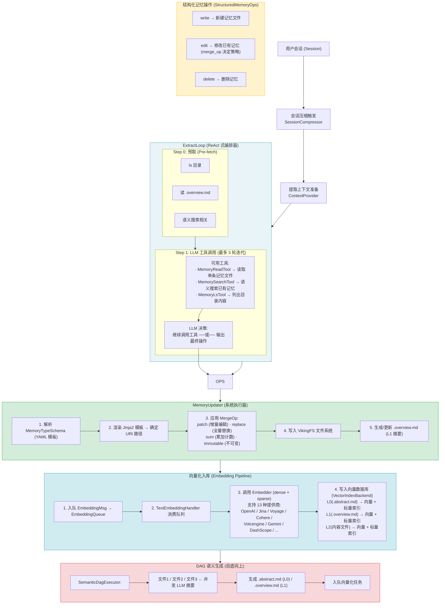
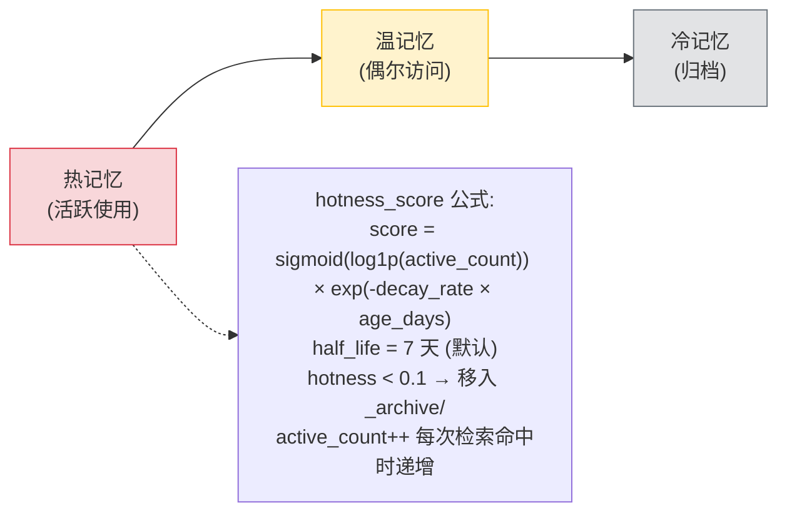
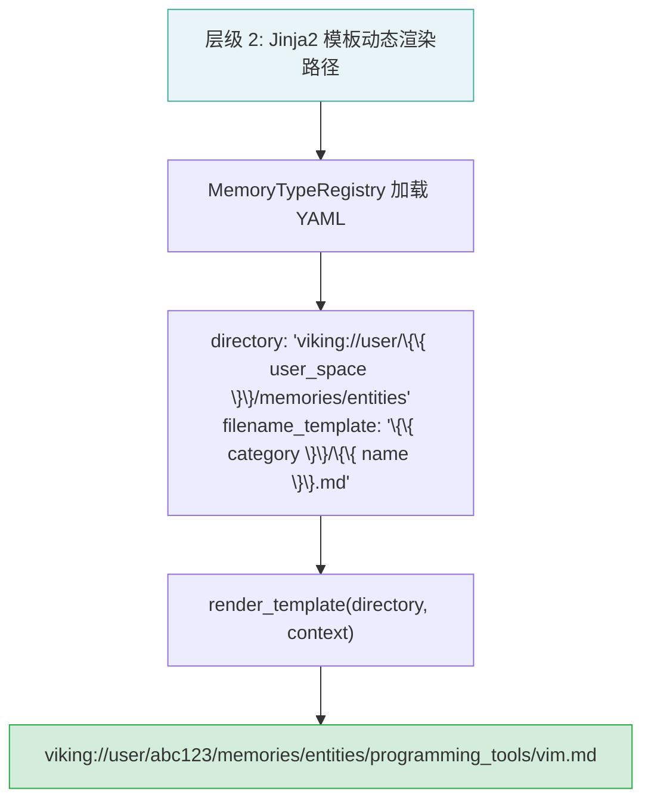
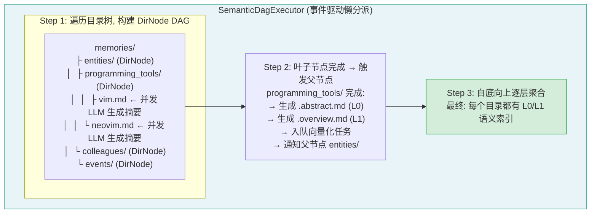
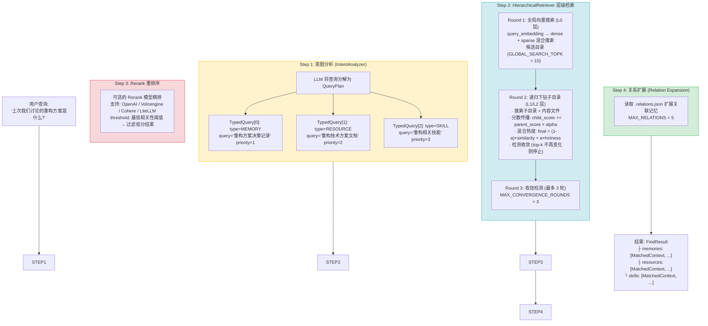
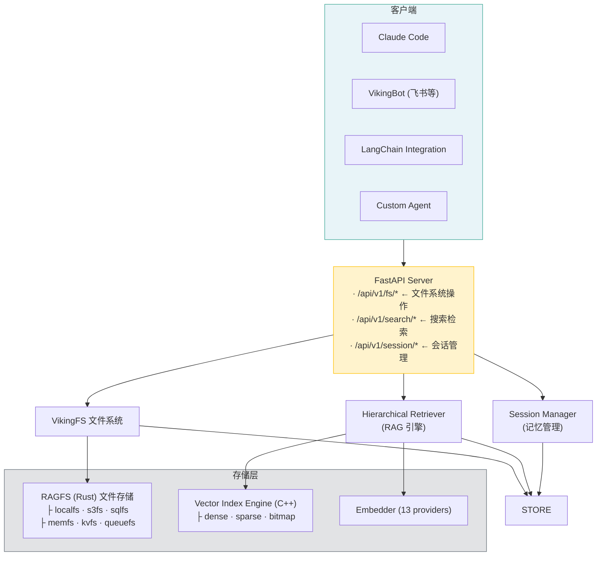

# OpenViking 记忆系统全景分析

> 基于源码深度分析，2026-05-16

---

## 一、记忆入库全流程 (Memory Ingestion Pipeline)



**关键设计决策**: ExtractLoop 使用 **ReAct 模式** (Reasoning + Acting)，让 LLM 自主决定需要读取哪些已有记忆，避免盲目覆盖。最多 3 轮迭代，平衡了探索深度与成本。

---

## 二、文件记忆的组织与管理

```
┌─────────────────────────────────────────────────────────────────────┐
│                   虚拟文件系统命名空间                                 │
│                   viking:// 协议                                     │
└─────────────────────────────────────────────────────────────────────┘

  viking://
  ├── user/{user_space}/                    ← 用户作用域 (跨会话持久)
  │   └── memories/
  │       ├── preferences/                  ← 偏好记忆
  │       │   └── {user}/{topic}.md
  │       ├── entities/                     ← 实体记忆 (Zettelkasten)
  │       │   └── {category}/{name}.md
  │       ├── events/                       ← 事件记忆 (不可变)
  │       │   └── {year}/{month}/{day}/{event}.md
  │       └── profile.md                    ← 用户画像
  │
  ├── agent/{agent_space}/                  ← Agent 作用域
  │   └── memories/
  │       ├── identity.md                   ← 身份认同
  │       ├── soul.md                       ← 核心价值观
  │       ├── experiences/                  ← 执行经验
  │       │   └── {name}.md
  │       ├── trajectories/                 ← 执行轨迹 (不可变)
  │       │   └── {name}_{timestamp}.md
  │       ├── skills/                       ← 技能记忆
  │       │   └── {skill_name}.md
  │       └── tools/                        ← 工具使用记忆
  │           └── {tool_name}.md
  │
  ├── session/{session_id}/                 ← 会话临时数据
  ├── resources/                            ← 共享知识库
  └── temp/                                 ← 临时文件
```

**每个目录三层语义结构**:

```
  memories/entities/projects/             ← 一个目录示例
  │
  ├── .abstract.md                        ← L0: 一行摘要 (~100 tokens)
  │   "用户的项目相关实体记忆"
  │
  ├── .overview.md                        ← L1: 详细概述 (~2k tokens)
  │   "包含以下项目: OpenViking, ..."
  │   "每个项目有详细的技术栈、状态..."
  │
  ├── .relations.json                     ← 关系图谱
  │   { "uris": ["viking://../events/..."],
  │     "reason": "该项目的决策记录" }
  │
  ├── OpenViking.md                       ← L2: 完整内容
  │   "## 项目概述\n..."
  │   "<!-- MEMORY_FIELDS\n{...} -->"      ← 结构化元数据嵌入
  │
  └── MyProject.md                        ← L2: 另一条记忆
```

**记忆生命周期管理**:



---

## 三、语义化目录结构的形成机制

```
┌─────────────────────────────────────────────────────────────────────┐
│            语义化目录结构是如何形成的?                                  │
└─────────────────────────────────────────────────────────────────────┘

  层级 1: YAML Schema 定义记忆类型分类体系
  ──────────────────────────────────────────

  openviking/prompts/templates/memory/
  ├── entities.yaml        → 目录: entities/{category}/
  │   │                         文件: {name}.md
  │   │                         字段: category(不可变), content(patch)
  │   │                         操作: upsert
  │   │
  │   └── category 字段实现 Zettelkasten 分类法
  │       (如 "programming_tools", "colleagues", "concepts")
  │
  ├── events.yaml          → 目录: events/{year}/{month}/{day}/
  │                              文件: {event_name}.md
  │                              操作: add_only (不可变)
  │
  ├── preferences.yaml     → 目录: preferences/{user}/
  │                              文件: {topic}.md
  │                              字段: preference(patch), reason(patch)
  │
  └── experiences.yaml     → 目录: experiences/
                                 文件: {experience_name}.md
                                 字段: situation, approach, reflection


```

**层级 3: DAG 语义处理器自底向上构建摘要**



**层级 4: 多租户隔离策略**

```
  ┌────────────────────────────────────────────────┐
  │  isolate_user_scope_by_agent:                  │
  │    user 记忆按 agent 隔离                       │
  │    viking://user/{space}/agent_{agent_id}/...   │
  │                                                │
  │  isolate_agent_scope_by_user:                  │
  │    agent 记忆按 user 隔离                       │
  │    viking://agent/{space}/user_{user_id}/...    │
  └────────────────────────────────────────────────┘
```

---

## 四、RAG 系统及其作用

**OpenViking 有完整的 RAG 系统**，且 RAG 是其核心能力之一，不是简单的 "embedding + 检索"，而是 **意图驱动的层级化检索**。



**RAG 在 OpenViking 中的五个核心作用**:

```mermaid
flowchart TD
    subgraph r1["1. 记忆去重 (Memory Deduplication)"]
        R1A["新提取记忆"] --> R1B["search_similar_memories()"]
        R1B --> R1C{"向量相似度 > 阈值?"}
        R1C -->|"是"| R1D["MergeOp 合并而非新建"]
        R1C -->|"否"| R1E["新建记忆"]
    end

    subgraph r2["2. 记忆提取时的上下文预取 (Context Prefetch)"]
        R2A["ExtractLoop 的 Pre-fetch 阶段"] --> R2B["MemorySearchTool → 语义搜索已有记忆"]
        R2B --> R2C["让 LLM 看到已有记忆 → 避免重复/冲突"]
    end

    subgraph r3["3. 会话时的实时记忆召回 (Real-time Recall)"]
        R3A["Claude Code Plugin: auto-recall.mjs<br>UserPromptSubmit hook"] --> R3B["搜索 OpenViking"]
        R3B --> R3C["注入 openviking-context 到对话中"]
        R3C --> R3D["token 预算管理"]
    end

    subgraph r4["4. 层级化精确检索 (Hierarchical Retrieval)"]
        R4A["L0 全局定位"] --> R4B["L1 目录内细化"]
        R4B --> R4C["L2 精确命中"]
        R4C --> R4D["+ 分数传播 + 热度衰减 + Rerank"]
    end

    subgraph r5["5. 冷存储归档决策 (Archive Decision)"]
        R5A["MemoryArchiver 定期扫描"] --> R5B{"hotness_score &lt; 0.1?"}
        R5B -->|"是"| R5C["移入 _archive/<br>但向量索引保留 → 仍可被检索"]
    end

    style r1 fill:#fff3cd,stroke:#ffc107
    style r2 fill:#d1ecf1,stroke:#17a2b8
    style r3 fill:#d4edda,stroke:#28a745
    style r4 fill:#f8d7da,stroke:#dc3545
    style r5 fill:#e2e3e5,stroke:#6c757d
```



---

## 五、整体架构总览



---

## 六、总结

OpenViking 的核心创新点在于将 **"文件系统隐喻"** 应用于 AI Agent 记忆管理:

1. **记忆不是平铺的 key-value**，而是有层级的目录树 (Zettelkasten 思想 + 时间维度)
2. **不是简单的 embedding 检索**，而是 L0/L1/L2 三层语义 + 意图分解 + 递归下钻的层级 RAG
3. **不是写后即忘**，而是有完整的生命周期 (提取→去重→合并→向量化→归档→热度衰减)
4. **不是单一存储**，而是文件系统 (RAGFS) + 向量数据库 (C++ Index) + 语义生成 (DAG) 三层协同
5. **RAG 不仅用于检索**，还用于去重、上下文预取、归档决策等贯穿全流程

---

## 关键源码索引

| 模块 | 路径 | 职责 |
|------|------|------|
| 记忆提取循环 | `openviking/session/memory/extract_loop.py` | ReAct 式编排，LLM 自主决策读写 |
| 记忆更新器 | `openviking/session/memory/memory_updater.py` | 执行写入/合并操作 |
| 记忆类型注册 | `openviking/session/memory/memory_type_registry.py` | 加载 YAML Schema，解析 Jinja2 模板 |
| 合并策略 | `openviking/session/memory/merge_op/` | patch/replace/sum/immutable |
| 语义 DAG | `openviking/storage/queuefs/semantic_dag.py` | 自底向上摘要生成 |
| 层级检索器 | `openviking/retrieve/hierarchical_retriever.py` | 三级递归下钻 + 分数传播 |
| 意图分析 | `openviking/retrieve/intent_analyzer.py` | LLM 分解查询为多类型子查询 |
| 热度评分 | `openviking/retrieve/memory_lifecycle.py` | sigmoid + 指数衰减 |
| 虚拟文件系统 | `openviking/storage/viking_fs.py` | viking:// URI 协议，L0/L1/L2 层级 |
| 向量后端 | `openviking/storage/viking_vector_index_backend.py` | 多租户隔离，dense+sparse 混合搜索 |
| C++ 索引引擎 | `src/index/` | 高性能向量/标量索引 |
| RAGFS | `crates/ragfs/` | Rust 文件系统插件 (local/s3/sql/mem/queue) |
| 记忆归档 | `openviking/session/memory_archiver.py` | 冷存储迁移 |
| 记忆去重 | `openviking/session/memory_deduplicator.py` | 向量相似度去重 |
| 目录预设 | `openviking/core/directories.py` | 预定义目录树结构 |
| 上下文模型 | `openviking/core/context.py` | ContextType/ContextLevel 枚举 |
| 记忆 YAML 模板 | `openviking/prompts/templates/memory/*.yaml` | 10 种记忆类型定义 |
