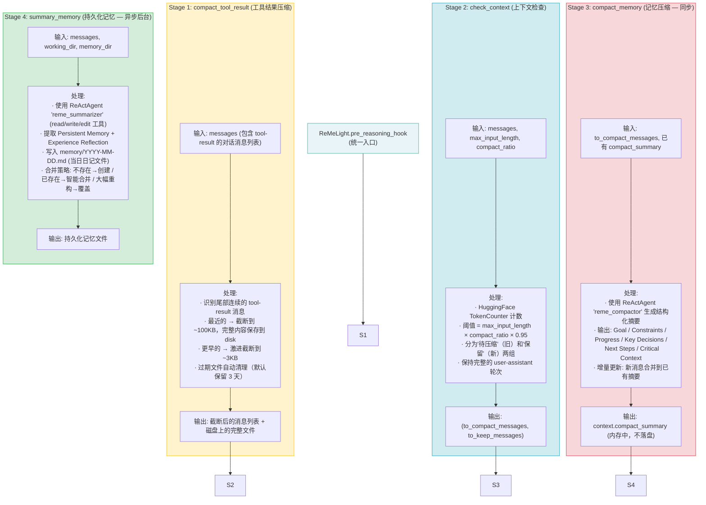
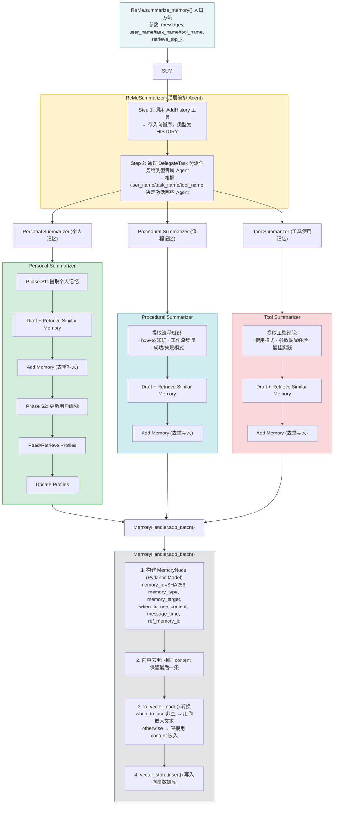
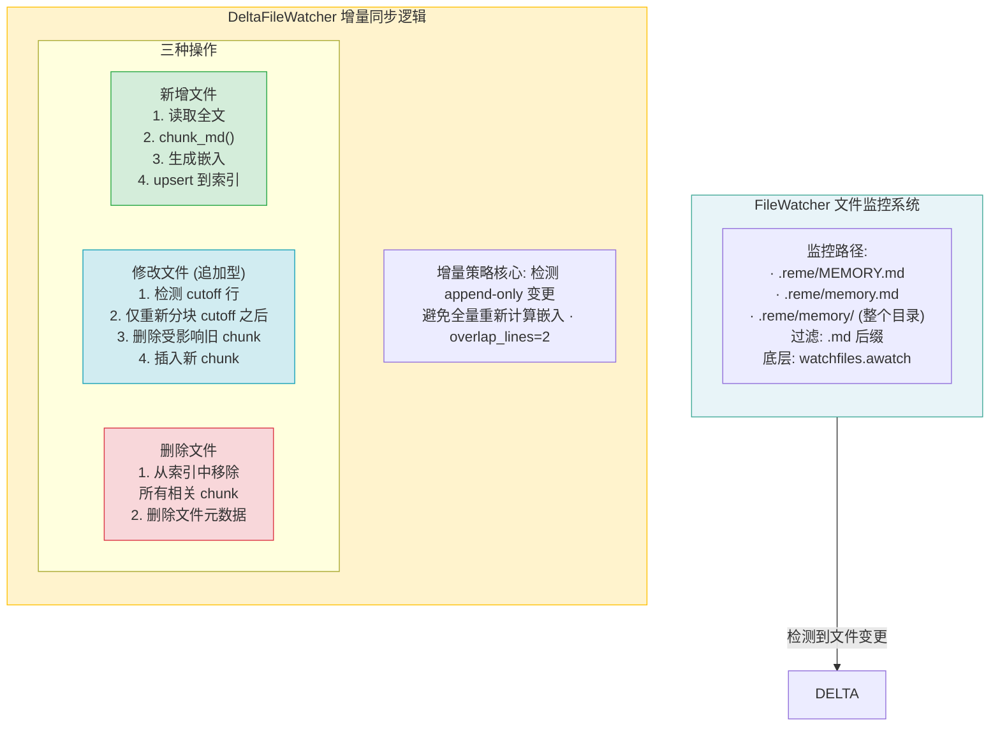
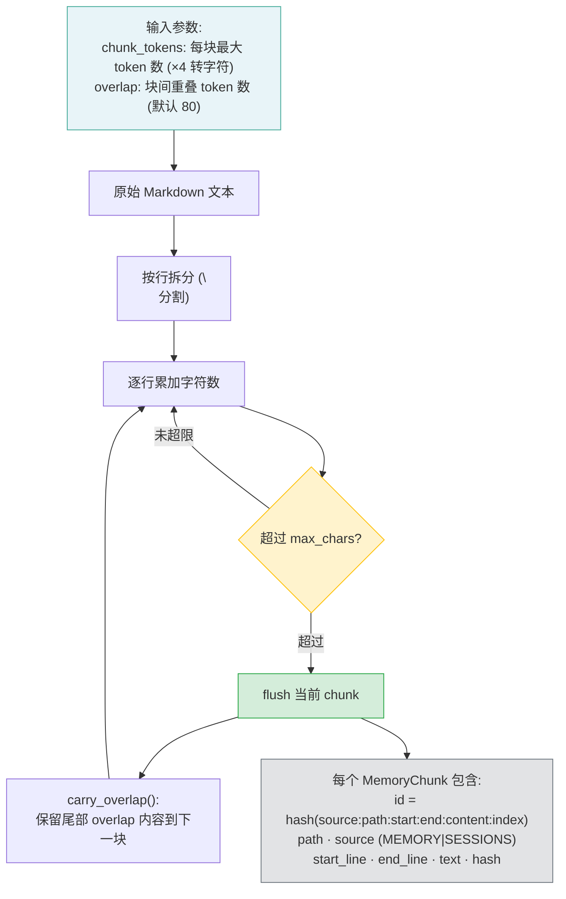
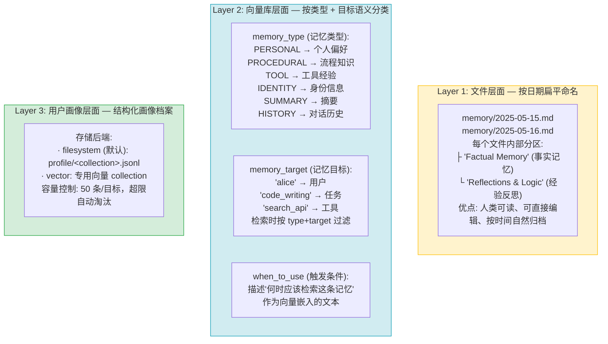
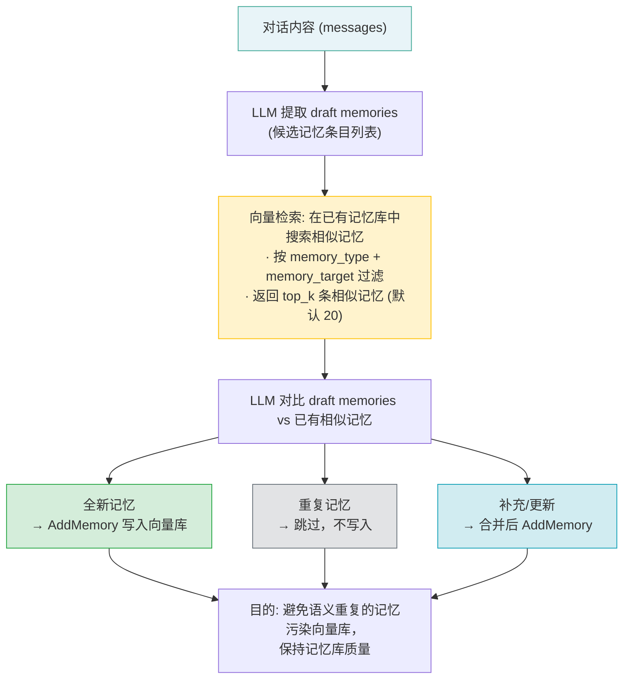
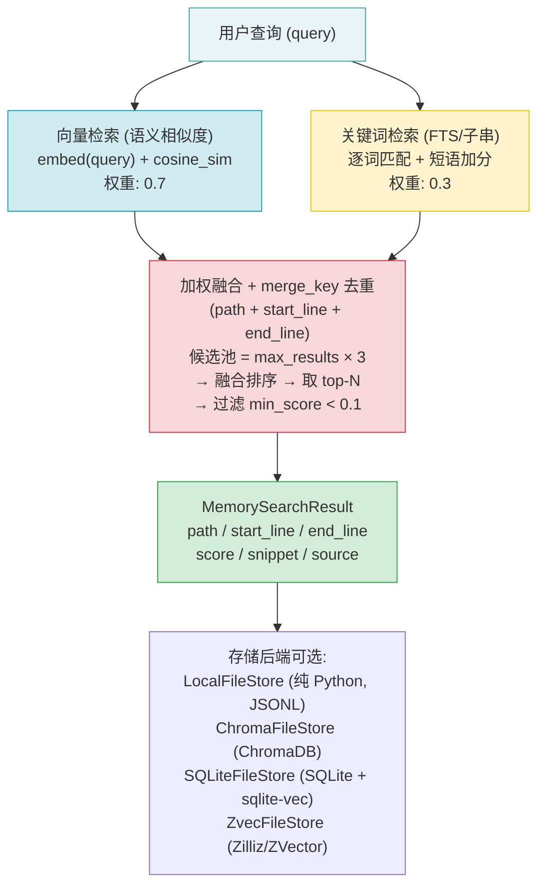
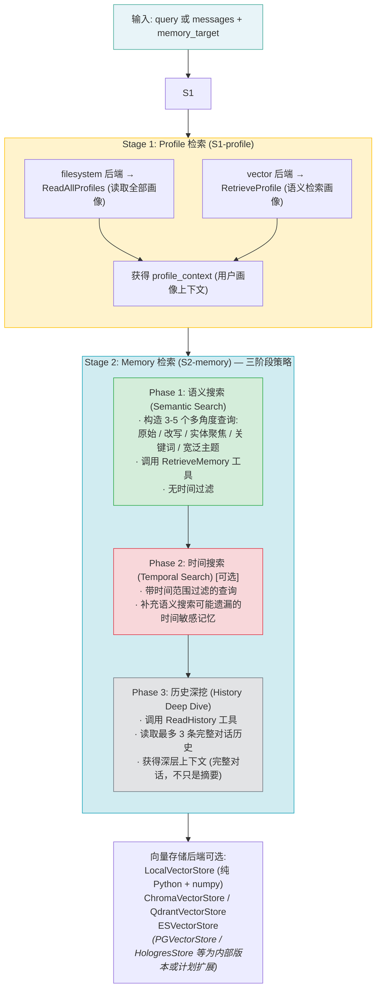
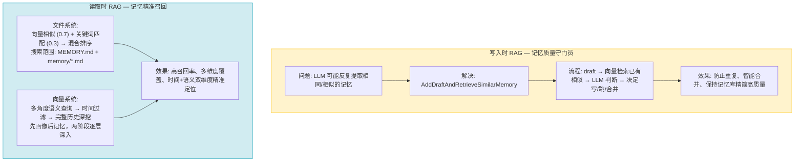
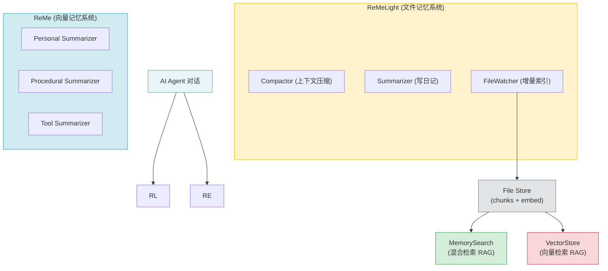

# ReMe 记忆架构深度分析

> ReMe（Remember Me, Refine Me）—— 阿里巴巴 AgentScope 团队的 AI Agent 记忆管理框架
> 版本 0.3.1.9 | Apache 2.0

---

## 一、项目总览

ReMe 提供**两套独立的记忆系统**，服务于不同复杂度的场景：

| 系统 | 入口类 | 存储方式 | 适用场景 |
|------|--------|----------|----------|
| **文件记忆系统 (ReMeLight)** | `ReMeLight` | Markdown 文件 + 文件索引 | 轻量级、透明可读、低依赖 |
| **向量记忆系统 (ReMe)** | `ReMe` | 向量数据库 + 结构化元数据 | 多类型记忆、精准语义检索 |

项目结构：
```
reme/           # 核心框架（v2+ 架构）
reme_ai/        # 旧版 v1 架构（FlowLLM，向后兼容）
```

---

## 二、记忆入库流程

### 2.1 文件记忆系统（ReMeLight）—— 4 阶段流水线

文件记忆以 `pre_reasoning_hook` 为统一入口，在每次 Agent 推理前自动触发。



### 2.2 向量记忆系统（ReMe）—— 分层代理委托模式

向量记忆以 `summarize_memory()` 为入口，采用层级 Agent 委托架构。



---

## 三、文件记忆的组织与管理

### 3.1 工作目录结构

由 `ReMeLight.__init__()` 自动创建（reme/reme_light.py:126-133）：

```
.reme/                              # working_dir 根目录
│
├── MEMORY.md                       # 长期持久记忆（手动或 Agent 写入）
├── memory.md                       # 备选记忆文件
│
├── memory/                         # 每日日记（Agent 自动写入）
│   ├── 2025-05-15.md               # 每个文件内部分区:
│   ├── 2025-05-16.md               #   "Factual Memory" (事实记忆)
│   └── ...                         #   "Reflections & Logic" (经验反思)
│
├── dialog/                         # 原始对话记录
│   ├── 2025-05-15.jsonl            # 每行一条 JSON 消息
│   └── ...
│
├── tool_result/                    # 大型工具输出缓存
│   ├── <uuid>.txt                  # TTL 自动清理（默认保留 3 天）
│   └── ...
│
├── embedding_cache/                # 嵌入模型缓存（加速重复计算）
│
├── file_store/                     # 文件存储索引持久化
│   ├── reme_chunks.jsonl           # 所有 chunk 的数据
│   └── reme_file_metadata.json     # 文件元数据（hash, mtime, size）
│
├── vector_store/                   # 向量存储持久化
│
└── profile/                        # 用户画像存储
    └── <collection_name>.jsonl     # 每个集合一个 JSONL 文件
```

**关键设计**:
- `MEMORY.md` / `memory.md`: 长期记忆文件，被 FileWatcher 监控
- `memory/*.md`: 日记文件，按日期命名，Summarizer Agent 自动写入
- `tool_result/`: 临时缓存，有 TTL 过期机制
- `file_store/`: 索引数据，由 FileWatcher 维护，支持增量更新

### 3.2 文件监控与增量索引系统



### 3.3 Markdown 分块策略

代码: `reme/core/utils/chunking_utils.py`



---

## 四、语义化目录组织方式

ReMe **不生成**语义化目录树，而是通过**三层机制**实现逻辑分明的组织：



---

## 五、RAG 在系统中的作用

ReMe 中 RAG 在**写入时**和**读取时**都发挥关键作用，贯穿记忆的完整生命周期。

### 5.1 写入时 RAG —— 去重与智能合并



### 5.2 读取时 RAG —— 两套检索系统

> **后端验证说明**：以下向量存储后端列表已与 agentscope-ai/ReMe 开源仓库核实。PostgreSQL+pgvector、Hologres 等后端在开源版本中未找到实现，可能为内部版本或计划扩展。

#### 文件记忆 RAG: MemorySearch (混合检索)



#### 向量记忆 RAG: PersonalRetriever (两阶段检索)



### 5.3 RAG 核心作用总结



---

## 六、整体架构总览



---

## 七、关键架构模式

| 模式 | 说明 | 实例 |
|------|------|------|
| **ReAct Agent** | 推理+行动循环，Agent 自主决定调用什么工具 | Compactor, Summarizer, 各类 Retriever |
| **层级委托** | 顶层编排 Agent 通过 DelegateTask 分派给类型专属 Agent | ReMeSummarizer → Personal/Procedural/Tool |
| **两阶段处理** | 先提取记忆，再更新画像 | PersonalSummarizer S1+S2 |
| **增量文件同步** | 检测追加型变更，仅重新计算新增部分 | DeltaFileWatcher |
| **混合检索融合** | 向量语义 + 关键词匹配加权融合 | MemorySearch (0.7 + 0.3) |
| **Registry 工厂** | 后端名 → 实现类的映射，支持热插拔 | R 注册 LLM/Embedding/VectorStore/FileStore |
| **YAML 配置** | 组件级 YAML 配置 + Pydantic 校验 | compactor.yaml, summarizer.yaml 等 |
