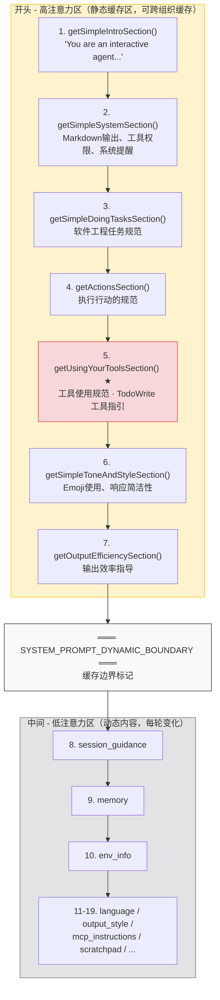
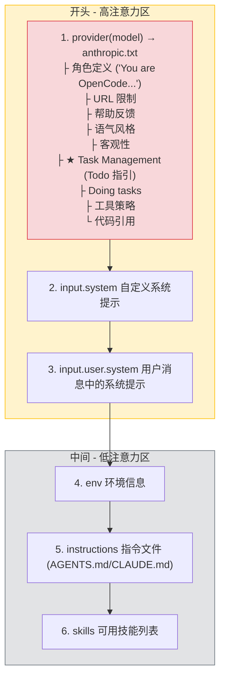
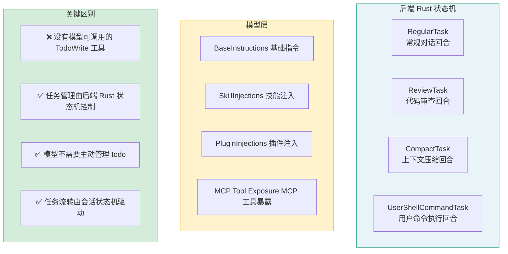
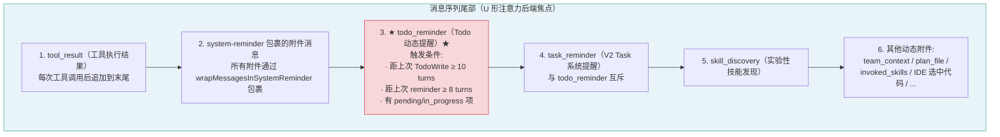
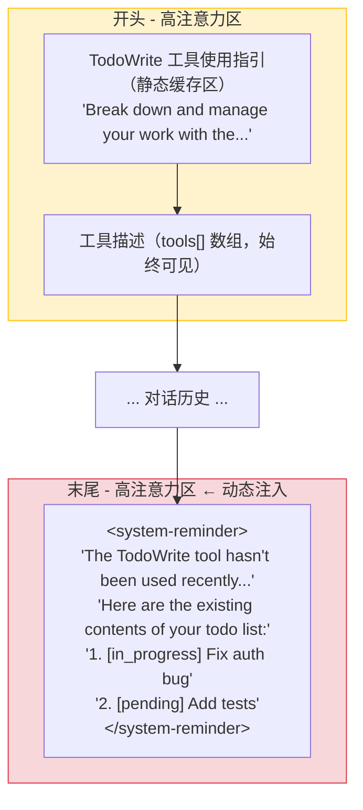
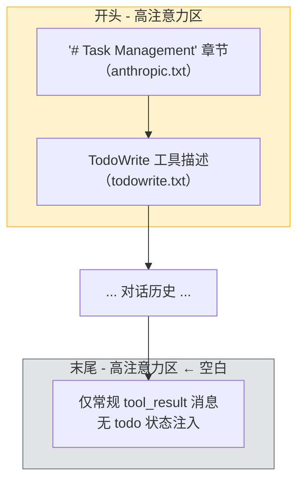

# AI Coding Agent Todo/任务系统提示词注入策略分析

> 分析对象：Claude Code、OpenCode、Codex 三个主流 AI 编程工具
> 分析日期：2026-05-10

---

## 一、U 形注意力理论基础

大型语言模型对提示词不同位置的关注度呈 U 形分布：

- **开头（高注意力区）**：角色设定、核心身份、基础规则被模型重点关注
- **中间（低注意力区）**：冗长内容最容易被忽略或遗漏
- **末尾（高注意力区）**：最新指令、上下文补充、动态提醒具有强影响力

**设计原则**：关键指令应放置在开头或末尾，避免沉没在中间区域。

---

## 二、Claude Code 分析

### 2.1 Todo 工具定义

| 文件 | 说明 |
|------|------|
| [TodoWriteTool/prompt.ts](file:///home/wunai/Disks/Data/my-project/project-for-reference/claude-code-src/src/tools/TodoWriteTool/prompt.ts) | 工具描述，约 180 行，包含使用场景、示例、状态管理规则 |
| [TodoWriteTool/TodoWriteTool.ts](file:///home/wunai/Disks/Data/my-project/project-for-reference/claude-code-src/src/tools/TodoWriteTool/TodoWriteTool.ts) | 工具实现 |
| [TodoWriteTool/constants.ts](file:///home/wunai/Disks/Data/my-project/project-for-reference/claude-code-src/src/tools/TodoWriteTool/constants.ts) | 工具名称常量 |
| [TaskListTool/prompt.ts](file:///home/wunai/Disks/Data/my-project/project-for-reference/claude-code-src/src/tools/TaskListTool/prompt.ts) | V2 任务列表工具描述 |
| [TaskCreateTool](file:///home/wunai/Disks/Data/my-project/project-for-reference/claude-code-src/src/tools/TaskCreateTool) | V2 任务创建工具 |
| [TaskUpdateTool](file:///home/wunai/Disks/Data/my-project/project-for-reference/claude-code-src/src/tools/TaskUpdateTool) | V2 任务更新工具 |

### 2.2 提示词构建顺序

系统提示词由 [prompts.ts](file:///home/wunai/Disks/Data/my-project/project-for-reference/claude-code-src/src/constants/prompts.ts) 中的 `getSystemPrompt()` 函数组装，完整顺序如下：



### 2.3 Todo 提醒策略

| 维度 | 详情 |
|------|------|
| **注入位置** | 第 5 位，`getUsingYourToolsSection()` 中，约前 30% 位置 |
| **U 形注意力利用** | ✅ 开头高注意力区 |
| **工具描述传递** | 每次 API 调用都作为 `tools[]` 数组的一部分传递 |
| **动态状态注入** | ❌ 无每轮动态注入当前 todo 列表状态 |
| **状态可见性** | 模型需主动调用 TodoWriteTool 查看/更新 |
| **缓存策略** | 静态缓存（`SYSTEM_PROMPT_DYNAMIC_BOUNDARY` 之前） |

### 2.4 关键代码位置

```typescript
// prompts.ts:269-314 getUsingYourToolsSection()
// 检测是否有 TodoWrite 或 TaskCreate 工具启用，动态插入指引
function getUsingYourToolsSection(enabledTools: Set<string>): string {
  const taskToolName = [TASK_CREATE_TOOL_NAME, TODO_WRITE_TOOL_NAME].find(n =>
    enabledTools.has(n),
  )
  // ...
  const items = [
    taskToolName
      ? `Break down and manage your work with the ${taskToolName} tool...`
      : null,
    // ...
  ]
}
```

---

## 三、OpenCode 分析

### 3.1 Todo 工具定义

| 文件 | 说明 |
|------|------|
| [tool/todo.ts](file:///home/wunai/Disks/Data/my-project/project-for-reference/opencode/packages/opencode/src/tool/todo.ts) | TodoWriteTool 实现 |
| [tool/todowrite.txt](file:///home/wunai/Disks/Data/my-project/project-for-reference/opencode/packages/opencode/src/tool/todowrite.txt) | 工具描述，约 166 行 |
| [session/todo.ts](file:///home/wunai/Disks/Data/my-project/project-for-reference/opencode/packages/opencode/src/session/todo.ts) | Todo 数据模型和存储服务 |
| [tool/task.ts](file:///home/wunai/Disks/Data/my-project/project-for-reference/opencode/packages/opencode/src/tool/task.ts) | TaskTool 实现（子代理） |

### 3.2 提示词构建顺序

系统提示词由 [llm.ts](file:///home/wunai/Disks/Data/my-project/project-for-reference/opencode/packages/opencode/src/session/llm.ts):103-115 和 [prompt.ts](file:///home/wunai/Disks/Data/my-project/project-for-reference/opencode/packages/opencode/src/session/prompt.ts):1568-1584 组装：



### 3.3 Todo 提醒策略

| 维度 | 详情 |
|------|------|
| **注入位置** | `anthropic.txt` 中的 "# Task Management" 章节，紧跟角色定义后 |
| **U 形注意力利用** | ✅ 开头高注意力区 |
| **工具描述传递** | 每次 API 调用作为工具定义的一部分传递 |
| **动态状态注入** | ❌ 无每轮动态注入当前 todo 列表状态 |
| **状态可见性** | 模型需主动调用 todowrite 工具查看/更新 |
| **持久化** | Todo 数据存储在 SQLite 数据库中（session/todo.ts） |
| **缓存策略** | 无明确缓存边界 |

### 3.4 anthropic.txt 中的 Task Management 章节

```text
# Task Management
You have access to the TodoWrite tools to help you manage and plan tasks. 
Use these tools VERY frequently to ensure that you are tracking your tasks 
and giving the user visibility into your progress.
These tools are also EXTREMELY helpful for planning tasks, and for breaking 
down larger complex tasks into smaller steps. If you do not use this tool 
when planning, you may forget to do important tasks - and that is unacceptable.

It is critical that you mark todos as completed as soon as you are done with 
a task. Do not batch up multiple tasks before marking them as completed.

Examples:
<example>
user: Run the build and fix any type errors
assistant: I'm going to use the TodoWrite tool...
</example>
```

### 3.5 关键代码位置

```typescript
// session/prompt.ts:1568-1574
const [skills, env, instructions, modelMsgs] = yield* Effect.all([
  sys.skills(agent),
  sys.environment(model),
  instruction.system().pipe(Effect.orDie),
  MessageV2.toModelMessagesEffect(msgs, model),
])
const system = [...env, ...instructions, ...(skills ? [skills] : [])]
```

```typescript
// session/instruction.ts:13-17
// 指令文件搜索列表
const FILES = [
  "AGENTS.md",
  ...(Flag.OPENCODE_DISABLE_CLAUDE_CODE_PROMPT ? [] : ["CLAUDE.md"]),
  "CONTEXT.md", // deprecated
]
```

---

## 四、Codex (OpenAI) 分析

### 4.1 任务系统设计

Codex 采用**完全不同的策略**——不依赖模型可调用的 todo 工具：

| 组件 | 说明 |
|------|------|
| [tasks/mod.rs](file:///home/wunai/Disks/Data/my-project/project-for-reference/codex/codex-rs/core/src/tasks/mod.rs) | 会话任务系统（RegularTask、ReviewTask、CompactTask、UserShellCommandTask） |
| [session/turn.rs](file:///home/wunai/Disks/Data/my-project/project-for-reference/codex/codex-rs/core/src/session/turn.rs) | 回合执行逻辑 |
| [session/session.rs](file:///home/wunai/Disks/Data/my-project/project-for-reference/codex/codex-rs/core/src/session/session.rs) | 会话状态管理 |

### 4.2 设计理念



### 4.3 提示词构建

```rust
// session/turn.rs 中的 run_turn 函数
// 提示词组装包括：
// - BaseInstructions（基础指令）
// - 技能注入（SkillInjections）
// - 插件注入（build_plugin_injections）
// - MCP 工具暴露（build_mcp_tool_exposure）
// - Hook 运行时注入（run_pending_session_start_hooks）
```

---

## 五、三工具对比总结

### 5.1 核心对比表

| 维度 | Claude Code | OpenCode | Codex |
|------|-------------|----------|-------|
| **Todo 工具存在** | ✅ TodoWriteTool + V2 Task 系统 | ✅ TodoWriteTool + TaskTool | ❌ 无模型 todo 工具 |
| **Todo 提醒位置** | 系统提示词第 5 位（~前 30%） | anthropic.txt 中，紧跟角色定义 | N/A |
| **利用 U 形注意力** | ✅ 开头高注意力区 | ✅ 开头高注意力区 | N/A |
| **每轮动态提醒** | ❌ 无 | ❌ 无 | N/A |
| **Todo 状态可见性** | 模型通过工具调用查看 | 模型通过工具调用查看 | 后端状态机管理 |
| **提醒方式** | 工具描述 + 使用指引 | 系统提示硬编码 + 工具描述 | 任务类型控制 |
| **缓存策略** | 明确缓存边界标记 | 无缓存边界 | 无缓存边界 |
| **持久化** | 内存/会话状态 | SQLite 数据库 | Rust 状态机 |
| **工具描述长度** | ~180 行 | ~166 行 | N/A |

### 5.2 提示词注入位置对比图


---

## 六、U 形注意力后端焦点分析

> **U 形注意力后端焦点** = 消息序列的最后位置，紧贴在 API 调用前注入的内容。
> 这是模型在生成响应前"最后看到"的信息，具有最强的即时影响力。

### 6.1 Claude Code：已有完善的后端焦点机制

Claude Code 的**消息序列尾部**（在 `mutableMessages` 数组末尾，API 调用前）包含以下内容：



**关键代码**（[attachments.ts](file:///home/wunai/Disks/Data/my-project/project-for-reference/claude-code-src/src/utils/attachments.ts):3299-3310）：

```typescript
// Todo 提醒触发逻辑
if (
  turnsSinceLastTodoWrite >= TODO_REMINDER_CONFIG.TURNS_SINCE_WRITE &&    // ≥10
  turnsSinceLastReminder >= TODO_REMINDER_CONFIG.TURNS_BETWEEN_REMINDERS  // ≥8
) {
  const todos = appState.todos[todoKey] ?? []
  return [{
    type: 'todo_reminder',
    content: todos,
    itemCount: todos.length,
  }]
}
```

**Todo 提醒消息格式**（[messages.ts](file:///home/wunai/Disks/Data/my-project/project-for-reference/claude-code-src/src/utils/messages.ts):3663-3678）：

```typescript
case 'todo_reminder': {
  const todoItems = attachment.content
    .map((todo, index) => `${index + 1}. [${todo.status}] ${todo.content}`)
    .join('\n')

  let message = `The TodoWrite tool hasn c hasn't been used recently. If you're working on tasks ` +
    `that would benefit from tracking progress, consider using the TodoWrite tool...`
  if (todoItems.length > 0) {
    message += `\n\nHere are the existing contents of your todo list:\n\n[${todoItems}]`
  }

  return wrapMessagesInSystemReminder([
    createUserMessage({ content: message, isMeta: true }),
  ])
}
```

**总结：Claude Code 同时利用了 U 形注意力的两端**
- ✅ 开头高注意力区：TodoWrite 工具使用指引（`getUsingYourToolsSection`）
- ✅ 末尾高注意力区：todo_reminder 动态附件（基于 turns 间隔触发）
- 工具描述作为 `tools[]` 始终可见

### 6.2 OpenCode：无后端焦点提醒

OpenCode **没有**类似 Claude Code 的 todo 动态注入机制：

| 维度 | 详情 |
|------|------|
| **开头指引** | ✅ anthropic.txt 中的 "# Task Management" 章节 |
| **工具描述** | ✅ todowrite.txt 每次 API 调用传递 |
| **动态状态注入** | ❌ 无每轮动态注入 todo 列表状态 |
| **提醒机制** | ❌ 无基于 turns 间隔的提醒 |
| **后端焦点内容** | 仅包含对话历史中的 tool_result 消息（用户消息） |

OpenCode 的消息序列尾部只有：
- 用户输入消息（role: "user"）
- 工具执行结果（role: "user"，content: tool_result）
- 无独立的系统提醒附件机制

### 6.3 Codex：无模型侧 todo，无后端焦点

| 维度 | 详情 |
|------|------|
| **模型侧 todo** | ❌ 无 TodoWrite 工具 |
| **后端焦点** | 仅有常规对话消息 + 工具结果 |
| **任务管理** | 由 Rust 后端状态机控制（RegularTask/ReviewTask） |
| **模型感知** | 模型不感知 todo 状态，任务流转由后端驱动 |

### 6.4 三工具后端焦点对比

| 维度 | Claude Code | OpenCode | Codex |
|------|-------------|----------|-------|
| **Todo 动态注入** | ✅ todo_reminder 附件（基于 turns 间隔） | ❌ 无 | ❌ 无 todo |
| **注入位置** | 消息序列末尾（紧接在对话历史后） | N/A | N/A |
| **注入格式** | `<system-reminder>` 包裹的 user 消息 | N/A | N/A |
| **触发频率** | 每 10 个 assistant turns 检查一次 | N/A | N/A |
| **包含当前状态** | ✅ 完整 todo 列表（序号+状态+内容） | N/A | N/A |
| **System-reminder 机制** | ✅ 统一的 `<system-reminder>` 标签 | ❌ 无 | ❌ 无 |
| **其他后端焦点内容** | 计划文件、技能、团队上下文等附件 | 仅对话历史 | 常规消息 |

---

## 七、设计洞察与优化建议

### 7.1 当前设计对比

**Claude Code 的完整策略（唯一利用 U 形注意力双端）：**



**OpenCode 的策略（仅利用开头）：**



### 7.2 U 形注意力优化建议

**OpenCode 可借鉴 Claude Code 的 todo_reminder 机制**：

可以在每轮对话前动态注入当前 todo 列表状态，利用 U 形注意力的**末端高注意力区域**：

```xml
<system-reminder>
Current task status:
1. [in_progress] Fix authentication bug
2. [pending] Add unit tests for auth module
3. [pending] Update API documentation
4. [completed] Setup project structure
</system-reminder>
```

**Claude Code 的 todo_reminder 触发条件参考**：

| 参数 | 值 | 说明 |
|------|-----|------|
| `TURNS_SINCE_WRITE` | 10 | 距上次 TodoWrite 调用的 assistant turns 数 |
| `TURNS_BETWEEN_REMINDERS` | 8 | 两次 reminder 之间的最小间隔 |
| 触发条件 | 两者同时满足 | 避免过度提醒 |

### 7.3 预期效果

| 优化点 | 预期效果 |
|--------|----------|
| 每轮注入当前 todo 状态 | 模型更频繁更新 todo，不依赖主动调用 |
| 状态变化提醒 | 模型能感知任务完成/阻塞/新增 |
| 末尾位置利用 | 弥补开头指引可能被长对话稀释的问题 |
| 结构化 XML 标签 | 便于模型解析和区分系统信息 |
| 基于 turns 间隔触发 | 平衡提醒频率和上下文效率 |

### 7.4 Claude Code 已有类似的 system-reminder 机制

```typescript
// prompts.ts:131-134
function getSystemRemindersSection(): string {
  return `- Tool results and user messages may include <system-reminder> tags. 
<system-reminder> tags contain useful information and reminders. They are 
automatically added by the system, and bear no direct relation to the 
specific tool results or user messages in which they appear.`
}
```

可以基于此机制扩展 todo 状态注入功能。

---

## 八、关键源文件索引

### Claude Code
- 系统提示构建：[src/constants/prompts.ts](file:///home/wunai/Disks/Data/my-project/project-for-reference/claude-code-src/src/constants/prompts.ts)
- TodoWrite 工具：[src/tools/TodoWriteTool/prompt.ts](file:///home/wunai/Disks/Data/my-project/project-for-reference/claude-code-src/src/tools/TodoWriteTool/prompt.ts)
- TaskList 工具：[src/tools/TaskListTool/prompt.ts](file:///home/wunai/Disks/Data/my-project/project-for-reference/claude-code-src/src/tools/TaskListTool/prompt.ts)
- 系统提示段配置：[src/constants/systemPromptSections.ts](file:///home/wunai/Disks/Data/my-project/project-for-reference/claude-code-src/src/constants/systemPromptSections.ts)
- 工具注册：[src/tools.ts](file:///home/wunai/Disks/Data/my-project/project-for-reference/claude-code-src/src/tools.ts)

### OpenCode
- LLM 流处理：[packages/opencode/src/session/llm.ts](file:///home/wunai/Disks/Data/my-project/project-for-reference/opencode/packages/opencode/src/session/llm.ts)
- 提示词解析：[packages/opencode/src/session/prompt.ts](file:///home/wunai/Disks/Data/my-project/project-for-reference/opencode/packages/opencode/src/session/prompt.ts)
- 系统提示服务：[packages/opencode/src/session/system.ts](file:///home/wunai/Disks/Data/my-project/project-for-reference/opencode/packages/opencode/src/session/system.ts)
- Anthropic 预设：[packages/opencode/src/session/prompt/anthropic.txt](file:///home/wunai/Disks/Data/my-project/project-for-reference/opencode/packages/opencode/src/session/prompt/anthropic.txt)
- TodoWrite 工具：[packages/opencode/src/tool/todo.ts](file:///home/wunai/Disks/Data/my-project/project-for-reference/opencode/packages/opencode/src/tool/todo.ts)
- TodoWrite 描述：[packages/opencode/src/tool/todowrite.txt](file:///home/wunai/Disks/Data/my-project/project-for-reference/opencode/packages/opencode/src/tool/todowrite.txt)
- Todo 存储：[packages/opencode/src/session/todo.ts](file:///home/wunai/Disks/Data/my-project/project-for-reference/opencode/packages/opencode/src/session/todo.ts)
- 指令加载：[packages/opencode/src/session/instruction.ts](file:///home/wunai/Disks/Data/my-project/project-for-reference/opencode/packages/opencode/src/session/instruction.ts)

### Codex
- 任务系统：[codex-rs/core/src/tasks/mod.rs](file:///home/wunai/Disks/Data/my-project/project-for-reference/codex/codex-rs/core/src/tasks/mod.rs)
- 回合执行：[codex-rs/core/src/session/turn.rs](file:///home/wunai/Disks/Data/my-project/project-for-reference/codex/codex-rs/core/src/session/turn.rs)
- 会话管理：[codex-rs/core/src/session/session.rs](file:///home/wunai/Disks/Data/my-project/project-for-reference/codex/codex-rs/core/src/session/session.rs)
- 上下文管理：[codex-rs/core/src/context_manager/updates.rs](file:///home/wunai/Disks/Data/my-project/project-for-reference/codex/codex-rs/core/src/context_manager/updates.rs)
