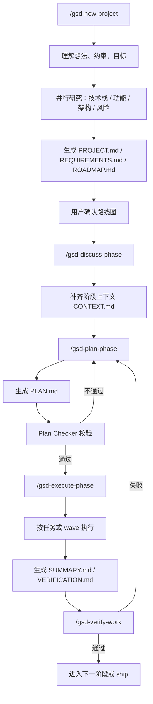
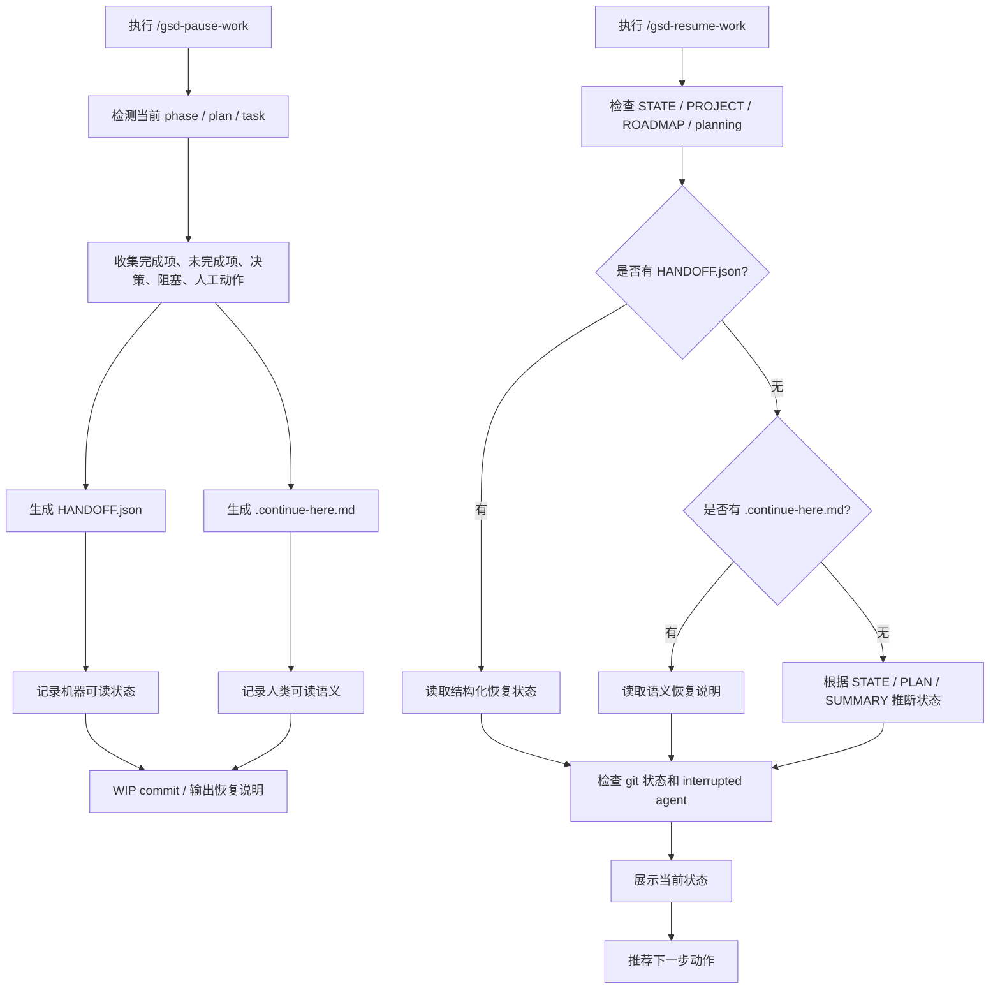

以下是将两份内容合并、去重、重新组织后的综合分析。两份原稿内容高度一致，核心观点都集中在 **GSD 是一套面向 AI 编程助手的上下文工程与规范驱动开发系统**，而不是普通命令集合。 

---

# GSD 项目综合分析

## 一、总体判断

**GSD（Get Shit Done）本质上是一套面向 AI 编程助手的“上下文工程 + 规范驱动开发 + 多代理执行”的工作流系统。**

它要解决的核心问题不是“如何让 AI 写几段代码”，而是 AI 编程在真实项目中常见的长期问题：

* 上下文变长后需求丢失；
* 决策过程被遗忘；
* 项目阶段混乱；
* 执行结果难以验证；
* 会话中断后难以高质量恢复；
* 多轮、多阶段开发缺少统一状态管理。

因此，GSD 的核心价值在于：**把 AI 编程从一次性对话，变成可恢复、可审计、可追踪、可验证的工程流程。**

它更像是给 Claude Code、Codex、Gemini、Cursor、Copilot 等 AI 编程工具加了一层“工程操作系统”，通过文件系统、阶段流程、多代理分工和质量门禁，把 AI 放进一个有状态、有约束、有产物的开发环境中。

---

## 二、GSD 的核心定位

GSD 不是一个简单的命令集合，而是一个 **meta-prompting / context engineering / spec-driven development system**。

它表面上提供的是一组命令，例如：

* `new-project`
* `discuss-phase`
* `plan-phase`
* `execute-phase`
* `verify-work`
* `pause-work`
* `resume-work`

但这些命令背后真正运行的是一套完整流程：

> 想法 → 研究 → 需求 → 路线图 → 阶段讨论 → 阶段计划 → 执行 → 验证 → 暂停/恢复 → 继续推进

也就是说，GSD 不是让 AI “直接开写”，而是先把模糊想法转化为结构化上下文，再让 AI 在受控流程中执行。

---

## 三、最核心的设计思想

## 1. 把上下文从聊天窗口搬到文件系统

GSD 最重要的设计，是不依赖模型自己记住上下文，而是把项目记忆显式保存为文件。

典型文件包括：

* `PROJECT.md`：项目愿景、边界、约束；
* `REQUIREMENTS.md`：需求分层与需求 ID；
* `ROADMAP.md`：阶段路线图；
* `STATE.md`：当前状态、决策、阻塞、进度；
* `PLAN.md`：原子任务计划；
* `SUMMARY.md`：执行摘要；
* `VERIFICATION.md` / `UAT.md`：验证结果；
* `HANDOFF.json`：机器可读的会话交接状态；
* `.continue-here.md`：人类/模型可读的恢复说明。

这套机制体现了一个非常关键的原则：

> 不相信模型会一直记住，但相信文件系统可以保存状态。

这也是它对抗 **context rot（上下文腐化）** 的根本方法。

---

## 2. 把需求理解和编码执行拆开

很多 AI 编程流程的问题，是用户一句话提出需求后，AI 就直接开始写代码。

GSD 的做法更工程化。它把开发拆成多个阶段：

1. `new-project`：理解想法，提出问题，研究项目背景；
2. 生成 `PROJECT.md`、`REQUIREMENTS.md`、`ROADMAP.md`；
3. `discuss-phase`：针对某一阶段补齐灰区、偏好和边界；
4. `plan-phase`：生成可执行的原子任务计划；
5. `execute-phase`：按 wave 或任务批次执行；
6. `verify-work`：对照目标和需求做验证；
7. `pause-work` / `resume-work`：支持跨会话恢复。

这说明 GSD 的重点不是“更快写代码”，而是 **更稳地把需求转化为可执行上下文**。

---

## 3. 多代理分工不是炫技，而是降低复杂度

GSD 的多代理设计非常实用。

它不是为了展示“很多 agent 很高级”，而是把复杂工作拆给更小、更专注的角色：

* 研究阶段：stack / features / architecture / pitfalls 等研究代理并行分析；
* 计划阶段：planner 负责生成计划，checker 负责校验计划；
* 执行阶段：executor 按任务或 wave 执行；
* 验证阶段：verifier 对照需求和目标检查结果。

这种设计的好处是：

> 一个大而模糊的问题，很容易让单个 AI 漏掉细节；拆成多个角色后，每个代理只处理更小、更清晰的上下文，稳定性更高。

---

## 4. 所有阶段都围绕“可验证性”设计

GSD 很强调：不是 AI 说完成了，就是真的完成了。

它要求计划里包含验证方式，并引入了类似 **Nyquist Validation** 的思想：在写代码前，就要把需求和测试、反馈信号、验证命令对应起来。

这意味着每个需求最好都能回答：

* 如何判断它完成了？
* 用什么命令验证？
* 是否有自动化测试？
* 是否有人工验收点？
* 是否存在 schema drift、安全问题、scope reduction 等风险？

这使得 GSD 从“生成代码工具”变成了“生成、执行、校验闭环”。

---

# 四、主工作流综合图



这个流程体现了 GSD 的基本哲学：

> 先结构化，再执行；先计划，再编码；先定义验证，再判断完成。

---

# 五、`pause-work` / `resume-work` 的核心原理

两份分析中最重要、也最值得展开的部分，是 GSD 的暂停与恢复机制。

## 1. `pause-work` 的本质

`pause-work` 不是简单写一句“下次继续”，而是把当前工作现场封装成一个可恢复快照。

它通常会收集：

* 当前 phase；
* 当前 plan；
* 当前 task；
* 已完成内容；
* 未完成内容；
* 关键决策；
* 当前阻塞；
* 需要人工处理的事项；
* 后台进程；
* 未提交文件；
* 下一步建议动作。

然后生成两类 handoff 文件：

### 机器可读

```text
.planning/HANDOFF.json
```

用于让 `resume-work` 精确读取状态，例如当前阶段、任务、阻塞点、下一步动作等。

### 人类/模型可读

```text
.continue-here.md
```

用于让下一次会话快速理解：

* 上次做到哪；
* 为什么这样做；
* 下一步先做什么；
* 有什么注意事项。

这就是一种 **Dual Handoff（双轨交接）** 设计。

---

## 2. `resume-work` 的本质

`resume-work` 不是单纯读取一个文件然后继续，而是从多个信号源重建真实状态。

它会检查：

* `.planning/STATE.md`
* `.planning/PROJECT.md`
* `.planning/HANDOFF.json`
* `.continue-here.md`
* 是否存在 `PLAN.md` 但没有 `SUMMARY.md`
* 是否存在 interrupted agent
* git 工作区状态是否和 handoff 一致

这说明 GSD 的恢复逻辑不是盲信单一来源，而是做 **状态交叉验证**。

它要解决的是真实开发中常见的不一致情况：

* 文档写了，但代码没完全改；
* 任务做了一半，summary 没生成；
* agent 中断；
* git 中有未提交文件；
* handoff 和实际文件状态不完全一致。

因此，`resume-work` 更像一个 **恢复编排器**，它的任务是判断：

> 当前项目真实进度是什么？下一步最合理的动作是什么？

---

## 3. 暂停/恢复机制图



---

# 六、最值得学习的工程模式

## 1. Artifacts-as-Memory：工件即记忆

GSD 的核心不是 prompt，而是工件体系。

它用文件保存：

* 项目目标；
* 需求；
* 阶段；
* 计划；
* 决策；
* 执行结果；
* 验证结果；
* 恢复状态。

这比单纯依赖聊天上下文稳定得多。

适合借鉴到：

* 长期 AI 编程项目；
* 多阶段产品开发；
* 复杂重构；
* 需要跨会话恢复的 agent 系统。

---

## 2. Thin Orchestrator + Specialized Agents：薄编排器 + 专用代理

主流程只负责调度，不承担所有智能工作。

具体研究、规划、校验、执行、验证交给专门 agent。

这种设计的优势是：

* 降低单个上下文复杂度；
* 角色职责更清楚；
* 输出更容易校验；
* 更适合并行化。

---

## 3. Spec-driven Development：规范驱动开发

GSD 不是从代码开始，而是从规范开始。

它建立了一条信息链：

```text
PROJECT.md
→ REQUIREMENTS.md
→ ROADMAP.md
→ CONTEXT.md
→ PLAN.md
→ SUMMARY.md
→ VERIFICATION.md / UAT.md
```

这条链条让开发过程从“临时对话”变成“结构化工程”。

---

## 4. Dual Handoff：双轨交接

`HANDOFF.json` 负责机器恢复，`.continue-here.md` 负责人类理解。

这比只存 JSON 或只写 Markdown 都更强：

* JSON 精确、结构化，适合程序读取；
* Markdown 可读、解释性强，适合人和模型快速恢复语境。

---

## 5. Verification-first：验证前置

GSD 强调每个阶段都要能验证。

这避免了 AI 编程中最常见的问题：

> AI 自信地说完成了，但实际上没有满足需求。

通过 plan checker、verification、UAT、测试命令、需求映射等机制，GSD 把“完成”变成可以检查的状态，而不是模型的主观声明。

---

# 七、综合评价

GSD 最有价值的地方，不是某个命令，也不是某个 prompt，而是它提出了一套完整的 AI 编程工程范式：

> 把上下文持久化，把需求结构化，把任务原子化，把执行流程化，把验证制度化，把恢复机制产品化。

它解决的是 AI 编程从 demo 到真实项目时最痛的几个问题：

* 长上下文腐化；
* 跨会话断层；
* 需求与代码脱节；
* 执行过程不可追踪；
* 缺少验证闭环；
* 多代理协作缺少状态管理。

因此，可以把 GSD 理解为：

> **一套 AI 编程工作流操作系统，而不是一个 AI 编码命令包。**

它真正的启发是：未来高质量 AI 编程工具的竞争点，可能不只是模型能力，而是围绕模型建立的 **上下文工程、状态管理、规范流程、恢复机制和质量门禁**。
