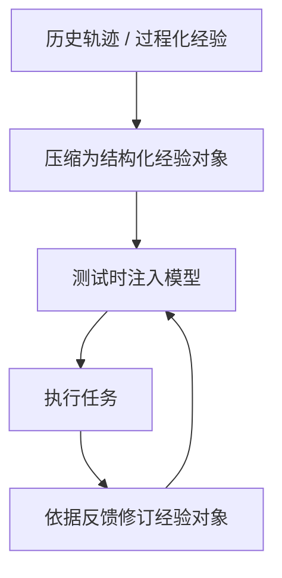
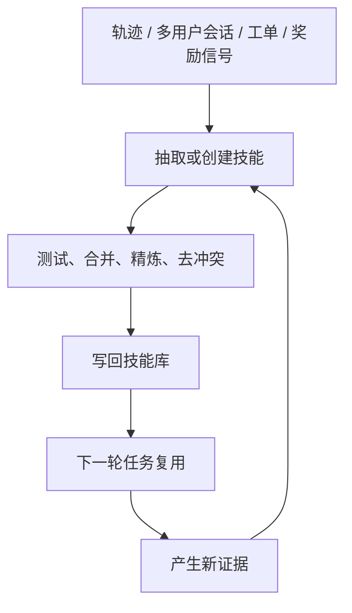
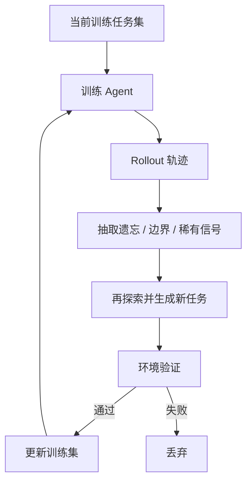
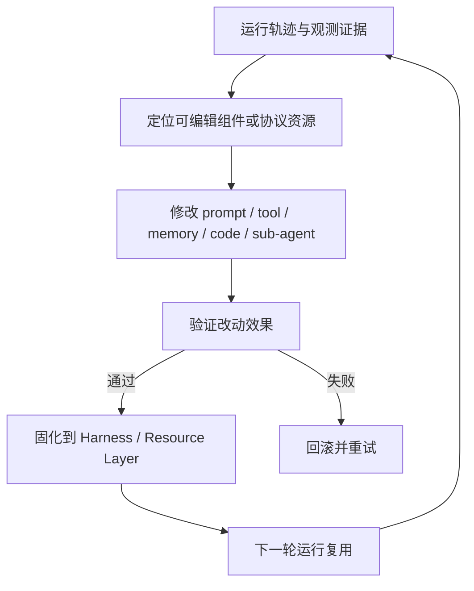

# Agent Self-Evolve 论文综述（2026-06）

这篇是对 [路线总览](./路线总览.md) 的补充。`路线总览.md` 偏路线梳理，这篇偏“逐篇论文总结 + 横向对比”。

> 检索时间：2026-06-05
>
> 说明：以下内容基于当日 arXiv 可见版本整理。带“我的理解”“我更倾向于理解为”的句子，是我基于论文内容做的归纳，不是论文原话。

## 1. 先给结论

如果把这 11 篇论文压成几条主线，我会分成四类：

1. **经验表示进化**：关注“经验对象应该长什么样”，代表是 Strategy Genes。
2. **技能资产进化**：关注“怎样把经验沉淀成 skill，并让 skill 持续运维”，代表是 MUSE、SkillForge、SkillX、Trace2Skill、SkillClaw、Skill1。
3. **训练数据进化**：关注“训练集能否跟着 Agent 的弱点一起变”，代表是 CoEvolve。
4. **Harness / 协议进化**：关注“真正该进化的不只是提示词或 skill，还包括 tool、memory、middleware、agent code 乃至资源协议”，代表是 Autogenesis、AHE、Continual Harness。

如果只看一条连续谱，我会这样概括：

- **Strategy Genes** 在回答“经验对象应如何表示”。
- **SkillX / Trace2Skill / MUSE / SkillForge / SkillClaw / Skill1** 在回答“经验如何变成可复用 skill 并持续迭代”。
- **CoEvolve** 在回答“训练数据能否跟着 agent 的弱点动态演化”。
- **Autogenesis / AHE / Continual Harness** 在回答“Agent 的可进化边界能否扩展到整个运行外壳和协议资源”。

## 2. 四条路线的演化闭环

### 2.1 经验表示进化

这条路线最看重的是：经验要足够短、足够结构化，能够直接充当测试时控制信号。

### 2.2 技能资产进化

这条路线最看重的是：怎样把零散经验沉淀成可复用、可共享、可持续迭代的技能层。

### 2.3 训练数据进化

这条路线最看重的是：训练分布不能静态不动，而应围绕 Agent 当前弱点动态移动。

### 2.4 Harness / 协议进化

这条路线最看重的是：把可进化对象从“经验文本”扩展到整个 Agent 外壳与资源协议。

## 3. 总览表

| 论文 | 我对它的定位 | 主要进化对象 | 更新信号 | 代表环境 |
| --- | --- | --- | --- | --- |
| [From Procedural Skills to Strategy Genes](https://arxiv.org/abs/2604.15097) | 经验表示研究 | 基因、胶囊、事件 | 执行结果、失败历史、验证记录 | 科学代码求解、CritPt |
| [MUSE-Autoskill](https://arxiv.org/abs/2605.27366) | 技能生命周期框架 | 单个 skill 的创建、记忆、测试、修补、治理 | 成功轨迹、测试结果、技能级记忆 | SkillsBench |
| [SkillForge](https://arxiv.org/abs/2604.08618) | 生产领域 skill 演化 | 领域技能包与 references | 真实工单 bad cases、专家参考回复 | 云技术支持 |
| [SkillX](https://arxiv.org/abs/2604.04804) | 预构建技能库 | 分层技能知识库 | 成功轨迹、执行反馈、探索扩展 | AppWorld / BFCL-v3 / τ²-Bench |
| [Trace2Skill](https://arxiv.org/abs/2603.25158) | 轨迹蒸馏式技能生成 | 综合技能或技能目录 | 大量轨迹的并行分析与合并 | spreadsheet / VisionQA / math |
| [SkillClaw](https://arxiv.org/abs/2604.08377) | 多用户集体进化 | 共享技能仓库 | 跨用户会话、夜间验证 | WildClawBench |
| [Skill1](https://arxiv.org/abs/2605.06130) | 强化学习统一训练 | 技能选择、技能使用、技能蒸馏 | 单一任务结果奖励 | ALFWorld / WebShop |
| [CoEvolve](https://arxiv.org/abs/2604.15840) | Agent-Data mutual evolution | 动态训练任务分布 | forgetting / boundary / rare 信号 | AppWorld / BFCL-V3 |
| [Autogenesis](https://arxiv.org/abs/2604.15034) | 自演化协议层 | Prompt、Agent、Tool、Environment、Memory 资源 | trace、反思、版本评估、提交/回滚 | GPQA / AIME / GAIA / HLE / LeetCode |
| [Agentic Harness Engineering](https://arxiv.org/abs/2604.25850) | 编码 Agent 外壳自动演化 | Harness 组件 | 轨迹证据、可归因决策、下一轮验证 | Terminal-Bench 2 / SWE-bench-verified |
| [Continual Harness](https://arxiv.org/abs/2605.09998) | 具身 Harness 在线自适应 | 提示词、子代理、技能、记忆、模型 | 单次长运行中的在线反馈、教师重标注 | Pokemon Red / Emerald |

## 4. 逐篇总结

### 4.1 From Procedural Skills to Strategy Genes: Towards Experience-Driven Test-Time Evolution

链接：[arXiv 2604.15097](https://arxiv.org/abs/2604.15097)  
版本：v1，2026-04-16，技术报告

**一句话**：这篇论文的核心主张不是“多给经验”，而是“把经验压缩成更像控制信号的对象”。

**论文要解决什么问题**

- 现有很多经验复用方法把经验写成很长的 skill 文档，默认“写得越完整越好”。
- 作者质疑这一点：长 skill 对人类可读，但对测试时控制不一定有效，甚至可能伤害性能。

**核心方法**

- 把经验对象分成两类：
  - `Skill`：偏文档化、过程化、说明书式的经验包。
  - `Gene`：偏短小、控制导向、可编辑的策略对象。
- 论文把 Gene 形式化为一组结构化字段，核心包括：
  - 适用信号
  - 策略摘要
  - 执行策略
  - 避免事项
  - 可选约束
  - 验证钩子
- 更进一步，它给出一个 **GEP（Gene Evolution Protocol）**：
  - `Gene`：最小控制单元
  - `Capsule`：带验证记录的任务级执行单元
  - `Event`：不可变的演化事件日志
- 整体回路是：`scan -> signal -> intent -> mutate -> validate -> solidify`。

**实验结论**

- 在 **4,590 次受控实验、45 个 scientific code-solving 场景**中比较不同经验表示。
- 紧凑 Gene 比文档化 Skill 更稳定、更适合作为 test-time control。
- 代表性结果里，Gene 大约 **230 tokens**，Skill 大约 **2,500 tokens**。
- 失败历史附着在 Gene 上，比附着在 Skill 或 free-form text 上更有效。
- 在 CritPt 上，两套 gene-evolved 系统分别从 **9.1% -> 18.57%**、**17.7% -> 27.14%**。

**我怎么理解这篇论文**

- 它本质上是在把“经验”从“知识文档”改造成“控制对象”。
- 如果目标是让 Agent 在测试时受控、可修订、可变异，Gene 这类结构化短对象确实比长 skill 手册更合适。

### 4.2 MUSE-Autoskill: Self-Evolving Agents via Skill Creation, Memory, Management, and Evaluation

链接：[arXiv 2605.27366](https://arxiv.org/abs/2605.27366)  
版本：v1，2026-05-26，working in progress

**一句话**：MUSE 关注的不是“能不能生成 skill”，而是“如何把 skill 做成有生命周期的长期资产”。

**论文要解决什么问题**

- 技能创建与真实运行上下文脱节。
- 技能没有技能级记忆。
- 技能缺少系统化验证与自动修补。
- 长任务上下文管理粗糙。

**核心方法**

- MUSE 把技能生命周期拆成五段：
  - `Creation`
  - `Memory`
  - `Management`
  - `Evaluation`
  - `Refinement`
- skill 是目录资产，含 `SKILL.md`、`scripts/`、`resources/`、`tests/`、`.memory.md`。
- skill 在进入 Skill Bank 前必须先过测试。
- skill 旁边单独维护技能级记忆，而不是只靠全局 memory。

**实验结论**

- 在 SkillsBench 上，MUSE 使用人工技能时从 **53.19% -> 68.40%**。
- 成功为 **35/51** 个任务生成技能，覆盖率约 **68.6%**。
- 只看成功生成技能的 35 个任务，Phase 2 达到 **87.94%**。
- 把 MUSE 生成技能迁移给 Hermes，可把其结果从 **47.89% -> 58.40%**。

**我怎么理解这篇论文**

- MUSE 的重点不是离线 skill 蒸馏，而是把 skill 做成“可创建、可测、可修、可治理”的工程资产。
- 它更像技能生命周期框架，而不只是 skill generation 方法。

### 4.3 SkillForge: Forging Domain-Specific, Self-Evolving Agent Skills in Cloud Technical Support

链接：[arXiv 2604.08618](https://arxiv.org/abs/2604.08618)  
版本：v2，2026-04-29，SIGIR 2026 Industry Track

**一句话**：SkillForge 关心的是“怎样让领域 skill 在真实生产 bad case 中持续变强”。

**论文要解决什么问题**

- 通用 skill creator 缺少企业私有知识、历史工单和真实工作流，冷启动 skill 质量不足。
- 生产中不断出现失败案例，但缺少把失败定向归因到 skill 缺陷并持续修补的闭环。

**核心方法**

- `Domain-Contextualized Skill Creator`：从历史工单、技术文档、工具说明中生成初始 `Skill_v0`。
- `Failure Analyzer`：把 bad case 拆成 `Knowledge / Tool / Clarification / Style` 四类。
- `Aggregation`：先聚合系统性失败，而不是逐条修补。
- `Skill Diagnostician`：把失败映射回 `SKILL.md` 和 `references/` 里的具体章节。
- `Skill Optimizer`：只做最小必要修改，提交为 `Skill_v_{n+1}`。

**实验结论**

- 数据来自某大型云厂商 **5 个真实生产支持场景、1,883 个匿名工单、3,737 个任务**。
- `S_domain` 在 5 个场景全部优于 `S_generic`，平均 Strict CR 提升 **+4.3pp**。
- 三轮自演化后，Strict CR 累计提升：
  - `S_manual`：**+10.99pp**
  - `S_domain`：**+9.23pp**
  - `S_generic`：**+11.60pp**
- 第三轮演化后的 skill-equipped agent 相比 legacy system Strict CR 提升 **+13.76pp**。

**我怎么理解这篇论文**

- SkillForge 的关键不是 skill 表示，而是“真实生产失败如何变成领域 skill 的持续改进信号”。
- 它比很多 benchmark 论文更接近线上产品运维视角。

### 4.4 SkillX: Automatically Constructing Skill Knowledge Bases for Agents

链接：[arXiv 2604.04804](https://arxiv.org/abs/2604.04804)  
版本：v2，2026-04-19，进行中

**一句话**：SkillX 关注的不是单个 skill，而是如何自动造出一个可插拔、可迁移的 SkillKB。

**论文要解决什么问题**

- 许多 self-evolving agent 是“单体学习”：
  - 每个 agent 重复探索；
  - 从很少的经验里反复总结相似行为；
  - 泛化差，样本浪费大。
- 作者想把强 agent 的经验沉淀为 **可被弱 agent 直接复用的技能库**。

**核心方法**

- 三大模块：
  - 多层技能设计
  - 迭代式技能精炼
  - 探索式技能扩展
- 技能被做成 **分层、轻量、可检索、可一次性注入** 的表示。

**实验结论**

- 用 **GLM-4.6** 构建 SkillKB，再插到别的 base agent 上。
- 在 **AppWorld、BFCL-v3、τ²-Bench** 上都有增益。
- 对 **Qwen3-32B**，BFCL-v3 `Avg@4` 从 **53.67 -> 63.67**，AppWorld `Avg@4` 从 **27.68 -> 35.12**。

**我怎么理解这篇论文**

- SkillX 更像 skill distillation / skill pretraining 框架。
- 如果系统是多模型、多 agent 共用一个技能层，SkillX 的思路很有价值。

### 4.5 Trace2Skill: Distill Trajectory-Local Lessons into Transferable Agent Skills

链接：[arXiv 2603.25158](https://arxiv.org/abs/2603.25158)  
版本：v4，2026-04-27，进行中

**一句话**：Trace2Skill 反对“来一条轨迹就改一次 skill”，主张先并行看大量轨迹，再合并成一个统一 skill。

**论文要解决什么问题**

- 自动 skill 生成常见两类问题：
  - 只靠模型参数知识，skill 很空；
  - 按轨迹顺序在线改 skill，容易把局部经验过拟合成碎片。

**核心方法**

- 三阶段流程：
  - 轨迹生成
  - 并行多代理补丁提议
  - 无冲突整合
- 支持两种模式：
  - `Deepening`
  - `Creation`

**实验结论**

- 评测覆盖 spreadsheet、VisionQA、math reasoning 等域。
- 由 **Qwen3.5-35B** 演化出的 skill，能把 **Qwen3.5-122B** 在 **WikiTableQuestions** 上的表现提升 **57.65 个百分点**。
- 在线顺序更新 skill bank 和 retrieval-based experience bank 都不如这种 **并行分析 + 分层合并** 的方法稳。

**我怎么理解这篇论文**

- 它把 skill evolution 从“增量修补”改成了“批量归纳”。
- 如果担心在线自我进化导致 skill 越改越碎，Trace2Skill 的回答就是先做经验归纳，再做技能成稿。

### 4.6 SkillClaw: Let Skills Evolve Collectively with Agentic Evolver

链接：[arXiv 2604.08377](https://arxiv.org/abs/2604.08377)  
版本：v1，2026-04-09，进行中

**一句话**：SkillClaw 把 skill 进化从“单用户 agent 的自我总结”推进到“多用户共享技能生态的集体进化”。

**论文要解决什么问题**

- 多个用户会反复踩到相似 workflow、工具使用模式和失败模式。
- 这些经验通常困在各自 session 中，没法变成共享改进。

**核心方法**

- 白天收集多用户 session trajectory。
- 夜间由 evolver 聚合跨用户证据。
- 对已有 skill 做 refine，或补出新 skill。
- 在真实环境里验证候选 skill，通过后同步到共享仓库。

**实验结论**

- 在 **WildClawBench** 上模拟 **8 个并发用户、6 天 day-night 演化**。
- 用户侧部署结果显示四个类别都有提升：
  - Social Interaction：**54.01% -> 60.34%**
  - Search & Retrieval：**22.73% -> 34.55%**
  - Creative Synthesis：**11.57% -> 21.80%**
  - Safety & Alignment：**24.00% -> 32.00%**

**我怎么理解这篇论文**

- 关键不是 skill 本身的表示，而是 **跨用户共享经验** 终于进入进化回路。
- 这比单 agent 自己写 reflection 更接近真实产品环境。

### 4.7 Skill1: Unified Evolution of Skill-Augmented Agents via Reinforcement Learning

链接：[arXiv 2605.06130](https://arxiv.org/abs/2605.06130)  
版本：v3，2026-05-12

**一句话**：Skill1 的贡献是把 skill 的选择、使用、蒸馏三件事放进同一个 RL 目标里联合优化。

**论文要解决什么问题**

- skill library 的 agent 至少要做三件事：
  - 选 skill
  - 用 skill
  - 从新轨迹里提炼 skill
- 现有方法往往把这三件事拆开优化，导致演化方向不一致。

**核心方法**

- 训练统一策略去完成：
  - 生成查询搜索技能库
  - 对候选技能重新排序
  - 条件化使用技能解题
  - 从轨迹里蒸馏新技能
- 奖励归因设计：
  - 低频趋势归因给技能选择
  - 高频波动归因给技能蒸馏

**实验结论**

- 在 **ALFWorld** 和 **WebShop** 上优于此前的 skill-based baseline 和 RL baseline。
- 去掉任意一种 credit signal，都会削弱效果。

**我怎么理解这篇论文**

- Skill1 更像“把 skill 系统纳入 RL 框架”的工作。
- 如果更关心“skill 系统怎样和 RL 整体训练打通”，这篇最值得看。

### 4.8 CoEvolve: Training LLM Agents via Agent-Data Mutual Evolution

链接：[arXiv 2604.15840](https://arxiv.org/abs/2604.15840)  
版本：v1，2026-04-17，ACL 2026 accepted

**一句话**：CoEvolve 关心的不是 skill，而是“训练数据能否围绕 Agent 的当前弱点自己演化”。

**论文要解决什么问题**

- LLM agent 的 RL 训练通常依赖静态数据分布。
- 人工专家轨迹昂贵，离线合成数据又不会随着 agent 能力变化而调整。

**核心方法**

- agent 通过 GRPO 在当前任务集上训练。
- 从 rollout 轨迹中提取三类弱点信号：
  - `Forgetting`
  - `Boundary`
  - `Rare`
- 用这些信号提示外部 LLM 回到环境中重新探索。
- 将探索得到的 action-observation triplets 抽象为新任务。
- 新任务经过环境验证后再加入训练集。

**实验结论**

- 在 AppWorld 与 BFCL-V3 上，三个 backbone 都有稳定提升：
  - Qwen2.5-7B：平均 **+19.43**
  - Qwen3-4B：**+15.58**
  - Qwen3-30B-A3B：**+18.14**
- 相比标准 GRPO，Qwen3-4B 在 AppWorld TestN 从 **28.57 -> 35.71**，BFCL 从 **58.00 -> 63.00**。
- 去掉 validation 后，AppWorld 从 **35.71** 掉到 **27.38**，说明环境验证是关键门禁。

**我怎么理解这篇论文**

- CoEvolve 本质上是在做“训练时 self-evolve”，而不是推理时 skill self-evolve。
- 它最值得借鉴的是：失败信号要先结构化，再驱动数据生成。

### 4.9 Autogenesis: A Self-Evolving Agent Protocol

链接：[arXiv 2604.15034](https://arxiv.org/abs/2604.15034)  
版本：v4，2026-05-19

**一句话**：Autogenesis 的重点不是具体优化器，而是先定义一套“什么可以被演化、如何安全演化”的协议层。

**论文要解决什么问题**

- 现有 A2A、MCP 等协议对跨实体生命周期、上下文管理、版本追踪和安全更新接口规定不足。
- 许多 self-evolving agent 系统因此变成单体式组合和脆弱 glue code。

**核心方法**

- 提出两层协议 AGP：
  - `RSPL`：Resource Substrate Protocol Layer
  - `SEPL`：Self-Evolution Protocol Layer
- RSPL 把 Prompt、Agent、Tool、Environment、Memory 注册为协议资源。
- SEPL 把演化形式化为对异构状态空间的优化问题。
- 典型 reflection optimizer 包含 5 个操作：
  - `REFLECT`
  - `SELECT`
  - `IMPROVE`
  - `EVALUATE`
  - `COMMIT`

**实验结论**

- 在科学推理、GAIA/HLE、代码 agent benchmark 上都看到提升。
- 论文强调：
  - 弱模型和困难任务收益更大；
  - Prompt 和 Solution 联合演化优于单独演化；
  - 在 GAIA Test 上平均提升 **12.61%**，Level 3 提升 **33.34%**。

**我怎么理解这篇论文**

- 它最重要的价值是把“被演化对象”和“演化机制”解耦。
- skill、prompt、tool、memory 是 substrate；reflection、TextGrad、RL 才是 optimizer。

### 4.10 Agentic Harness Engineering: Observability-Driven Automatic Evolution of Coding-Agent Harnesses

链接：[arXiv 2604.25850](https://arxiv.org/abs/2604.25850)  
版本：v4，2026-05-18

**一句话**：AHE 认为 coding agent 的关键优化对象不是单个 prompt，而是整个 harness，并且 harness 必须先“可观测”才能被自动演化。

**论文要解决什么问题**

- coding-agent 的表现高度依赖 harness，但 harness engineering 通常还是人工 craft。
- 自动化很难做，主要因为：
  - 动作空间异构；
  - 轨迹太长；
  - 改动效果难归因。

**核心方法**

- 三层可观测性：
  - 组件可观测性
  - 经验可观测性
  - 决策可观测性
- 将 harness 拆成七类组件：
  - system prompt
  - tool description
  - tool implementation
  - middleware
  - skill
  - sub-agent configuration
  - long-term memory

**实验结论**

- 在 **Terminal-Bench 2** 上，10 轮 AHE 把 `pass@1` 从 **69.7% 提升到 77.0%**。
- 超过人类手工设计的 **Codex-CLI（71.9%）**。
- 迁移到 **SWE-bench-verified** 和其他模型家族后仍有效。
- ablation 显示增益主要来自 **tools / middleware / long-term memory**，而不是 system prompt。

**我怎么理解这篇论文**

- 要演化 Agent，先把 Agent 拆成可审计、可回滚、可归因的组件。
- AHE 比很多“让模型自己改 prompt”的工作成熟得多。

### 4.11 Continual Harness: Online Adaptation for Self-Improving Foundation Agents

链接：[arXiv 2605.09998](https://arxiv.org/abs/2605.09998)  
版本：v1，2026-05-11

**一句话**：Continual Harness 把 harness 进化推进到 embodied setting，而且强调 **单次长运行内的在线适应**，不靠 episode reset。

**论文要解决什么问题**

- embodied agent 缺少像 Claude Code / OpenHands 那样的 harness 视角。
- 对长时程、部分可观测环境，prompt optimization 常常需要 reset episode 才能重试。

**核心方法**

- 从最小环境接口开始，Agent 在单次运行里交替进行：
  - 行动
  - 精炼提示词
  - 精炼子代理
  - 精炼技能
  - 精炼记忆
- 后续再把精炼出来的 harness 生成轨迹，交给前沿教师模型重标注，形成 online process-reward co-learning。

**实验结论**

- 在 **Pokemon Red / Emerald** 上，Continual Harness 从相同的最小接口出发：
  - 明显降低 button-press cost
  - 追回大部分 hand-engineered expert harness 的差距

**我怎么理解这篇论文**

- 如果 AHE 是“coding harness 的结构化自动演化”，Continual Harness 就是“embodied harness 的在线自适应版本”。
- 它最大的不同不是 skill，而是 **不重置环境、直接在 ongoing run 中自我修正**。

## 5. 横向对比：这些论文到底在争什么

### 5.1 它们对“经验”是什么的看法不同

- **Strategy Genes**：经验首先是一个**控制对象**。
- **MUSE / SkillForge / SkillX / Trace2Skill / SkillClaw / Skill1**：经验首先是一个**技能对象或技能资产**。
- **CoEvolve**：经验首先是一个**数据分布修正信号**。
- **Autogenesis / AHE / Continual Harness**：经验最后应该沉淀到**整个 agent runtime 外壳或协议资源**里，而不只是技能文本。

### 5.2 它们的更新粒度不同

- **Gene**：最细，接近 test-time control primitive。
- **Skill**：中等粒度，通常是一段 SOP、工具用法、错误规避规则，或带脚本和测试的技能包。
- **Task Distribution**：训练级粒度，更新的是“给 Agent 练什么”。
- **Harness / Resource**：最大粒度，包含 prompt、tool、memory、middleware、sub-agent、agent code 乃至资源协议。

### 5.3 它们的反馈来源不同

- **Strategy Genes**：执行成功/失败、失败历史、验证钩子。
- **MUSE**：成功轨迹、技能测试、技能级 memory。
- **SkillForge**：真实工单 bad case、专家参考回复。
- **SkillX**：强 agent rollout、执行反馈、主动探索。
- **Trace2Skill**：大规模轨迹池的并行归纳。
- **SkillClaw**：跨用户 session 聚合后的共享证据。
- **Skill1**：统一任务结果奖励。
- **CoEvolve**：forgetting、boundary、rare 三类训练信号。
- **Autogenesis**：trace、反思、版本评估、提交/回滚。
- **AHE**：任务轨迹证据 + 下一轮 outcome 验证。
- **Continual Harness**：在线环境反馈 + teacher relabel。

### 5.4 它们的验证强度也不同

- **Strategy Genes / SkillX / Trace2Skill / Skill1** 更偏“在 benchmark 上看最终成绩”。
- **MUSE** 已经把测试准入做成显式门禁。
- **SkillForge** 明显带有“生产 bad case -> 归因 -> 小步修补 -> 再部署”的运维味道。
- **CoEvolve** 把环境 validation 放在数据入库之前。
- **Autogenesis** 把版本谱系、提交和回滚做成协议要求。
- **AHE** 把“每次编辑都必须可归因、可回滚、可 falsify”推进得最彻底。
- **Continual Harness** 则把验证嵌进单条长运行和后续 co-learning loop。

## 6. 我认为最值得吸收的 6 个设计点

1. **经验对象必须结构化。**  
   不管叫 gene、skill、task template 还是 harness component，论文共同趋势都是把经验从 free-form text 变成可编辑资产。

2. **进化前先做可观测化。**  
   AHE、SkillForge、Autogenesis 都说明，如果动作空间和证据空间不显式，自我进化很容易退化成随机试错。

3. **不要把每条轨迹都直接当最终经验。**  
   Trace2Skill、SkillX、CoEvolve 都说明，轨迹更适合作为原材料，应该先抽象、合并、去冲突或转成可验证任务。

4. **验证是入库门禁，不是事后装饰。**  
   MUSE 的 tests、SkillForge 的评估回路、CoEvolve 的环境 validation、Autogenesis 的 commit/rollback 本质上说的是同一件事。

5. **共享经验比孤立反思更值钱。**  
   SkillClaw 和 SkillForge 都说明，真实系统里最有价值的信号往往来自跨用户复现或生产失败，而不是单个 agent 的自言自语。

6. **最终进化对象会从 skill 扩展到 harness 和协议资源。**  
   只进化 skill 是起点，不是终点；工程上更大的收益常常在 tool、memory、middleware、sub-agent 编排和资源协议。

## 7. 一个更高层的脉络

如果把这批论文放在一条连续谱上，我会这样看：

- **Strategy Genes**：先定义“经验对象应该长什么样”。
- **SkillX / Trace2Skill**：再解决“如何把轨迹压缩成可复用 skill”。
- **MUSE / SkillForge**：接着解决“如何让 skill 真正成为可测试、可修补、可运维的资产”。
- **SkillClaw / Skill1**：再解决“如何让 skill 在多用户系统或 RL 训练里持续进化”。
- **CoEvolve**：把“进化对象”再往训练数据分布推进一层。
- **Autogenesis / AHE / Continual Harness**：最后把进化边界从 skill 扩大到整个 agent operating system。

所以这组论文不是互相替代，而是逐步扩展：

`经验表示 -> 技能沉淀 -> 技能运维 -> 技能共享/联训 -> 数据分布进化 -> Harness / 协议级演化 -> 在线自适应`

## 8. 参考链接

1. [From Procedural Skills to Strategy Genes: Towards Experience-Driven Test-Time Evolution](https://arxiv.org/abs/2604.15097)
2. [MUSE-Autoskill: Self-Evolving Agents via Skill Creation, Memory, Management, and Evaluation](https://arxiv.org/abs/2605.27366)
3. [SkillForge: Forging Domain-Specific, Self-Evolving Agent Skills in Cloud Technical Support](https://arxiv.org/abs/2604.08618)
4. [SkillX: Automatically Constructing Skill Knowledge Bases for Agents](https://arxiv.org/abs/2604.04804)
5. [Trace2Skill: Distill Trajectory-Local Lessons into Transferable Agent Skills](https://arxiv.org/abs/2603.25158)
6. [SkillClaw: Let Skills Evolve Collectively with Agentic Evolver](https://arxiv.org/abs/2604.08377)
7. [Skill1: Unified Evolution of Skill-Augmented Agents via Reinforcement Learning](https://arxiv.org/abs/2605.06130)
8. [CoEvolve: Training LLM Agents via Agent-Data Mutual Evolution](https://arxiv.org/abs/2604.15840)
9. [Autogenesis: A Self-Evolving Agent Protocol](https://arxiv.org/abs/2604.15034)
10. [Agentic Harness Engineering: Observability-Driven Automatic Evolution of Coding-Agent Harnesses](https://arxiv.org/abs/2604.25850)
11. [Continual Harness: Online Adaptation for Self-Improving Foundation Agents](https://arxiv.org/abs/2605.09998)
