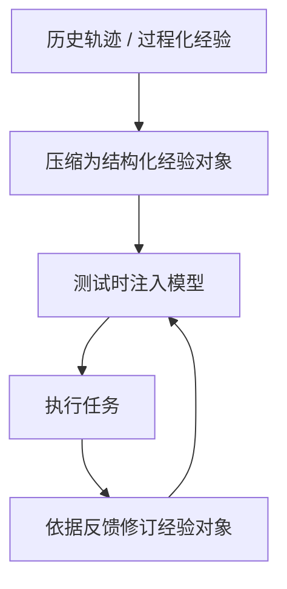
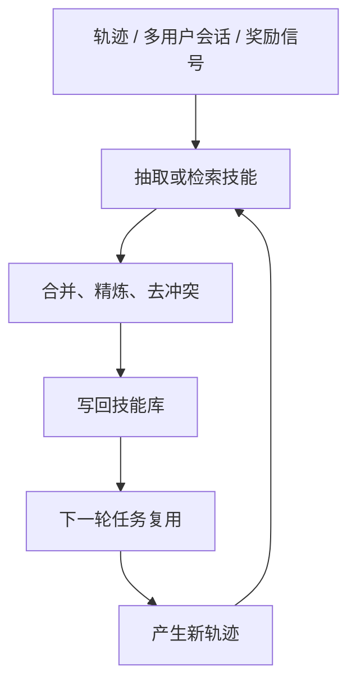
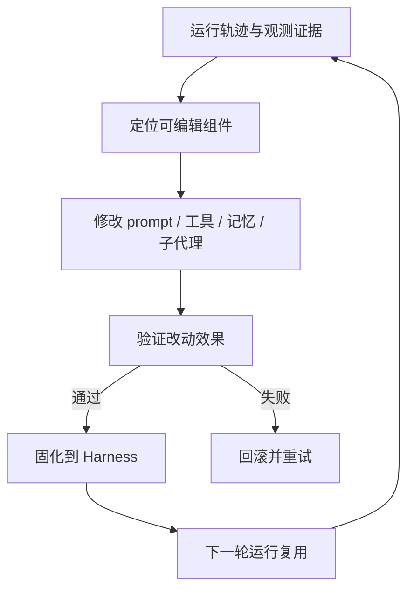

# Agent Self-Evolve 论文综述（2026-05）

这篇是对 [路线总览](./路线总览.md) 的补充。`路线总览.md` 偏路线梳理，这篇偏“逐篇论文总结 + 横向对比”。

> 检索时间：2026-05-30
>
> 说明：以下内容基于当日 arXiv 可见版本整理。带“我的判断”“我更倾向于理解为”的句子，是我基于论文内容做的归纳，不是论文原话。

## 1. 先给结论

这 7 篇论文基本可以分成三条线：

1. **经验表示进化**：关注“经验应该长什么样”，代表是 Strategy Genes。
2. **技能进化**：关注“怎样把轨迹、跨用户经验、强化学习信号沉淀成可复用技能”，代表是 SkillX、Trace2Skill、SkillClaw、Skill1。
3. **Harness 进化**：关注“真正该进化的不只是提示词或技能，还包括工具、中间层、记忆、子代理这些外壳组件”，代表是 AHE 和 Continual Harness。

如果只看一条主线，我会这样概括：

- **Strategy Genes** 在回答“经验对象应如何表示”。
- **SkillX / Trace2Skill / SkillClaw / Skill1** 在回答“经验如何变成可复用技能并持续迭代”。
- **AHE / Continual Harness** 在回答“Agent 的可进化边界能否从技能扩展到整个运行外壳”。

## 2. 三条路线的演化闭环

### 2.1 经验表示进化

这条路线最看重的是：经验要足够短、足够结构化，能够直接充当测试时控制信号。

### 2.2 技能进化

这条路线最看重的是：怎样把零散经验沉淀成可复用、可共享、可持续迭代的技能层。

### 2.3 Harness 进化

这条路线最看重的是：把可进化对象从“经验文本”扩展到整个 Agent 外壳。

## 3. 总览表

| 论文 | 我对它的定位 | 主要进化对象 | 更新信号 | 代表环境 |
| --- | --- | --- | --- | --- |
| [From Procedural Skills to Strategy Genes](https://arxiv.org/abs/2604.15097) | 经验表示研究 | 基因、胶囊、事件 | 执行结果、失败历史、验证记录 | 科学代码求解、CritPt |
| [SkillX](https://arxiv.org/abs/2604.04804) | 预构建技能库 | 分层技能知识库 | 成功轨迹、执行反馈、探索扩展 | AppWorld / BFCL-v3 / τ²-Bench |
| [Trace2Skill](https://arxiv.org/abs/2603.25158) | 轨迹蒸馏式技能生成 | 综合技能或技能目录 | 大量轨迹的并行分析与合并 | spreadsheet / VisionQA / math |
| [SkillClaw](https://arxiv.org/abs/2604.08377) | 多用户集体进化 | 共享技能仓库 | 跨用户会话、夜间验证 | WildClawBench |
| [Skill1](https://arxiv.org/abs/2605.06130) | 强化学习统一训练 | 技能选择、技能使用、技能蒸馏 | 单一任务结果奖励 | ALFWorld / WebShop |
| [Agentic Harness Engineering](https://arxiv.org/abs/2604.25850) | 编码 Agent 外壳自动演化 | Harness 组件 | 轨迹证据、可归因决策、下一轮验证 | Terminal-Bench 2 / SWE-bench-verified |
| [Continual Harness](https://arxiv.org/abs/2605.09998) | 具身 Harness 在线自适应 | 提示词、子代理、技能、记忆、模型 | 单次长运行中的在线反馈、教师重标注 | Pokemon Red / Emerald |

## 4. 逐篇总结

### 4.1 From Procedural Skills to Strategy Genes: Towards Experience-Driven Test-Time Evolution

链接：[arXiv 2604.15097](https://arxiv.org/abs/2604.15097)  
版本：v1，2026-04-16，技术报告

**一句话**：这篇论文的核心主张不是“多给经验”，而是“把经验压缩成更像控制信号的对象”。

**论文要解决什么问题**

- 现有很多经验复用方法把经验写成很长的 skill 文档，默认“写得越完整越好”。
- 作者质疑这一点：长 skill 对人类可读，但对测试时控制不一定有效，甚至可能伤害性能。

**核心方法**

- 把经验对象分成两类：
  - `Skill`：偏文档化、过程化、说明书式的经验包。
  - `Gene`：偏短小、控制导向、可编辑的策略对象。
- 论文把 Gene 形式化为一组结构化字段，核心包括：
  - 适用信号（task-matching signals）
  - 策略摘要（summary）
  - 执行策略（strategy）
  - 避免事项（AVOID cues）
  - 可选约束（optional constraints）
  - 验证钩子（validation hooks）
- 更进一步，它不是只讨论 prompt 格式，而是给出一个 **GEP（Gene Evolution Protocol）**：
  - `Gene`：最小控制单元
  - `Capsule`：带验证记录的任务级执行单元
  - `Event`：不可变的演化事件日志
- 整体演化回路是：`scan -> signal -> intent -> mutate -> validate -> solidify`。

**实验结论**

- 作者在 **4,590 次受控实验、45 个 scientific code-solving 场景**中比较了不同经验表示。
- 论文反复强调一个结果：**紧凑的 Gene 比文档化 Skill 更稳定、更适合作为 test-time control**。
- 代表性结果里，Gene 大约 **230 tokens**，Skill 大约 **2,500 tokens**；Gene 相对 no-guidance baseline 带来提升，而长 Skill 反而可能下降。
- 在鲁棒性测试里，作者发现：
  - 内容被破坏时性能明显下降；
  - 结构扰动对 Gene 的伤害更小。
- 在迭代演化上，作者还发现：
  - 失败历史附着在 Gene 上，比附着在 Skill 或 free-form text 上更有效；
  - 失败信息最好被蒸馏成紧凑 warning，而不是原样拼接。
- 在 CritPt 上，两套 gene-evolved 系统分别从 **9.1% -> 18.57%**、**17.7% -> 27.14%**。

**我怎么理解这篇论文**

- 它本质上是在把“经验”从“知识文档”改造成“控制对象”。
- 如果你的目标是 **让 Agent 在测试时受控、可修订、可变异**，Gene 这类结构化短对象确实比长 skill 手册更合适。
- 这篇论文和后面的 skill/harness 论文其实是一条线：都在把经验从“文本”升级成“可操作资产”。

### 4.2 SkillX: Automatically Constructing Skill Knowledge Bases for Agents

链接：[arXiv 2604.04804](https://arxiv.org/abs/2604.04804)  
版本：v2，2026-04-19，进行中

**一句话**：SkillX 关注的不是单个 skill，而是如何自动造出一个可插拔、可迁移的 SkillKB。

**论文要解决什么问题**

- 许多 self-evolving agent 是“单体学习”：
  - 每个 agent 重复探索；
  - 从很少的经验里反复总结相似行为；
  - 泛化差，样本浪费大。
- 作者想把强 agent 的经验沉淀为 **可被弱 agent 直接复用的技能库**。

**核心方法**

- SkillX 的三大模块：
  - **多层技能设计**：把轨迹抽成三层技能
    - 规划技能（Planning Skills）
    - 功能技能（Functional Skills）
    - 原子技能（Atomic Skills）
  - **迭代式技能精炼**：根据执行反馈反复修订、合并、清洗技能
  - **探索式技能扩展**：主动探索低覆盖工具和高失败模式，扩充技能空间
- 一个关键设计点是：SkillX 不是像 Claude Skills 那样依赖长上下文逐步展开，而是想把技能做成 **分层、轻量、可检索、可一次性注入** 的表示。

**实验结论**

- 论文用 **GLM-4.6** 先构建 SkillKB，再把它插到别的 base agent 上。
- 评测环境是 **AppWorld、BFCL-v3、τ²-Bench**。
- 按论文主结果表，SkillX 在多个 base model 上都带来收益：
  - 对 **Qwen3-32B**，BFCL-v3 `Avg@4` 从 **53.67 -> 63.67**，AppWorld `Avg@4` 从 **27.68 -> 35.12**。
  - 对 **Kimi-K2-Instruct-0905**，AppWorld `Avg@4` 从 **46.88 -> 56.40**。
  - 对 **GLM-4.6** 自身，也仍有提升。
- 论文还强调：
  - execution efficiency 也会变好；
  - multi-level design 比其他经验表示更稳；
  - refinement 和 expansion 继续带来增益。

**我怎么理解这篇论文**

- SkillX 的重点不是“在线自我进化”，而是 **先用强模型把技能库预编译出来，再给别的 agent 用**。
- 所以它更像一个 **skill distillation / skill pretraining** 框架。
- 如果你的系统是多模型、多 agent 共用一个技能层，SkillX 的思路很有价值。

### 4.3 Trace2Skill: Distill Trajectory-Local Lessons into Transferable Agent Skills

链接：[arXiv 2603.25158](https://arxiv.org/abs/2603.25158)  
版本：v4，2026-04-27，进行中

**一句话**：Trace2Skill 反对“来一条轨迹就改一次 skill”，主张先并行看大量轨迹，再合并成一个统一 skill。

**论文要解决什么问题**

- 自动 skill 生成常见两类问题：
  - 只靠模型参数知识，skill 很空；
  - 按轨迹顺序在线改 skill，容易把局部经验过拟合成碎片。
- 作者认为人类专家写 skill 的方式更像：
  - 先看大量案例；
  - 形成整体理解；
  - 再写成一个完整 guide。

**核心方法**

- 三阶段流程：
  - **轨迹生成**（Trajectory Generation）：先滚出一批轨迹；
  - **并行多代理补丁提议**（Parallel Multi-Agent Patch Proposal）：让成功/失败分析子代理并行分析轨迹并提出补丁；
  - **无冲突整合**（Conflict-Free Consolidation）：把补丁分层合并成一个统一、无冲突的技能更新。
- 它支持两种模式：
  - **Deepening**：从已有 human-written skill 出发做增强；
  - **Creation**：从一个很弱的初始 skill 出发，直接造出新 skill。
- 论文的关键哲学是：
  - 不要让 skill 数量越长越碎；
  - 要把大量 trajectory-local lesson 汇总成一个更 generalizable 的 declarative skill。

**实验结论**

- 评测覆盖 spreadsheet、VisionQA、math reasoning 等域。
- 论文强调 evolved skill 不只是“记住题目”，而是能：
  - **跨模型规模迁移**
  - **跨分布泛化**
- 最醒目的结果是：
  - 由 **Qwen3.5-35B** 在自己的轨迹上演化出的 skill，
  - 能把 **Qwen3.5-122B** 在 **WikiTableQuestions** 上的表现提升 **57.65 个百分点**。
- 对 spreadsheet 任务，deepening 和 creation 都能明显优于初始 baseline；有些情形下，自动演化 skill 甚至超过 human-written skill。
- 论文还明确比较了两类替代路线：
  - 在线顺序更新 skill bank
  - retrieval-based experience bank
- 结论是它们都不如这种 **并行分析 + 分层合并** 的方法稳。

**我怎么理解这篇论文**

- 这篇论文很重要的一点，是把 **skill evolution 从“增量修补”改成“批量归纳”**。
- 如果你担心在线自我进化导致 skill 越改越碎，Trace2Skill 给出的答案就是：先做“经验归纳”，再做“技能成稿”。

### 4.4 SkillClaw: Let Skills Evolve Collectively with Agentic Evolver

链接：[arXiv 2604.08377](https://arxiv.org/abs/2604.08377)  
版本：v1，2026-04-09，进行中

**一句话**：SkillClaw 把 skill 进化从“单用户 agent 的自我总结”推进到“多用户共享技能生态的集体进化”。

**论文要解决什么问题**

- OpenClaw 这类系统依赖 skill，但 skill 往往部署后就静态化。
- 多个用户其实会反复踩到相似的问题：
  - 相似 workflow
  - 相似 tool usage pattern
  - 相似 failure mode
- 但这些经验通常被困在各自 session 中，没法变成共享改进。

**核心方法**

- SkillClaw 的闭环可以概括成：
  - `交互 -> 证据 -> 演化 -> 验证 -> 部署`
- 白天：
  - 多用户正常使用 agent；
  - 系统收集 session trajectory。
- 夜间：
  - evolver 聚合跨用户证据；
  - 对已有 skill 做 refine，或补出新 skill；
  - 在真实环境里验证候选 skill；
  - 只把验证通过的 skill 回写到共享仓库，第二天同步给所有用户。
- 论文强调三点特性：
  - collective evolution
  - full automation
  - agentic adaptability

**实验结论**

- 评测在 **WildClawBench**，模拟 **8 个并发用户、6 天 day-night 演化**。
- 用户侧部署结果显示四个类别都有明显提升：
  - Social Interaction：**54.01% -> 60.34%**
  - Search & Retrieval：**22.73% -> 34.55%**
  - Creative Synthesis：**11.57% -> 21.80%**
  - Safety & Alignment：**24.00% -> 32.00%**
- 从论文叙述看，不同类别的演化节奏不同：
  - 有些是 Day 2 就快速修复主瓶颈；
  - 有些需要几轮逐步积累。

**我怎么理解这篇论文**

- SkillClaw 的关键不是 skill 本身的表示，而是 **“跨用户共享经验”终于进入进化回路**。
- 这比单 agent 自己写 reflection 更接近真实产品环境，因为真实线上系统的经验来源本来就是多用户、多时间、多上下文的。

### 4.5 Skill1: Unified Evolution of Skill-Augmented Agents via Reinforcement Learning

链接：[arXiv 2605.06130](https://arxiv.org/abs/2605.06130)  
版本：v3，2026-05-12

**一句话**：Skill1 的贡献是把 skill 的选择、使用、蒸馏三件事放进同一个 RL 目标里联合优化。

**论文要解决什么问题**

- 有 skill library 的 agent 至少要做三件事：
  - 选 skill
  - 用 skill
  - 从新轨迹里提炼 skill
- 现有方法往往把这三件事拆开优化，或者给不同奖励信号，导致演化方向不一致。

**核心方法**

- Skill1 训练一个统一策略，让它完成整条链路：
  - 生成查询去搜索技能库
  - 对候选技能重新排序
  - 条件化使用技能来解题
  - 从轨迹里蒸馏新技能
- 最有意思的是奖励归因设计：
  - **低频趋势** 归因给技能选择
  - **高频波动** 归因给技能蒸馏
- 所有学习都来自 **同一个任务结果信号**，所以技能选择、技能使用、技能蒸馏会共同朝着任务成功率演化，而不是各学各的。

**实验结论**

- 论文在 **ALFWorld** 和 **WebShop** 上评测。
- 结论很明确：
  - Skill1 优于此前的 skill-based baseline 和 RL baseline；
  - 训练动态能看到三种能力在共同演化；
  - ablation 去掉任意一种 credit signal，都会削弱效果。

**我怎么理解这篇论文**

- Skill1 更像“把 skill 系统纳入 RL 框架”的工作。
- 跟 SkillX、Trace2Skill 这些偏“经验工程 / skill 编排”的论文比，Skill1 更偏 **policy learning**。
- 如果你更关心“skill 系统怎样和 RL 整体训练打通”，这篇最值得看。

### 4.6 Agentic Harness Engineering: Observability-Driven Automatic Evolution of Coding-Agent Harnesses

链接：[arXiv 2604.25850](https://arxiv.org/abs/2604.25850)  
版本：v4，2026-05-18

**一句话**：AHE 认为 coding agent 的关键优化对象不是单个 prompt，而是整个 harness，并且 harness 必须先“可观测”才能被自动演化。

**论文要解决什么问题**

- coding-agent 的表现高度依赖 harness，但 harness engineering 通常还是人工 craft。
- 自动化很难做，主要因为：
  - 可编辑动作空间异构；
  - 轨迹太长，关键信号淹没在海量 token 里；
  - 改动效果难归因，容易变成盲目 trial-and-error。

**核心方法**

- AHE 用三层可观测性把问题拆开：
  - **组件可观测性**（component observability）：把 Harness 的每个可编辑部件都做成文件级对象，动作空间显式、可回滚；
  - **经验可观测性**（experience observability）：把百万级轨迹 token 压缩成分层、可下钻的证据语料；
  - **决策可观测性**（decision observability）：每次编辑都带自声明的预测，下一轮验证是否兑现。
- 在实现上，作者把 harness 拆成七类组件：
  - system prompt
  - tool description
  - tool implementation
  - middleware
  - skill
  - sub-agent configuration
  - long-term memory
- 一个重要工程点是：seed harness 故意很小，避免“初始设计太强”掩盖演化本身的贡献。

**实验结论**

- 在 **Terminal-Bench 2** 上，10 轮 AHE 把 `pass@1` 从 **69.7% 提升到 77.0%**。
- 它超过了人类手工设计的 **Codex-CLI（71.9%）**，也超过了自进化 baseline **ACE** 和 **TF-GRPO**。
- 冻结后的 evolved harness 还能迁移：
  - 在 **SWE-bench-verified** 上，以更少 token 获得更高总成功；
  - 在 **Terminal-Bench 2** 上，对 3 个其他模型家族带来 **+5.1 到 +10.1 个百分点** 的增益。
- ablation 结论也很关键：
  - 增益主要来自 **tools / middleware / long-term memory**
  - 而不是 system prompt 本身

**我怎么理解这篇论文**

- 这是“self-evolve”视角里非常工程化的一篇。
- 它其实在说：**要演化 Agent，先把 Agent 拆成可审计、可回滚、可归因的组件**。
- 从这点看，AHE 比很多“让模型自己改 prompt”的工作成熟得多。

### 4.7 Continual Harness: Online Adaptation for Self-Improving Foundation Agents

链接：[arXiv 2605.09998](https://arxiv.org/abs/2605.09998)  
版本：v1，2026-05-11

**一句话**：Continual Harness 把 harness 进化推进到 embodied setting，而且强调 **单次长运行内的在线适应**，不靠 episode reset。

**论文要解决什么问题**

- Claude Code / OpenHands 这类 coding harness 已经存在，但 embodied agent 缺少对应物。
- 对长时程、部分可观测环境，prompt optimization 常常需要 reset episode，再重来一遍。
- 作者要解决的是：**能不能在同一条长运行里边干边改自己**。

**核心方法**

- 从一个最小环境接口开始，Agent 在单次运行里交替进行：
  - 行动
  - 精炼提示词
  - 精炼子代理
  - 精炼技能
  - 精炼记忆
- 它复用了全部历史 trajectory data，但不要求把环境重置。
- 论文后半段又把回路进一步闭合：
  - 一个开源 Agent 通过精炼 Harness 产生轨迹；
  - 前沿教师模型给这些轨迹重标注；
  - 再用这些数据更新模型；
  - 形成 **在线过程奖励协同学习**（online process-reward co-learning）。

**实验结论**

- 论文以 **Gemini Plays Pokemon (GPP)** 的观察为出发点，再把人工参与拿掉，形成自动 Continual Harness。
- 在 **Pokemon Red / Emerald** 上，Continual Harness 从和 minimalist baseline 相同的原始接口出发，
  - 明显降低 button-press cost，
  - 并追回大部分 hand-engineered expert harness 的差距。
- 论文还强调：
  - 这套方法没有 curated knowledge、没有 hand-crafted tools、没有 domain scaffolding；
  - 但仍能在线适应并持续推进 milestone。

**我怎么理解这篇论文**

- 如果 AHE 是“coding harness 的结构化自动演化”，Continual Harness 就是“embodied harness 的在线自适应版本”。
- 它最大的不同不是 skill，而是 **不重置环境、直接在 ongoing run 中自我修正**。

## 5. 横向对比：这几篇论文到底在争什么

### 5.1 它们对“经验”是什么的看法不同

- **Strategy Genes**：经验首先是一个**控制对象**。
- **SkillX / Trace2Skill / SkillClaw / Skill1**：经验首先是一个**技能对象**。
- **AHE / Continual Harness**：经验最后应该沉淀到**整个 agent runtime 外壳**里，而不只是技能文本。

### 5.2 它们的更新粒度不同

- **Gene**：最细，接近 test-time control primitive。
- **Skill**：中等粒度，通常是一段 SOP、工具用法、错误规避规则。
- **Harness**：最大粒度，包含 prompt、工具、memory、middleware、sub-agent 乃至训练闭环。

### 5.3 它们的反馈来源不同

- **Strategy Genes**：执行成功/失败、失败历史、验证钩子。
- **SkillX**：强 agent rollout、执行反馈、主动探索。
- **Trace2Skill**：大规模轨迹池的并行归纳。
- **SkillClaw**：跨用户 session 聚合后的共享证据。
- **Skill1**：统一任务结果奖励。
- **AHE**：任务轨迹证据 + 下一轮 outcome 验证。
- **Continual Harness**：在线环境反馈 + teacher relabel。

### 5.4 它们的验证强度也不同

- **Strategy Genes / SkillX / Trace2Skill / Skill1** 更偏“在 benchmark 上看最终成绩”。
- **SkillClaw** 开始引入“部署前验证再同步”的生产式味道。
- **AHE** 把“每次编辑都必须可归因、可回滚、可 falsify”推进得最彻底。
- **Continual Harness** 则把验证嵌进单条长运行和后续 co-learning loop。

## 6. 我认为最值得吸收的 5 个设计点

1. **经验对象必须结构化。**  
   不管叫 gene、skill 还是 harness component，论文共同趋势都是把经验从 free-form text 变成可编辑资产。

2. **进化前先做可观测化。**  
   AHE 证明，如果 action space 和证据空间不显式，自我进化很容易退化成随机试错。

3. **不要把每条轨迹都直接当最终经验。**  
   Trace2Skill、SkillX 都说明，轨迹更适合作为原材料，应该先抽象、合并、去冲突。

4. **共享经验比孤立反思更值钱。**  
   SkillClaw 说明真实系统里最有价值的信号往往来自跨用户复现，而不是单个 agent 的自言自语。

5. **最终进化对象会从 skill 扩展到 harness。**  
   只进化 skill 是起点，不是终点；工程上更大的收益常常在 tool、memory、middleware、sub-agent 编排。

## 7. 一个更高层的脉络

如果把这批论文放在一条连续谱上，我会这样看：

- **Strategy Genes**：先定义“经验对象应该长什么样”。
- **SkillX / Trace2Skill**：再解决“如何把轨迹压缩成可复用 skill”。
- **SkillClaw / Skill1**：接着解决“如何让 skill 在多用户系统或 RL 训练里持续进化”。
- **AHE / Continual Harness**：最后把进化边界从 skill 扩大到整个 agent operating system。

所以这组论文不是互相替代，而是逐步扩展：

`经验表示 -> 技能沉淀 -> 技能共享/联训 -> Harness 级演化 -> 在线自适应`

## 8. 参考链接

1. [From Procedural Skills to Strategy Genes: Towards Experience-Driven Test-Time Evolution](https://arxiv.org/abs/2604.15097)
2. [SkillX: Automatically Constructing Skill Knowledge Bases for Agents](https://arxiv.org/abs/2604.04804)
3. [Trace2Skill: Distill Trajectory-Local Lessons into Transferable Agent Skills](https://arxiv.org/abs/2603.25158)
4. [SkillClaw: Let Skills Evolve Collectively with Agentic Evolver](https://arxiv.org/abs/2604.08377)
5. [Skill1: Unified Evolution of Skill-Augmented Agents via Reinforcement Learning](https://arxiv.org/abs/2605.06130)
6. [Agentic Harness Engineering: Observability-Driven Automatic Evolution of Coding-Agent Harnesses](https://arxiv.org/abs/2604.25850)
7. [Continual Harness: Online Adaptation for Self-Improving Foundation Agents](https://arxiv.org/abs/2605.09998)
