# Agent 自进化路线总览

配套细读版见：[论文综述](./论文综述.md)。单篇笔记见：[MUSE-Autoskill](./MUSE-Autoskill.md)。

下面用 `mermaid` 流程图重新梳理几种“自我进化”路线。

## 1. SkillX：把经验沉淀成技能库

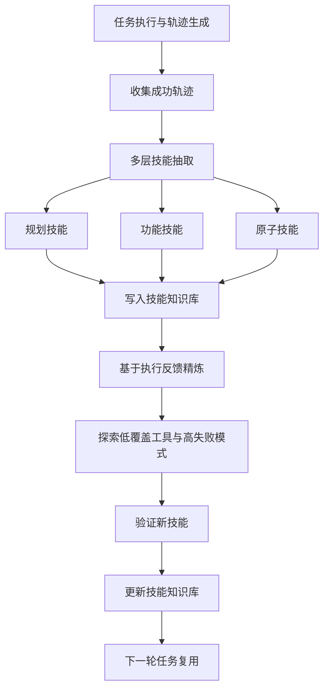

- 进化对象：技能知识库（Skill Knowledge Base，SkillKB）
- 核心机制：轨迹抽取、多层技能表示、反馈精炼、主动扩展
- 一句话：SkillX 让 Agent 的经验沉淀为一个越来越强、可迁移的技能库。

## 2. MUSE-Autoskill：把技能做成长生命周期资产

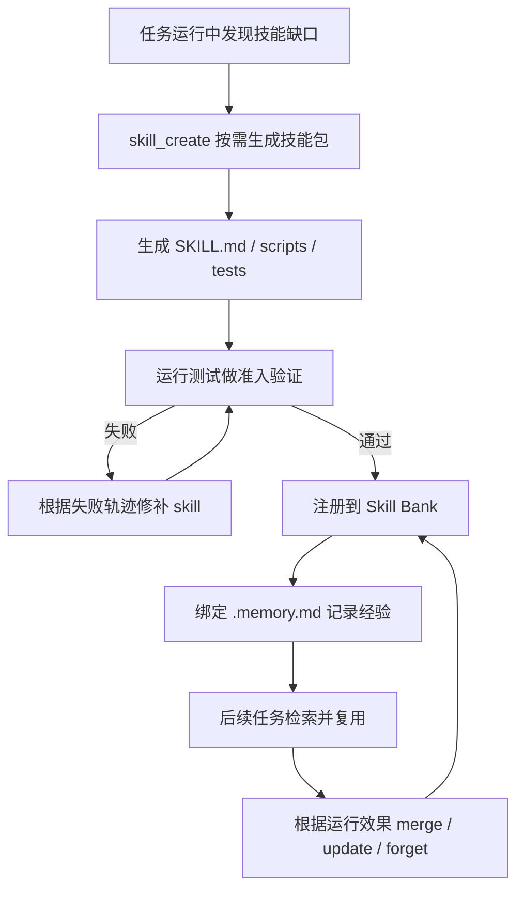

- 进化对象：单个 skill 的完整生命周期
- 核心机制：运行时创建、技能级记忆、测试准入、失败修补、技能治理
- 一句话：MUSE-Autoskill 让 skill 不再是一段静态经验，而是可持续运维的工程资产。

## 3. SkillForge：让领域技能从生产失败中演化

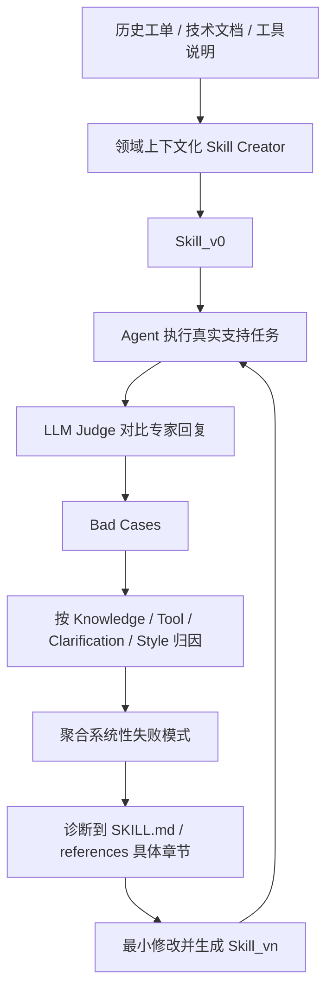

- 进化对象：领域技能包和参考材料
- 核心机制：领域数据 grounding、失败分类、聚合诊断、小步版本化优化
- 一句话：SkillForge 把生产 bad case 变成领域 skill 的持续改进信号。

## 4. Strategy Genes：把经验压缩成策略基因

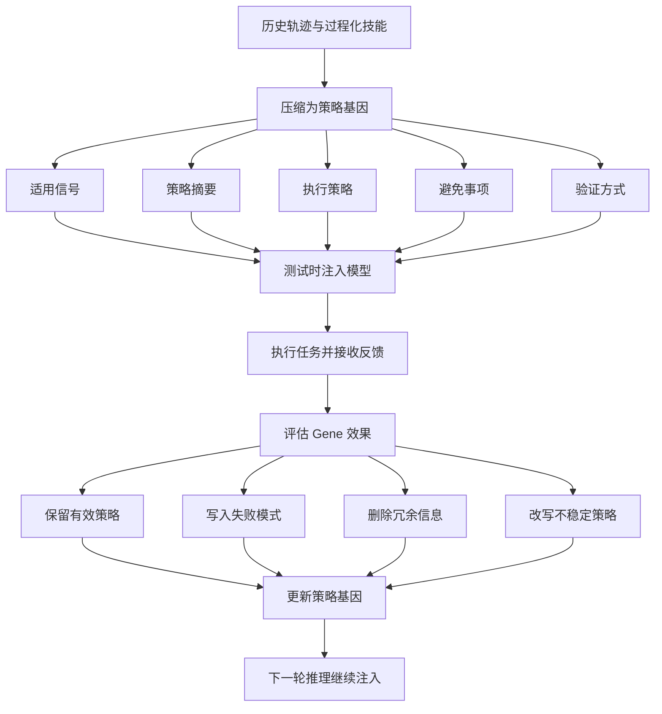

- 进化对象：策略基因（Strategy Gene）
- 核心机制：经验压缩、测试时控制、失败蒸馏、持续修订
- 一句话：Strategy Genes 让经验从“长文档”进化成“短小、可编辑的控制信号”。

## 5. APO / FedTextGrad：把提示词优化做成文本更新闭环

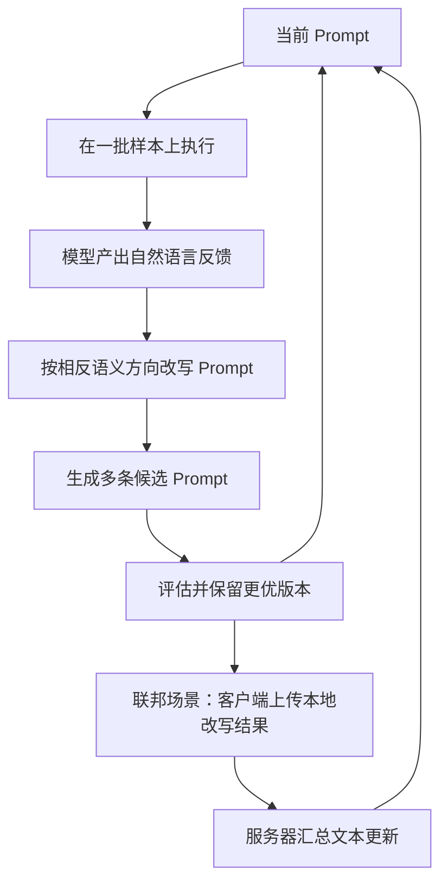

- 进化对象：Prompt 本身，以及如何根据文本反馈改写 Prompt 的规则
- 核心机制：文本梯度、候选改写、beam search、分布式文本聚合
- 一句话：APO 用自然语言批评来自动改 prompt，FedTextGrad 则把这套文本更新闭环推广到联邦学习。

## 6. Autogenesis：把自进化做成协议资源

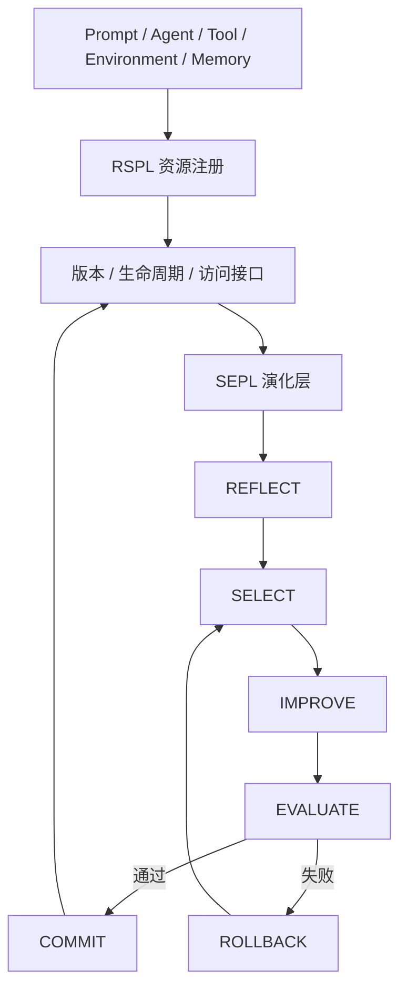

- 进化对象：协议化资源，而不是某个硬编码组件
- 核心机制：资源基底、类型化演化操作、版本谱系、回滚、Trace
- 一句话：Autogenesis 先定义“什么能被安全修改”，再让优化器决定“怎样修改”。

## 7. CoEvolve：让训练数据和 Agent 共同演化

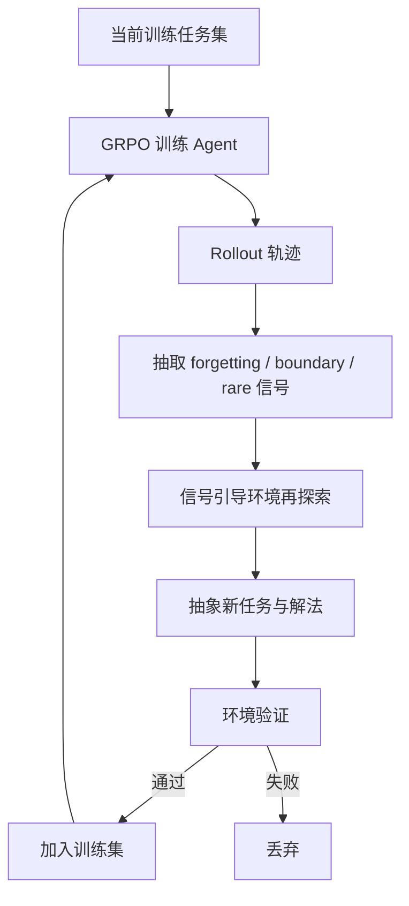

- 进化对象：训练任务分布和 Agent 策略
- 核心机制：弱点信号抽取、环境再探索、任务抽象、执行验证、RL 更新
- 一句话：CoEvolve 让训练集追着 Agent 的当前弱点移动，而不是静态 replay。

## 8. Evolver / GEP：把自进化做成工程流水线

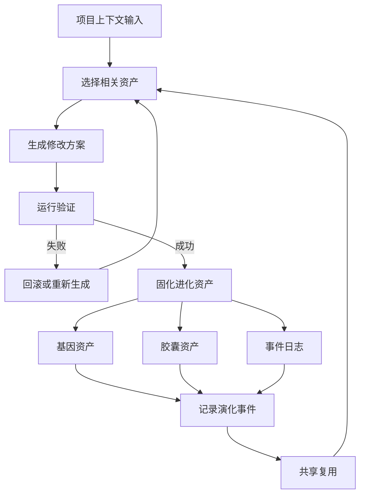

- 进化对象：基因、胶囊、事件日志
- 核心机制：资产选择、修改生成、验证固化、审计复用
- 一句话：Evolver 把自我进化从“写经验”推进成“可验证、可回滚、可审计”的工程系统。

## 9. 总体对比

### 9.1 技能路线

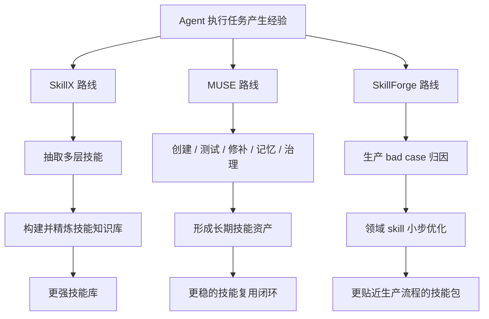

### 9.2 表示、Prompt、协议与工程路线

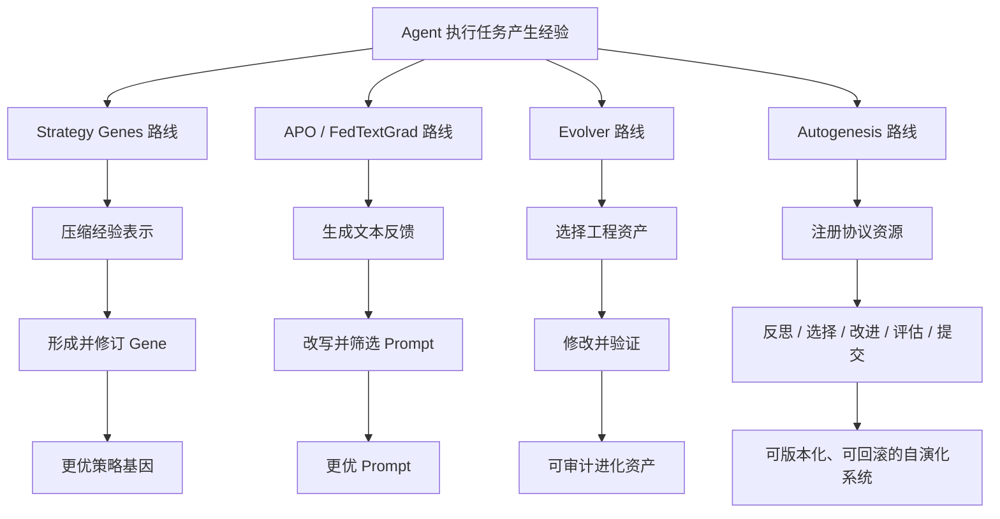

### 9.3 训练数据路线

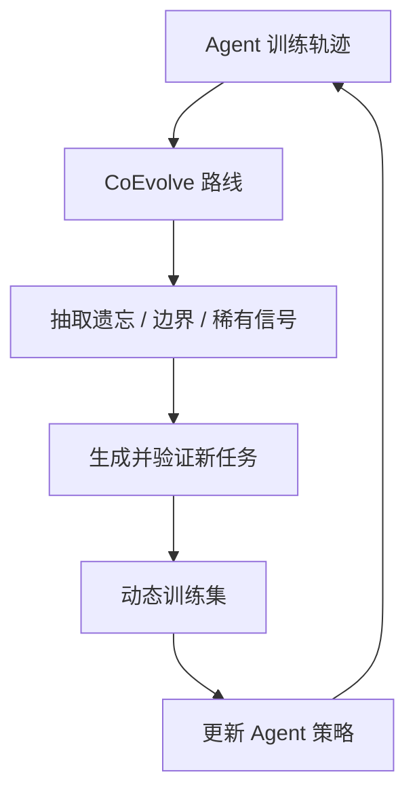

### 9.4 共同结果

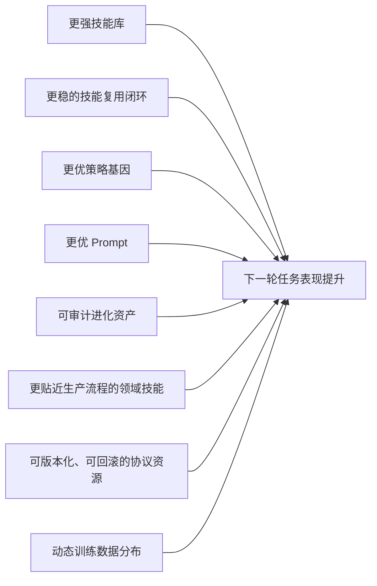

## 10. 最简理解

### 10.1 SkillX

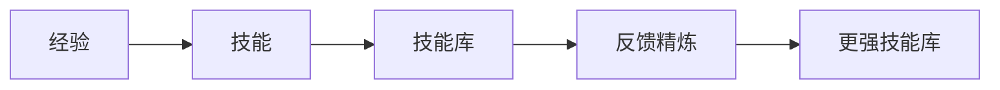

### 10.2 MUSE-Autoskill

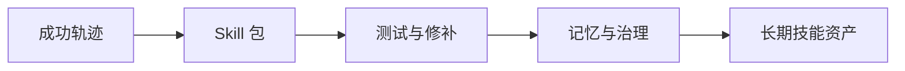

### 10.3 SkillForge

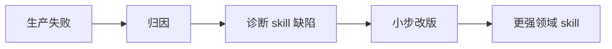

### 10.4 Strategy Genes

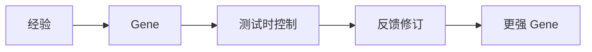

### 10.5 APO / FedTextGrad

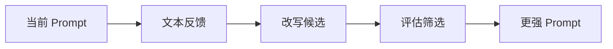

### 10.6 Autogenesis

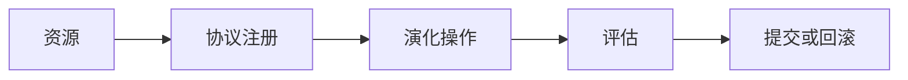

### 10.7 CoEvolve

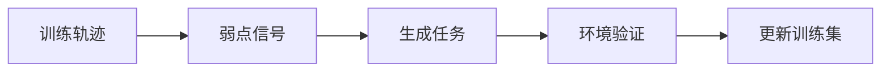

### 10.8 Evolver / GEP

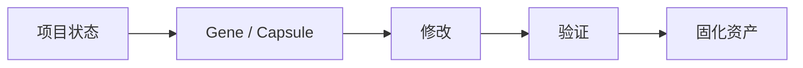

## 11. 一句话总结

- SkillX：进化的是“技能库”。
- MUSE-Autoskill：进化的是“技能的生命周期”。
- SkillForge：进化的是“领域技能的生产适配度”。
- Strategy Genes：进化的是“经验表示”。
- APO / FedTextGrad：进化的是“Prompt 及其文本化更新规则”。
- Autogenesis：进化的是“协议化资源”。
- CoEvolve：进化的是“训练数据分布和策略”。
- Evolver：进化的是“工程资产和演化流程”。
