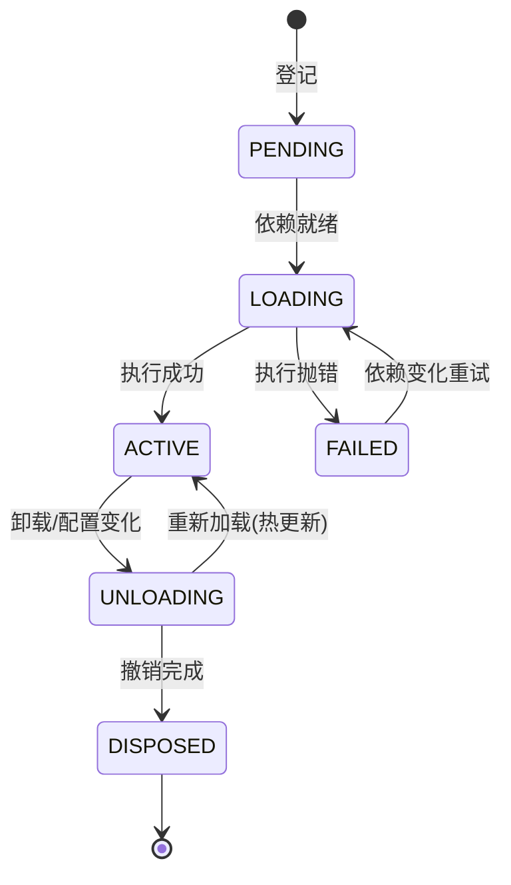

# Cordis 内核拆解：它是"完整"的微内核吗？

> **上一篇文章**拆了 DeepSeek Harness（应用层），这一篇单独看它的地基——Cordis（内核层）。
> **研究目标**：搞清楚 Cordis 到底是什么、它自己声称的"微内核"身份有几分成色，以及如果你想把它当模板做一个逻辑中心，它"完整"在哪、"缺"在哪。
> **一句话结论**：在"应用级微内核架构"这个尺度上，它是完整甚至超纲的；在"操作系统级微内核"（故障隔离）这个尺度上，它刻意不做——下面把两把尺子都拿出来量一遍。

---

## 目录

- [一、Cordis 到底是什么](#一cordis-到底是什么)
- [二、内核有多小：核心包拆开看](#二内核有多小核心包拆开看)
- [三、两把尺子：应用微内核 vs 操作系统微内核](#三两把尺子应用微内核-vs-操作系统微内核)
- [四、逐项对照：完整在哪，缺在哪](#四逐项对照完整在哪缺在哪)
- [五、它比"经典微内核"多出来的东西](#五它比经典微内核多出来的东西)
- [六、结论：什么时候够用，什么时候要补](#六结论什么时候够用什么时候要补)
- [七、参考来源](#七参考来源)

---

## 一、Cordis 到底是什么

Cordis 的自我定位是 **"元框架"（Meta-Framework）**——一个"框架的框架"：它不提供任何业务能力，只提供一套**让插件能被安全装上、拆下、互相发现**的机制。它的设计哲学由一篇论文支撑（《A Programming Paradigm for Spatiotemporal Composability》），核心是两个字：**组合**。

它的出身也说明问题：它曾是聊天机器人框架 Koishi 的底层（在 Koishi 生态打磨了四年），现在被 DeepSeek 选中做 dsh 的插件内核。**一个被两种截然不同的产品（聊天机器人、agent harness）同时使用的内核，本身就是"内核不含业务"的活证据**——如果它含业务，不可能跨域复用。

它到底是不是"微内核"？答案是：**取决于你用哪把尺子量。**

---

## 二、内核有多小：核心包拆开看

先量化一下"薄"到什么程度。Cordis 的核心包（`packages/core`）只有 8 个源文件、约 1800 行代码：

| 文件 | 职责 | 通俗解释 |
|------|------|---------|
| `context.ts` | 上下文：服务的容器 | 插座板本体 |
| `fiber.ts` | 插件生命周期状态机 | 每个插件的"生命控制器" |
| `events.ts` | 事件分发（5 种模式） | 零件之间的通信总线 |
| `registry.ts` | 插件注册表与依赖解析 | 登记处 + 排班表 |
| `reflect.ts` | 服务代理与依赖检查 | "查户口"：服务是否就绪 |
| `service.ts` | Service 基类 | "能力型插件"的基座 |
| `logger.ts` / `utils.ts` | 日志与工具 | 基础设施 |

而配置加载（loader）、热更新（hmr）、插件分组（group）、配置表达式（include）——这些听起来"很内核"的东西，**全部不在内核里，它们本身也是插件**。这是 Cordis 最诚实的微内核姿态：连"装配系统"自己都是可插拔的。

### 内核里真正重要的一个机制：生命周期状态机

每个插件被挂载时，会得到一个 **Fiber（纤维）**——它就是插件的"生命控制器"，状态机如下：

这个状态机回答了微内核最核心的问题：**"拆一个插件，系统怎么知道拆干净了？"** 答案是：每个注册行为都是"可逆副作用"（`ctx.effect()`），卸载时按**注册的逆序**逐个撤销；依赖变化（比如你注入的服务换了个实现）会让 Fiber 自动回到 LOADING 重来一遍。**拆装全程不需要人写清理代码。**

---

## 三、两把尺子：应用微内核 vs 操作系统微内核

"微内核"这个词在软件史上有两个著名含义，判断"完整"之前必须先声明用哪把尺子：

| | 尺子 A：应用微内核（架构模式） | 尺子 B：操作系统微内核（如 L4/seL4） |
|---|---|---|
| 典型代表 | VS Code 扩展系统、Eclipse 插件、Cordis | Mach、L4、seL4 |
| 内核提供 | 进程内的组合机制（服务、事件、生命周期） | 进程间通信、调度、内存隔离、保护域 |
| 主要目标 | **可组合、可扩展、可维护** | **故障隔离、安全、性能** |
| 隔离手段 | 契约与约定（类型、文档、纪律） | 硬件保护（内存页、CPU 特权级） |
| 被隔离物 | 代码模块 | 崩溃/恶意代码本身 |

Cordis 明确属于尺子 A——它是**应用级微内核**。但很多人问"完不完整"，其实想拿尺子 B 来量。所以我们两把都量一遍。

---

## 四、逐项对照：完整在哪，缺在哪

### 4.1 用尺子 A（应用微内核模式）量：基本满分

| 微内核模式要求 | Cordis 的实现 | 评价 |
|---|---|---|
| 内核极简（只留机制） | 8 个文件，无任何业务 | ✅ 教科书级 |
| 插件形态统一 | 函数/对象/类三种写法，统一收口 | ✅ |
| 契约明确 | 服务 key + inject 依赖 + 类型化事件 + 配置校验 | ✅ 甚至更强（见第五节） |
| 插件间只通过契约通信 | 通过 `ctx.<key>` 查找服务，从不 import 实现 | ✅ |
| 动态装卸 | Fiber 状态机 + 可逆副作用，卸载自动撤销 | ✅ 超出模式预期 |
| 装配可配置 | loader 用配置树声明插件与依赖 | ✅ |

**尺子 A 的结论：不只是完整，而是完整得有点超纲**——经典微内核模式（比如 POSA 书里的描述）对"拆掉一个插件会不会留下垃圾"几乎没给出机制，Cordis 用"可逆副作用"把这个洞填了。

### 4.2 用尺子 B（操作系统微内核）量：三项缺失

| 操作系统内核必备 | Cordis 现状 | 缺失后果 |
|---|---|---|
| 故障隔离（插件崩溃不影响系统） | ❌ 同进程，插件抛错只能让自身 FAILED，但**无法阻止插件把整个进程搞崩** | 恶意/有 bug 的插件可以拖垮一切 |
| 资源隔离（CPU/内存配额） | ❌ 没有配额概念 | 一个死循环插件可以卡死整个系统 |
| 安全边界（权限保护域） | ❌ 所有插件共享地址空间与信任 | Cordis 不是安全边界，只是可靠性边界 |

**尺子 B 的结论：不完整，而且它自己也没打算做。** 内核源码里有一句很诚实的注释：如果日志器本身失败，"进程级崩溃是诚实的结局"——它接受了"同进程共生死"这个设定。

---

## 五、它比"经典微内核"多出来的东西

如果用一句话概括 Cordis 相对经典微内核模式的真正差异，那就是论文里那对概念：**时空可组合性**。

| 维度 | 经典微内核模式 | Cordis |
|---|---|---|
| 时间维度（拆装） | 靠插件自觉清理 | **可逆副作用**：运行时跟踪每个注册的"逆操作"，卸载时自动按逆序撤销 |
| 空间维度（依赖） | 插件自己管理依赖 | **响应式依赖**：`inject` 声明依赖后，服务就绪才启动；依赖变化（被换实现）时插件**自动重载** |
| 两者的统一 | 无 | 统一在一个"上下文"模型里，论文做了完整的形式化证明 |

这正是 dsh 敢说"没有特权内核需要打补丁"的原因：**因为连"拆干净"都被机制保证了，所以"换掉任何部件"在工程上永远是低风险的**——这比 VS Code 那种"装扩展要重启、卸载要手动清残留"的老式插件系统，整整先进了一个时代。

---

## 六、结论：什么时候够用，什么时候要补

回到你的问题："Cordis 是完整微内核吗？"——**分场景回答**：

### 当你的目标是"可组合的逻辑中心"（dsh 的用法）→ 完整，直接用

如果你要做的是：一个逻辑内核 + 一堆可热插拔的业务插件 + 强契约 + 配置化装配，那么 Cordis 在应用微内核这个维度上**完整到超纲**。dsh 就是它最完整度的证明：模型、工具、循环、UI 全插件化，还能热更新、还能配置树叠加 patch。

### 当你的目标是"不可信插件的安全托管"→ 不够，必须补边界

如果插件来自不可信来源（下载别人的插件跑在自己系统上），Cordis 缺的三样必须由**宿主应用**补齐：

1. **进程/沙箱边界**：dsh 就是这么做的——把 `sandbox`、`subprocess`、`fs` 做成插件，让 Bash、文件系统都指向远程沙箱，插件再坏也出不了沙箱；
2. **资源配额**：给"死循环/无限内存"的插件戴上限额（超时、token 上限、内存上限）；
3. **权限模型**：决定哪个插件能碰哪些服务（dsh 的审批/权限体系就是这层）。

### 一句话总结

> **Cordis 是一个"协作式"应用微内核：它把"组合"这件事做到了理论级的完整（有论文、有证明、有先例），但它不是"防护式"微内核——它不隔离崩溃、不隔离资源、不隔离恶意。前者是它的舞台，后者是宿主应用的职责。**

对你做逻辑中心最有价值的借鉴是：**用 Cordis 的"机制-业务"二分 + 可逆副作用 + 响应式依赖"三件套"，再在自己的宿主层补上沙箱、配额、权限这三道防护——你得到的将是一个比大多数号称微内核的产品更完整、且被两个真实产品验证过的地基。**

---

## 七、参考来源

- Cordis 仓库（`cordis/`）：`packages/core/src/`（context、fiber、events、registry、reflect、service）、`packages/loader/`、`packages/hmr/`、`packages/group/`、`packages/include/`、各包 `package.json`
- 论文仓库（`paper/`）：《A Programming Paradigm for Spatiotemporal Composability》
- DeepSeek Harness 文档（`deepseek-harness/docs/cordis-primer.zh.md`）：Cordis 五个核心概念与分发模式
- 公开资料：The New Stack / Eigent 对 dsh 与 Cordis 关系的分析
