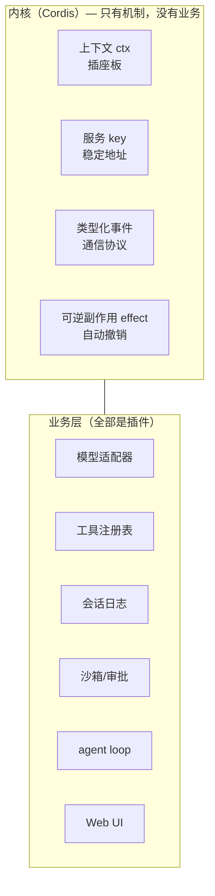
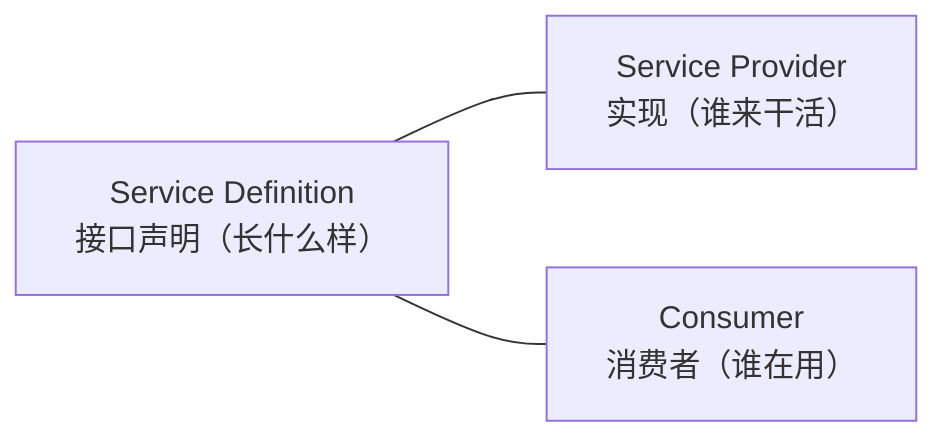
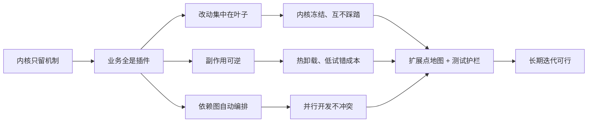

# DeepSeek Harness 架构拆解：一个"微内核式"逻辑中心是怎么设计的

> **研究目标**：搞清楚 DeepSeek Harness（dsh）如何做到"一切皆插件"，为什么这样的架构不怕长期迭代——然后把这套思路提炼成我们自己构建"微内核式逻辑中心"时可复制的清单。
>
> **研究对象**：三个仓库（详见文末参考来源）——`deepseek-harness`（产品本体）、`cordis`（插件内核）、`paper`（内核的设计论文）。Cordis 内核本身的完整拆解见姊妹篇 [Cordis 内核拆解](cordis-microkernel.md)。
>
> **阅读前提**：本文只讲逻辑，不贴大段代码；仅在"契约形状"处给出少量示意，帮助理解而非照抄。

---

## 目录

- [一、先看整体：三个仓库各干什么](#一先看整体三个仓库各干什么)
- [二、为什么能"一切皆插件"：内核里到底剩什么](#二为什么能一切皆插件内核里到底剩什么)
- [三、插件契约如何约定：把"插头规格"定清楚](#三插件契约如何约定把插头规格定清楚)
- [四、迭代可行性如何保证：为什么敢快速改](#四迭代可行性如何保证为什么敢快速改)
- [五、可借鉴的实践清单：自己做一个"微内核式逻辑中心"](#五可借鉴的实践清单自己做一个微内核式逻辑中心)
- [六、参考来源](#六参考来源)

---

## 一、先看整体：三个仓库各干什么

先说结论：**这三个仓库是一套"内核 + 应用 + 理论"的完整组合。**

| 仓库 | 一句话定位 | 扮演角色 |
|------|-----------|---------|
| `deepseek-harness`（dsh） | DeepSeek 开源的 agent harness（智能体外壳），MIT 协议，2026-08 开发者预览 | **应用层**：所有"业务能力"都长在这里 |
| `cordis` | 一个"元框架"：插件怎么挂载、卸载、互相发现 | **内核层**：只提供"装拆零件的机制"，不含任何 agent 业务 |
| `paper` | 论文《A Programming Paradigm for Spatiotemporal Composability》 | **理论层**：把内核的两大机制（可逆副作用、响应式依赖）形式化 |

为什么值得研究？因为 dsh 把插件化推到了极致——**连模型适配器、工具注册表、会话日志、甚至 agent 循环（agent loop）本身都是插件**。官方文档的原话是：

> "不存在需要打补丁的特权内核：扩展 dsh 的方式是把插件挂载到其他插件旁边。"

这句话就是全文的题眼。接下来我们逐个回答三个问题：**为什么能这么做、契约怎么定、迭代怎么保。**

---

## 二、为什么能"一切皆插件"：内核里到底剩什么

### 2.1 反直觉的第一问：什么功能被留在了内核里？

直觉上，"一切皆插件"容易让人以为内核很复杂——毕竟要管理这么多零件。但实际正好相反：**dsh 的内核（Cordis）里几乎没有业务功能**。

举几个 dsh 中"看起来像核心、其实是插件"的东西：

- 模型适配器（接 DeepSeek 还是接别的 API）→ 插件
- 工具注册表（agent 能调哪些工具）→ 插件
- 会话日志与存储（用 JSONL 还是 SQLite）→ 插件
- 沙箱与审批策略 → 插件
- 整个 agent loop（循环驱动）→ 插件
- Web UI → 插件

内核里剩下的，只有四样"机制"：

| 机制 | 通俗解释 | 类比 |
|------|---------|------|
| **上下文（ctx）** | 一块公共"插座板"，所有插件都插在这块板上 | 电脑的 USB 集线器 |
| **服务 key** | 每个插座都有固定编号（`ctx.llm`、`ctx.tools`…），按编号找人而不是按生产厂家 | 集线器上的固定接口 |
| **事件** | 零件之间的通信协议（广播、请求-应答、责任链） | 主板上的总线 |
| **可逆副作用（effect）** | 插件装上去时登记"我改了哪些东西"，拔下来时自动撤销 | 插头的"自动松脱" |



### 2.2 为什么这种设计"必然成立"：三段式推导

"一切皆插件"不是拍脑袋的口号，而是三个前提都满足后**必然**推出的组织方式：

1. **接口稳定**：插件之间通过固定的服务 key 和事件通信，从不直接 `import` 彼此的实现。
2. **实现可拆**：任何注册行为都是"可逆副作用"——卸载插件时，它装上去的一切都被自动撤销，不会残留污染。
3. **消费者只见接口**：用某个能力的人只依赖接口声明（Service Definition），不知道也不关心背后是哪家实现。

当这三个前提同时成立，就得到了一个关键推论：**既然任何零件都可以安全地拆装、替换，那么"把功能做成内核还是插件"就不再是技术问题，而是纯选择问题**——于是选择成本最低的答案：一律做成插件。

这也是 dsh 文档里那句"没有特权内核需要打补丁"的由来：**改动任何业务能力，都不需要动内核代码**，只要在旁边挂一个新的插件。

### 2.3 一个更深的洞察：为什么内核能薄到只剩四样？

内核能这么薄，是因为它抓住了业务的一个"不变量"：**"模型可见 ⟺ 已记录"**——凡是模型能看到的东西，都必须能从会话日志重建。这条规则保证了：只要日志机制在，任何插件（包括"循环"本身）都可以被替换、重放、恢复，不会破坏系统的可追溯性。

所以真正的高手设计不是"把内核写得很大很全"，而是**先找到一个不可动摇的核心事实（不变量），再让内核只守护这个事实，其余全部外置**。

---

## 三、插件契约如何约定：把"插头规格"定清楚

内核只负责"装拆"，那"插头"长什么样、插到哪、互相怎么说话——这些就是**契约**。dsh 的契约分四层，由粗到细：

### 3.1 插件形状：三种写法，一个思想

插件本质是一个"可以被挂载到 ctx 上的代码单元"，有三种写法（形状示意，不必照抄）：

```ts
// 写法一：普通函数（最常见）
const myPlugin = (ctx, config) => {
  // 在这里注册事件、注册服务、安装副作用
}
myPlugin.inject = ['llm', 'tools']  // 声明：我需要这两个服务就绪

// 写法二：对象（带 apply 方法）
const myPlugin = {
  apply(ctx, config) { /* ... */ },
}

// 写法三：类（继承 Service，适合"提供新能力"的插件）
class MyService extends Service {
  constructor(ctx) { super(ctx, 'myKey') }
}
```

注意三种写法背后的统一思想：**插件 = 接收 (ctx, config) 的一段代码**。ctx 是插座板，config 是拧在插头上的旋钮（插件的可配置项）。

### 3.2 依赖契约（inject）：说"我要什么"，而不是"按什么顺序启动"

传统框架里，启动顺序靠人工编排：先启动 A，再启动 B，再启动 C——一旦新增零件就要改这个清单，脆弱。

Cordis 反其道而行：**插件只声明"我需要哪些服务"，内核自动算出加载顺序**。`inject` 声明 `['llm', 'tools']` 意味着"请等这两个服务就绪后再启动我"。顺序由依赖图推导，而不是手写。

### 3.3 服务契约（ctx.key）：一份稳定的"地址簿"

服务是"一个能力 + 一个固定地址"。比如：

| 地址 | 能力 |
|------|------|
| `ctx.llm` | 模型适配器注册表 |
| `ctx.tools` | 工具注册表与执行流水线 |
| `ctx.sessions` | 会话日志与内存存储 |
| `ctx.fs` | 文件系统 |
| `ctx.agents` | 活跃 agent 注册表 |

契约的本质：**`ctx.llm` 这个地址永远指向"模型能力"，至于它是 DeepSeek 官方实现还是第三方实现，消费者不关心**。这正是 2.2 节"消费者只见接口"的实现载体。

### 3.4 事件契约：四种分发模式

插件间通信靠事件。每种事件属于以下四种模式之一（这是公开契约的一部分，写死在事件声明上）：

| 模式 | 行为 | 适合场景 |
|------|------|---------|
| `emit` | 广播通知，监听者各自观察，无返回值 | 记录日志、打点 |
| `waterfall` | 责任链：监听者逐个包装请求，可改可短路 | 审批策略、请求改写 |
| `parallel` | 并行扇出，全部执行 | 无关的并行处理 |
| `serial` | 按注册顺序依次执行，可传结果 | 有顺序要求的协作 |

> 为什么事件也是契约？因为**事件就是扩展点**。你想"拦截所有模型请求"，不需要改内核，只需要监听 `agent/request` 事件；你想"决定这次写入是否允许"，监听 `fs/write-intent` 的 waterfall 事件，有权决定时直接返回而不调用 `next()` 即可。

### 3.5 能力 seam：一个能力 = 三个角色

这是 dsh 最值得抄的设计之一。一个"可替换能力"（seam）由三个角色组成：



- **Definition**（定义）：接口长什么样，方法签名、事件、配置项。
- **Provider**（实现）：真正干活的人，比如"本地文件系统实现"或"远程沙箱实现"。
- **Consumer**（使用方）：通常是对着模型的工具，把能力包装成模型能调用的形式。

设计要点：**"三个角色"必须一起设计，只写接口不叫 seam，只写实现也不叫 seam。** 为什么？因为只有三者齐备，才验证了"这个能力可以被替换"这一核心主张。比如文件系统：Definition 稳定，Provider 换成"远程沙箱"后，Bash、PTY、LSP 全都跟着搬过去——因为它们是 Consumer，只认识 Definition。

### 3.6 契约的校验：类型 + 文档 + 运行时三重保险

光有口头契约不够，dsh 用三层手段让契约"不撒谎"：

1. **类型层**：用 TypeScript 声明合并把服务 key、事件名、载荷类型钉死在类型系统里——写错 key 或事件名，编译期就报错。
2. **文档层**：事件用 `@mode` 标签记录分发模式，有自动生成的目录，还有工具校验"声明的模式"和"实际调用的模式"一致。
3. **运行时**：每个注册行为都返回一个"释放函数"（disposer），并有运行时断言（invariant）守护关键不变量（比如"模型可见即已记录"）。

---

## 四、迭代可行性如何保证：为什么敢快速改

微内核架构最大的风险是"改起来很爽，回头是地狱"——插件多了，依赖乱了，行为互相踩脚。dsh 用下面六条机制把这条路修平：

### 4.1 内核冻结：改动不需要"打补丁给内核"

因为业务全是插件，**绝大多数改动发生在叶子节点**，内核代码几乎不被动。这意味着：长期迭代中，最脆弱、被改动最频繁的部分（业务）恰恰是隔离得最干净的部分。新增一个模型提供方 = 在 `ctx.llm` 上注册适配器；新增一个工具 = 在 `ctx.tools` 上注册。**都不动内核。**

### 4.2 依赖图自动编排：加插件不改启动序列

靠 3.2 节的 inject 机制，新插件加入时，加载顺序由依赖图自动推导。**你不需要改任何"启动清单"**——这也意味着多人并行开发互不冲突：每个人贡献自己的插件，内核负责把它们编排好。

### 4.3 可逆副作用：热卸载、热更新、低试错成本

这是 dsh 相对传统插件系统（如 VS Code 扩展）最突出的差异：**注册是副作用，卸载时自动撤销**。于是：

- 插件可以被热卸载/热重载，不需要重启整个应用；
- 试错成本极低：写一个插件挂上去，不满意，拔下来，一切痕迹自动清除；
- HMR（热模块替换）成为常态，开发迭代可以"边改边看"。

### 4.4 扩展点地图：新行为有明确归属

dsh 的架构文档里有一张"新行为归属表"——**你想加什么功能，文档明确告诉你去哪挂**。这解决了微内核系统最普遍的痛点："我知道一切皆插件，但我不知道我的东西该插哪"。摘录几行：

| 目标 | 机制 |
|------|------|
| 添加模型提供方 | 在 `ctx.llm` 上注册适配器 |
| 添加面向模型的能力 | 在 `ctx.tools` 上注册 |
| 拦截请求/工具/轮次 | 使用 `agent/*` 或 `tools/*` 事件 |
| 添加 shell 执行 | 注册 `ctx.shell` 后端 |
| 添加后台工作 | 在 `ctx.jobs` 上注册 |
| 添加 UI 集成 | 驱动 `ctx.agents` 并从会话事件渲染 |

这张表的意义不只是文档，它是架构的"宪法"：**凡是往系统里加东西，先查表，不查表就乱插，就是破坏架构。**

### 4.5 配置即组装：profile / bundle / patch 分层覆盖

插件之间怎么组合成"一个产品"？答案：**配置**。dsh 的装配模型是分层的：

1. **profile**：一套命名好的装配方案（如 `web`、`headless`）。
2. **bundle（组合包）**：一批插件 + 它们的配置，作为一层分发。
3. **patch（补丁）**：按 id 定位某一层里的某个条目，替换其配置或插入新条目。

各层按顺序叠放，**后一层可以覆盖前一层**——所以"换掉一个能力"在部署层面就是改一行配置，而不是改代码：

```yaml
# 示意：在既有装配之上，插入一个自定义工具
patches:
  - insert:
      - id: my-tool
        name: '@me/my-tool'
```

用 `dsh --profile web --dump-config` 可以打印出真实装配树，任何条目都可用 patch 替换。**这保证了"产品形态"层面的迭代也完全不走代码路径。**

### 4.6 工程护栏：让快速迭代不变成快速翻车

机制只能保证"能做"，要保证"长期能做对"，还得靠工程纪律。dsh 的护栏包括：

- **包级运行时不变量**：每个包注册自己的 invariant 断言，守护"数据关系成立"（如事件流与状态一致），违规即失败；
- **测试门槛**：单测覆盖率按文件 100% 起跳，加上快照测试（回放真实运行、keyless 可重复）、e2e 测试；
- **文档预算**：关键文档有字数上限，防止文档膨胀到没人读；文档与代码强校验（粘贴的类型声明必须与源码一致）；
- **决策记录（Agent Notes）**：重要设计决策记录"为什么、放弃了什么、需要验证什么"，后人能理解而不是考古。

### 4.7 串成一条因果链



---

## 五、可借鉴的实践清单：自己做一个"微内核式逻辑中心"

如果你也想构建一个"逻辑中心"（一个被多方复用、需要长期演进的逻辑内核），从 dsh 可以提炼出五步：

### 第 1 步：先找"不变量"，再定"边界"

动笔前先问：**这个系统里有什么事实是永远成立的？** dsh 找到的是"模型可见 ⟺ 已记录"。你的系统里可能是"所有变更都有审计轨迹"或"每个请求都有唯一归属"。找到它，内核只守护它。

### 第 2 步：内核只留机制，一个业务功能都不要

用"会不会被替换"来测试：**这个功能将来可能换成别的实现吗？可能 → 做成插件，绝不放内核。** 内核只保留：公共上下文、服务寻址、事件机制、副作用管理。四个就够，不要多。

### 第 3 步：契约三件套缺一不可

一个能力成为"可替换能力"，必须同时定义：

1. **服务 key**（地址，稳定不变）；
2. **事件**（通信协议，注明分发模式）；
3. **配置**（插头上的旋钮，可校验）。

只定义其一，就不算完整的契约——尤其"消费者必须只依赖接口"这一点，是替换性的前提。

### 第 4 步：把"卸载干净"当成一等公民

每次注册必须返回释放函数；卸载 = 撤销一切副作用。**测试里要专门写"卸载后系统复原"的用例**（dsh 的 HMR-safety 测试就是这么要求的）。能安全拆卸，才谈得上安全替换。

### 第 5 步：配齐"扩展点地图 + 测试护栏 + 决策记录"

- 文档里写一张"你想加 X → 去 Y 注册"的表，作为架构宪法；
- 关键不变量用运行时断言守护；
- 重要决策留记录，说明"为什么这么做、放弃了什么"。

### 常见误区

| 误区 | 澄清 |
|------|------|
| "插件化 = 配置化" | 插件化是代码组织方式，配置只是组装方式，两者不相等 |
| "内核薄 = 内核弱" | 相反：内核的机制必须非常强（依赖解析、撤销顺序、类型安全），薄指的是业务少 |
| "一切皆插件 = 没有架构" | 恰恰相反：插件越多越需要契约文档和扩展点地图 |
| "先把插件系统写好，再加业务" | 应该从第一个真实业务开始设计契约，纸上谈兵只会过度设计 |

---

## 六、参考来源

- DeepSeek Harness 仓库（`deepseek-harness/`）：`README.zh.md`、`docs/architecture.zh.md`、`docs/cordis-primer.zh.md`、`docs/capability-seams.zh.md`、`docs/module-graph.zh.md`、`docs/AGENTS.md`、`packages/AGENTS.md`、`packages/fs/fs/src/index.ts`、`examples/acp-agent/advanced.cordis.yml`
- Cordis 仓库（`cordis/`）：`README.md`、`packages/core/src/context.ts`、`packages/core/src/registry.ts`
- 论文仓库（`paper/`）：`README.md`（《A Programming Paradigm for Spatiotemporal Composability》）
- 公开资料：DeepSeek 官方发布页（deepseek.com/harness）、The New Stack 与 Eigent 等对 dsh 架构的分析文章
