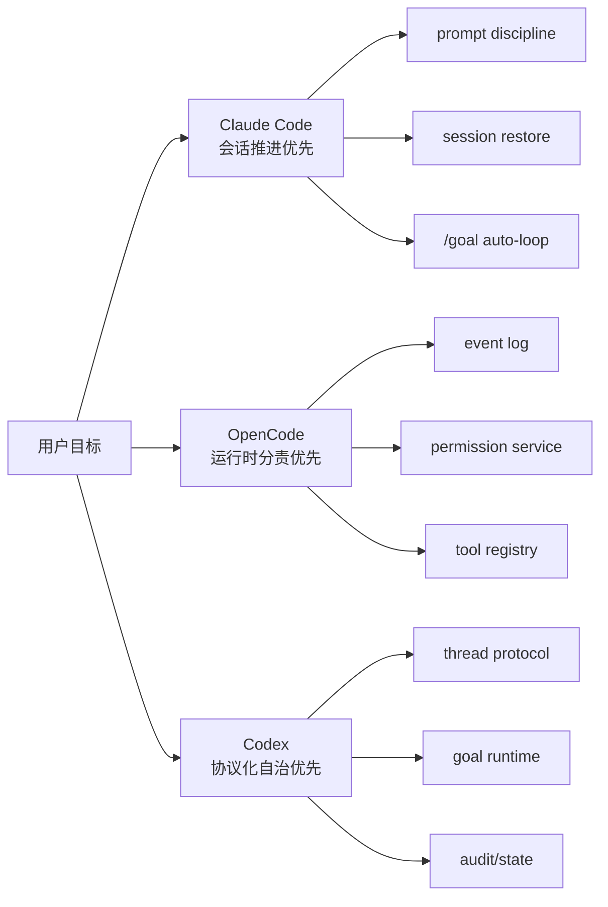
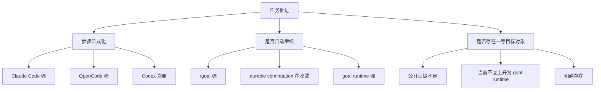

# 关键差异与设计选择：三套 AI 编码 Agent 到底在解哪类问题

这一页不再按“谁有哪些功能”罗列，而是收束一个更有用的问题：

- `Claude Code`、`OpenCode`、`Codex` 分别把什么当成系统主干
- 它们为什么没有收敛成同一种架构
- 如果你要自己做 agent，哪些差异是能力边界，哪些只是实现风格

先给总判断：

- `Claude Code` 的主干是 `prompt discipline + session runtime + /goal 驱动的自动续跑控制`，它优先优化交互式开发中的任务推进与宿主适配。证据类型：本地源码 + 官方文档。`claude-code-src/src/QueryEngine.ts`、`src/Tool.ts`、`src/utils/sessionRestore.ts`、`https://code.claude.com/docs/en/goal`
- `OpenCode` 的主干是 `session/event/permission/tool registry` 组成的 runtime control plane，它优先优化运行时分责、可恢复性和多宿主扩展。证据类型：本地源码 + 官方文档。`opencode/packages/core/src/session/input.ts`、`src/permission.ts`、`src/tool/registry.ts`、仓库内 `opencode/specs/v2/session.md`
- `Codex` 的主干是 `thread/turn/protocol/goal/state`，它优先优化高自治任务的协议化控制、预算约束和可审计恢复；命令执行也被拆到 `command_exec` 与 `process/spawn` 两条通道。证据类型：本地源码。`codex/codex-rs/app-server-protocol/src/protocol/v2/thread.rs`、`command_exec.rs`、`process.rs`、`thread_data.rs`、`ext/goal/src/runtime.rs`、`state/src/audit.rs`

## 总对比表

| 维度 | Claude Code | OpenCode | Codex |
|---|---|---|---|
| 系统主干 | 会话 runtime 与 prompt/tool discipline | session/event/permission/tool registry | thread/turn/protocol/goal/state |
| 第一优先目标 | 交互式开发效率与任务推进 | 运行时可组合性与 durable continuation | 高自治长任务的受控续跑 |
| 规则注入方式 | `CLAUDE.md`、nested memory、skills 分层注入 | `AGENTS.md` 进入 ambient instructions，和历史分轨 | `AGENTS.md` 与 `instruction_sources` 进入 thread 级上下文 |
| 工具控制面 | runtime 内 `canUseTool`、hooks、bridge request，BashTool 再做命令边界 | registry materialize + permission assert + settle 分责 | approval/sandbox/permissions 先入协议，再入 `command_exec` / tool 契约 |
| 任务抽象主角 | todo/task + `/goal` completion condition | session todo + task/subagent + continuation | thread goal 对象 + accounting |
| 恢复主轴 | transcript 与 session restore | durable inbox / event cursor / projected history | thread resume + state audit |
| 子代理主轴 | brief + context factory + verification 工件 | durable background dispatch 语义仍在收敛，且与 background bash 共享 lifecycle 问题 | parent/child thread 与 approval routing |
| 最强优势 | 行为纪律强、交互顺手、宿主适配快 | 边界清楚、扩展面稳、可回放 | 高风险能力受控、状态机完整、审计强 |
| 最大代价 | runtime 耦合高，部分控制面公开度有限 | 抽象层多，理解门槛高 | 协议与状态层重，改动成本高 |

- 证据类型：推断。依据 [设计原则主线](../design-principles/index.md) 下各专题的本地源码、官方文档与公开 issue 综合比较。

## 差异一：谁把“agent 稳定性”压在哪一层

### Claude Code：先把行为纪律钉牢，再把 runtime 补硬边界

- `ToolUseContext`、`QueryEngine`、`bridgeMessaging` 共同说明：Claude Code 不是只有 prompt，但 prompt discipline 仍是最强的行为塑形层。证据类型：本地源码。`claude-code-src/src/Tool.ts`、`src/QueryEngine.ts`、`src/bridge/bridgeMessaging.ts`
- `BashTool` 又把只读校验、sandbox 选择、permission suggestion、background task 链接到 runtime，说明 shell 这类高风险工具并没有停在 prompt 层。证据类型：本地源码。`claude-code-src/src/tools/BashTool/BashTool.tsx`、`bashPermissions.ts`、`readOnlyValidation.ts`
- `/goal` 文档把 completion condition、Stop hook、自动续跑写成一套联动机制，说明它把“继续干活”放在会话编排层，而不是 thread goal 对象层。证据类型：官方文档。`https://code.claude.com/docs/en/goal`、`https://code.claude.com/docs/en/best-practices`

这条路线的设计选择是：

- 优先让模型在一个强纪律交互循环里表现稳定；
- 再用 permissions、hooks、bridge control request 把高风险边界补硬；
- 不急着把所有能力都升格成公开协议对象。

trade-off 很清楚：

- 好处是交互体验顺，prompt、工具、规则文件能快速一起演进。
- 代价是很多关键能力仍嵌在 runtime 内部，做跨宿主统一控制面会更难。

### OpenCode：先拆责任，再决定模型能看到什么

- `ToolRegistry.materialize()` 负责目录暴露，`PermissionV2.assert()` 负责执行授权，`settle()` 负责结果结算，这是一条非常刻意的分责链。证据类型：本地源码。`opencode/packages/core/src/tool/registry.ts`、`src/permission.ts`
- `tool/bash.ts` 还主动把 background launch、durable progress、restart recovery 标成待实现，说明 OpenCode 更愿意公开“未收敛面”，而不是先把 shell/background 执行包装成稳定成品。证据类型：本地源码。`opencode/packages/core/src/tool/bash.ts`
- `SessionInput.admit()` 与 `Prompted` 分离、`Context Epoch` 独立推进，说明它把“输入接收”“历史投影”“上下文更新”拆成了 durable runtime 事件，而不是一段 prompt 魔法。证据类型：本地源码。`opencode/packages/core/src/session/input.ts`、`src/session/context-epoch.ts`

这条路线的设计选择是：

- 先让控制面职责边界稳定；
- 再让 prompt、tool、permission、session 各自作为 runtime 组件协作；
- 对还没收敛的 continuation/background 语义明确保留 TODO，而不是先包装成完整成品。

trade-off：

- 好处是可替换、可测试、可扩展。
- 代价是系统理解成本比“一个 CLI agent”高很多。

### Codex：先定义协议和状态，再让模型获得受限入口

- `ThreadStartParams` 直接携带 `approval_policy`、`sandbox`、`permissions`、`dynamic_tools`，说明控制面早于工具暴露存在。证据类型：本地源码。`codex/codex-rs/app-server-protocol/src/protocol/v2/thread.rs`
- `command_exec.rs` 与 `process.rs` 分别描述“沙箱中的 standalone command”和“宿主上的 standalone process”，说明它连命令执行通道本身都放在协议里分层。证据类型：本地源码。`codex/codex-rs/app-server-protocol/src/protocol/v2/command_exec.rs`、`process.rs`
- `goal` 通过 `get_goal/create_goal/update_goal` 开放，但 pause/resume/budget-limit 明确不让模型自行改写，说明 tool authority 被刻意收紧。证据类型：本地源码。`codex/codex-rs/ext/goal/src/spec.rs`、`tool.rs`

这条路线的设计选择是：

- 先把状态对象和协议边界定义完整；
- 再让模型通过有限工具接触状态；
- 让“能继续跑多久、由谁批准、如何恢复”都成为协议问题，而不是对话习惯。

trade-off：

- 好处是高自治能力更可控、更可审计。
- 代价是每加一个能力都可能同时触碰协议、runtime、state。

## 差异二：任务推进到底依赖 todo、continuation 还是 goal

- `Claude Code` 最强的是会话任务清单与 completion-condition-driven auto-loop，不应误写成和 Codex 等价的线程级 goal 状态机。证据类型：本地源码 + 官方文档 + 推断。`claude-code-src/src/tools/TodoWriteTool/*`、`TaskCreateTool/*`、`https://code.claude.com/docs/en/goal`
- `OpenCode` 最强的是持久化 session todo 与 continuation/runtime 组合，不应把 `todowrite` 或 `task/subagent` 误写成显式 goal 对象。证据类型：本地源码 + 官方文档。`opencode/packages/core/src/session/todo.ts`、`src/tool/todowrite.ts`、仓库内 `opencode/specs/v2/todo.md`
- `Codex` 则明确有线程级 goal、budget、elapsed accounting 与状态迁移限制。证据类型：本地源码。`codex/codex-rs/ext/goal/src/runtime.rs`、`accounting.rs`

这背后的核心设计选择不是“名字不同”，而是：

- Claude Code 解决“别漏步骤、条件没满足就继续”。
- OpenCode 解决“运行时怎样安全地继续和重放”。
- Codex 解决“长期目标怎样在状态机里受控推进”。

## 差异三：中断、恢复、审批为什么不能写成同一套故事

- `Claude Code` 的恢复主轴是 transcript/session restore，审批和续跑则分别靠 runtime permission 与 `/goal`/Stop hook；这是三条不同链路。证据类型：本地源码 + 官方文档。`claude-code-src/src/utils/sessionRestore.ts`、`src/Tool.ts`、`https://docs.anthropic.com/en/docs/claude-code/hooks`
- `OpenCode` 的恢复主轴是 event/projection reload，审批主轴是 `PermissionV2` request lifecycle，两者通过 runtime 事件协作。证据类型：本地源码。`opencode/packages/core/src/session/history.ts`、`src/permission.ts`
- `Codex` 则把恢复、审批、goal 分别做成 thread 协议、permission profile、goal runtime。证据类型：本地源码。`codex/codex-rs/app-server-protocol/src/protocol/v2/shared.rs`、`thread.rs`、`ext/goal/src/runtime.rs`

如果把三家都写成“有审批、有恢复、有自动继续，所以基本一样”，就会漏掉真正的工程 trade-off。  
证据类型：推断。依据 [权限审批与人工接管](../design-principles/permission-approval-and-human-override.md)、[中断、恢复与可追溯](../design-principles/interrupt-resume-and-traceability.md) 的综合比较。

## 收束：最值得记住的核心设计选择

1. `Claude Code` 选择的是“强行为纪律 + 会话 runtime 补硬边界”。
   证据类型：推断。依据 `QueryEngine.ts`、`Tool.ts`、`/goal` 文档。
2. `OpenCode` 选择的是“先把 runtime 分责，再让模型运行在这些责任边界内”。
   证据类型：推断。依据 `session/input.ts`、`permission.ts`、`tool/registry.ts` 与 `specs/v2/session.md`。
3. `Codex` 选择的是“先把自治能力协议化，再让模型以受限方式接触状态”。
   证据类型：推断。依据 `thread.rs`、`spec.rs`、`tool.rs`、`runtime.rs`。
4. 三家不是同一种架构的三种皮肤，而是三种不同的系统重心。
   证据类型：推断。依据本页全部对照和前序专题证据。

如果你只抄一张表，就抄上面的总对比表；如果你只记一句话，就记这一句：

`Claude Code` 在优化会话里的执行感觉，`OpenCode` 在优化 runtime 的职责边界，`Codex` 在优化高自治任务的协议化控制。  
证据类型：推断。依据本页比较结论。
