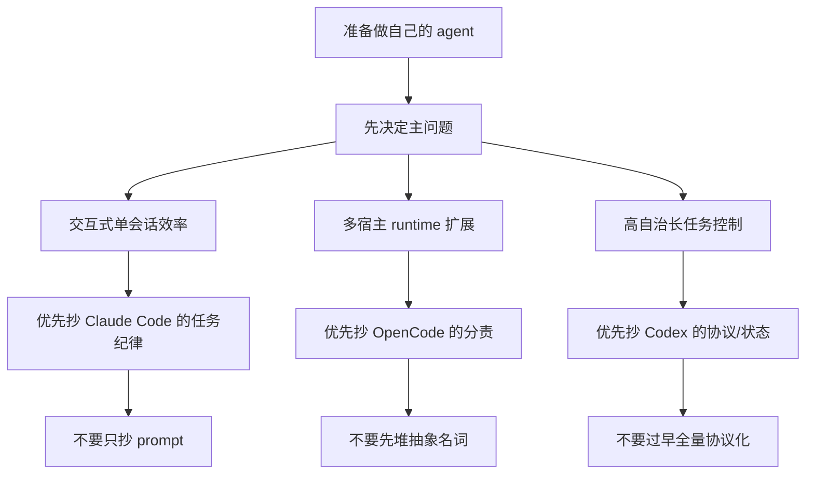
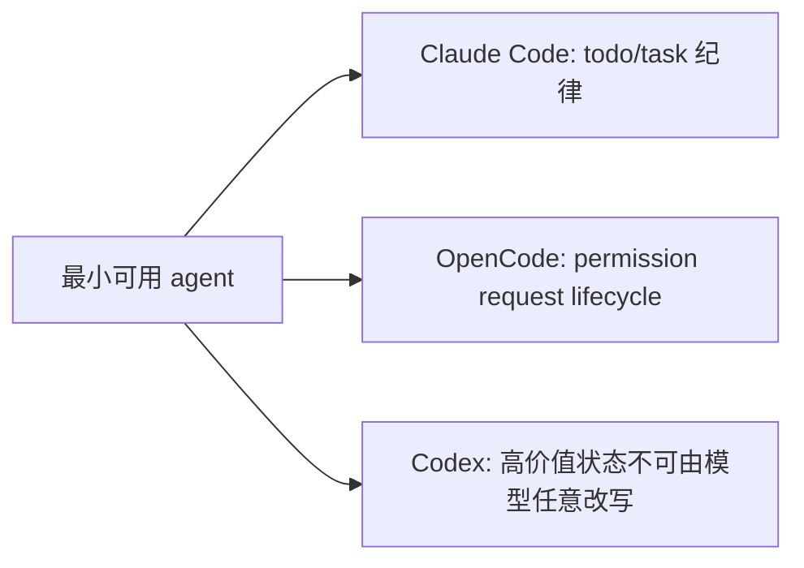

# 自建 Agent 时该抄什么、不该抄什么

这一页不回答“哪家最好”，只回答一个更实际的问题：

- 你从 `Claude Code`、`OpenCode`、`Codex` 各自最该抄什么
- 哪些东西看起来很强，但直接照搬大概率会把系统做坏

先给结论：

- 最值得直接抄的是 `结构化状态对象、权限边界、恢复链路、证据可追溯性`，不是某段系统提示词。证据类型：推断。依据本专题各页对稳定性来源的综合比较。
- `Claude Code` 最值得抄的是会话任务纪律和规则分层注入；最不该照搬的是把大量控制逻辑继续隐含在 prompt 里。证据类型：本地源码 + 官方文档 + 推断。`claude-code-src/src/QueryEngine.ts`、`src/tools/TodoWriteTool/prompt.ts`、`https://code.claude.com/docs/en/goal`
- `OpenCode` 最值得抄的是 runtime 分责和 permission lifecycle；最不该照搬的是在没有事件骨架时硬复制它的抽象层数。证据类型：本地源码 + 官方文档。`opencode/packages/core/src/permission.ts`、`src/tool/registry.ts`、仓库内 `opencode/specs/v2/session.md`
- `Codex` 最值得抄的是 thread/goal/protocol/audit 的边界清晰度；最不该照搬的是在产品还没到那个复杂度时过早协议化一切。证据类型：本地源码。`codex/codex-rs/app-server-protocol/src/protocol/v2/thread.rs`、`ext/goal/src/spec.rs`、`state/src/audit.rs`

## 一条先验原则：先抄“稳定性来源”，不要先抄“表现层”

真正让 agent 稳的，通常不是：

- UI 长什么样
- 回答语气像不像人
- prompt 写得多像某家

而是下面四样：

1. 状态对象是否显式。
2. 权限边界是否硬编码在 runtime / protocol 里。
3. 中断与恢复是否有单独链路。
4. 关键结论能不能回到源码、文档和事件上复核。

这四点分别能在三家里找到非常清楚的正例。  
证据类型：推断。依据 `Claude Code session restore`、`OpenCode permission/event`、`Codex goal/state/audit` 的对照。

## 可以直接抄的设计

### 1. 抄 Claude Code 的“任务纪律”，不是抄整段人格 prompt

值得抄：

- 把当前工作显式拆成少量 `pending / in_progress / completed` 步骤，并要求及时更新。证据类型：本地源码。`claude-code-src/src/tools/TodoWriteTool/prompt.ts`、`TodoWriteTool.ts`
- 把项目规则、嵌套规则、技能说明做成分层注入，而不是所有内容塞进一段系统提示词。证据类型：本地源码。`claude-code-src/src/bootstrap/state.ts`、`src/QueryEngine.ts`
- 把 `/goal` 这种 auto-loop 能力建立在完成条件之上，而不是无限“继续执行”提示。证据类型：官方文档。`https://code.claude.com/docs/en/goal`

不该照搬：

- 指望只靠 prompt 复现 Claude Code 的执行稳定性。证据类型：推断。依据 `Tool.ts`、`QueryEngine.ts`、`bridgeMessaging.ts` 已存在大量 runtime 硬边界。
- 在没有恢复链路时先抄 `/goal` 式自动续跑。证据类型：公开 issue / discussion + 推断。`anthropics/claude-code#65099`、`#58558`

更稳的抄法是：

- 先做 todo/task 状态对象；
- 再做规则分层；
- 最后才做条件驱动续跑。

### 2. 抄 OpenCode 的“控制面分责”，不是抄术语表

值得抄：

- 把“可广告给模型的工具目录”和“执行时权限检查”拆开。证据类型：本地源码。`opencode/packages/core/src/tool/registry.ts`、`src/permission.ts`
- 把 `输入已接收` 和 `输入已进入模型历史` 分成两个 durable 事件。证据类型：本地源码。`opencode/packages/core/src/session/input.ts`
- 让工具自己显式声明要访问哪些资源，而不是靠一个万能 registry 替它兜底。证据类型：官方文档 + 本地源码。仓库内 `opencode/specs/v2/tools.md`、`opencode/packages/core/src/tool/todowrite.ts`

不该照搬：

- 在没有 event log、history projection、context epoch 的前提下，先复制 `PermissionV2`、`ToolRegistry` 这类抽象名词。证据类型：推断。依据这些对象依赖 durable runtime 骨架才能成立。
- 把 OpenCode 还在 TODO 中收敛的 background continuation 语义，当成现成模板直接抄。证据类型：官方文档。仓库根 `opencode/TODO.md`、仓库内 `opencode/specs/v2/todo.md`

更稳的抄法是：

1. 先有 durable 输入/事件骨架。
2. 再有 permission request lifecycle。
3. 最后才拆 registry、tool settlement、background dispatch。

### 3. 抄 Codex 的“高自治控制边界”，不是抄复杂度

值得抄：

- 把长期目标做成显式对象，并绑定状态、预算、耗时，而不是只写一句自然语言目标。证据类型：本地源码。`codex/codex-rs/ext/goal/src/spec.rs`、`runtime.rs`、`accounting.rs`
- 把 approval policy、reviewer、permission profile、tool authority 明确分层。证据类型：本地源码。`codex/codex-rs/app-server-protocol/src/protocol/v2/shared.rs`、`permissions.rs`
- 给高价值状态变更多留一道“工具契约不能越权”的硬限制。证据类型：本地源码。`codex/codex-rs/ext/goal/src/tool.rs`
- 给恢复和审计留结构化状态库入口。证据类型：本地源码。`codex/codex-rs/state/src/audit.rs`

不该照搬：

- 在还没有真实长任务、预算和审批场景时，就先把所有能力协议化成大而全的 thread runtime。证据类型：推断。依据 Codex 的结构优势正好来自复杂度投入。
- 把“模型能看到 goal 工具”误写成“模型可以自己控制全部 goal 生命周期”。证据类型：本地源码。`codex/codex-rs/ext/goal/src/spec.rs`

更稳的抄法是：

- 只有当你真的需要长时运行、自动续跑、人工审批和恢复追责时，再引入 Codex 这一层复杂度。

## 哪些设计值得组合着抄

### 适合大多数自建 agent 的最小组合

推荐组合：

1. 用 Claude Code 的思路做会话任务纪律。
   证据类型：推断。依据 `TodoWriteTool` 与 task 更新习惯。
2. 用 OpenCode 的思路拆 permission 与 tool catalog。
   证据类型：推断。依据 `permission.ts` 与 `tool/registry.ts`。
3. 用 Codex 的思路保护 goal、approval、budget 这类高价值状态。
   证据类型：推断。依据 `thread/shared/goal` 协议与工具契约。

这套组合足够覆盖多数“单会话编码 agent + 有少量自动化”的场景。

### 只有在这些前提成立时，才值得抄更重的部分

| 前提 | 值得追加抄的设计 | 不满足时的风险 |
|---|---|---|
| 需要长任务自动续跑 | Claude `/goal` 的 completion-condition 思路，或 Codex 的 goal runtime | 会做出无法正确停止的自动循环 |
| 需要多宿主/远端/后台执行 | OpenCode 的 event/runtime/control-plane 分责 | 会把 UI 回调误当成系统状态 |
| 需要严格审批与审计 | Codex 的 approval/profile/audit 分层 | 会把“用户点过一次允许”误当长期授权 |

- 证据类型：推断。依据三家能力重心与公开失效面比较。

## 明确不要照搬的四类反模式

1. `只抄 prompt，不抄状态对象`
   证据类型：推断。因为三家的稳定性都明显不只来自 prompt。
2. `把 todo、task、goal 混成一个对象`
   证据类型：本地源码 + 推断。`Claude Code`、`OpenCode`、`Codex` 在这三层上都显式不同。
3. `把 approval、sandbox、tool authority 混成一个“权限系统”`
   证据类型：本地源码。`OpenCode permission.ts`、`Codex shared.rs/permissions.rs/spec.rs`
4. `先做自动续跑，再补恢复和取消`
   证据类型：公开 issue / discussion + 官方文档。`anthropics/claude-code#65099`、仓库根 `opencode/TODO.md`、`openai/codex#28574`

## 收束：按成熟度抄，而不是按品牌抄

如果你的系统还在第一阶段，先抄这些：

- Claude Code 的任务纪律。
- OpenCode 的 permission lifecycle。
- Codex 的“高价值状态不能任意改写”。

如果你的系统已经进入第二阶段，再考虑这些：

- OpenCode 的 event/runtime/control-plane 分层。
- Codex 的 goal/accounting/audit。
- Claude Code 的 completion-condition auto-loop。

最后一句建议：

不要问“我该抄哪一家”，更该问“我当前最缺的是任务纪律、运行时分责，还是高自治控制”。  
证据类型：推断。依据本页全部比较。
