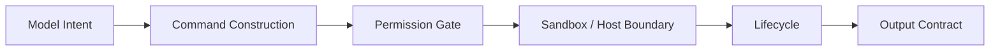

# Bash 工具与命令执行：真正要设计的是边界，不是 `run(command: string)`

这一篇只讨论一个经常被写扁的问题：

- shell/bash 工具到底是不是“给模型一根命令字符串，再把输出贴回来”。

先给结论：

- 不是。一个能上线的 bash 工具，至少同时包含 `command construction + permission gate + sandbox boundary + lifecycle + output contract`。
- `Claude Code` 的 `BashTool` 已经把只读校验、破坏性判断、permission suggestion、sandbox 选择、foreground/background task 线索做进实现，不能写成“只靠 prompt discipline”。
  - 证据类型：本地源码。`claude-code-src/src/tools/BashTool/BashTool.tsx`、`bashPermissions.ts`、`readOnlyValidation.ts`、`shouldUseSandbox.ts`
- `OpenCode` 当前公开的是一个刻意收窄的 `V2 core shell boundary`；background bash jobs、durable status observation、completion delivery、explicit cancellation 仍明确挂在 TODO 上。
  - 证据类型：本地源码 + 官方文档。`opencode/packages/core/src/tool/bash.ts`、`opencode/specs/v2/todo.md`、`opencode/specs/v2/schema-changelog.md`
- `Codex` 没把命令执行塞成单一 shell tool，而是拆成 `thread/app-server control plane + command_exec sandbox exec + process/spawn host process`。
  - 证据类型：本地源码。`codex/codex-rs/app-server-protocol/src/protocol/v2/thread.rs`、`command_exec.rs`、`process.rs`、`permissions.rs`

## 问题定义：bash 工具其实在同时解决五件事

如果把 bash 工具理解成：

- 输入一段字符串；
- 返回一段 stdout/stderr；

那会漏掉真正困难的部分：

1. `command construction`：模型写出来的是不是安全、可解释、可审批的命令。
2. `permission gate`：哪些命令、哪些路径、哪些资源需要批准。
3. `sandbox boundary`：命令到底跑在什么文件系统、网络和进程边界内。
4. `lifecycle`：长时任务、后台任务、取消、恢复、超时怎么处理。
5. `output contract`：输出是否截断、如何保留、如何对模型回传。

只要其中一层没设计清楚，bash 工具就会退化成“看起来能跑，实际上难以控制”的黑盒。

## Claude Code：`BashTool` 不是裸 shell，而是 runtime 安全边界的一部分

`Claude Code` 的实现很能说明 bash 工具为什么不能只看 schema：

- `BashTool.tsx` 在输入 schema 之外，还额外接入只读判断、路径约束、`sed` 约束、sandbox 选择、输出存储和前后台任务管理。
  - 证据类型：本地源码。`claude-code-src/src/tools/BashTool/BashTool.tsx`
- `readOnlyValidation.ts` 维护了大批只读命令与 flag allowlist，连 `fd`、`xargs`、`sed`、`git` 等都按“只读语义是否成立”逐项校验。
  - 证据类型：本地源码。`claude-code-src/src/tools/BashTool/readOnlyValidation.ts`
- `bashPermissions.ts` 不只做 allow/deny，还会解析命令前缀、复合命令、wrapper、安全 env var，并生成 permission suggestion。
  - 证据类型：本地源码。`claude-code-src/src/tools/BashTool/bashPermissions.ts`
- `shouldUseSandbox.ts` 明确区分“是否启用 sandbox”“是否允许 unsandboxed commands”“哪些命令匹配用户排除规则”；关闭 sandbox 不是一个公开给模型随意使用的普通参数。
  - 证据类型：本地源码。`claude-code-src/src/tools/BashTool/shouldUseSandbox.ts`
- `BashTool` 还能把阻塞命令自动转进 foreground/background task 流程，并在 UI 里给出后台提示。
  - 证据类型：本地源码。`claude-code-src/src/tools/BashTool/BashTool.tsx`、`UI.tsx`

更稳的判断是：

- `Claude Code` 的 bash 方案属于“交互式 runtime 里的强约束 shell 工具”；
- prompt discipline 仍重要，但实际安全边界已经下沉到 permission、sandbox、task lifecycle 和 bridge/runtime 里。

## OpenCode：受信执行器已成型，但后台 bash 生命周期仍在收敛

`OpenCode` 的 V2 shell 边界故意写得很克制：

- `specs/v2/tools.md` 把本地工具统一成 opaque executor，并强调 trusted built-ins 由工具自己调用 `permission.assert(...)`，registry 不注入万能授权助手。
  - 证据类型：官方文档 + 本地源码。`opencode/specs/v2/tools.md`、`opencode/packages/core/src/permission.ts`
- `packages/core/src/tool/bash.ts` 的文件头直接写明：这是 “Minimal V2 core shell boundary”。
  - 证据类型：本地源码。`opencode/packages/core/src/tool/bash.ts`
- 这个 `bash` 工具已经做了几件关键事：工作目录解析、external directory 审批、命令字符串资源审批、超时与 capture 上限、结构化输出。
  - 证据类型：本地源码。`opencode/packages/core/src/tool/bash.ts`
- 但同一文件也把 parser-based approval reduction、durable/live progress、background launch、HTTP background-job observation 全都留在 TODO。
  - 证据类型：本地源码。`opencode/packages/core/src/tool/bash.ts`
- `specs/v2/todo.md` 与 `schema-changelog.md` 进一步把 `background bash jobs` 重新定义成需要 durable status observation、completion delivery、explicit cancellation semantics 的未完成功能，而不是现成稳定产品面。
  - 证据类型：官方文档。`opencode/specs/v2/todo.md`、`opencode/specs/v2/schema-changelog.md`

所以对 OpenCode 更准确的写法是：

- shell 执行边界已经开始协议化；
- 但后台 bash 与后台 agent 的 durable lifecycle 仍是公开中的设计面，不宜写成“已经完善支持”。

## Codex：把命令执行拆到协议层、沙箱层和宿主进程层

`Codex` 的分层最适合拿来当反例，说明为什么不该把所有命令执行塞进一个 `run(command)`：

- `thread.rs` 的 `ThreadStartParams` 和 settings update 已经把 `cwd`、`approval_policy`、`approvals_reviewer`、`sandbox`、`permissions`、`dynamic_tools` 做成 thread control plane。
  - 证据类型：本地源码。`codex/codex-rs/app-server-protocol/src/protocol/v2/thread.rs`
- `command_exec.rs` 另开一组协议，专门描述“在 server sandbox 中运行 standalone command”：支持 PTY、stdin/stdout streaming、output cap、timeout、`sandbox_policy`、`permission_profile`。
  - 证据类型：本地源码。`codex/codex-rs/app-server-protocol/src/protocol/v2/command_exec.rs`
- `permissions.rs` 再把 sandbox policy 展开成 `ReadOnly`、`WorkspaceWrite`、`DangerFullAccess`、`ExternalSandbox` 以及文件系统/网络细项。
  - 证据类型：本地源码。`codex/codex-rs/app-server-protocol/src/protocol/v2/permissions.rs`
- `process.rs` 则明确把 `process/spawn` 定义为“不经过 Codex sandbox 的 host process”。
  - 证据类型：本地源码。`codex/codex-rs/app-server-protocol/src/protocol/v2/process.rs`

这意味着在 Codex 里，“执行命令”至少分成两种完全不同的 contract：

- 受 `sandbox/permissions/approval` 约束的 sandbox exec；
- 直接在 app server 宿主上跑的 host process。

这一点比“有没有 shell 工具”更关键，因为它决定了审批、归责、输出流和宿主能力边界分别落在哪。

## 为什么后台作业、取消、恢复、审批、sandbox 必须一起设计

这几件事不能拆着想：

- 有后台作业但没有 durable status，恢复后主代理不知道它是否还活着。
- 有取消但没有 owner/approval 边界，谁有资格杀任务会变模糊。
- 有 sandbox 但没有输出 contract，长时命令会在结果截断时失真。
- 有审批但没有生命周期，批准的是“启动这条命令”还是“继续观察/恢复这条命令”会混在一起。

这也是为什么：

- Claude Code 把 shell 命令接到 foreground/background task 流；
- OpenCode 把 background bash jobs 明确退回 TODO，要求先补 durable 观察与 completion delivery；
- Codex 直接用协议字段把 streaming、timeout、sandbox、permission profile 拆开。

## 收束成自建 agent 的 bash 工具方案

如果你要自己做 agent，最小可行 contract 至少应该拆成六块：

1. `命令入口`
   - 接收结构化参数，而不是只有一个不透明字符串。
2. `权限/审批`
   - 把 action、resource、保存 scope、批准者路由单独建模。
3. `执行隔离`
   - 明确 cwd、文件系统根、网络、宿主/沙箱执行通道。
4. `输出处理`
   - 定义截断策略、保留策略、stdout/stderr streaming 策略。
5. `后台作业状态`
   - 至少有 id、running/completed/error/cancelled、completion delivery。
6. `取消/恢复语义`
   - 说明恢复后是继续观察、重试、重新启动，还是只读取最终状态。

不推荐的做法是：

- 只暴露 `run(command: string)`；
- 再靠 prompt 告诉模型“危险命令要谨慎”。

更稳的底线是：

- 高风险命令必须有结构化审批和运行时边界；
- 后台作业不能只有“启动成功”，还要有后续可观察状态；
- shell 工具与宿主进程执行最好分层，不要混成一个通道。

最后的稳定判断是：

- `Claude Code` 证明了 bash 工具需要深度嵌入 runtime 权限与任务系统。
- `OpenCode` 证明了 shell boundary 可以先做小，但要诚实暴露未完成的 lifecycle 面。
- `Codex` 证明了命令执行值得升格为协议对象，而不只是普通工具。
