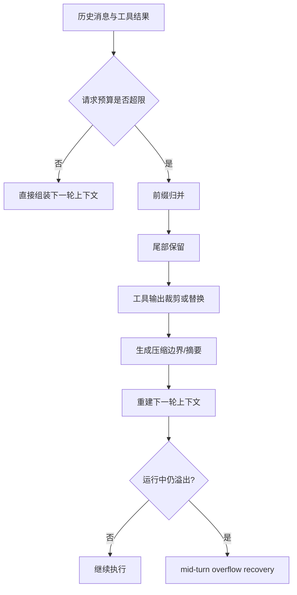

# 上下文管理与压缩：真正决定长任务稳定性的不是窗口大小，而是边界怎么切

这一篇只讨论一件事：当 agent 面对长对话、长工具输出、长任务链路时，系统怎样决定哪些内容继续保留、哪些内容转写成摘要、哪些内容只能留在 durable 状态里而不再直接暴露给模型。

先给结论：

- `Claude Code` 最强调“压缩前后仍能维持会话链完整”，所以它在 `compact_boundary`、`preservedSegment`、`pre_compact/post_compact` hooks、session memory 之间做了很多边界修补。证据类型：本地源码。`claude-code-src/src/services/compact/compact.ts`、`src/QueryEngine.ts`、`src/Tool.ts`、`src/services/compact/sessionMemoryCompact.ts`
- `OpenCode` 的 compaction 更像一次可回放的 durable checkpoint：旧前缀并没有被删掉，而是把模型可见表示切换成“结构化 summary + recent tail + fresh baseline”。证据类型：本地源码。`opencode/packages/core/src/session/compaction.ts`、`src/session/history.ts`、`src/session/context-epoch.ts`
- `Codex` 当前公开材料里没有把“对话压缩算法”暴露成像前两家那样完整的单独模块。证据类型：本地源码。`codex/codex-rs/app-server-protocol/src/protocol/v2/thread.rs`、`thread_data.rs`、`codex-rs/analytics/src/client.rs`、`codex-rs/README.md`
- `Codex` 更明显的是先把 instruction source、thread/turn view、goal/runtime、audit/analytics 协议化；再让 compaction 以线程系统中的事件与限流相关信号出现。证据类型：本地源码 + 推断。依据前述协议/analytics 结构与公开说明做保守归纳。
- 三家都不是“把旧消息直接截断”这么简单。真正的设计题是：前缀规则怎么定义、尾部要保留多少、工具输出能保留到什么粒度、压缩发生在 turn 之前还是 turn 中间，以及压缩后恢复时谁来承接语义连续性。证据类型：推断。依据前述源码和规格职责切分。

## 先把五个压缩问题分开

很多文档把 compaction 写成一句“上下文太长时做摘要”，这会掩盖真正的设计差异。更稳妥的拆法是：

- `前缀规则`：哪些旧内容必须进入摘要，哪些内容要被完全剔除。
- `尾部保留`：最近消息是否原样保留，保留到 token 上限还是按 turn 数保留。
- `工具输出裁剪`：是先裁工具结果，再决定是否压缩，还是把完整工具结果交给压缩器处理。
- `pre-turn compaction`：在下一轮请求发给模型之前判断预算是否超限。
- `mid-turn compaction`：请求已经发出后，因 context overflow 或恢复路径再做一次压缩。

- 证据类型：推断。依据 `Claude Code` 的 `compact_boundary`、`OpenCode` 的 overflow compaction，以及 `Codex` 的 thread/turn/item 分层。

## Claude Code：更像“带保留尾段和钩子的会话压缩器”

### 前缀规则与尾部保留

- `annotateBoundaryWithPreservedSegment()` 会把保留尾段写入 `compactMetadata.preservedSegment`，显式记录 `headUuid`、`anchorUuid`、`tailUuid`，说明 Claude Code 并不是只产一段 summary，而是要在压缩边界后重新接回一段原始尾部消息。证据类型：本地源码。`claude-code-src/src/services/compact/compact.ts`
- `QueryEngine` 在写入 `compact_boundary` 前会先把 preserved tail 对应的 in-memory 消息刷入 transcript，避免恢复时找不到 `tailUuid`，说明它把“恢复链正确性”看得和“省 token”同样重要。证据类型：本地源码。`claude-code-src/src/QueryEngine.ts`

这意味着 Claude Code 的默认思路不是“旧的都摘要，新的都保留”，而是：

1. 先制造一个显式 boundary。
2. 再把必须原样保留的 suffix 接回去。
3. 恢复时按 metadata 重连链路。

- 证据类型：推断。依据前述 `preservedSegment` 与 transcript flush 逻辑。

### pre-turn 与 mid-turn compaction

- `Tool.ts` 为 `pre_compact`、`post_compact`、`session_start` 暴露了专门进度事件，说明 compaction 被当作一类一等运行时阶段，而不是单纯内部优化。证据类型：本地源码。`claude-code-src/src/Tool.ts`
- `compactConversation()` 在真正摘要前先执行 `PreCompact hooks`，再合并 hook 返回的自定义 instructions，说明 Claude Code 允许“压缩策略前插入额外规则”。证据类型：本地源码。`claude-code-src/src/services/compact/compact.ts`
- `QueryEngine` 里有 `snipReplay`、`HISTORY_SNIP`、`projectSnippedView` 相关逻辑，说明它还存在“长会话 headless 模式下直接截短内存表示”的另一层策略。证据类型：本地源码。`claude-code-src/src/QueryEngine.ts`

这里的 trade-off 很明确：

- 好处：压缩既能被 hooks 定制，也能兼顾恢复链和 UI 会话体验。
- 代价：压缩逻辑分散在 summary、transcript、boundary relink、session restore 多层，复杂度高。

- 证据类型：推断。依据 `compact.ts`、`QueryEngine.ts`、`sessionRestore` 相关实现。

### 工具输出裁剪与 session memory

- `sessionMemoryCompact.ts` 会先等 session memory extraction 完成，再决定是否用 session memory 代替传统 compaction summary。证据类型：本地源码。`claude-code-src/src/services/compact/sessionMemoryCompact.ts`
- 同一文件明确区分两种场景：已知 `lastSummarizedMessageId` 的正常压缩，以及 resumed session 下“不知道旧边界，只能拿 memory 当摘要”的恢复式压缩。证据类型：本地源码。`claude-code-src/src/services/compact/sessionMemoryCompact.ts`
- `SessionMemory/sessionMemory.ts` 里 session memory extraction 只在 `main REPL thread` 运行，并用 `createSubagentContext()` 与 `runForkedAgent()` 隔离提炼过程，说明 Claude Code 把“长期会话摘要生成”当成后台子代理任务，而不是每轮都让主代理自己总结。证据类型：本地源码。`claude-code-src/src/services/SessionMemory/sessionMemory.ts`

所以 Claude Code 的一个关键特征是：  
`工具结果 -> 后台提炼 session memory -> 再反哺 compaction`。

- 证据类型：推断。依据 `sessionMemory.ts` 与 `sessionMemoryCompact.ts` 的调用关系。

## OpenCode：把 compaction 做成 durable checkpoint，而不是 transcript 修补术

### 前缀规则

- `SessionCompaction.select()` 会把会话分成 `head` 和 `recent` 两部分，并按 token 预算从尾部反向保留 recent；如果一条消息刚好跨边界，还会把它切成 `splitPrefix` 和 `splitSuffix`。证据类型：本地源码。`opencode/packages/core/src/session/compaction.ts`
- `buildPrompt()` 不是盲目重写摘要，而是把 `previousSummary` 和新增 `context` 一起传给总结模型，说明 OpenCode 采用“锚定式滚动摘要”。证据类型：本地源码。`opencode/packages/core/src/session/compaction.ts`

和 Claude Code 不同，OpenCode 没有把重点放在“如何把旧消息 parent uuid 接回来”，而是放在“如何稳定地产出下一次可继续更新的 summary”。  
证据类型：推断。依据 `SessionCompaction.select/buildPrompt` 与 Claude 的 boundary relink 对比。

### 尾部保留与工具输出裁剪

- OpenCode 明确设置了 `DEFAULT_KEEP_TOKENS = 8000` 与 `TOOL_OUTPUT_MAX_CHARS = 2000`，先把工具输出序列化并裁到安全长度，再交给 summary pipeline。证据类型：本地源码。`opencode/packages/core/src/session/compaction.ts`
- `serialize()` 里对 assistant tool call、tool result、tool error 都有不同文本化格式，说明它更强调“压缩时保留任务语义骨架”，不是保留 provider-native 原始对象。证据类型：本地源码。`opencode/packages/core/src/session/compaction.ts`

这是一种更强的标准化路线：

- 压缩前先把消息“降格”为稳定文本骨架。
- recent tail 按 token 预算保留。
- summary 更新保持模板结构不变。

- 证据类型：推断。依据 `serialize()`、`SUMMARY_TEMPLATE`、`select()`。

### pre-turn 与 mid-turn overflow compaction

- `compactIfNeeded()` 在 provider turn 之前用请求大小和 `context - max(output, buffer)` 比较，属于典型 pre-turn compaction。证据类型：本地源码。`opencode/packages/core/src/session/compaction.ts`
- `runner/llm.ts` 明确区分 `ContinueAfterCompaction` 与 `ContinueAfterOverflowCompaction`，而且只在“provider 因上下文溢出且还没有 durable assistant output”时允许一次 overflow-triggered compaction。证据类型：本地源码。`opencode/packages/core/src/session/runner/llm.ts`
- 官方 `specs/v2/session.md` 也写明：第二次 overflow、compaction 不可用、或溢出发生在已有 durable 输出之后，都变成正常终止失败，不会无界重试。证据类型：官方文档。`opencode/specs/v2/session.md`

这说明 OpenCode 在这条线上比 Claude Code 更保守：

- 它允许 mid-turn recovery。
- 但 recovery 只允许一个明确边界，避免重复重放副作用。

- 证据类型：推断。依据 `runner/llm.ts` 和 `specs/v2/session.md`。

## Codex：当前更突出“上下文来源协议化”，而不是公开完整 compaction 算法

### 前缀规则不先体现在单个压缩器，而先体现在协议视图

- `ThreadStartResponse` 会返回 `instruction_sources`，`Thread`/`Turn`/`TurnItemsView` 则区分 `NotLoaded`、`Summary`、`Full` 三种 item 视图，说明 Codex 先把“哪些上下文来源已加载、turn item 加载到什么程度”协议化。证据类型：本地源码。`codex/codex-rs/app-server-protocol/src/protocol/v2/thread.rs`、`thread_data.rs`
- `README.md` 明确说 `workspace-write` 模式会把 `~/.codex/memories` 一并放进可写根，说明 memory 并不是纯提示词对象，而是被视作受权限约束的持久上下文资产。证据类型：官方文档。`codex/codex-rs/README.md`

因此，Codex 当前更像先解决：

- 指令来源如何声明；
- 线程历史如何按 summary/full 视图读取；
- memory 如何进入受控读写面；

再把 compaction 作为 thread analytics 和 runtime 的一部分去演进。  
证据类型：推断。依据 `thread.rs`、`thread_data.rs`、`README.md`、`analytics` 中的 compaction 事件。

### memory 不是“会话摘要文件”，而是独立读写管线

- `memories/README.md` 把 memory 分成 read path 和 write path，并明确 Phase 1/Phase 2：先按 rollout 提炼，再全局 consolidation。证据类型：官方文档。`codex/codex-rs/memories/README.md`
- `ext/memories` 会把 memory read-path prompt 追加到 developer instructions，并对 `memory_summary.md` 做 token 限制。证据类型：本地源码。`codex/codex-rs/ext/memories/src/prompts.rs`、`src/extension.rs`

这和 Claude Code 的 session memory 最大的差异在于：

- Claude 的 session memory 更贴近单会话 compaction 辅助物。
- Codex 的 memories 更像跨 rollout、跨线程的持久知识资产。

- 证据类型：推断。依据 `sessionMemoryCompact.ts` 与 `memories/README.md` 的职责不同。

## 并排比较：三家的“压缩”不在同一层

| 维度 | Claude Code | OpenCode | Codex |
|---|---|---|---|
| 前缀处理主轴 | boundary + preserved tail relink | anchored summary + recent tail | thread/item/instruction source 视图先行 |
| 尾部保留 | 显式 preserved segment | token 预算内 recent tail | 公开为 summary/full 读取视图 |
| 工具输出处理 | session memory 与 compact 协同 | 先标准化序列化并裁剪 | 更偏 memory/turn asset 管理 |
| pre-turn compaction | 有 | 有 | 未以同层算法公开 |
| mid-turn overflow recovery | 有多路径恢复语义，但实现更分散 | 有且边界明确，只尝试一次 | 公开更强调 thread/runtime 恢复而非同层对话压缩 |

- 证据类型：推断。依据前文本地源码与官方规格综合比较。

## 设计启发

1. 真正稳的 compaction 不是“会总结”，而是“压缩后还能恢复对”。Claude Code 说明 boundary relink 是一等问题。证据类型：推断。依据 `compact.ts` 与 `QueryEngine.ts`。
2. 如果要做 durable runtime，最好把 compaction 产物设计成稳定 checkpoint，而不是只保留一段自由文本摘要。OpenCode 在这点上最清楚。证据类型：推断。依据 `session/compaction.ts`、`session/history.ts`、`specs/v2/session.md`。
3. 长期 memory 与短期 compaction 不该混为一个对象。Codex 和 Claude Code 刚好代表了两种不同边界：一个偏跨线程 memory pipeline，一个偏单会话压缩辅助。证据类型：推断。依据 `memories/README.md` 与 `sessionMemoryCompact.ts`。
4. mid-turn compaction 必须有重试边界，否则很容易演化成“溢出后反复压缩再重试”的副作用放大器。OpenCode 的一次性 overflow recovery 是更稳的设计。证据类型：官方文档 + 本地源码。`opencode/specs/v2/session.md`、`opencode/packages/core/src/session/runner/llm.ts`
