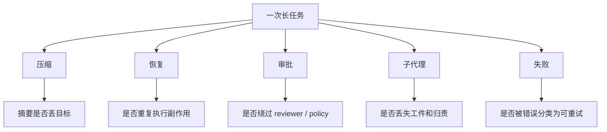

# 评估、可观测性与回归：agent 系统不是“跑通一次”就算稳定

这篇只回答一个问题：  
对于会压缩、会恢复、会审批、会分派子代理的 coding agent，应该观察什么，才能知道系统没有静悄悄地退化。

先给结论：

- `Claude Code` 已经把 transcript、session history、bridge debug、subagent internal events、OpenTelemetry tracer provider 等观测点散布在运行时里，但主叙事仍偏“排障与恢复”。证据类型：本地源码。`claude-code-src/src/bootstrap/state.ts`、`src/assistant/sessionHistory.ts`、`src/cli/remoteIO.ts`、`src/bridge/bridgeDebug.ts`
- `OpenCode` 的优势是 durable event cursor、projected history、context epoch、本地 runner checkpoint 都天然可以变成 eval 和 regression probe。证据类型：官方文档 + 本地源码。`opencode/specs/v2/session.md`、`opencode/packages/core/src/session/input.ts`、`src/session/context-epoch.ts`
- `Codex` 则把 audit row、thread view、goal events、analytics compaction/subagent/approval 事件做成更明确的审计链，因此更适合做“恢复后是否重复执行”“子代理审批是否漏归责”这类系统级回归。证据类型：本地源码。`codex/codex-rs/state/src/audit.rs`、`codex-rs/analytics/src/events.rs`、`app-server-protocol/src/protocol/v2/thread_data.rs`

## 先定义五类最重要的回归面

用户已经点名的五个风险，基本也是这类系统的核心 regression surface：

1. `恢复后重复执行`
2. `压缩后丢目标`
3. `审批绕过`
4. `subagent 漏交接`
5. `失败分类漂移`

- 证据类型：推断。依据三家公开失效面和设计边界。

## Claude Code：观测点多，但要自己拼出完整回归故事

### trace 与审计面

- `bootstrap/state.ts` 维护 `tracerProvider`，说明它有接入 OpenTelemetry 级别 tracing 的基础设施。证据类型：本地源码。`claude-code-src/src/bootstrap/state.ts`
- `sessionHistory.ts` 可以分页读取 `/v1/sessions/{sessionId}/events`，说明远程会话历史至少可作审计素材。证据类型：本地源码。`claude-code-src/src/assistant/sessionHistory.ts`
- `remoteIO.ts` 注释直接说会读取 internal events 来重构 conversation state，其中包含 subagent internal events。证据类型：本地源码。`claude-code-src/src/cli/remoteIO.ts`

所以 Claude Code 的问题不在“没有观测点”，而在“观测点比较分散，评估时要自己拼”。

- 证据类型：推断。依据前述实现分布。

### 重点回归面

- `恢复后重复执行`：`QueryEngine` 会在 compact/replay/transcript 之间做 dedup 和 flush；如果 dedup 失效，就可能出现 resume 后链路分叉或重复操作。证据类型：本地源码。`claude-code-src/src/QueryEngine.ts`
- `压缩后丢目标`：`invokedSkills` 被专门保留跨 compaction，说明团队已经把“压缩后丢技能上下文”视为真实风险。证据类型：本地源码。`claude-code-src/src/bootstrap/state.ts`
- `subagent 漏交接`：verification prompt 明确要求把原始请求、改动文件、plan 路径传给 verifier，否则就是 contract 违例。证据类型：本地源码。`claude-code-src/src/constants/prompts.ts`

### 公开失效面

- `/goal` cancel 后仍继续跑。证据类型：公开 issue / discussion。`anthropics/claude-code#65099`
- Stop hook 结果格式不符导致 auto-clear 失败。证据类型：公开 issue / discussion。`anthropics/claude-code#58558`

这两类问题都说明：  
Claude Code 的 eval 不能只看“最后任务是否完成”，还要看中间 stop/continue contract 是否被正确执行。  
证据类型：推断。依据 issue 类型。

## OpenCode：最适合做 replayable regression

### 为什么它的评估面更干净

- `PromptAdmitted` 与 `Prompted` 被严格分开，所以“输入已接收但未进入模型历史”的状态可以被单独断言。证据类型：本地源码。`opencode/packages/core/src/session/input.ts`
- `ContextUpdated` 与 `Context Epoch` 独立存在，所以“压缩后/规则更新后是否丢目标”能在 baseline 与 chronological system update 层分别测。证据类型：本地源码。`opencode/packages/core/src/session/context-epoch.ts`
- `sessions.events/history` 在规格里有 durable cursor 语义，天然适合做 replay-based regression。证据类型：官方文档。`opencode/specs/v2/session.md`

### 重点回归面

- `恢复后重复执行`：官方 TODO 明确说 post-crash continuation recovery 还未收敛，尤其涉及 provider-dispatch ambiguity 与 post-tool continuation。证据类型：官方文档。`opencode/specs/v2/todo.md`
- `压缩后丢目标`：`SUMMARY_TEMPLATE` 要求保留 Goal、Constraints、Progress、Blocked、Next Steps，这其实就是在把“压缩后不可丢的任务骨架”显式模板化。证据类型：本地源码。`opencode/packages/core/src/session/compaction.ts`
- `审批绕过`：`tools.md` 明确说 trusted executors 自己发起 permission assert，registry 不代劳，因此 eval 必须覆盖“工具有没有漏 assert”。证据类型：官方文档。`opencode/specs/v2/tools.md`
- `subagent 漏交接`：虽然 background agent dispatch 还在推进，但 TODO 已把 completion delivery 和 explicit cancellation / continuation semantics 点出来，这些都应该成为将来的 regression 断言。证据类型：官方文档。`opencode/specs/v2/todo.md`

### OpenCode 式的 eval 样板

可以按事件流写测试，而不是按终态写测试：

1. admit 一个 prompt。
2. 触发一次 compaction。
3. 注入一次 context update。
4. 中断后 resume。
5. 断言 `Prompted`、`Compaction.Ended`、`ContextUpdated` 的顺序和次数。

- 证据类型：推断。依据 `session/input.ts`、`session/compaction.ts`、`session/context-epoch.ts` 的事件结构。

## Codex：最适合做跨线程、跨审批、跨子代理的系统审计

### 可观测面

- `read_thread_state_audit_rows()` 提供了只读 state DB 审计入口。证据类型：本地源码。`codex/codex-rs/state/src/audit.rs`
- `analytics/events.rs` 里有 compaction、subagent_thread_started、guardian approval routed through parent 等事件。证据类型：本地源码。`codex/codex-rs/analytics/src/events.rs`
- `thread_data.rs` 的 `TurnItemsView` 允许客户端只读 summary 或 full items，这对大规模回归采样很重要。证据类型：本地源码。`codex/codex-rs/app-server-protocol/src/protocol/v2/thread_data.rs`

### 重点回归面

- `恢复后重复执行`：thread/resume 与 goal runtime 分层后，必须断言恢复不会重复触发已完成的 goal accounting。证据类型：推断。依据 `thread.rs`、`ext/goal/src/runtime.rs`
- `压缩后丢目标`：analytics 里已有 compaction event，而 goal runtime 又会注入 steering item，因此 regression 应覆盖“compaction 后 active goal 是否仍能 steer 当前 turn”。证据类型：本地源码 + 推断。`codex/codex-rs/ext/goal/src/runtime.rs`、`codex-rs/analytics/src/events.rs`
- `审批绕过`：analytics 明确记录 delegated subagent approval routed through parent，这是检查 guardian thread 责任链的天然探针。证据类型：本地源码。`codex/codex-rs/analytics/src/events.rs`
- `subagent 漏交接`：如果 parent/child thread edge 存在，但 child 完成后没有对应状态关闭或工件可读，就是显式的 orchestration failure。证据类型：推断。依据 `agent-graph-store` 的 open/closed edge 设计。

## 怎样组织这类系统的 eval

### 1. 状态回归

- 看 thread/session/goal 是否进入正确状态。
- 典型断言：中断后没有 ghost running；完成后没有 active child edge。

### 2. 事件回归

- 看 durable event 序列是否缺失、重排、重复。
- 典型断言：一次 compaction 只产生一次完成边界；一次审批请求只产生一条 reviewer routing 链。

### 3. 工件回归

- 看 summary、memory、verification report、state audit 是否可被主代理或外部工具重新消费。
- 典型断言：subagent 完成后主代理拿到的不是一句自由文本，而是可验证工件。

### 4. 权限回归

- 看工具调用和子代理调用是否落在正确 reviewer / sandbox / permission profile 下。
- 典型断言：恢复后 profile 不漂移；子代理审批不直接穿透到错误 reviewer。

- 证据类型：推断。依据三家设计重点。

## 设计启发

1. 评估长任务 agent 时，只看最终答案会错过最关键的退化点；必须覆盖压缩、恢复、审批、子代理四条中间链。证据类型：推断。依据本文回归面拆分。
2. 能 replay durable event 的系统，天然更适合做 regression。OpenCode 在这点上成本最低。证据类型：官方文档 + 本地源码。`opencode/specs/v2/session.md`、`opencode/packages/core/src/session/input.ts`
3. 如果审批和子代理是高风险能力，就应像 Codex 一样把它们变成 analytics/audit first-class event，而不是只靠 transcript 事后猜。证据类型：本地源码。`codex/codex-rs/analytics/src/events.rs`
4. Claude Code 的经验说明，交互式产品即使主打体验，也必须留下足够多的 debug 和 internal event 钩子，否则恢复类 regression 很难定位。证据类型：本地源码。`claude-code-src/src/bridge/bridgeDebug.ts`、`src/cli/remoteIO.ts`
