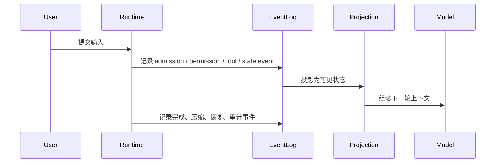
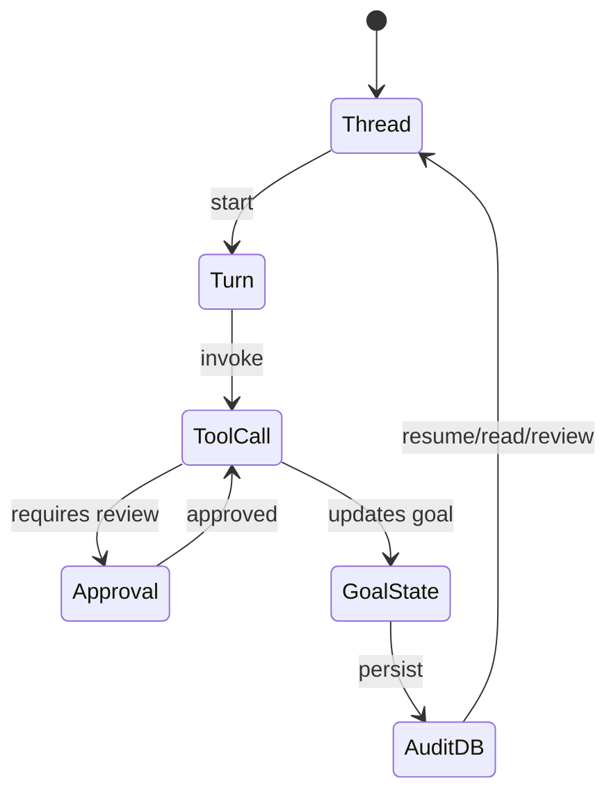

# 事件、状态与可追溯：agent 为什么需要日志协议，而不是只靠聊天记录

这一篇讨论的核心问题是：长任务为什么会恢复失败、为什么权限决策难审计、为什么“我记得刚才做过”在工程系统里不够用。

结论先给：

- `Claude Code` 已经有事件历史、session restore、bridge event 过滤和 transcript 恢复，但它的主叙事仍偏“会话恢复”而非完整事件溯源。
  - 证据类型：本地源码。`claude-code-src/src/assistant/sessionHistory.ts`、`src/utils/sessionRestore.ts`、`src/bridge/bridgeMessaging.ts`
- `OpenCode` 在三家里最明确地把 `event -> projection -> runner reload` 写成系统主线，`session_input`、`PromptAdmitted`、`Prompted`、`ContextUpdated`、`sessions.events/history` 都是为可追溯和恢复服务。
- 证据类型：OpenCode 官方规格文档（仓库内 `opencode/specs/v2/session.md`）。
  - 证据类型：本地源码。`opencode/packages/core/src/session/input.ts`、`session/history.ts`、`session/context-epoch.ts`
- `Codex` 把 thread、goal、audit row、state SQLite、app-server notifications 串成了更明显的审计链，尤其适合恢复、review 与多 client 消费。
  - 证据类型：本地源码。`codex/codex-rs/ext/goal/src/events.rs`、`state/src/lib.rs`、`app-server-protocol/src/protocol/v2/thread_data.rs`

## 问题：为什么“聊天记录”不足以支撑恢复和审计

只保留聊天记录，通常会丢掉下面这些信息：

1. 哪些输入已经被接收，但还没进入模型可见历史。
2. 哪些权限请求被 ask、被 reject、被 always allow。
3. 哪些工具输出只是临时流式 delta，哪些才是 durable completion。
4. 压缩、续跑、外部中断后，下一轮到底该从哪个状态继续。

## Claude Code：重点是“会话恢复”，不是完整事件溯源

### 三家做法之一：Claude Code

`Claude Code` 至少已经做了三件重要的事：

- `sessionHistory.ts` 可以从 `/v1/sessions/{sessionId}/events` 分页抓取事件历史。
  - 证据类型：本地源码。`claude-code-src/src/assistant/sessionHistory.ts`
- `sessionRestore.ts` 会从 transcript/log 中恢复 file history、attribution、todo、context collapse 快照等状态。
  - 证据类型：本地源码。`claude-code-src/src/utils/sessionRestore.ts`
- bridge 明确区分哪些消息值得转发，哪些只是本地 REPL chatter，不让所有中间噪音污染远端会话视图。
  - 证据类型：本地源码。`claude-code-src/src/bridge/bridgeMessaging.ts`

### 这类设计能解决什么

- 允许 session resume 时恢复比纯聊天记录更多的运行时状态。
- 允许远程桥接端只看到对外有意义的 user/assistant/system 事件。
- 允许 todo、file history、attribution 等附加状态跨重启继续工作。

### trade-off

- 好处：对交互式产品很实用，恢复体验明显优于“只记消息数组”。
- 代价：状态仍然较分散，事件日志更像恢复素材，而不是统一投影主轴。
- 推断：Claude Code 当前最稳定的叙事仍是“session restore”，而不是 OpenCode/Codex 那种强事件溯源 runtime。
  - 证据类型：推断。依据是 `sessionRestore.ts` 的恢复函数形态与 `sessionHistory.ts` 的分页拉取方式。

## OpenCode：把 event log 当成 Session runtime 的骨架

### 三家做法之二：OpenCode

OpenCode 在这条线上最清楚，因为它直接把事件写进了 V2 规格和源码：

- 输入先进入 durable `session_input` inbox，`PromptAdmitted` 表示已接收但还未成为模型可见历史。
  - 证据类型：OpenCode 官方规格文档（仓库内 `opencode/specs/v2/session.md`）。
  - 证据类型：本地源码。`opencode/packages/core/src/session/input.ts`
- `Prompted` 才表示输入被提升进 visible conversation history。
  - 证据类型：本地源码。`opencode/packages/core/src/session/input.ts`
- `SessionHistory.load/loadForRunner` 会按 compaction 和 baselineSeq 裁剪出 runner 该看到的历史，而不是粗暴重放全部聊天记录。
  - 证据类型：本地源码。`opencode/packages/core/src/session/history.ts`
- `ContextUpdated` 事件推动 `Context Epoch` 快照前进，让系统上下文变更也可追溯。
  - 证据类型：本地源码。`opencode/packages/core/src/session/context-epoch.ts`

### 关键差异

OpenCode 不是“事件很多”，而是把这些事件用于三件硬事：

1. 区分 admission、projection、model-visible history。
2. 支撑 compaction 后的稳定重建。
3. 给 `sessions.events(...)` 和 `sessions.history(...)` 这样的外部消费者稳定游标。

### trade-off

- 好处：恢复、重放、远程消费、UI 订阅都能建立在同一条 durable event 语义上。
- 代价：系统实现更重，必须维护 event schema、projection、一致性和 safe boundary。
- 关键结论：OpenCode 的可追溯不是“顺便记录日志”，而是 runtime 设计的基础。
  - 证据类型：OpenCode 官方规格文档（仓库内 `opencode/specs/v2/session.md`）。

## Codex：把事件、状态库与审计行连起来

### 三家做法之三：Codex

`Codex` 的可追溯重点不止是 thread history，还包括状态库和审计接口：

- `GoalEventEmitter` 会发出 `ThreadGoalUpdated` 事件，把 tool call、turn_id、goal 新状态挂到统一事件里。
  - 证据类型：本地源码。`codex/codex-rs/ext/goal/src/events.rs`
- `state` crate 明确暴露 `ThreadStateAuditRow`、`read_thread_state_audit_rows`、`StateRuntime`、`LogQuery`、`ThreadGoal` 等对象。
  - 证据类型：本地源码。`codex/codex-rs/state/src/lib.rs`
- `Thread`/`Turn`/`TurnItemsView` 协议让客户端能区分“没加载 item”“只看 summary”“完整持久化 turn item”。
  - 证据类型：本地源码。`codex/codex-rs/app-server-protocol/src/protocol/v2/thread_data.rs`

### 这说明了什么

Codex 的恢复和审计链更像：

这里的重点不只是“能恢复”，而是：

- 事件能驱动状态变化；
- 状态变化进入 SQLite runtime；
- 客户端再通过协议把它读出来；
- 审计不是额外外挂，而是状态系统的一部分。

### trade-off

- 好处：长任务、review、thread read/fork/resume 的一致性更强。
- 代价：系统更重，状态迁移、事件兼容和协议演进都要维护。
- 关键结论：Codex 在三家里最像“以审计和恢复为先”的线程系统。
  - 证据类型：本地源码。`events.rs`、`state/src/lib.rs`、`thread_data.rs`

## 并排比较：三家的“可追溯”不是同义词

| 维度 | Claude Code | OpenCode | Codex |
|---|---|---|---|
| 主叙事 | session restore | event-sourced session runtime | protocol + state db + audit |
| 输入 admission 是否显式 | 相对弱 | 很强，`PromptAdmitted/Prompted` 明确 | 有 thread/turn/event 边界，但不走同名抽象 |
| compaction 与历史重建 | 有，但更偏运行时恢复 | 明确写入 V2 规格 | 通过 thread/turn/state 体系承接 |
| 审计接口 | 有事件历史与恢复素材 | 有 durable event cursor / history 语义 | 有 state audit row 与协议化读取 |
| 最大优势 | 实用的会话恢复 | 最清晰的 event->projection 设计 | 最强的状态化审计能力 |

- 证据类型：推断。依据前文本地源码与 OpenCode 仓库内官方规格文档（`opencode/specs/v2/session.md`）的综合比较。

## 设计启发

1. 想做真正可恢复的 agent，必须把“输入已接收”和“输入已进入模型历史”分开。`OpenCode` 这一点最值得直接照抄。（证据类型：推断。依据 OpenCode 仓库内官方规格文档（`opencode/specs/v2/session.md`）与 `session/input.ts`、`session/history.ts`。）
2. 如果高价值状态会影响自动续跑、预算和权限，应该把它们做成状态库和审计行，而不是只靠会话 transcript。`Codex` 在这点最完整。（证据类型：推断。依据 `events.rs`、`state/src/lib.rs`、`thread_data.rs`。）
3. 交互式 CLI 也至少要把恢复所需的附加状态从纯消息数组里分离出来。`Claude Code` 的 session restore 给了一个实用下限。（证据类型：推断。依据 `sessionHistory.ts`、`sessionRestore.ts`、`bridgeMessaging.ts`。）

稳妥的总结是：

- `Claude Code` 解决的是“如何把会话状态救回来”。（证据类型：推断。依据 `sessionHistory.ts` 与 `sessionRestore.ts` 的恢复路径。）
- `OpenCode` 解决的是“如何让 event log 成为 runtime 主骨架”。（证据类型：推断。依据 OpenCode 仓库内官方规格文档（`opencode/specs/v2/session.md`）与 `session/input.ts`、`session/history.ts`。）
- `Codex` 解决的是“如何把可追溯、可恢复、可审计做成线程系统能力”。（证据类型：推断。依据 `events.rs`、`state/src/lib.rs`、`thread_data.rs`。）

这三种侧重点不该被写成同一个层级的“日志系统”。（证据类型：推断。依据前文对 session restore、event-sourced runtime、protocol + state db + audit 三种主叙事的综合比较。）
