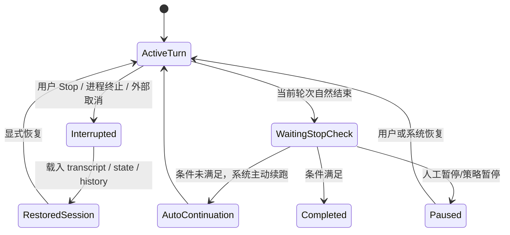
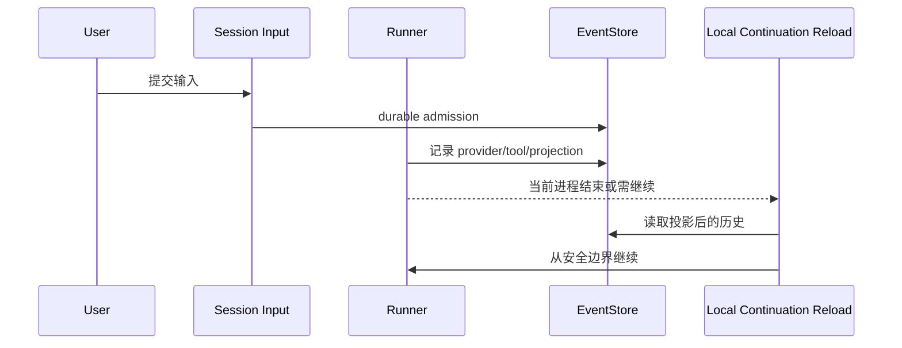

# 中断、恢复与可追溯：为什么 agent 不能把“停一下再继续”写成一句话

这一篇专门拆开五个经常被混写的词：`中断`、`暂停`、`恢复`、`续跑`、`可追溯`。

文首状态图是跨系统概念图，用来帮助分层讨论，不代表三家都公开实现了同构的 `Paused` 状态。  
证据类型：推断。依据 `Codex` 公开存在显式 `Paused` goal status，而 `Claude Code` 与 `OpenCode` 公开材料更多呈现会话恢复、停止钩子与 continuation 语义，而非同构暂停状态机。

先给结论：

- `Claude Code` 最强的是“会话被打断后怎样尽量把 transcript 和运行现场救回来”，以及 `/goal` 驱动的自动续跑；但它公开出来的主抽象仍更接近 `session restore + stop-hook orchestration`，不是完整线程状态机。
  - 证据类型：本地源码。`claude-code-src/src/QueryEngine.ts`、`src/bootstrap/state.ts`、`src/Tool.ts`
  - 证据类型：官方文档。`/goal`、hooks、best practices、Week 20 周报
  - 证据类型：公开 issue / discussion。`anthropics/claude-code#65099`、`#58558`、`#59969`、`#63988`
- `OpenCode` 的重点不是“自动续跑很多”，而是把 `session input -> event/projection -> local continuation reload` 写成 durable runtime，所以它更强的是可追溯和安全继续，而不是高度自治的 goal continuation。
  - 证据类型：本地源码。`opencode/packages/core/src/session/todo.ts`
  - 证据类型：官方文档。仓库内 `opencode/specs/v2/tools.md`、`opencode/specs/v2/todo.md`
  - 证据类型：官方文档。仓库根 `TODO.md` 明确把 durable continuation recovery、interruption、retries 仍列为后续切片
- `Codex` 在三家里最明确地区分“线程恢复”和“目标续跑”：`thread/resume` 负责把线程状态重新接上，`goal` runtime 负责在活动目标上继续推进，两者由协议、状态库和审计事件连接。
  - 证据类型：本地源码。`codex/codex-rs/app-server-protocol/src/protocol/v2/thread.rs`、`thread_data.rs`、`ext/goal/src/spec.rs`、`tool.rs`、`runtime.rs`、`state/src/audit.rs`
  - 证据类型：公开 issue / discussion。`openai/codex#24016`、`#25590`、`#28296`、`#28574`

## 先把五个词分开

- `中断`：当前 turn 或当前工具执行被外部打断，重点是“这一轮没自然结束”。
  - 证据类型：推断。依据三家 runtime 都把 interrupt 视为 turn/tool 级事件，而非目标完成。
- `暂停`：系统显式进入不继续推进的稳定状态，后续是否继续要等用户或系统再触发。
  - 证据类型：本地源码 + 推断。`Codex` 的 `ThreadGoalStatus::Paused` 是显式状态；`Claude Code` 与 `OpenCode` 没有同层公开 goal pause 对象。
- `恢复`：从已保存的会话、线程、history 或状态库重新接上。
  - 证据类型：本地源码。`claude-code-src/src/bootstrap/state.ts`、`codex/.../thread.rs`
- `续跑`：系统主动开启下一轮，不要求用户再发 prompt。
  - 证据类型：官方文档。`Claude Code /goal`
  - 证据类型：本地源码。`Codex` goal runtime/accounting/steering
- `可追溯`：事后能回答“为什么继续了、为什么没停、恢复时用了什么状态、权限是谁批的”。
  - 证据类型：本地源码。`Claude Code` transcript/session restore、`OpenCode` event-sourced runtime 主线、`Codex` state audit row

如果把这五个词压成同一个“resume”，文档就一定会误判三家的设计重点。  
证据类型：推断。依据前文对 `Claude Code session restore + /goal`、`OpenCode durable continuation`、`Codex thread/resume + goal runtime` 的分层对照。

## Claude Code：中断恢复靠 transcript 与 session restore，续跑靠 `/goal + Stop hook`

### 它的恢复主轴是什么

- `QueryEngine` 在进入 query loop 之前先把用户消息写入 transcript，目的就是避免“请求刚发出就被杀掉，`--resume` 却找不到对话”的恢复失败。
  - 证据类型：本地源码。`claude-code-src/src/QueryEngine.ts`
- `Tool` 抽象显式区分可中断行为，`interruptBehavior()` 可以声明 `cancel` 或 `block`，说明中断首先是 tool/turn 级控制，而不是高层 goal 状态。
  - 证据类型：本地源码。`claude-code-src/src/Tool.ts`
- `bootstrap/state.ts` 维护 `switchSession()`、`sessionProjectDir`、`projectRoot` 等恢复辅助状态，支持跨项目、worktree、`/resume` 场景。
  - 证据类型：本地源码。`claude-code-src/src/bootstrap/state.ts`

### 它的续跑主轴是什么

- 官方 `/goal` 文档写得很直接：设置 completion condition 后，每轮结束由一个更快的小模型判断条件是否成立；如果未成立，就自动开始下一轮。
  - 证据类型：官方文档。`https://code.claude.com/docs/en/goal`
- 官方 hooks 文档明确把 `/goal` 描述为 session-scoped prompt-based Stop hook 的内建捷径。
  - 证据类型：官方文档。`https://docs.anthropic.com/en/docs/claude-code/hooks`
- 官方 best practices 也明确说 unattended run 是否能自己结束，关键就在 `/goal` 和 Stop hook 版本。
  - 证据类型：官方文档。`https://code.claude.com/docs/en/best-practices`

### 这说明了什么

`Claude Code` 的“恢复”与“续跑”并不来自同一层：

- 恢复来自 transcript、session restore、bridge/session 状态。
- 续跑来自 completion condition 循环和 stop 判定。

这正是它和 `Codex` 最大的结构差异。`Codex` 把 goal 做成线程对象；`Claude Code` 目前公开出来的更像“会话恢复系统 + 自动续跑控制面”。  
证据类型：推断。依据前述本地源码与官方 `/goal`/hooks 文档的职责切分。

### 公开失效面

- 显式 cancel 之后，旧 `/goal` 仍可能继续推 turn，尤其叠加 compaction 和多 session resume 时更明显。
  - 证据类型：公开 issue / discussion。`anthropics/claude-code#65099`
- Stop hook 返回 markdown fenced JSON 会触发校验失败，导致 `/goal` 无法 auto-clear。
  - 证据类型：公开 issue / discussion。`anthropics/claude-code#58558`
- Desktop Code tab 中 `/goal` 与 `/permissions` 可能报 “not available in this environment”，说明桌面嵌入环境与终端会话并不是同一个能力面。
  - 证据类型：公开 issue / discussion。`anthropics/claude-code#59969`
- `/remote-control` 在本地 agent 的非交互环境里被 denylist 拦住，说明交互与非交互恢复路径并不完全等价。
  - 证据类型：公开 issue / discussion。`anthropics/claude-code#63988`
- Stop hook 连续阻止八次后会被系统 override，继续工作并以 warning 结束 turn。
  - 证据类型：官方文档。`https://docs.anthropic.com/en/docs/claude-code/hooks-guide`

## OpenCode：强的是 durable continuation，不是 goal auto-loop

### 它公开强调的是什么

- `TODO.md` 明确写出 local continuation reload、queued input promotion、explicit cancellation / continuation semantics、durable/clustered interruption 仍在分阶段实现。
  - 证据类型：官方文档。仓库根 `opencode/TODO.md`
- `tools.md` 把“Effect interruption is the cancellation mechanism”写成工具执行契约的一部分，说明中断先是 effect/runtime 概念。
  - 证据类型：官方文档。仓库内 `opencode/specs/v2/tools.md`
- `SessionTodo` 会把 todo 写进数据库并按 session 读回，说明 OpenCode 至少把“这次会话做到哪一步”做成了 durable state，而不是纯提示词。
  - 证据类型：本地源码。`opencode/packages/core/src/session/todo.ts`

### 这意味着什么

OpenCode 的恢复逻辑更接近：

它的关键词是：

- `continue safely`
- 不是 `loop until condition met`

所以如果把 OpenCode 写成“也有和 Claude/Codex 同层的续跑目标系统”，就是把 durable runtime 误写成 goal runtime。  
证据类型：推断。依据 `opencode/TODO.md`、`specs/v2/tools.md` 和 `session/todo.ts`。

### 公开失效面与未完成边界

- 官方 TODO 直接承认 durable continuation recovery 仍是显式待设计切片，尤其包括 provider-dispatch ambiguity、post-tool continuation、retry/abandon decision。
  - 证据类型：官方文档。仓库根 `opencode/TODO.md`
- 同一份 TODO 也把 background agent dispatch 的 explicit cancellation / continuation semantics 列为后续集成项，说明“后台任务取消后怎样继续”并非已经完全收敛。
  - 证据类型：官方文档。仓库根 `opencode/TODO.md`
- `Tool` 规范强调 interruption 不应被工具错误吞掉，这本身就暴露了一个设计风险：如果叶子工具滥用 broad catch，会把取消伪装成普通失败。
  - 证据类型：官方文档。仓库内 `opencode/specs/v2/tools.md`

## Codex：线程恢复与目标续跑被显式拆成两层

### 恢复层

- `ThreadResumeParams` 明确写出三种 resume 方式：按 `thread_id`、按 `history`、按 `path`；并定义了优先级和 running thread 的一致性校验。
  - 证据类型：本地源码。`codex/codex-rs/app-server-protocol/src/protocol/v2/thread.rs`
- `Thread`/`Turn`/`TurnItemsView` 说明 resume 不只是“拿回一串消息”，而是拿回线程、turn、item 是否完整加载的结构化状态。
  - 证据类型：本地源码。`codex/codex-rs/app-server-protocol/src/protocol/v2/thread_data.rs`
- `state/src/audit.rs` 直接提供 `read_thread_state_audit_rows`，说明恢复与审计本来就站在状态库上，而不只是 transcript 文件。
  - 证据类型：本地源码。`codex/codex-rs/state/src/audit.rs`

### 续跑层

- `get_goal/create_goal/update_goal` 只开放读取、创建、完成/阻塞标记；pause、resume、budget-limited、usage-limited 明确不允许模型自行写。
  - 证据类型：本地源码。`codex/codex-rs/ext/goal/src/spec.rs`
- `GoalToolExecutor` 在 `update_goal` 里显式拒绝 pause/resume/budget-limited/usage-limited 状态迁移。
  - 证据类型：本地源码。`codex/codex-rs/ext/goal/src/tool.rs`
- `GoalRuntimeHandle` 负责 external goal mutation、active/idle accounting、objective steering 注入，说明 goal continuation 是 runtime 级行为，不只是工具返回值。
  - 证据类型：本地源码。`codex/codex-rs/ext/goal/src/runtime.rs`

### 关键差异

`Codex` 的“恢复”和“续跑”是被刻意拆开的：

1. `thread/resume` 解决线程重新接入。
2. `goal runtime` 决定活跃目标是否继续推进。
3. `audit/state` 负责事后解释恢复时发生了什么。

这使它比 `Claude Code` 更接近完整状态机，但代价是协议、状态库、runtime 必须共同演进。  
证据类型：推断。依据 `thread.rs`、`thread_data.rs`、`spec.rs`、`tool.rs`、`runtime.rs`。

### 公开失效面

- `codex exec resume` 目前仍要求 prompt 或 stdin，不能只“跟随已存在的 active goal continuation”。
  - 证据类型：公开 issue / discussion。`openai/codex#24016`
- 线程恢复后 sandbox/approval profile 可能与原线程不一致，尤其在 Desktop 与 goal continuation 重启/恢复时。
  - 证据类型：公开 issue / discussion。`openai/codex#25590`、`#28296`
- 5 小时 usage limit 之后的 goal resume 可能卡在 approval prompt，且 iOS 缺少对应 pause/resume 控件。
  - 证据类型：公开 issue / discussion。`openai/codex#28574`

## 并排比较：三家的“恢复”不是同一件事

| 维度 | Claude Code | OpenCode | Codex |
|---|---|---|---|
| 中断主落点 | tool/turn + transcript | effect interruption + runner continuation | thread/turn + goal runtime |
| 恢复主落点 | session restore / transcript | event/projection reload | thread/state/audit |
| 自动续跑主轴 | `/goal` + Stop hook | durable continuation，但非同层 goal loop | goal runtime + thread protocol |
| pause 是否公开成一等状态 | 不完整公开 | 未见同层公开 goal pause | 有，goal status 含 paused |
| 最大失效面 | cancel 后继续跑、hook 失效、环境边界差异 | continuation recovery 尚在收敛 | resume 后权限/沙箱继承不一致 |

- 证据类型：推断。依据前文本地源码、官方文档与公开 issue 的综合比较。

## 设计启发

1. 不要把“恢复对话”误当成“恢复目标运行时”。`Claude Code` 和 `Codex` 的差别正好说明这两层必须分开写。  
   证据类型：推断。依据 `Claude Code /goal` 文档与 `Codex thread/goal` 协议的职责不同。
2. 真正可续跑的系统，必须回答“取消是否能压过自动继续”。Claude Code 和 Codex 的公开 issue 都说明这是高风险边界。  
   证据类型：公开 issue / discussion。`anthropics/claude-code#65099`、`openai/codex#28574`
3. 如果 continuation 设计还没收敛，应该像 OpenCode 一样把 ambiguity 明说，而不是在文档里假装已经有完整恢复语义。  
   证据类型：官方文档。仓库根 `opencode/TODO.md`
