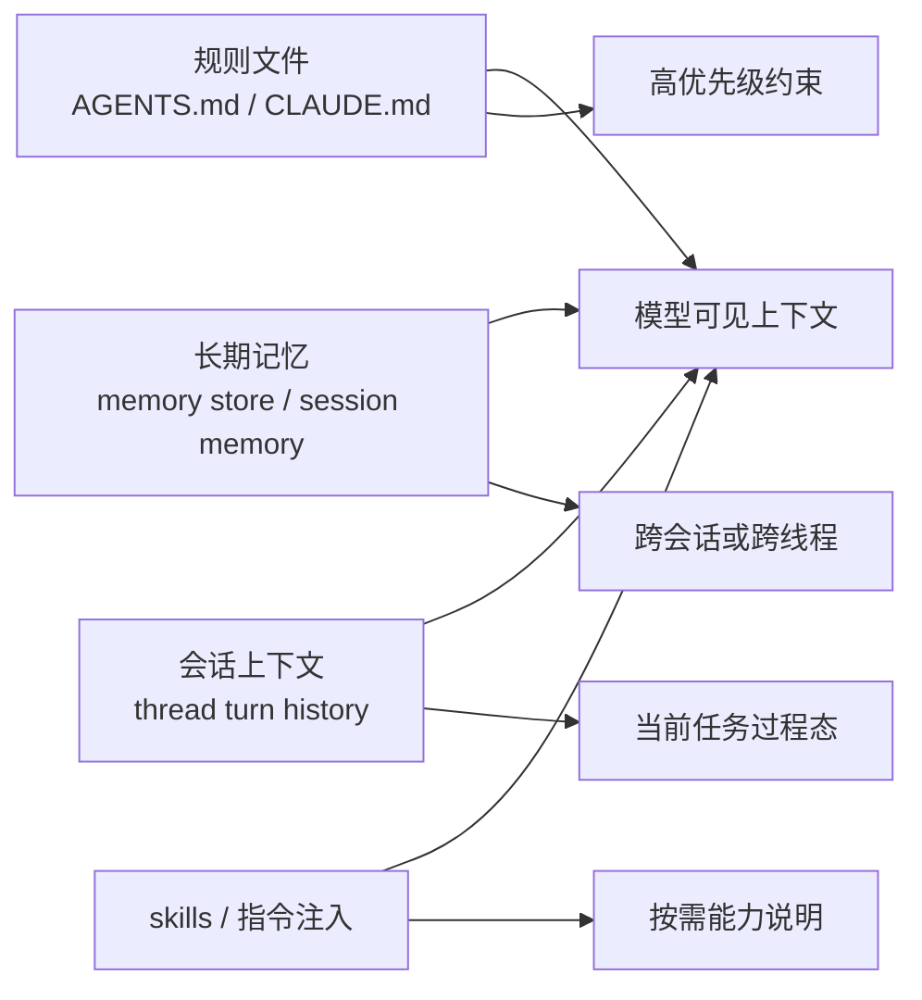

# 记忆、规则与项目说明：不要把 AGENTS、长期记忆、会话上下文写成同一个东西

这一篇要拆开的不是功能，而是四种经常被混写的“上下文来源”：

1. 规则文件
2. 长期记忆
3. 会话上下文
4. skills / instructions 注入

如果不先分层，后面的 compaction、resume、subagent handoff、eval 都会被写乱。

先给结论：

- `Claude Code` 的核心是把 `CLAUDE.md`、nested memory、skills、session memory、turn messages 混合进一条会话组装链，但这些对象的生命周期并不相同。证据类型：本地源码。`claude-code-src/src/QueryEngine.ts`、`src/Tool.ts`、`src/bootstrap/state.ts`、`src/services/SessionMemory/sessionMemory.ts`
- `OpenCode` 在三家里最明确地区分了 ambient instructions 与 session history：`AGENTS.md` 通过 `InstructionContext` 作为 System Context Source 注入，而 prompt admission / promoted history 走另一条 durable session 通道。证据类型：本地源码。`opencode/packages/core/src/instruction-context.ts`、`src/session/input.ts`、`src/session/context-epoch.ts`
- `Codex` 把项目规则和长期记忆再拆得更开：`AGENTS.md` 以 `instruction_sources` 和官方 `agents-md` 语义出现，memories 则是单独的读写扩展与后台 consolidation 管线。证据类型：本地源码。`codex/codex-rs/app-server-protocol/src/protocol/v2/thread.rs`、`codex/docs/agents_md.md`、`codex/codex-rs/memories/README.md`

- 证据类型：推断。依据三家注入链路的不同职责。

## 先把四类对象分清

### 规则文件

- 它们的作用是定义优先级较高、相对稳定的约束。
- 典型例子：`CLAUDE.md`、`AGENTS.md`。
- 问题不是“有没有读到”，而是“作用域、优先级、替换语义是什么”。

### 长期记忆

- 它们服务的是跨会话、跨线程、跨 rollout 的延续性。
- 不一定每轮都注入全部内容。
- 可能通过摘要、检索、引用或后台 consolidation 进入当前上下文。

### 会话上下文

- 它是当前任务的过程态：prompt、assistant 消息、工具调用、系统更新、todo/progress。
- 它必须能被 resume、compact、audit 和 retry 正确消费。

### skills / instructions 注入

- 它们是按需能力说明，不等于项目规则，也不等于长期记忆。
- 关键问题是：何时注入、是否跨 compaction 保留、是否对子代理重新加载。

- 证据类型：推断。依据后文三家实现分层。

## Claude Code：规则、技能、session memory 都能进 prompt，但生命周期不同

### 规则文件

- `bootstrap/state.ts` 里直接缓存 `cachedClaudeMdContent`，并记录 `additionalDirectoriesForClaudeMd`，说明 `CLAUDE.md` 是会在运行时被专门发现、缓存、重新装配的。证据类型：本地源码。`claude-code-src/src/bootstrap/state.ts`
- `ToolUseContext` 里有 `loadedNestedMemoryPaths`、`nestedMemoryAttachmentTriggers`，并特别说明用来避免重复注入同一份 `CLAUDE.md`。证据类型：本地源码。`claude-code-src/src/Tool.ts`

这说明 Claude Code 把规则文件当成“会进入模型上下文的高优先级文件”，但它仍受会话装配和缓存约束。  
证据类型：推断。依据 `cachedClaudeMdContent` 与 nested memory 注入逻辑。

### 长期记忆

- `QueryEngine.ts` 在构造消息时存在 `memoryMechanicsPrompt` 与 `CLAUDE_COWORK_MEMORY_PATH_OVERRIDE` 分支，说明记忆并不是天生总在上下文里，而是通过额外 mechanics prompt 告诉模型如何使用 memory 目录。证据类型：本地源码。`claude-code-src/src/QueryEngine.ts`
- session memory 是另一类对象：`SessionMemory/sessionMemory.ts` 只在主 REPL 线程后台提炼，并更新 `lastSummarizedMessageId`，更像“当前长会话的渐进摘要”。证据类型：本地源码。`claude-code-src/src/services/SessionMemory/sessionMemory.ts`

因此 Claude Code 至少有两层 memory：

- 面向工作流的 memory 目录/机制；
- 面向长会话 compaction 的 session memory。

- 证据类型：推断。依据 `memoryMechanicsPrompt` 与 session memory 子系统职责不同。

### skills / instructions 注入

- `QueryEngine.ts` 在 query 前显式加载 skills 和 plugins。证据类型：本地源码。`claude-code-src/src/QueryEngine.ts`
- `bootstrap/state.ts` 维护 `invokedSkills`，注释直接写明“for preservation across compaction”。证据类型：本地源码。`claude-code-src/src/bootstrap/state.ts`

这非常关键：  
skills 在 Claude Code 里不是一次性读完就算了，而是被视为压缩后仍需保留的能力上下文。

- 证据类型：本地源码。`claude-code-src/src/bootstrap/state.ts`

## OpenCode：最清楚地把规则文件和会话历史拆成两条 durable 轨道

### 规则文件

- `InstructionContext.observe()` 会从全局 config 目录和当前项目向上查找 `AGENTS.md`，并把找到的文件渲染成 `Instructions from: <path>` 文本。证据类型：本地源码。`opencode/packages/core/src/instruction-context.ts`
- `SystemContext.make()` 里的 `update()` 明确写着 “These instructions replace all previously loaded ambient instructions.”，说明 OpenCode 对规则文件变化采用替换语义，而不是增量追加语义。证据类型：本地源码。`opencode/packages/core/src/instruction-context.ts`

这和“把规则文件内容直接塞进 transcript”是两回事。  
证据类型：推断。依据 `InstructionContext` 作为 system context source 的实现。

### 会话上下文

- `SessionInput.admit()` 先写 durable inbox 并发布 `PromptAdmitted`；只有后续 promote 才发布 `Prompted` 让它进入模型可见历史。证据类型：本地源码。`opencode/packages/core/src/session/input.ts`
- `SessionContextEpoch.prepare()` 会把当前 System Context 与历史 snapshot 比较，必要时发布 `ContextUpdated`，但不会把它和普通 user prompt 混成一条 admission 流。证据类型：本地源码。`opencode/packages/core/src/session/context-epoch.ts`

所以 OpenCode 的层级非常分明：

- 规则文件进入 Context Epoch。
- prompt 进入 session inbox。
- 两者在 safe boundary 处汇合成下一轮 request。

- 证据类型：推断。依据 `instruction-context.ts`、`session/input.ts`、`session/context-epoch.ts`。

### skills / instructions 注入

- `specs/v2/session.md` 明确把“selected-agent available-skill guidance”写进 Context Source，而不是写进普通 transcript。证据类型：官方文档。`opencode/specs/v2/session.md`
- 同一规格还把“configured, remote, and nested instruction sources”列为后续工作，说明 OpenCode 对 instruction injection 的边界是显式设计项，不是假定已经完备。证据类型：官方文档。`opencode/specs/v2/session.md`

这代表一种很工程化的态度：  
先把注入点协议化，再逐步增加来源。  
证据类型：推断。依据 `specs/v2/session.md`。

## Codex：AGENTS.md 与 memories 被明确拆成两套系统

### 规则文件

- `thread/start` 响应会返回 `instruction_sources`，说明 Codex 会把当前线程到底加载了哪些规则来源变成协议返回值。证据类型：本地源码。`codex/codex-rs/app-server-protocol/src/protocol/v2/thread.rs`
- `docs/agents_md.md` 明确指出 `child_agents_md` feature 打开后，会为子代理追加 AGENTS.md 的作用域与优先级说明。证据类型：官方文档。`codex/docs/agents_md.md`

这意味着 Codex 把规则文件至少当成两层问题：

1. 主线程当前加载了什么。
2. 子代理是否继承、如何解释层级作用域。

- 证据类型：推断。依据 `instruction_sources` 与 `child_agents_md` 文档。

### 长期记忆

- `memories/README.md` 明确把 memories 分成 read path 与 write path，并说明只有根 session 启动且非 ephemeral、非 sub-agent、state DB 可用时才触发。证据类型：官方文档。`codex/codex-rs/memories/README.md`
- Phase 2 会生成 `MEMORY.md`、`memory_summary.md`、`raw_memories.md` 等工件，并通过内部 consolidation sub-agent 维护。证据类型：官方文档。`codex/codex-rs/memories/README.md`

这和“当前线程的 instruction sources”不是一个生命周期：

- AGENTS.md 是线程启动时要遵守的规则。
- memories 是后台更新、跨 rollout 聚合的长期资产。

- 证据类型：推断。依据 `thread.rs` 与 `memories/README.md`。

### skills / instructions 注入

- memories read path 本身会向 developer instructions 追加“何时应该做 quick memory pass”的说明。证据类型：本地源码。`codex/codex-rs/ext/memories/src/prompts.rs`
- 这说明在 Codex 里，某些扩展不只是暴露工具，还会修改开发者指令层。证据类型：本地源码。`codex/codex-rs/ext/memories/src/extension.rs`

这类设计的 trade-off 是：

- 好处：扩展能把“怎么用我”一起带进推理上下文。
- 代价：如果不清楚区分 instruction injection 与 memory asset，就会误把扩展提示当成长期记忆本身。

- 证据类型：推断。依据 memories extension 的 prompt contribution 设计。

## 并排比较：四类对象在三家里的落点不同

| 维度 | Claude Code | OpenCode | Codex |
|---|---|---|---|
| 规则文件 | `CLAUDE.md` 注入、缓存、nested memory 去重 | `AGENTS.md` 作为 `InstructionContext` | `instruction_sources` + AGENTS 层级文档 |
| 长期记忆 | memory 目录机制 + session memory 双层 | 目前公开更偏 instructions / session，不突出独立 memory 管线 | 独立 memories read/write + consolidation |
| 会话上下文 | conversation + transcript + compact boundary | durable inbox + projected history | thread / turn / item / goal / audit |
| skills / 注入 | invoked skills 可跨 compaction 保留 | skill guidance 作为 Context Source | 扩展可贡献 developer instructions |

- 证据类型：推断。依据前文源码与文档综合比较。

## 设计启发

1. 规则文件必须有明确的替换语义和作用域，否则它们会在 compaction、resume、subagent handoff 时变成幽灵约束。OpenCode 在这一点最清楚。证据类型：本地源码。`opencode/packages/core/src/instruction-context.ts`
2. 长期记忆不该天然等于“每轮都要注入到 prompt”。Codex 的 memories pipeline 说明，很多长期资产更适合通过检索或后台 consolidation 进入当前任务。证据类型：官方文档。`codex/codex-rs/memories/README.md`
3. 如果 skills 会影响执行边界，它们就应该像 Claude Code 那样有 compaction-preservation 策略，否则长任务后半程会丢掉能力约束。证据类型：本地源码。`claude-code-src/src/bootstrap/state.ts`
4. 设计文档里最容易犯的错误，是把 “AGENTS.md 内容”“memory summary”“当前 thread history”“某个 skill 的说明”写成同一种上下文。三家实现都说明，这四类对象的生命周期和恢复语义不同。证据类型：推断。依据全文比较。
