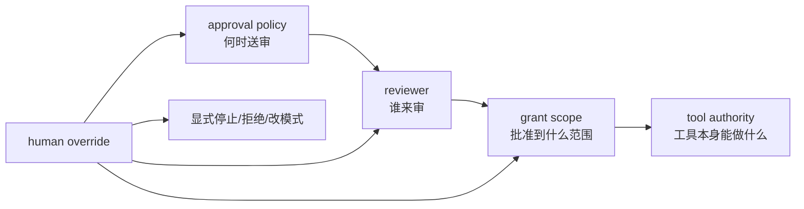
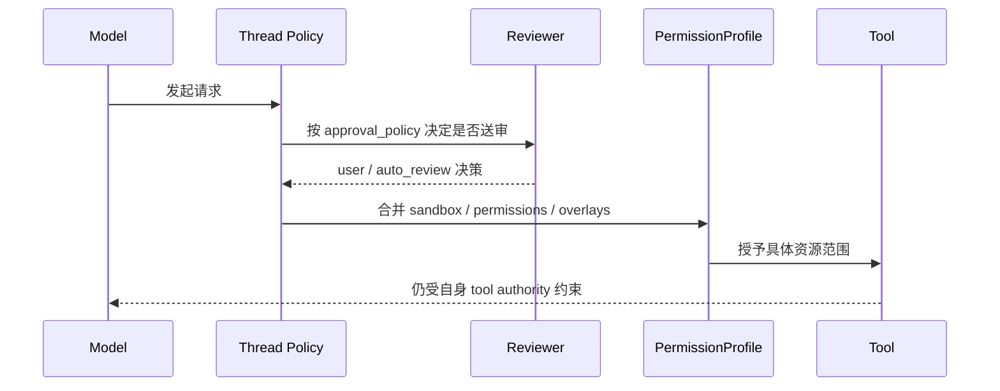

# 权限审批与人工接管：approval policy 不是 sandbox，human override 也不是万能后门

这一篇要拆开的四个词是：`approval policy`、`human override`、`permission scope`、`tool authority`。

先给结论：

- `Claude Code` 的审批设计更像“runtime 中的动态协商”：`canUseTool`、permission mode、hook、bridge control request 共同决定某次工具调用能不能继续；人工接管通常表现为用户显式批准、拒绝、Stop、Ctrl+C 或改变 permission mode。
  - 证据类型：本地源码。`claude-code-src/src/Tool.ts`、`src/QueryEngine.ts`、`src/bridge/bridgeMessaging.ts`
  - 证据类型：官方文档。hooks 文档
- `OpenCode` 在三家里最清楚地区分了 `policy evaluation` 和 `tool authority`：`PermissionV2` 负责 ask/assert/reply，`ToolRegistry` 负责目录裁剪与结算，具体工具自己声明要访问什么资源。
  - 证据类型：本地源码。`opencode/packages/core/src/permission.ts`、`src/tool/registry.ts`、`src/tool/AGENTS.md`
  - 证据类型：官方文档。仓库内 `opencode/specs/v2/tools.md`
- `Codex` 则把审批直接做进 thread protocol：`approval_policy` 决定何时请求批准，`approvals_reviewer` 决定由谁审，`permissions`/`sandbox` 决定能力边界，而 tool contract 再决定模型是否有权改写某类状态。
  - 证据类型：本地源码。`codex/codex-rs/app-server-protocol/src/protocol/v2/shared.rs`、`thread.rs`、`permissions.rs`、`ext/goal/src/spec.rs`、`tool.rs`
  - 证据类型：公开 issue / discussion。`openai/codex#24135`、`#29857`、`#23875`、`#29610`

## 四个概念先分开

- `approval policy`：什么时候必须把请求送去审批。
- `human override`：人类显式覆盖当前自动决策，例如强制停止、批准一次、改 reviewer、切换模式。
- `permission scope`：一次授权到底覆盖哪些资源、多久生效、是否可保存。
- `tool authority`：某个工具在设计上被允许做什么，哪怕审批通过也不能越权。

这四个概念如果混在一起，最常见的错误就是：

1. 把“审批通过”误写成“工具什么都能做”。
2. 把“全局全自动”误写成“没有人工接管入口”。
3. 把“沙箱限制”误写成“审批策略”。

## Claude Code：审批像 runtime 协调，不像单独的 policy object

### 它的边界在哪里

- `ToolPermissionContext` 里同时存在 `mode`、`alwaysAllowRules`、`alwaysDenyRules`、`alwaysAskRules`、`shouldAvoidPermissionPrompts`、`awaitAutomatedChecksBeforeDialog` 等字段，说明审批并不只是一个 yes/no 弹窗。
  - 证据类型：本地源码。`claude-code-src/src/Tool.ts`
- `QueryEngine` 会包装 `canUseTool` 并记录 `permission_denials`，说明审批结果会回流到 turn 结果和后续决策里。
  - 证据类型：本地源码。`claude-code-src/src/QueryEngine.ts`
- bridge 控制消息里存在 `set_permission_mode`、`interrupt` 等可变请求，说明人工 override 也是控制面的一部分。
  - 证据类型：本地源码。`claude-code-src/src/bridge/bridgeMessaging.ts`

### approval policy 在 Claude Code 里更接近什么

更准确地说，它更接近：

- 一个运行时模式集合；
- 再叠加 hook、classifier、UI prompt、remote control 回答；
- 而不是 `Codex` 那种 thread 协议里显式写死的 `approval_policy` 字段。

证据类型：推断。依据 `ToolPermissionContext`、`canUseTool` 包裹方式和 bridge 控制请求。

### human override 在这里表现为什么

- 用户在权限提示里批准/拒绝某个调用。
- 用户显式 Stop 或 Ctrl+C 打断当前工具或 turn。
- hook 以退出码 0/2 改写“继续、阻止、忽略”。
- 会话切换到别的 permission mode。

其中 Stop hook 甚至会在连续阻止过多次后被系统 override，说明“人工或脚本 override”本身也受系统上限约束。  
证据类型：官方文档。`https://docs.anthropic.com/en/docs/claude-code/hooks-guide`

### 真实边界风险

- Desktop Code tab 里 `/permissions` 与 `/goal` 不可用，说明不是每个宿主都暴露同样的人类审批入口。
  - 证据类型：公开 issue / discussion。`anthropics/claude-code#59969`
- 非交互 local-agent 里 `/remote-control` 被 denylist 阻止，说明“把审批转移给别的界面”也有宿主边界。
  - 证据类型：公开 issue / discussion。`anthropics/claude-code#63988`

## OpenCode：policy evaluation、scope persistence、tool authority 分得最清楚

### approval policy 由谁负责

- `PermissionV2.evaluate()` 负责把 action/resource 与 ruleset 匹配成 `allow / ask / deny`。
  - 证据类型：本地源码。`opencode/packages/core/src/permission.ts`
- `PermissionV2.assert()` 在 `ask` 时创建 pending request，并等待 `reply()`。
  - 证据类型：本地源码。`opencode/packages/core/src/permission.ts`
- `reply(always)` 还可以把允许规则写进 `PermissionSaved`，说明 permission scope 可以持久化，而不只是一次性点击。
  - 证据类型：本地源码。`opencode/packages/core/src/permission.ts`

### tool authority 由谁负责

- `ToolRegistry` 没有 `PermissionV2.Service` 依赖，它只做 materialize/settle，不替工具决定资源授权。
  - 证据类型：本地源码。`opencode/packages/core/src/tool/registry.ts`
- `tool/AGENTS.md` 直接写明 definition filtering 只是 catalog visibility，不是 execution authorization。
  - 证据类型：本地源码。`opencode/packages/core/src/tool/AGENTS.md`
- `tools.md` 规格明确要求 trusted tools 自己构造 permission request，registry 不注入万能 `assertPermission` 帮手。
  - 证据类型：官方文档。仓库内 `opencode/specs/v2/tools.md`

### 这说明了什么

OpenCode 很明确地反对一种混写：

- “出现在工具目录里” != “执行时已授权”
- “用户保存过一次 allow” != “工具权限无限放大”
- “registry 能看到全部工具” != “registry 有权替叶子工具审批”

这套边界在三家里是最清楚的。  
证据类型：推断。依据 `permission.ts`、`tool/registry.ts`、`tool/AGENTS.md` 与 `specs/v2/tools.md`。

### 人工 override 在这里是什么

- `reply(reject)` 会拒绝当前 pending request，还会把同 session 的其他 pending request 一并 reject。
  - 证据类型：本地源码。`opencode/packages/core/src/permission.ts`
- `reply(always)` 会把允许规则持久化成 saved permissions。
  - 证据类型：本地源码。`opencode/packages/core/src/permission.ts`

也就是说，人工 override 在 OpenCode 里不是“神奇大按钮”，而是明确地改写 request 的生命周期与持久化范围。  
证据类型：本地源码 + 推断。依据 `permission.ts` 中 `reply(reject)` 对 pending request 的处置，以及 `reply(always)` 对 saved permissions 的持久化写入。

## Codex：审批策略、审查者、权限配置、工具权限是分层协议

### approval policy 的边界

- `AskForApproval` 是显式枚举：`untrusted`、`on-failure`、`on-request`、`granular`、`never`。
  - 证据类型：本地源码。`codex/codex-rs/app-server-protocol/src/protocol/v2/shared.rs`
- `granular` 甚至继续拆成 `sandbox_approval`、`rules`、`skill_approval`、`request_permissions`、`mcp_elicitations`。
  - 证据类型：本地源码。`codex/.../shared.rs`

这说明 `approval policy` 在 Codex 里是“什么时候为哪类事情送审”，而不是批准后授予什么具体权限。

### reviewer 的边界

- `ApprovalsReviewer` 明确区分 `user` 与 `auto_review`/`guardian_subagent`。
  - 证据类型：本地源码。`codex/.../shared.rs`

也就是说：

- `approval policy` 解决“要不要审”。
- `approvals_reviewer` 解决“谁来审”。

两者不是一个字段换个名字。  
证据类型：本地源码。`codex/.../shared.rs`、`thread.rs`

### permission scope 的边界

- `ThreadStartParams` / `ThreadResumeParams` / `ThreadSettingsUpdateParams` 都允许设置 `sandbox` 或 `permissions`，并明确声明两者不能同时使用。
  - 证据类型：本地源码。`codex/codex-rs/app-server-protocol/src/protocol/v2/thread.rs`
- `ActivePermissionProfile` 明确记录当前生效的是哪个 profile，以及它是否继承了别的 profile。
  - 证据类型：本地源码。`codex/codex-rs/app-server-protocol/src/protocol/v2/permissions.rs`
- `AdditionalPermissionProfile` 又进一步支持 per-command 的 network / filesystem overlay。
  - 证据类型：本地源码。`codex/.../permissions.rs`

这说明 Codex 把 permission scope 做成了独立配置对象，而不是 approval policy 的副产品。

### tool authority 的边界

- `goal` 工具虽可见，但 `update_goal` 只能把状态设为 `complete` 或 `blocked`。
  - 证据类型：本地源码。`codex/codex-rs/ext/goal/src/spec.rs`
- `GoalToolExecutor` 明确拒绝 pause/resume/budget-limited/usage-limited。
  - 证据类型：本地源码。`codex/codex-rs/ext/goal/src/tool.rs`

这正是 tool authority 的典型例子：

- 审批通过不意味着工具能任意改状态。
- profile 允许 shell/file/network 也不意味着 `goal` 工具能越过其契约。

### 公开失效面

- `codex exec` 非交互场景里，MCP tool call 会因为 stdin 关闭而被 auto-cancel；用户只能退回 `--dangerously-bypass-approvals-and-sandbox`，这暴露了 headless approval 边界。
  - 证据类型：公开 issue / discussion。`openai/codex#24135`、`#29857`
- compaction/resume 后 `approvals_reviewer=auto_review` 可能丢失，线程退回手工审批。
  - 证据类型：公开 issue / discussion。`openai/codex#23875`
- automation / goal resume 之后线程可能降级为更保守的 approval path。
  - 证据类型：公开 issue / discussion。`openai/codex#29610`

## 并排比较：别把四层边界压成一个“权限系统”

| 维度 | Claude Code | OpenCode | Codex |
|---|---|---|---|
| approval policy 主落点 | runtime mode + hook + prompt | ruleset ask/allow/deny | protocol enum |
| human override 形式 | prompt/Stop/hook/改 mode | reply reject/always | reviewer、人类批准、thread settings 更新 |
| permission scope | 规则集与 session mode，公开对象较弱 | request/save/saved rules 很明确 | profile、additional permissions、sandbox overlays |
| tool authority | 工具本身 + runtime discipline | 叶子工具自行声明 | tool contract 明写不可越权状态 |

- 证据类型：推断。依据前文本地源码、官方文档与公开 issue 的综合比较。

## 设计启发

1. `approval policy` 应该回答“何时送审”，不要同时承担“批准到哪些资源”的职责。Codex 的字段拆法最清楚。  
   证据类型：推断。依据 `AskForApproval`、`ApprovalsReviewer`、`ActivePermissionProfile` 的职责边界。
2. `tool authority` 必须独立存在，否则审批一旦放宽，模型就会把高价值状态当成普通可写字段。Codex 的 `goal` 契约是一个很好的反例防护。  
   证据类型：推断。依据 `ext/goal/src/spec.rs` 与 `tool.rs`。
3. 人工 override 最好做成显式 request lifecycle 操作，而不是神秘 UI 按钮。OpenCode 的 `reply(reject/always)` 比较值得复用。  
   证据类型：推断。依据 `opencode/packages/core/src/permission.ts`
