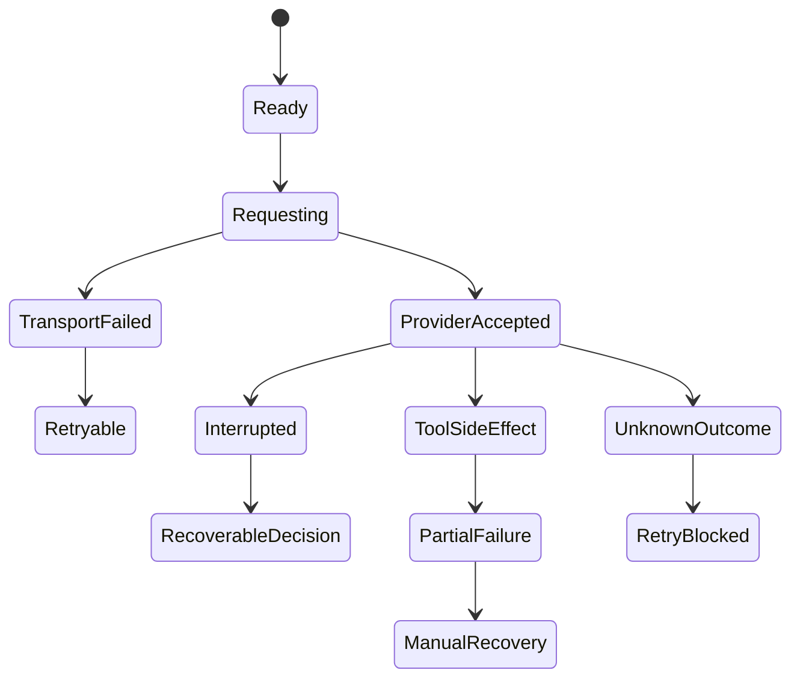

# 重试、恢复与失败处理：真正难的不是“再来一次”，而是知道什么时候绝不能再来一次

这一篇讨论 retry boundary、recovery boundary 和 failure taxonomy。

先给结论：

- `Claude Code` 在 bridge / remote control / tool interrupt 路线上已经形成了比较细的失败分类，但它的重试、恢复和继续执行语义仍分散在 bridge、QueryEngine、session restore、/goal 这些层里。证据类型：本地源码。`claude-code-src/src/bridge/bridgeApi.ts`、`src/bridge/replBridge.ts`、`src/Tool.ts`、`src/QueryEngine.ts`
- `OpenCode` 的规格最明确地写出了“哪些未知状态不能自动重试”，尤其是 provider-dispatch ambiguity、post-tool continuation、retry/abandon 决策。证据类型：官方文档。`opencode/specs/v2/todo.md`、`opencode/specs/v2/session.md`
- `Codex` 的优势是 goal/runtime/thread/audit 都是结构化对象，因此 partial failure、approval routing failure、subagent parent-child failure 更容易被显式分类；但代价是恢复路径要同时考虑线程、目标、权限和 analytics 一致性。证据类型：本地源码。`codex/codex-rs/ext/goal/src/runtime.rs`、`state/src/audit.rs`、`analytics/src/events.rs`

## 先定义 retry boundary

不是所有失败都能自动重试。最常见的边界至少有五类：

1. `纯传输失败`：请求没真正到达副作用边界。
2. `provider 已接单但结果未知`：最危险，通常不能盲重试。
3. `工具已开始副作用`：除非幂等，否则不能自动重试。
4. `审批失败/被拒`：这不是 retry，而是策略终止。
5. `取消或中断`：要优先判定为控制流事件，而不是普通错误。

- 证据类型：推断。依据三家都显式区分 interruption、tool settlement、provider overflow/unknown outcome。

## Claude Code：失败分类已经很细，但恢复逻辑跨多层

### 工具失败与取消

- `Tool.interruptBehavior()` 只允许 `cancel` 或 `block`，说明工具中断首先是一种控制流语义。证据类型：本地源码。`claude-code-src/src/Tool.ts`
- 如果把 interruption 吃掉并包装成普通 tool failure，就会破坏上层恢复逻辑。证据类型：推断。依据 `interruptBehavior` 设计意图。

### 远程桥接失败分类

- `bridgeApi.ts` 对 401 会做一次 token refresh retry；403、404、429、其他状态码又分开报错。证据类型：本地源码。`claude-code-src/src/bridge/bridgeApi.ts`
- `replBridge.ts` 和 `remoteBridgeCore.ts` 又进一步区分 reconnecting、failed、auth_failed、fatal，以及 crash-recovery pointer 的恢复路径。证据类型：本地源码。`claude-code-src/src/bridge/replBridge.ts`、`src/bridge/remoteBridgeCore.ts`

这类实现说明 Claude Code 的 retry boundary 大概是：

- 传输鉴权问题可以有限重试。
- 环境过期、worker epoch 不匹配等进入恢复或重连。
- 不是所有失败都往“重新跑一轮任务”收敛。

- 证据类型：推断。依据 bridge 状态机。

### 部分失败与取消 race

- `QueryEngine` 会记录 `api_retry`、structured output retry limit、permission denials 等信息，说明模型输出失败和执行控制失败也被分层。证据类型：本地源码。`claude-code-src/src/QueryEngine.ts`
- 公开 issue 里 `/goal` cancel 后继续跑，就是典型的 cancel race：控制面认为停止了，自动续跑层却还在推进。证据类型：公开 issue / discussion。`anthropics/claude-code#65099`

这代表 Claude Code 的重点风险不是“没有重试”，而是“不同恢复层之间谁赢”。  
证据类型：推断。依据 `/goal` issue 和 bridge/runtime 分层。

## OpenCode：对“不能自动重试”的边界写得最明确

### 什么时候不能重试

- `specs/v2/todo.md` 明确写了：post-crash continuation recovery 必须显式建模 `provider-attempt preparation versus provider-dispatch ambiguity`、`required post-tool continuation`、`retry and abandon decisions for unknown outcomes`。证据类型：官方文档。`opencode/specs/v2/todo.md`
- `specs/v2/session.md` 还写明 overflow compaction 只允许一次；第二次 overflow 或 compaction 不可用就变成 terminal failure。证据类型：官方文档。`opencode/specs/v2/session.md`

这几乎就是 retry boundary 教科书：

- 如果你不知道 provider 是否已经开始执行，就不要默认 safe retry。
- 如果工具已经有副作用，也不要假装可以无害重放。

- 证据类型：推断。依据 `specs/v2/todo.md` 与 `specs/v2/session.md`。

### 部分失败

- `runner/llm.ts` 在 provider turn 开始前会把先前仍标记为 `running` 的工具失败成 `Tool execution interrupted`。证据类型：本地源码。`opencode/packages/core/src/session/runner/llm.ts`
- 这说明 OpenCode 对“工具半途死掉”不走静默恢复，而是先显式沉淀失败，再让后续 continuation 决定是否继续。证据类型：本地源码。`opencode/packages/core/src/session/runner/llm.ts`

### 取消 race

- `sessions.interrupt(sessionID)` 在规格里明确会等待 runner cleanup、清掉 follow-up wake，但保留 durable inbox rows 给之后 resume。证据类型：官方文档。`opencode/specs/v2/session.md`

这个设计的关键优点是：

- 中断不等于把未消费输入丢掉。
- 但也不等于立刻自动继续。

- 证据类型：官方文档。`opencode/specs/v2/session.md`

## Codex：结构化线程系统更适合把失败归到正确层

### 工具/目标/线程失败分层

- `update_goal` 明确拒绝 pause/resume/budget-limited 等状态迁移，说明某些“失败后的状态变更”根本不允许模型自行重试修复。证据类型：本地源码。`codex/codex-rs/ext/goal/src/tool.rs`、`src/spec.rs`
- `GoalRuntimeHandle` 会区分 `prepare_external_goal_mutation`、`apply_external_goal_set/clear`、`account_active_goal_progress`，说明恢复与失败处理需要在目标计量层先做结算。证据类型：本地源码。`codex/codex-rs/ext/goal/src/runtime.rs`

### 部分失败

- `state/src/audit.rs` 能读取线程状态审计行，说明部分失败后至少还能从状态库侧回答“线程落在什么状态”。证据类型：本地源码。`codex/codex-rs/state/src/audit.rs`
- `analytics/events.rs` 对 delegated subagent approval 有单独事件，这意味着审批链部分失败不会只能靠 transcript 诊断。证据类型：本地源码。`codex/codex-rs/analytics/src/events.rs`

### 什么时候不能重试

- 如果失败已经穿过线程、goal、approval 三层之一的不可逆边界，盲目重试只会制造新的归责混乱。证据类型：推断。依据 Codex 的结构化分层。

## 建议的失败分类

可以把这类系统的 failure taxonomy 至少写成下面六类：

1. `Transient transport failure`
2. `Provider accepted, outcome unknown`
3. `Tool execution interrupted before durable settlement`
4. `Tool side effect partially applied`
5. `Approval or policy denial`
6. `State inconsistency / recovery mismatch`

对应策略应该分别是：

- 1 类：有限自动重试。
- 2 类：默认阻止自动重试，等待显式恢复决策。
- 3 类：先沉淀失败，再决定是否继续。
- 4 类：要求人工或专门恢复逻辑。
- 5 类：不重试，只升级或终止。
- 6 类：优先审计和重建状态，不直接继续执行。

- 证据类型：推断。依据三家公开设计边界。

## 设计启发

1. “可重试”应该是一种被证明的属性，不是默认值。OpenCode 的 TODO 在这点上最诚实。证据类型：官方文档。`opencode/specs/v2/todo.md`
2. 取消和中断必须从普通错误里分离出来，否则会在恢复后制造重复执行。Claude Code 的 `interruptBehavior` 和 `/goal` 失效面都指向这一点。证据类型：本地源码 + 公开 issue / discussion。`claude-code-src/src/Tool.ts`、`anthropics/claude-code#65099`
3. 部分失败必须可审计。Codex 的 thread/goal/audit 体系给出了更好的下限。证据类型：本地源码。`codex/codex-rs/state/src/audit.rs`、`ext/goal/src/runtime.rs`
4. 自动恢复如果跨过了副作用边界，就不再是“retry”，而是在赌幂等性。生产系统不该默认做这种赌注。证据类型：推断。依据全文比较。
