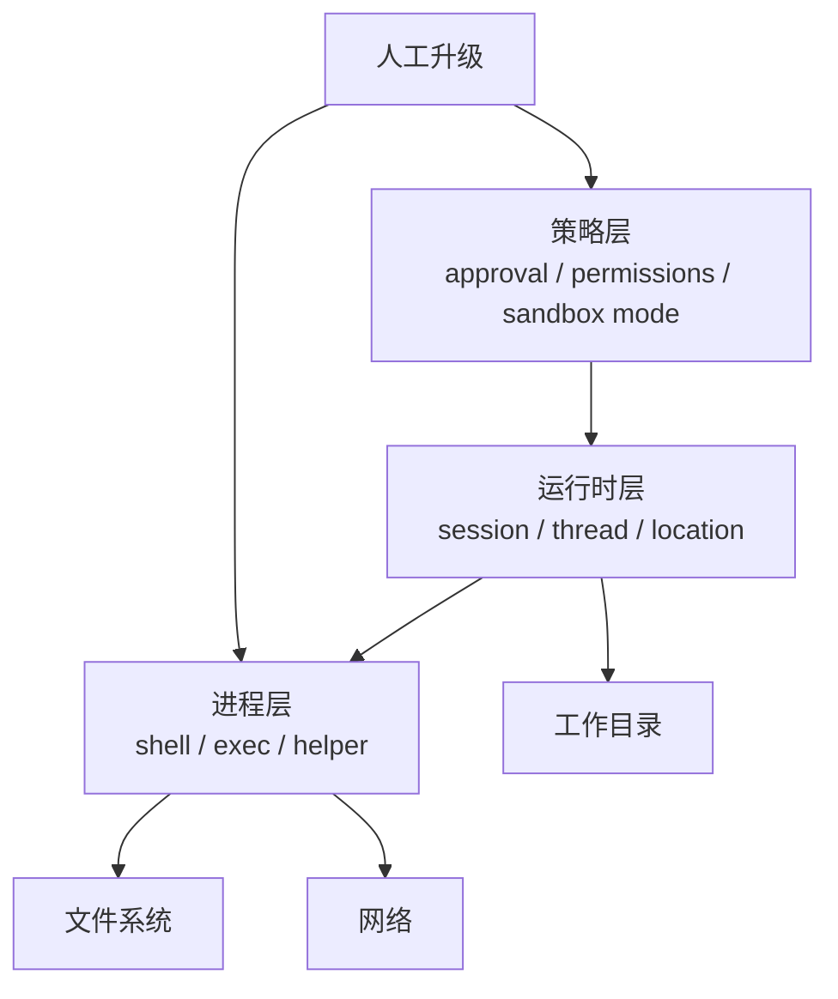
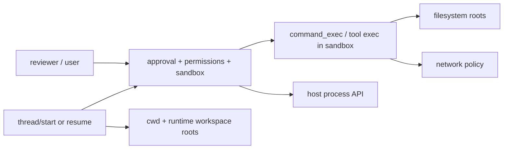

# 沙箱与执行隔离：同样叫 sandbox，三家隔离的对象根本不是一回事

这一篇讨论的是：文件系统、shell、网络、工作目录、权限升级、容器/进程隔离，到底分别落在哪一层。

先给结论：

- `Claude Code` 的隔离边界更像“会话运行时上的安全护栏”：有 permission mode、可选 sandbox、额外工作目录、remote/bridge 环境差异，但公开主叙事不是一个强协议化 sandbox profile。
  - 证据类型：本地源码。`claude-code-src/src/Tool.ts`、`src/bridge/sessionRunner.ts`、`src/bridge/bridgeUI.ts`
  - 证据类型：公开 issue / discussion。`anthropics/claude-code#59969`、`#63988`
- `OpenCode` 当前更强调 `Location / workspace / permission / process boundary`，而不是对外暴露一组像 `read-only/workspace-write` 那样的统一 sandbox policy 名称。
  - 证据类型：本地源码。`opencode/packages/core/src/filesystem.ts`、`src/cross-spawn-spawner.ts`、`src/permission.ts`
  - 证据类型：官方文档。仓库内 `opencode/specs/v2/tools.md`、仓库根 `TODO.md`
- `Codex` 在三家里把隔离面写得最显式：thread protocol 里有 `sandbox`/`permissions`，沙箱策略里明确区分 `read-only`、`workspace-write`、`danger-full-access`、`external-sandbox`，并继续分解 writable roots、network access、临时目录排除与独立命令执行。
  - 证据类型：本地源码。`codex/codex-rs/app-server-protocol/src/protocol/v2/shared.rs`、`permissions.rs`、`thread.rs`、`command_exec.rs`
  - 证据类型：官方文档。`codex/codex-rs/README.md`
  - 证据类型：公开 issue / discussion。`openai/codex#14068`、`#5041`、`#12996`、`#28281`

## 先把六层隔离分开

- `文件系统隔离`：哪些路径可读、可写、可删除。
- `shell 隔离`：shell 命令是否被包装、是否要额外审批、是否存在非 shell 的 exec 通道。
- `网络隔离`：DNS、HTTP、socket 是否允许。
- `工作目录隔离`：进程从哪个 cwd 启动，运行时是否能切换 cwd，切换后边界是否跟着变。
- `权限升级`：本来不允许的操作能否通过人工或策略临时升级。
- `容器/进程隔离`：命令是跑在当前宿主、受限子进程，还是外部环境/容器里。

如果不先分层，最容易出现的错误是把“文件可写”写成“全权限”，或者把“允许网络”写成“没有 sandbox”。

## Claude Code：公开出来的是 permission runtime，不是强协议 sandbox

### 文件系统与工作目录

- `ToolPermissionContext` 里有 `additionalWorkingDirectories`，说明它允许在主 cwd 之外额外开放工作目录，但这更像运行时附加权限，而不是独立 profile 对象。
  - 证据类型：本地源码。`claude-code-src/src/Tool.ts`
- `bootstrap/state.ts` 区分 `originalCwd`、`projectRoot`、当前 `cwd`，并说明 worktree 启动与中途 EnterWorktreeTool 的行为不同。
  - 证据类型：本地源码。`claude-code-src/src/bootstrap/state.ts`

### shell 与进程

- bridge `sessionRunner` 会以子进程方式启动 CLI，并把 `cwd`、`permissionMode`、`CLAUDE_CODE_FORCE_SANDBOX` 等环境注入 child process。
  - 证据类型：本地源码。`claude-code-src/src/bridge/sessionRunner.ts`
- 这说明它至少支持“在桥接/远程模式下强制把 child 会话放进 sandbox”。
  - 证据类型：本地源码。`claude-code-src/src/bridge/sessionRunner.ts`

### 网络与宿主差异

- `remote-control`、Desktop、本地 REPL、headless/SDK 不是同一个执行环境；一些命令只在交互终端可用，一些在桌面 local-agent 被 denylist。
  - 证据类型：公开 issue / discussion。`anthropics/claude-code#59969`、`#63988`

### 权限升级边界

- `Claude Code` 确实允许把本来不允许的操作临时放宽，但公开路径主要是 UI 审批、hook 返回结果、切换 permission mode，或在 bridge/remote 宿主里通过控制面改变本次会话的运行方式。
  - 证据类型：本地源码 + 官方文档。`claude-code-src/src/Tool.ts`、`src/bridge/bridgeMessaging.ts`、hooks 文档
- 这些放宽更像“对当前 runtime 规则和当前请求做协商式调整”，而不是像 `Codex` 那样显式叠加一个独立的 profile overlay 对象。
  - 证据类型：本地源码 + 推断。依据 `Claude Code` 公开的是 `mode`、规则集、bridge 控制请求与 hook 结果，而 `Codex` 公开的是 `ActivePermissionProfile`、`AdditionalPermissionProfile` 与 thread-level `sandbox/permissions` 配置。
- 如果进入 Desktop、本地 agent、remote-control 或非交互宿主，这些升级入口是否可见、由谁触发、能放宽到什么范围，还会继续受宿主能力面约束。
  - 证据类型：公开 issue / discussion + 推断。`anthropics/claude-code#59969`、`#63988`

### 关键 trade-off

`Claude Code` 更像：

- “先有交互式 runtime，再给它加权限和 sandbox 护栏”

而不是：

- “先定义统一 sandbox contract，再让所有宿主照着跑”

证据类型：推断。依据 `ToolPermissionContext`、`sessionRunner` 和公开宿主边界 issue。

## OpenCode：隔离主轴是 Location、workspace 与 trusted process leaf

### 文件系统

- `filesystem.ts` 会把输入解析为相对 `location.directory` 的绝对路径，并检查目标路径必须包含在 location 根内。
  - 证据类型：本地源码。`opencode/packages/core/src/filesystem.ts`
- 这说明 OpenCode 的第一层隔离单位是 `Location` 或 workspace 根，而不是一个对外宣传的“read-only / workspace-write”名字。  
  证据类型：本地源码 + 推断。依据 `filesystem.ts` 的 location containment 实现，以及当前公开文档更强调 workspace/location 边界而非统一命名 sandbox mode。

### shell / 进程

- `cross-spawn-spawner.ts` 显式整理 `cwd`、`shell` 等子进程参数，说明 shell 执行是受统一进程启动器约束的。
  - 证据类型：本地源码。`opencode/packages/core/src/cross-spawn-spawner.ts`
- `tools.md` 明确说 interruption 是 cancellation 机制，并要求工具不要吞掉 interruption，说明 shell/process 隔离不仅是路径问题，也是 effect lifecycle 问题。
  - 证据类型：官方文档。仓库内 `opencode/specs/v2/tools.md`

### 权限升级与 scope

- `PermissionV2` 把 action/resource 作为授权基本单位，还支持 `always` 持久化保存。
  - 证据类型：本地源码。`opencode/packages/core/src/permission.ts`

这意味着 OpenCode 的“升级”更像：

- 扩大某个 action/resource scope

而不是：

- 直接切换到一个全新 sandbox mode

### 容器/进程隔离与公开未完成面

- 官方 TODO 里专门提到要重新审视 hostile external process 的 syscall-level mutation confinement，还没把 descriptor-relative mutation 之类硬边界完全做实。
  - 证据类型：官方文档。仓库根 `opencode/TODO.md`
- 同一份 TODO 也说明 clustered interruption、stale-owner fencing、background bash jobs 等隔离难题仍在切片化推进。
  - 证据类型：官方文档。仓库根 `opencode/TODO.md`

所以更稳的写法是：

- OpenCode 已经有明确的 location/process/permission 边界；
- 但它当前公开主叙事仍是 runtime decomposition，而不是统一命名的 sandbox 产品面。

证据类型：推断。依据 `filesystem.ts`、`cross-spawn-spawner.ts`、`permission.ts`、`TODO.md`。

## Codex：把隔离对象写进协议和 profile

### sandbox mode 与 sandbox policy 是两层

- `SandboxMode` 只有三种高层入口：`read-only`、`workspace-write`、`danger-full-access`。
  - 证据类型：本地源码。`codex/codex-rs/app-server-protocol/src/protocol/v2/shared.rs`
- 真正生效的 `SandboxPolicy` 继续细分为：
  - `ReadOnly { network_access }`
  - `WorkspaceWrite { writable_roots, network_access, exclude_tmpdir_env_var, exclude_slash_tmp }`
  - `DangerFullAccess`
  - `ExternalSandbox { network_access }`
  - 证据类型：本地源码。`codex/.../permissions.rs`

这说明 `sandbox mode` 是用户入口，`sandbox policy` 是运行时展开后的具体隔离对象。

### 文件系统

- `workspace-write` 不只是“当前目录可写”，还显式带 `writable_roots`。
  - 证据类型：本地源码。`codex/.../permissions.rs`
- 官方 README 还补充：在 `workspace-write` 下，`~/.codex/memories` 也会加入 writable roots。
  - 证据类型：官方文档。`codex/codex-rs/README.md`

### 网络

- `ReadOnly` 和 `WorkspaceWrite` 都要单独声明 `network_access`。
  - 证据类型：本地源码。`codex/.../permissions.rs`
- `ExternalSandbox` 甚至把网络单独抽成 `Restricted/Enabled` 枚举。
  - 证据类型：本地源码。`codex/.../permissions.rs`

所以在 Codex 里：

- 只读文件系统 != 禁网
- 可写工作区 != 自动放开网络

证据类型：本地源码 + 推断。依据 `ReadOnly { network_access }` 与 `WorkspaceWrite { ..., network_access, ... }` 是彼此独立的结构字段，因而文件系统写权限与网络权限不是同一个开关。

### 工作目录

- `ThreadStartParams`、`ThreadResumeParams`、`ThreadSettingsUpdateParams` 都带 `cwd` 和 `runtime_workspace_roots`。
  - 证据类型：本地源码。`codex/codex-rs/app-server-protocol/src/protocol/v2/thread.rs`

这意味着 cwd 不是一个隐式 shell 参数，而是 thread control plane 的一部分。

### 权限升级

- thread/turn/standalone command 都允许设置 `permissions` profile 或 `sandboxPolicy`，但明确不能同时使用。
  - 证据类型：本地源码。`codex/.../thread.rs`、`command_exec.rs`
- `ApprovalsReviewer` 与 `AskForApproval` 再决定升级请求由谁审、何时审。
  - 证据类型：本地源码。`codex/.../shared.rs`

### 容器与进程隔离

- 官方 README 直接写出 `codex sandbox` 会按宿主平台使用 Seatbelt、Linux sandbox 或 Windows restricted token。
  - 证据类型：官方文档。`codex/codex-rs/README.md`
- `command_exec` 又提供“在 server sandbox 中运行 standalone command”的独立接口，而 `process.rs` 则是“不经过 Codex sandbox 的 host process”。
  - 证据类型：本地源码。`codex/codex-rs/app-server-protocol/src/protocol/v2/command_exec.rs`、`process.rs`

这在三家里是最明确的进程边界拆分。

### 公开失效面

- `app-server` 工具命令可能仍在 `read-only` sandbox 中执行，即使上层看起来已经 bypass 了 approvals/sandbox。
  - 证据类型：公开 issue / discussion。`openai/codex#14068`
- VS Code / Desktop 等宿主里曾出现 network policy 传播不一致，即便用户认为自己已经开了 full access。
  - 证据类型：公开 issue / discussion。`openai/codex#5041`、`#12996`、`#28281`

## 并排比较：三家的“沙箱”不是同一个抽象

| 维度 | Claude Code | OpenCode | Codex |
|---|---|---|---|
| 公开主抽象 | permission runtime + 可选 sandbox | location/workspace/process boundary | protocolized sandbox mode/policy |
| 文件系统边界 | cwd + additional working dirs + runtime rules | location.directory containment | writable_roots / permission profiles |
| 网络边界 | 宿主相关，公开对象较弱 | 更多落在 permission/process 设计 | sandbox policy 显式字段 |
| shell 边界 | child CLI / tool runtime / hooks | cross-spawn + trusted tools | sandboxed command_exec 与 host process 分离 |
| 权限升级 | UI/hook/mode/remote control | request/reply/saved scope | approval_policy + reviewer + permission profile |
| 容器/OS 隔离 | 公开细节较少 | 仍在持续硬化 | Seatbelt / Linux sandbox / Windows token 明示 |

- 证据类型：推断。依据前文本地源码、官方文档与公开 issue 的综合比较。

## 设计启发

1. 不要用一个 `sandbox=true` 掩盖文件系统、网络、cwd、exec 通道四个不同问题。Codex 的 policy 拆法最值得借鉴。  
   证据类型：推断。依据 `SandboxMode` 与 `SandboxPolicy` 的双层设计。
2. 如果系统以 workspace/location 为核心，文档就应该像 OpenCode 一样把边界写成 location containment，而不是强行假装自己有统一产品化 sandbox mode。  
   证据类型：推断。依据 `filesystem.ts` 与 `TODO.md`
3. 交互式 runtime 的宿主差异必须单独写，不然用户会误以为桌面、终端、headless 是同一种隔离环境。Claude Code 的公开 issue 已经证明这点。  
   证据类型：公开 issue / discussion。`anthropics/claude-code#59969`、`#63988`
