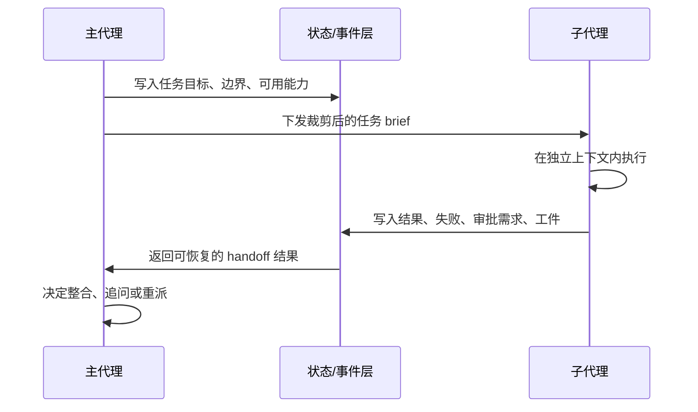

# 子代理交接与编排：handoff contract 比“会不会开分身”更重要

这一篇讨论的不是“系统能不能起 subagent”，而是更难的部分：

- 主代理交给子代理的最小契约是什么
- 哪些上下文应该裁掉，哪些必须保留
- 结果要以什么工件形式回传
- 主代理和子代理的责任边界怎么防止漂移

先给结论：

- `Claude Code` 对 subagent 最激进，既支持 specialized subagent，也支持 fork yourself；它把 handoff contract 直接写进 Agent tool prompt 和 `createSubagentContext()` 的隔离策略里。证据类型：本地源码。`claude-code-src/src/tools/AgentTool/prompt.ts`、`src/tools/AgentTool/forkSubagent.ts`、`src/utils/forkedAgent.ts`
- `OpenCode` 当前公开材料更强调 background job / background agent dispatch 的 durable status 与取消/续跑语义。证据类型：官方文档。`opencode/specs/v2/todo.md`、`opencode/specs/v2/session.md`
- 由此更稳妥的归纳是：它当前公开重点先放在“编排一致性”；至于不是把重点放在大规模公开子代理 prompt contract，现有材料更适合标成推断。证据类型：官方文档 + 推断。依据公开规格当前暴露面的侧重点。
- `Codex` 已经把 subagent/thread spawn、parent/child 拓扑、approval routed through guardian thread、subagent analytics source 做进协议和状态层，所以它比前两家更像“线程编排系统”。证据类型：本地源码。`codex/codex-rs/agent-graph-store/src/store.rs`、`codex-rs/app-server-protocol/src/protocol/v2/thread_data.rs`、`codex-rs/analytics/src/events.rs`

- 证据类型：推断。依据三家对子代理状态隔离与回传方式的共同需求。

## handoff contract 应该包含什么

最小 contract 至少要有五项：

1. `目标`：子代理要解决的具体问题。
2. `边界`：能不能改文件、能不能联网、何时必须停。
3. `上下文包`：给它哪些历史，哪些不该给。
4. `结果格式`：是要报告、patch、状态变更、还是只返回结论。
5. `失败回传`：失败时是直接终止、请求审批、还是要求主代理二次分派。

如果缺其中任一项，系统就会出现典型故障：

- 子代理复述大段无关上下文。
- 主代理拿不到可整合工件。
- 审批责任被子代理偷偷越权。
- 失败后只剩一句“没成功”，无法恢复。

- 证据类型：推断。依据后文三家实现中的显式设计边界。

## Claude Code：把上下文裁剪和角色边界写进子代理上下文工厂

### 主代理/子代理边界

- `AgentTool/prompt.ts` 明确写了：有 `subagent_type` 时 fresh agent starts without context；fork path 则继承 full conversation context。证据类型：本地源码。`claude-code-src/src/tools/AgentTool/prompt.ts`
- `forkSubagent.ts` 说明 omitted `subagent_type` 触发 implicit fork，child 继承完整对话上下文，而不是重新 briefing。证据类型：本地源码。`claude-code-src/src/tools/AgentTool/forkSubagent.ts`

这已经暴露出 Claude Code 的第一条核心 trade-off：

- specialized subagent：上下文小，但 briefing 成本高。
- fork subagent：上下文大，但能减少 handoff 信息损失。

- 证据类型：推断。依据 `prompt.ts` 与 `forkSubagent.ts`。

### 上下文裁剪

- `createSubagentContext()` 默认 clone `readFileState`、重建 `agentId`、新建 `queryTracking`，并把 `shouldAvoidPermissionPrompts` 设成 true，说明它默认假设子代理应在隔离上下文里工作，且尽量不弹交互 UI。证据类型：本地源码。`claude-code-src/src/utils/forkedAgent.ts`
- 同一函数又会按需共享 `abortController`、`setAppState`、`setResponseLength`、`contentReplacementState`，说明 Claude Code 允许在隔离和共享之间做细粒度 handoff 配置。证据类型：本地源码。`claude-code-src/src/utils/forkedAgent.ts`

换句话说，Claude Code 的 handoff contract 并不只是一段 prompt，而是：

- 一段文字 briefing；
- 一组上下文共享/隔离开关；
- 一套 permission / cache / interrupt 继承策略。

- 证据类型：推断。依据 `createSubagentContext()` 的字段设计。

### 任务工件

- 系统 prompt 明确要求非 trivial implementation 后必须做 adversarial verification，并把“原始用户请求、改动文件、方案、plan 文件路径”传给 verification subagent。证据类型：本地源码。`claude-code-src/src/constants/prompts.ts`
- 这说明 Claude Code 不是让子代理只回一句“我看过了”，而是要求回传可核对工件。证据类型：本地源码。`claude-code-src/src/constants/prompts.ts`

## OpenCode：公开重点先放在 durable orchestration，而不是 prompt 化的 subagent 协作剧本

### 主代理/子代理边界

- `specs/v2/todo.md` 把 “background bash jobs and background agent dispatch with durable status observation, completion delivery, and explicit cancellation / continuation semantics” 列为后续切片。证据类型：官方文档。`opencode/specs/v2/todo.md`
- 同一 TODO 又强调 durable/clustered interruption、retries、stale-owner fencing 需要独立设计。证据类型：官方文档。`opencode/specs/v2/todo.md`

这说明 OpenCode 当前更关心的是：

- 子任务能否 durable 观察；
- 是否能在取消、恢复、换 owner 后保持一致；

而不是先定义一套花哨的子代理角色 prompt。  
证据类型：推断。依据 `specs/v2/todo.md` 的优先级排序。

### 上下文裁剪与工件回传

- `specs/v2/session.md` 一直把 prompt admission、projected history、tool settlement、event cursor 作为编排骨架，说明未来无论 background agent 怎样落地，它也会被要求生成 durable 可观察事件，而不是只留在内存回调里。证据类型：官方文档。`opencode/specs/v2/session.md`
- `background-job.ts` 中状态枚举已经区分 `running`、`completed`、`error`、`cancelled`。证据类型：本地源码。`opencode/packages/core/src/background-job.ts`

因此 OpenCode 的 handoff contract 更可能是：

- durable job identity
- 状态观测
- 明确 completion delivery

而不只是 prompt brief。  
证据类型：推断。依据 `background-job.ts` 与 `specs/v2/todo.md`。

## Codex：把 subagent handoff 升级成 parent/child thread 协议

### 主代理/子代理边界

- `agent-graph-store` 明确提供 `upsert_thread_spawn_edge`、`set_thread_spawn_edge_status`、`list_thread_spawn_children/descendants`，说明 Codex 把 parent/child 关系持久化了。证据类型：本地源码。`codex/codex-rs/agent-graph-store/src/store.rs`
- `thread_data.rs` 里 `SessionSource` 与 `ThreadSource` 直接区分 `SubAgent`、`MemoryConsolidation` 等来源。证据类型：本地源码。`codex/codex-rs/app-server-protocol/src/protocol/v2/thread_data.rs`

这意味着在 Codex 里，subagent 不是“主线程里的一个特殊工具结果”，而是：

- 可能拥有独立 thread；
- 拥有可追踪来源；
- 能进入 parent/child 图。

- 证据类型：推断。依据 `agent-graph-store` 与 `thread_data.rs`。

### 上下文裁剪

- `analytics/events.rs` 专门记录 `subagent_source`、`parent_thread_id`，并有“approval requested by a delegated subagent and routed through the parent”这样的事件说明。证据类型：本地源码。`codex/codex-rs/analytics/src/events.rs`
- 这表示 Codex 的关键上下文裁剪不是“子代理拿了几条消息”，而是“审批和归责是否仍回到父线程”。证据类型：本地源码。`codex/codex-rs/analytics/src/events.rs`

### 任务工件

- 因为 Codex 的线程、goal、audit 和 state DB 都是结构化对象，子代理结果更自然的交付物是线程状态、审批事件、goal 更新、审计行，而不是单段自由文本总结。证据类型：推断。依据 `thread.rs`、`thread_data.rs`、`state/src/audit.rs`、`analytics/events.rs`

## 三种路线的差异

| 维度 | Claude Code | OpenCode | Codex |
|---|---|---|---|
| handoff 主体 | prompt brief + context factory | durable job orchestration | parent/child thread protocol |
| 子代理上下文 | fresh vs fork 两种模式 | 尚在收敛，更偏 runtime 状态 | 独立线程/来源/图关系 |
| 结果工件 | transcript、verification report、tool result | durable status / completion delivery | thread state、audit、approval、goal 事件 |
| 最大风险 | brief 不完整或共享过多上下文 | 取消/恢复/ownership 语义未完全收敛 | 协议复杂，父子线程归责链更难维护 |

- 证据类型：推断。依据前文源码与规格比较。

## 设计启发

1. `handoff contract` 不应只是一段自然语言 prompt；至少还要包含权限、取消、回传格式和恢复边界。Claude Code 的 `createSubagentContext()` 已经证明这一点。证据类型：本地源码。`claude-code-src/src/utils/forkedAgent.ts`
2. 若子代理会长期运行或后台运行，必须先把 durable status 与 completion delivery 设计清楚，否则恢复后主代理不知道该接什么。OpenCode 的 TODO 把这件事放在前面是对的。证据类型：官方文档。`opencode/specs/v2/todo.md`
3. 一旦子代理涉及审批，最好像 Codex 一样让 parent/child 归责进入协议和事件层，而不是只靠 transcript 推断。证据类型：本地源码。`codex/codex-rs/analytics/src/events.rs`
4. “子代理越独立越好”是错误直觉。真正要优化的是：给它最小充分上下文，并要求它返回主代理可消费的工件。否则只是在把复杂度搬出主线程。证据类型：推断。依据三家 trade-off。
