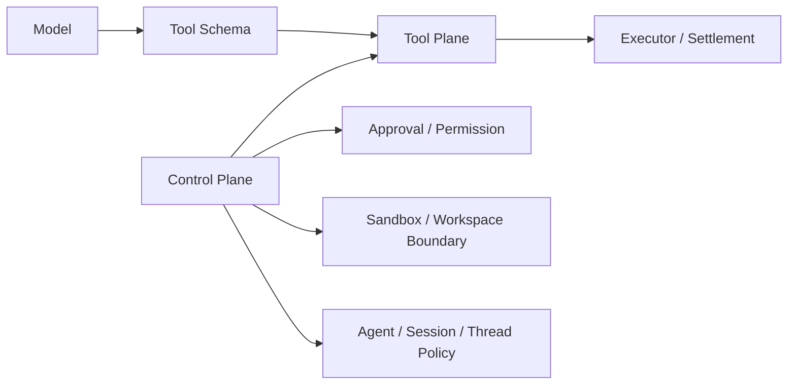
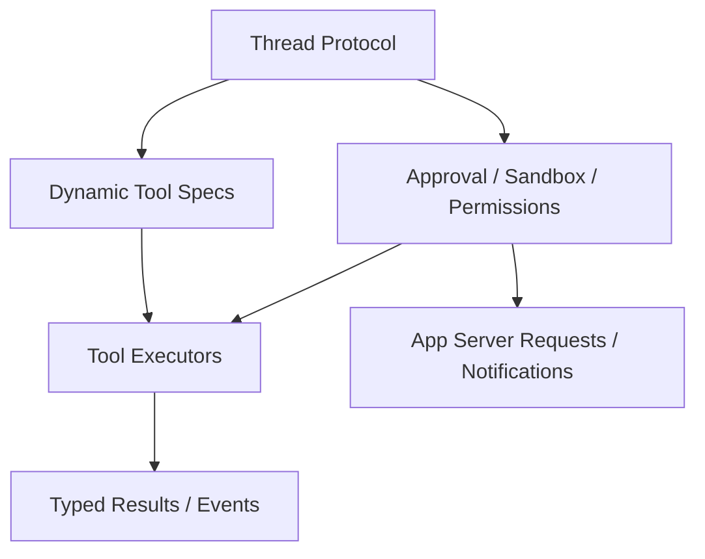

# 工具协议与控制面：为什么真正决定 agent 上限的不是 prompt，而是执行边界

这一篇讨论的不是“模型会不会调用工具”，而是另一个更关键的问题：工具怎样被定义、怎样被裁剪、谁能批准、谁来结算、哪些能力属于 tool plane，哪些能力属于 control plane。

先给结论：

- `Claude Code` 的工具系统仍然很强调 prompt discipline，但已经有明显的 permission、hooks、bridge control request 边界。
  - 证据类型：本地源码。`claude-code-src/src/Tool.ts`、`src/QueryEngine.ts`、`src/bridge/bridgeMessaging.ts`
- `OpenCode` 把工具定义、权限判断、结算与运行时调度拆得最清楚，`ToolRegistry` 本身甚至不依赖 `PermissionV2.Service`。
  - 证据类型：本地源码。`opencode/packages/core/src/tool/registry.ts`、`src/permission.ts`
- 证据类型：OpenCode 官方规格文档（仓库内 `opencode/specs/v2/tools.md`、`opencode/specs/v2/session.md`）。
- `Codex` 把很多“控制面字段”直接塞进 thread/app-server 协议，例如 approval policy、sandbox、permissions profile、dynamic tools。
  - 证据类型：本地源码。`codex/codex-rs/app-server-protocol/src/protocol/v2/thread.rs`
  - 证据类型：本地源码。`codex/codex-rs/ext/goal/src/spec.rs`

## 问题：为什么“有工具调用”不等于“有控制面”

很多系统做到工具调用后，会停在下面这一层：

- 给模型一个 JSON schema
- 返回一个工具结果
- 用 prompt 提醒“谨慎使用”

但真正的生产级 agent 还必须回答：

1. 工具 schema 谁拥有，运行时还是 UI？
2. 权限是工具内部判断，还是统一 control plane 判断？
3. 工具 catalog 会不会因为 agent、workspace、权限而变化？
4. 工具调用失败时，返回的是普通文本，还是类型化失败？
5. shell、file edit、background task、goal 更新这些到底是不是同一类工具？

## Claude Code：工具纪律很强，但 control plane 更像会话运行时的一部分

### 三家做法之一：Claude Code

`Claude Code` 的工具面有两个明显特征：

- `ToolUseContext` 把 permissions、hooks、tool decisions、requestPrompt、notification、read limits、glob limits、query tracking 等都塞进工具上下文。
  - 证据类型：本地源码。`claude-code-src/src/Tool.ts`
- `QueryEngine` 在提交消息时包裹 `canUseTool`，显式追踪 permission denials。
  - 证据类型：本地源码。`claude-code-src/src/QueryEngine.ts`
- bridge 能接收 `control_request`，包括 initialize、set_model、can_use_tool 等服务器控制请求。
  - 证据类型：本地源码。`claude-code-src/src/bridge/bridgeMessaging.ts`

### 它的控制面特点

这意味着 `Claude Code` 并不是“只有 prompt 在约束工具”。更准确地说：

- prompt 负责工具纪律和行为倾向；
- `canUseTool`、permission mode、hooks、bridge control request 负责真实执行边界；
- tool/use/result 与 UI 展示之间还有 bridge 过滤层。

### trade-off

- 好处：交互式体验强，工具纪律和会话上下文结合紧密。
- 代价：tool plane 与 session runtime 耦合较高，不像独立 registry 那样容易被别的宿主复用。
- 推断：Claude 的 control plane 更像“runtime 内核的一部分”，而不是单独公开的工具平台。
  - 证据类型：推断。依据是 `ToolUseContext` 的宽接口与 `QueryEngine` 的集中包裹逻辑。

## OpenCode：工具协议、权限、结算、广告目录是分开的

### 三家做法之二：OpenCode

`OpenCode` 在这条线上最值得抄的地方，是明确把几层边界拆开：

- `ToolRegistry.materialize()` 根据 permissions 生成当前可广告给模型的 tool definitions。
  - 证据类型：本地源码。`opencode/packages/core/src/tool/registry.ts`
- `ToolRegistry.settle()` 负责 lookup、typed failure、输出边界化和结果结算。
  - 证据类型：本地源码。`opencode/packages/core/src/tool/registry.ts`
- `PermissionV2` 独立做 `evaluate / ask / assert / reply`，并通过 `EventV2` 发布 `Asked/Replied` 事件。
  - 证据类型：本地源码。`opencode/packages/core/src/permission.ts`
- `todowrite` 这种具体工具自己调用 `permission.assert(...)`，说明“registry 不做所有事情，执行器负责声明自己要触达哪些资源”。
  - 证据类型：本地源码。`opencode/packages/core/src/tool/todowrite.ts`

### 关键差异

OpenCode 的 `tool/AGENTS.md` 甚至明确写了：`ToolRegistry` 不依赖 `PermissionV2.Service`，registry 负责 catalog 和 settle，权限在工具执行时由受信执行器自己断言。

- 证据类型：本地源码。`opencode/packages/core/src/tool/AGENTS.md`

这是一种非常刻意的设计：

- registry 不充当万能中控；
- permission 不隐藏在 UI 回调后面；
- 具体工具必须显式说出自己需要什么边界；
- 最终 control plane 由 session、permission、tool registry、location 一起构成。

- 证据类型：推断。依据 OpenCode 仓库内官方规格文档（`opencode/specs/v2/tools.md`、`opencode/specs/v2/session.md`）与 `tool/registry.ts`、`permission.ts`、`tool/AGENTS.md` 的职责切分。

### trade-off

- 好处：工具协议清楚，权限裁剪和执行结算都能独立演化。
- 代价：实现者必须理解多层责任分配，写工具时不能偷懒依赖全局魔法。
- 关键结论：OpenCode 的重点不是“工具很多”，而是“工具平面与控制平面分责明确”。
  - 证据类型：本地源码。`tool/registry.ts`、`permission.ts`、`tool/todowrite.ts`

## Codex：把控制面直接做进 thread 协议和 app-server

### 三家做法之三：Codex

`Codex` 的工具定义当然也有 schema，但更大的差异在于控制面很多时候先于工具存在：

- thread 启动参数直接携带 `approval_policy`、`approvals_reviewer`、`sandbox`、`permissions`、`dynamic_tools`、`instruction_sources`。
  - 证据类型：本地源码。`codex/codex-rs/app-server-protocol/src/protocol/v2/thread.rs`
- `goal` 被公开成 `get_goal/create_goal/update_goal` 三个工具，但工具说明同时把“哪些状态不能由模型变更”写进契约。
  - 证据类型：本地源码。`codex/codex-rs/ext/goal/src/spec.rs`
- `GoalToolExecutor` 在处理 `update_goal` 时明确拒绝 pause/resume/budget-limit 之类状态，由系统或用户控制。
  - 证据类型：本地源码。`codex/codex-rs/ext/goal/src/tool.rs`

### 这说明了什么

对 `Codex` 来说，tool plane 只是控制面的一个入口，不是全部：

- 一部分边界在 thread 协议；
- 一部分边界在 app-server 请求/通知；
- 一部分边界在 sandbox/approval profile；
- 一部分边界在具体工具契约。

这也是为什么它更适合画成下面这样：

### trade-off

- 好处：高风险能力可以先受协议控制，再受工具契约控制，模型自由度被主动压缩。
- 代价：新增能力往往要同时动协议、执行器、状态层，迭代成本更高。
- 关键结论：`Codex` 的控制面不是“工具之上的附属层”，而是系统主干。
  - 证据类型：本地源码。`thread.rs`、`spec.rs`、`tool.rs`

## 并排比较：三家并不是同一类“tool use”

| 维度 | Claude Code | OpenCode | Codex |
|---|---|---|---|
| 工具 schema 的主载体 | 工具定义 + prompt discipline | registry materialization | 协议 + tool spec |
| 权限判定位置 | runtime 包裹的 `canUseTool` 与 permission mode | `PermissionV2` 独立服务 | thread/app-server policy + tool 契约 |
| 工具 catalog 是否动态裁剪 | 有，但更偏 runtime 内部 | 明确按 permissions materialize | 明确按 thread settings / dynamic tools / profiles |
| 控制面最强的落点 | session runtime | permission + registry + location | thread protocol + app-server |
| 最大风险 | 把工具纪律误当成全部控制面 | 抽象较重，难快速读懂 | 协议和执行层一起演进，成本高 |

- 证据类型：推断。依据前文本地源码与 OpenCode 仓库内官方规格文档（`opencode/specs/v2/tools.md`、`opencode/specs/v2/session.md`）的综合比较。

## 设计启发

1. 工具 schema 只是入口，不是控制面本体。（证据类型：推断。依据 `Tool.ts`、`QueryEngine.ts` 与 `bridgeMessaging.ts` 的职责边界。）
2. 需要把“可广告给模型的工具目录”和“真正执行时的权限判断”分开。`OpenCode` 在这点上最清楚。（证据类型：推断。依据 OpenCode 仓库内官方规格文档（`opencode/specs/v2/tools.md`、`opencode/specs/v2/session.md`）以及 `tool/registry.ts`、`permission.ts`。）
3. 高风险状态变更不要只靠 prompt 劝阻，应该像 `Codex goal` 一样在工具契约里明确禁止某些状态迁移。（证据类型：推断。依据 `thread.rs`、`spec.rs`、`tool.rs`。）
4. 如果你的系统以交互 CLI 起家，也至少要像 `Claude Code` 一样在 runtime 层留下 `canUseTool`、permission mode、hook、bridge request 这些硬边界。（证据类型：推断。依据 `Tool.ts`、`QueryEngine.ts` 与 `bridgeMessaging.ts`。）

最后的稳妥判断是：

- `Claude Code` 强在工具纪律和会话控制融合。（证据类型：推断。依据前文本地源码对 tool 调用包裹方式的归纳。）
- `OpenCode` 强在 tool plane 与 control plane 的分责。（证据类型：推断。依据 OpenCode 仓库内官方规格文档（`opencode/specs/v2/tools.md`、`opencode/specs/v2/session.md`）与本地源码。）
- `Codex` 强在把 control plane 升格为协议与状态的一部分。（证据类型：推断。依据 `thread.rs`、`spec.rs`、`tool.rs`。）

这三种路线各有上限，也各有成本。（证据类型：推断。依据前文对 `Claude Code`、`OpenCode`、`Codex` 控制面落点与实现代价的综合比较。）
