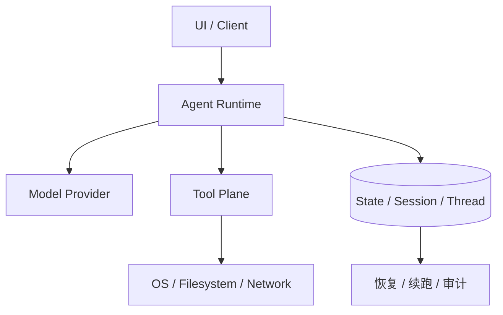
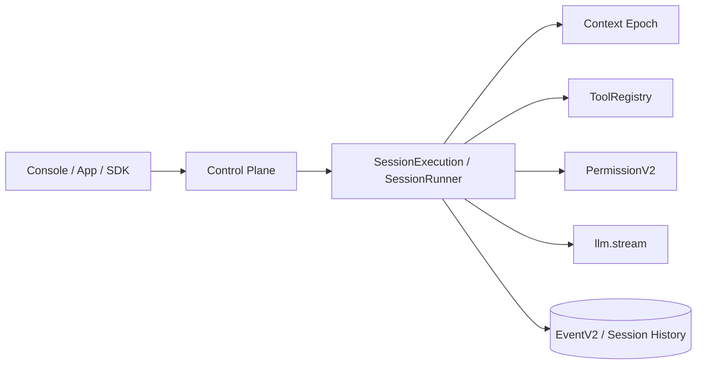
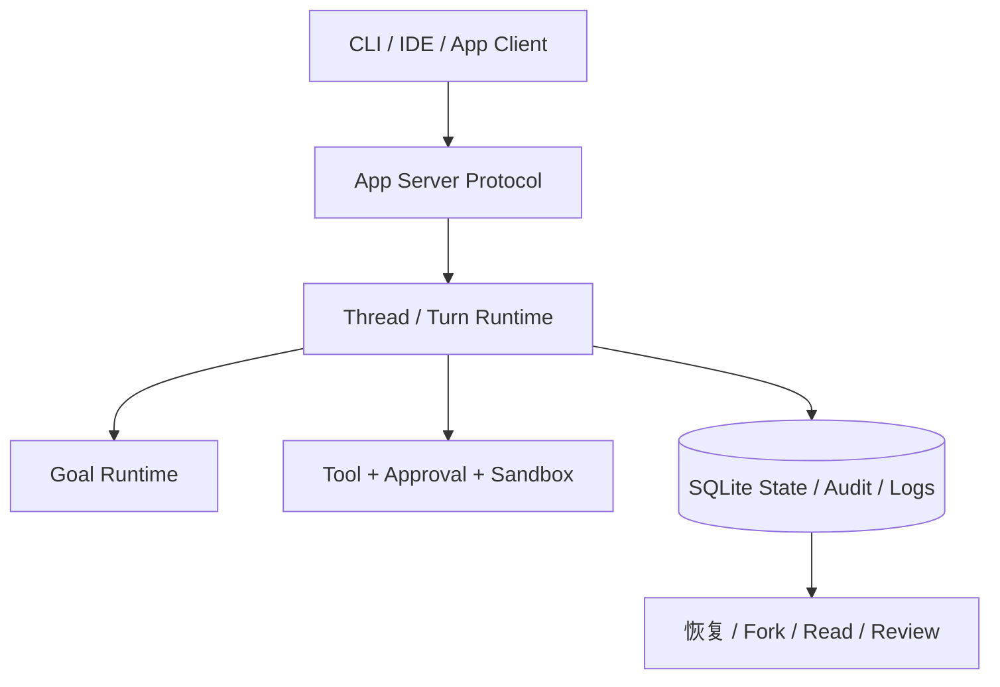

# UI、Runtime 与状态边界：为什么解耦不是“前后端分层”这么简单

这一篇只回答一个问题：AI 编码 agent 为什么必须把 `UI`、`runtime`、`provider`、`state` 拆开，而且三家为什么拆得不一样。

结论先说在前面：

- `Claude Code` 更像“交互壳 + 会话运行时”的解耦，重点是让同一套 query/tool/session 逻辑同时服务 REPL、SDK 和 bridge。
  - 证据类型：本地源码。`claude-code-src/src/QueryEngine.ts`、`src/Tool.ts`、`src/bootstrap/state.ts`、`src/bridge/bridgeMessaging.ts`
- `OpenCode` 更像“位置感知 runtime + 可替换 control plane”的解耦，UI 不是中心，`Location`、`SessionRunner`、`ToolRegistry`、`Context Epoch` 才是中心。
  - 证据类型：OpenCode 官方规格文档（仓库内 `opencode/specs/v2/session.md`）。
  - 证据类型：本地源码。`opencode/packages/core/src/session/context-epoch.ts`、`src/tool/registry.ts`、`src/permission.ts`
- `Codex` 更像“协议对象 + app-server + 状态数据库”的解耦，UI 只是某种 client，线程和回合状态才是一等公民。
  - 证据类型：本地源码。`codex/codex-rs/app-server-protocol/src/protocol/v2/thread.rs`、`thread_data.rs`、`codex-rs/state/src/lib.rs`

## 问题：为什么不能把 UI 直接绑死在 agent loop 上

如果 UI 直接长在 agent loop 里，会立刻遇到四个问题：

1. 同一套执行逻辑很难同时服务 CLI、桌面端、SDK、远程控制。
2. provider 切换会把 UI 行为一起拖动，导致状态边界混乱。
3. 恢复、续跑、审计只能依赖“聊天记录”，而不是稳定状态。
4. 子 agent、后台任务、权限回调很容易沦为 UI 特判。

下面这张图给出三家都在解决的抽象问题，但实现重点完全不同：

## Claude Code：先把“会话运行时”从 REPL 中抽出来

### 它怎么拆

`Claude Code` 的核心不是把前端做得多薄，而是把 `query lifecycle` 从 REPL 中抽成 `QueryEngine`。源码直接写明：`QueryEngine owns the query lifecycle and session state for a conversation`，并强调它既服务 headless/SDK，也为未来 REPL 共用做准备。

- `QueryEngine` 持有消息、权限拒绝、usage、文件缓存、技能发现等会话级状态。
  - 证据类型：本地源码。`claude-code-src/src/QueryEngine.ts`
- `ToolUseContext` 把 tool、permission、hook、notification、UI callback、state setter 放在同一个运行时接口里，但允许部分 UI 能力在 headless 模式缺席。
  - 证据类型：本地源码。`claude-code-src/src/Tool.ts`
- `bootstrap/state.ts` 持有大量 session-scoped runtime state，例如 hooks、系统提示词缓存、prompt cache、日志、telemetry、session-only flags。
  - 证据类型：本地源码。`claude-code-src/src/bootstrap/state.ts`
- bridge 层只转发“对远端有意义的消息”，明确过滤内部 REPL chatter、tool progress 等本地噪音。
  - 证据类型：本地源码。`claude-code-src/src/bridge/bridgeMessaging.ts`

### 这说明了什么

`Claude Code` 的 UI/runtime 解耦不是“有个前端有个后端”，而是：

- REPL、bridge、SDK 是不同外壳。
- 真正共享的是 conversation runtime。
- UI 层可以附加标题提取、状态显示、权限弹窗，但不拥有核心执行状态。

### trade-off

- 好处：同一套 agent loop 可以较快复用到 CLI、Remote Control、SDK。
- 代价：`ToolUseContext` 和 bootstrap state 很肥，说明运行时虽然脱离了单一 UI，但仍然偏单体会话对象。
- 推断：这类设计更容易快速演进交互体验，但要把状态进一步拆成严格协议对象会更难。
  - 证据类型：推断。依据是 `QueryEngine`、`ToolUseContext`、`bootstrap/state.ts` 的高聚合状态形态。

## OpenCode：UI 退后，Location-aware runtime 站到中间

### 它怎么拆

`OpenCode` 的 V2 设计文档几乎把“UI”降成次要问题，主叙事是：

- `sessions.prompt` 先进入 durable `session_input` inbox，再由 `SessionExecution.resume(sessionID)` 驱动运行。
  - 证据类型：OpenCode 官方规格文档（仓库内 `opencode/specs/v2/session.md`）。
- `SessionRunner`、catalog、model resolver、tool registry、permission、filesystem 都缓存并挂在 `Location` 上，而不是挂在某个页面组件上。
  - 证据类型：OpenCode 官方规格文档（仓库内 `opencode/specs/v2/session.md`）。
- `Context Epoch` 把“给模型看的系统上下文”做成独立持久层，和普通 UI 会话状态分离。
  - 证据类型：本地源码。`opencode/packages/core/src/session/context-epoch.ts`
- `ToolRegistry` 负责工具物化和结算，权限过滤只影响广告出来的 catalog，不把 registry 自己和 UI 绑死。
  - 证据类型：本地源码。`opencode/packages/core/src/tool/registry.ts`

### 这说明了什么

`OpenCode` 的边界更接近下面这张图：

它把“当前是什么界面”降级为入口差异，把“当前 Session 在哪个 Location、有哪些可用工具、上下文基线是什么、权限如何裁剪”升格为 runtime 的主角。

### trade-off

- 好处：provider、workspace、remote/local placement、权限和工具都能在 runtime 层组合，不必围着 UI 做特判。
- 代价：抽象层明显更重，`Session`、`Location`、`Context Epoch`、`EventV2`、`ToolRegistry` 的理解门槛比交互式 CLI 高。
- 推断：这类设计更适合做“可嵌入平台”或多前端承载，而不是只做一个终端代理。
- 证据类型：推断。依据 OpenCode 仓库内官方规格文档（`opencode/specs/v2/session.md`）对 `Location`、`SessionRunner`、`Context Epoch` 的中心化设计。

## Codex：把 UI 彻底降格为协议客户端

### 它怎么拆

`Codex` 的第一观察点不是 TUI，而是 `thread` 协议对象：

- `ThreadStartParams` 和 `ThreadStartResponse` 直接建模了 model、provider、cwd、workspace roots、approval policy、sandbox、dynamic tools、instruction sources。
  - 证据类型：本地源码。`codex/codex-rs/app-server-protocol/src/protocol/v2/thread.rs`
- `Thread`、`Turn`、`TurnItemsView` 把线程、回合、项目载荷的可见性做成稳定协议，而不是 UI 内部结构。
  - 证据类型：本地源码。`codex/codex-rs/app-server-protocol/src/protocol/v2/thread_data.rs`
- `state` crate 单独维护 SQLite-backed rollout metadata、goal、thread metadata、audit rows。
  - 证据类型：本地源码。`codex/codex-rs/state/src/lib.rs`

### 这说明了什么

`Codex` 的典型形态更接近：

UI 在这里当然重要，但它的重要性主要体现在“协议消费者”，而不是“运行时宿主”。

### trade-off

- 好处：线程生命周期、设置更新、恢复、fork、review 都可以稳定落到协议和状态库上。
- 代价：系统实现成本更高，很多能力必须经过 app-server 协议和状态持久化层才能落地。
- 关键差异：它不是把 UI 和 runtime 稍微分开，而是把 runtime 先协议化、再让 UI 消费。
  - 证据类型：本地源码。`thread.rs`、`thread_data.rs`、`state/src/lib.rs`

## 并排比较：三家到底哪里不同

| 维度 | Claude Code | OpenCode | Codex |
|---|---|---|---|
| UI 的相对地位 | 强交互外壳，但核心 loop 已抽离 | UI 只是 runtime 入口之一 | UI 更像协议 client |
| runtime 的中心对象 | 会话 query engine | session runner + location | thread + turn |
| provider 边界 | 嵌在 query/runtime 里 | 明确是 runner 的一层依赖 | 通过线程协议与 app-server 配置暴露 |
| state 的主落点 | 会话内状态 + 恢复辅助 | inbox / event / context epoch / session history | thread state / goal / audit / logs |
| 最容易误写的点 | 误写成“终端 UI 驱动一切” | 误写成“只是另一个 CLI” | 误写成“只是 prompt 更强” |

- 证据类型：推断。依据前文本地源码与 OpenCode 仓库内官方规格文档（`opencode/specs/v2/session.md`）的综合比较。

## 设计启发

1. 如果你先做的是交互式 CLI，至少也要尽早把 conversation runtime 从 UI 组件里抽出来。这是 `Claude Code` 给的最低门槛。（证据类型：推断。依据 `QueryEngine`、`ToolUseContext` 与 `bootstrap/state.ts` 的高聚合状态形态。）
2. 如果你要支持多宿主、多 workspace、远端/本地混跑，应该优先把 `Location / Session / ToolRegistry / Permission` 作为 runtime 主轴，而不是继续堆 UI 特判。这是 `OpenCode` 的启发。（证据类型：推断。依据 OpenCode 仓库内官方规格文档（`opencode/specs/v2/session.md`）与 `context-epoch.ts`、`tool/registry.ts` 的分层关系。）
3. 如果你要做可恢复、可审计、可多客户端消费的系统，线程和回合必须先变成协议对象，状态必须脱离 UI 存活。这是 `Codex` 的启发。（证据类型：推断。依据 `thread.rs`、`thread_data.rs`、`state/src/lib.rs`。）

最后给一个稳妥判断：

- `Claude Code` 的解耦重点是“把运行时从单一 REPL 抽出”。（证据类型：推断。依据前文本地源码对 `QueryEngine` 与会话状态抽离方式的归纳。）
- `OpenCode` 的解耦重点是“把运行时提升为独立 control plane”。（证据类型：推断。依据 OpenCode 仓库内官方规格文档（`opencode/specs/v2/session.md`）与本地源码的综合比较。）
- `Codex` 的解耦重点是“把运行时协议化并持久化”。（证据类型：推断。依据 `thread.rs`、`thread_data.rs`、`state/src/lib.rs`。）

这三者不是同一种架构的轻微变体。（证据类型：推断。依据前文对 `QueryEngine`、`Location/SessionRunner`、`thread/turn/state` 三类中心对象的综合比较。）
