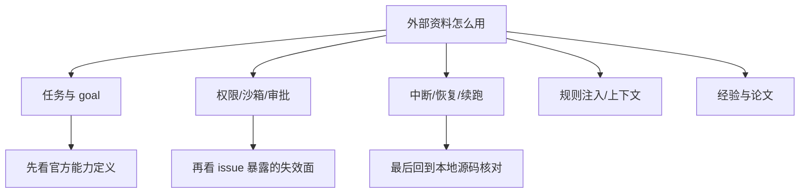

# 外部资料与公开讨论索引

这一页不是链接堆栈，而是把外部资料按“你在设计什么问题”来归档。

检索日期：**2026-07-09**

证据使用规则：

- `官方文档`：可用于确认公开能力边界、用户可见语义、版本要求。
- `公开 issue / discussion`：可用于识别失效面、宿主差异、回归风险，不能单独当成官方规格。
- `论文 / 经验资料`：用于解释为什么这些设计选择合理，不用于直接证明某家实现细节。
- `推断`：只在前面三类证据不足以直接下结论时使用，并明确标注。

## 一、任务推进、Todo 与 Goal

### Claude Code

- 官方文档：`/goal`
  - 链接：<https://code.claude.com/docs/en/goal>
  - 用途：确认 completion condition、自动续跑、版本要求与 `/loop`、Stop hook 的区别。
- 官方文档：Best practices
  - 链接：<https://code.claude.com/docs/en/best-practices>
  - 用途：确认 unattended run 的推荐收束方式。
- 官方文档：What’s new / 2026 Week 20
  - 链接：<https://code.claude.com/docs/en/whats-new>
  - 链接：<https://code.claude.com/docs/en/whats-new/2026-w20>
  - 用途：确认 `/goal` 的公开发布时间与能力叙述。
- 公开 issue / discussion：`/goal` cancel 后仍续跑
  - 链接：<https://github.com/anthropics/claude-code/issues/65099>
  - 用途：识别 completion-condition loop 与 cancel race 的回归面。
- 公开 issue / discussion：Stop hook JSON 校验导致 `/goal` auto-clear 失败
  - 链接：<https://github.com/anthropics/claude-code/issues/58558>
  - 用途：识别 `/goal` 对 Stop hook 结果格式的依赖。

### OpenCode

- 官方文档：V2 session spec
  - 链接：<https://github.com/sst/opencode/blob/dev/specs/v2/session.md>
  - 用途：确认 session、history、projection、continuation 的公开 runtime 骨架。
- 官方文档：V2 todo spec
  - 链接：<https://github.com/sst/opencode/blob/dev/specs/v2/todo.md>
  - 用途：确认 background dispatch、durable continuation、explicit cancellation/continuation semantics 仍在收敛。
- 官方文档：仓库根 `TODO.md`
  - 链接：<https://github.com/sst/opencode/blob/dev/TODO.md>
  - 用途：确认恢复、重试、continuation 的未完成边界。

### Codex

- 官方文档：Codex guide
  - 链接：<https://developers.openai.com/codex>
  - 用途：确认 Codex 作为 coding agent 的公开定位。
- 官方文档：CLI sandbox 与 approvals
  - 链接：<https://developers.openai.com/codex/security>
  - 用途：确认沙箱、审批与 CLI 运行边界。
- 公开 issue / discussion：`codex exec resume` 仍要求 prompt 或 stdin
  - 链接：<https://github.com/openai/codex/issues/24016>
  - 用途：识别 thread resume 与 goal continuation 仍未完全打通的边界。
- 公开 issue / discussion：usage limit 后 goal resume 卡在 approval
  - 链接：<https://github.com/openai/codex/issues/28574>
  - 用途：识别长任务续跑与审批链路耦合的风险。

## 二、权限、审批、沙箱与人工接管

### Claude Code

- 官方文档：Hooks
  - 链接：<https://docs.anthropic.com/en/docs/claude-code/hooks>
  - 用途：确认 Stop hook、PreToolUse、PostToolUse 的控制面地位。
- 官方文档：Hooks guide
  - 链接：<https://docs.anthropic.com/en/docs/claude-code/hooks-guide>
  - 用途：确认连续阻止上限、输出格式等实际限制。
- 公开 issue / discussion：Desktop Code tab 中 `/goal` 与 `/permissions` 不可用
  - 链接：<https://github.com/anthropics/claude-code/issues/59969>
  - 用途：识别宿主环境差异。
- 公开 issue / discussion：`/remote-control` 在非交互环境被 denylist 阻止
  - 链接：<https://github.com/anthropics/claude-code/issues/63988>
  - 用途：识别 headless 场景的人工接管边界。

### OpenCode

- 官方文档：V2 tools spec
  - 链接：<https://github.com/sst/opencode/blob/dev/specs/v2/tools.md>
  - 用途：确认 trusted executors、permission assert、interruption contract。
- 官方文档：V2 todo spec
  - 链接：<https://github.com/sst/opencode/blob/dev/specs/v2/todo.md>
  - 用途：确认 background bash jobs、background agent dispatch、explicit cancellation/continuation semantics 仍在收敛。
- 官方文档：主站文档
  - 链接：<https://opencode.ai/docs/>
  - 用途：补充用户可见的产品与使用入口。

### Codex

- 官方文档：Approvals
  - 链接：<https://developers.openai.com/codex/security>
  - 用途：确认 approval policy、reviewer 与 CLI 行为边界。
- 官方文档：Sandbox
  - 链接：<https://developers.openai.com/codex/security>
  - 用途：确认沙箱与权限配置的公开语义。
- 公开 issue / discussion：非交互 `codex exec` 的 MCP 调用被 auto-cancel
  - 链接：<https://github.com/openai/codex/issues/24135>
  - 链接：<https://github.com/openai/codex/issues/29857>
  - 用途：识别 headless approval 的失败面。
- 公开 issue / discussion：resume 后 `approvals_reviewer=auto_review` 丢失
  - 链接：<https://github.com/openai/codex/issues/23875>
  - 用途：识别 resume 时 approval profile 继承问题。
- 公开 issue / discussion：自动化恢复后线程退回更保守审批路径
  - 链接：<https://github.com/openai/codex/issues/29610>
  - 用途：识别 thread settings 与 automation 续跑之间的边界。

## 三、bash / shell 工具与命令执行

### Claude Code

- 官方文档：Hooks
  - 链接：<https://docs.anthropic.com/en/docs/claude-code/hooks>
  - 用途：确认 shell/tool 调用前后的外部控制点，以及 Stop/PreToolUse/PostToolUse 的公开语义。
- 官方文档：Hooks guide
  - 链接：<https://docs.anthropic.com/en/docs/claude-code/hooks-guide>
  - 用途：确认 hook 返回格式、阻止上限和实际执行约束。

### OpenCode

- 官方文档：V2 tools spec
  - 链接：<https://github.com/sst/opencode/blob/dev/specs/v2/tools.md>
  - 用途：确认 local tool executor、interruption 作为 cancellation、trusted built-ins 的公开 contract。
- 官方文档：V2 todo spec
  - 链接：<https://github.com/sst/opencode/blob/dev/specs/v2/todo.md>
  - 用途：确认 background bash jobs 与 completion delivery 仍是待完成能力。
- 官方文档：schema changelog
  - 链接：<https://github.com/sst/opencode/blob/dev/specs/v2/schema-changelog.md>
  - 用途：确认 background bash observation/cancellation contract 为什么被推迟重引入。

### Codex

- 官方文档：Sandbox
  - 链接：<https://developers.openai.com/codex/security>
  - 用途：确认沙箱模式、可写根和网络策略的公开语义。
- 官方文档：Approvals
  - 链接：<https://developers.openai.com/codex/security>
  - 用途：确认命令执行审批的公开规则。
- 公开 issue / discussion：`app-server` 命令仍落在只读沙箱
  - 链接：<https://github.com/openai/codex/issues/14068>
  - 用途：识别 app-server command execution 与上层权限预期不一致的失效面。
- 公开 issue / discussion：宿主中的 network/full-access 传播不一致
  - 链接：<https://github.com/openai/codex/issues/5041>
  - 链接：<https://github.com/openai/codex/issues/12996>
  - 链接：<https://github.com/openai/codex/issues/28281>
  - 用途：识别 shell/command execution 在不同宿主下的策略传播问题。

## 四、中断、恢复、续跑与可追溯

### Claude Code

- 官方文档：`/goal`
  - 链接：<https://code.claude.com/docs/en/goal>
  - 用途：确认每轮结束后的条件评估与自动下一轮。
- 官方文档：Best practices
  - 链接：<https://code.claude.com/docs/en/best-practices>
  - 用途：确认 unattended run 的收束建议。
- 公开 issue / discussion：`/goal` cancel race
  - 链接：<https://github.com/anthropics/claude-code/issues/65099>
  - 用途：识别“取消是否真正压过自动续跑”。
- 公开 issue / discussion：Stop hook 格式错误影响 auto-clear
  - 链接：<https://github.com/anthropics/claude-code/issues/58558>
  - 用途：识别续跑与钩子耦合面。

### OpenCode

- 官方文档：V2 session spec
  - 链接：<https://github.com/sst/opencode/blob/dev/specs/v2/session.md>
  - 用途：确认 durable inbox、event cursor、history projection 与 runner cleanup。
- 官方文档：仓库根 `TODO.md`
  - 链接：<https://github.com/sst/opencode/blob/dev/TODO.md>
  - 用途：确认 post-crash continuation recovery、retry/abandon decision 仍是显式设计任务。

### Codex

- 官方文档：CLI docs index
  - 链接：<https://developers.openai.com/codex>
  - 用途：统一查看 Codex 公开指南入口，再转到 security 和 AGENTS 文档。
- 公开 issue / discussion：resume 后 sandbox/profile 不一致
  - 链接：<https://github.com/openai/codex/issues/25590>
  - 链接：<https://github.com/openai/codex/issues/28296>
  - 用途：识别 thread resume 与环境继承风险。
- 公开 issue / discussion：长时续跑在 usage limit 后卡住
  - 链接：<https://github.com/openai/codex/issues/28574>
  - 用途：识别 usage limit、approval prompt 与 mobile/desktop 宿主差异。

## 五、规则注入、项目说明与上下文工程

### Claude Code

- 官方文档：Memory / CLAUDE.md / settings 入口
  - 链接：<https://code.claude.com/docs/en/memory>
  - 链接：<https://code.claude.com/docs/en/settings>
  - 用途：确认项目规则、记忆和行为偏好的用户可见入口。

### OpenCode

- 官方文档：主站 docs
  - 链接：<https://opencode.ai/docs/>
  - 用途：确认规则文件、agent 与插件的用户入口。
- 官方文档：V2 session spec
  - 链接：<https://github.com/sst/opencode/blob/dev/specs/v2/session.md>
  - 用途：确认 ambient instructions 与 projected history 的分轨。

### Codex

- 官方文档：AGENTS.md
  - 链接：<https://developers.openai.com/codex/guides/agents-md>
  - 用途：确认 `AGENTS.md` 的搜索、合并与子代理继承规则。
- 官方文档：Codex guide
  - 链接：<https://developers.openai.com/codex>
  - 用途：确认 Codex 面向开发者的整体使用语境。

## 六、可借用的论文与经验资料

这些资料不证明三家的具体实现，但能帮助理解为什么它们会做出相似或相反的设计选择。

- 经验资料：OpenAI Cookbook, Prompt Caching 101
  - 链接：<https://cookbook.openai.com/examples/prompt_caching101>
  - 用途：理解为什么静态前缀、规则分层、上下文重建能降低长会话成本。
- 经验资料：Anthropic, Building effective agents
  - 链接：<https://www.anthropic.com/engineering/building-effective-agents>
  - 用途：理解“工作流优先、再到自治”的工程判断。
- 经验资料：Anthropic, Context engineering for agents
  - 链接：<https://www.anthropic.com/engineering/context-engineering-for-agents>
  - 用途：理解为什么规则、记忆、历史、工具输出要分层。
- 论文：ReAct
  - 链接：<https://arxiv.org/abs/2210.03629>
  - 用途：理解 reason-act 交替为什么会把 tool/result 和状态管理推到前台。
- 论文：Reflexion
  - 链接：<https://arxiv.org/abs/2303.11366>
  - 用途：理解自我反思、验证工件与失败后策略修正的价值。

## 怎么回用这页

如果你在写设计判断，推荐按这个顺序取证：

1. 先看本地源码，确认实际实现落点。
2. 再看这一页对应主题下的官方文档，确认公开语义。
3. 最后看公开 issue / discussion，判断失效面和宿主差异。
4. 只有当前三类都不足时，才写推断。

这也是本专题各页统一使用的证据顺序。  
证据类型：推断。依据当前文档集的组织方式。
