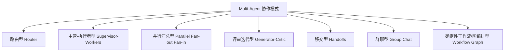
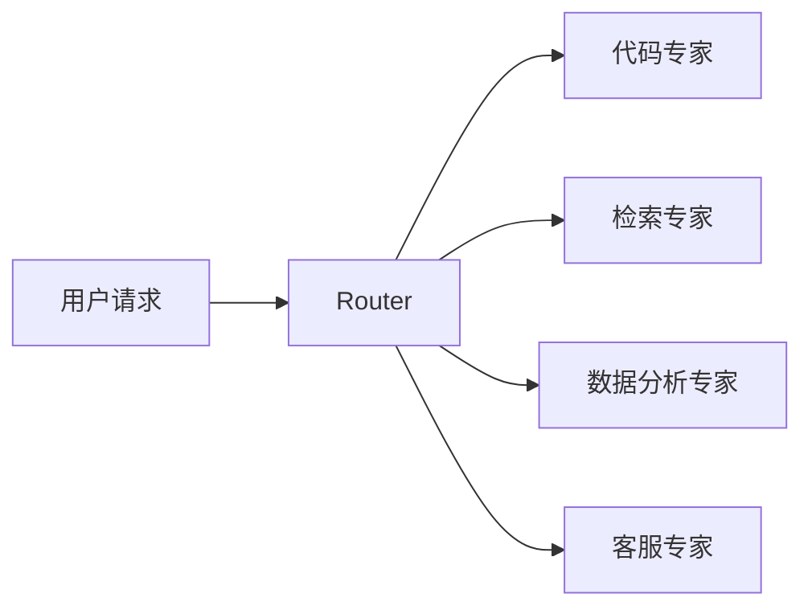
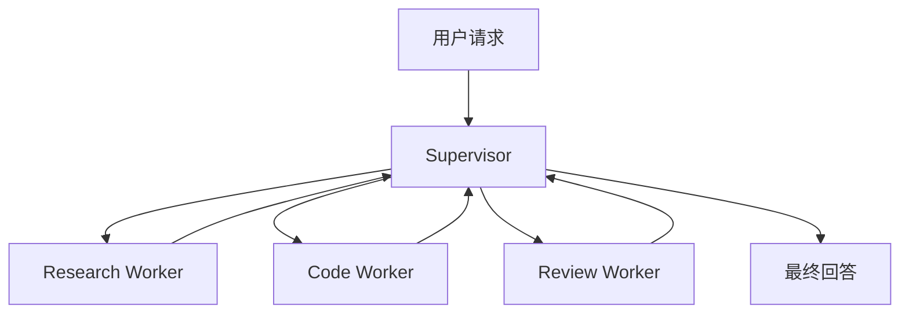
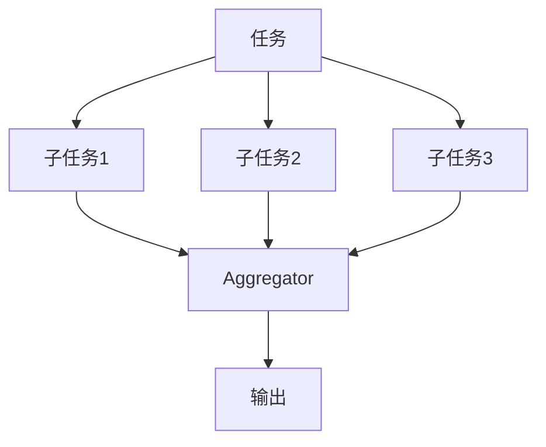
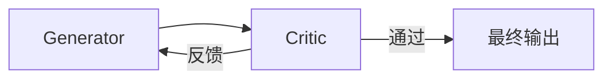
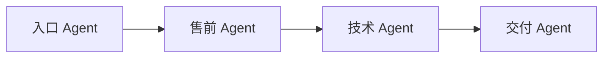
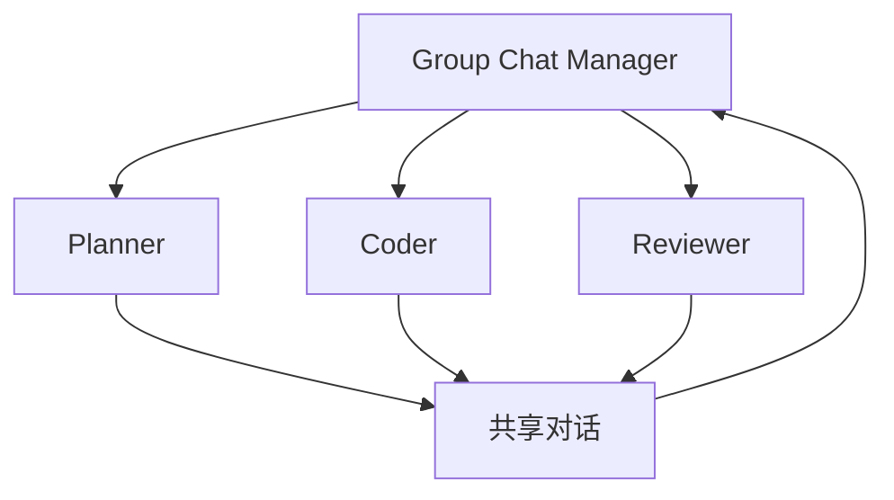
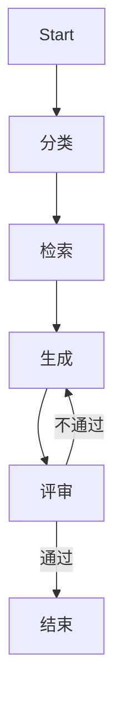

# Multi-Agent 协作模式分类总览

> 更新日期：2026-07-07
> 适用目标：面试/表达导向 + 工程落地导向 + 学习认知导向

## 1. 先给一个总判断

今天讲 multi-agent，不应该再把重点放在“多个角色一起聊天”上，而应该放在**任务如何拆分、控制权如何流动、上下文如何隔离、结果如何汇总**这四个问题上。

如果要一句话概括当前主流认知，可以这样说：

- 单 Agent 解决的是“一个智能体如何调用工具完成任务”
- Multi-Agent 解决的是“多个具备不同职责的智能体如何协作完成更复杂的任务”
- 真正成熟的 multi-agent 系统，本质上不是角色扮演，而是**带有分工、路由、控制流和状态管理的任务系统**

从工程角度看，当前最稳定的模式不是“自由群聊”，而是：

- 路由型
- 主管-执行者型
- 并行汇总型
- 评审迭代型
- 移交型
- 图工作流型

群聊型仍然存在，但更多是特定场景的表达方式，而不是默认最优解。

---

## 2. 面试里先怎么给出分类框架

如果在面试里被问到“multi-agent 有哪些模式”，一个比较稳的答法是：

> 我通常先按控制流来分类，而不是按角色名分类。主流 multi-agent 可以分成六类：路由型、主管-执行者型、并行汇总型、评审迭代型、移交型，以及确定性工作流/图编排型。  
> 如果需要补充更开放的形态，还可以再加群聊型。  
> 这几类模式的核心差异，不在于 agent 叫 planner、coder 还是 reviewer，而在于谁负责决策、谁持有上下文、任务能不能并行、以及失败以后怎么恢复。

这套答法有三个好处：

- 不会陷入“我见过哪个开源项目”的记忆题
- 能把概念和工程约束同时讲出来
- 后续可以自然过渡到选型、容错、可观测性和成本控制

---

## 3. 分类总图

可以把主流 multi-agent 模式理解成下面这张图：

理解这些模式时，建议始终抓住四个问题：

- **控制权在谁手里**
- **上下文是共享还是隔离**
- **协作是串行、并行还是循环**
- **最终结果由谁负责汇总**

---

## 4. 路由型 Router

### 4.1 定义

路由型是指先由一个入口 agent 或路由器判断任务属于哪一类，再把请求发送给最合适的 specialist agent。

它的核心不是“多个 agent 一起做”，而是“**先判断该谁做**”。

### 4.2 典型流程

### 4.3 适用场景

- 多领域问答
- 客服/工单分流
- 多技能 coding agent
- 一个统一入口下挂多个专家能力

### 4.4 优点

- 结构简单
- 成本可控
- specialist 上下文更干净
- 容易做权限隔离和工具裁剪

### 4.5 代价和风险

- 路由错了，后续全错
- 对跨领域复合任务支持一般
- router 本身可能成为单点瓶颈

### 4.6 面试里怎么讲

> Router 模式本质上是“分类再分发”。它适合请求类型比较明确、专家边界相对清晰的场景，比如客服、代码解释、数据分析、RAG 问答。它最大的价值是降低单个 agent 的上下文负担，但问题在于首跳决策一旦错了，后面的路径就全偏了，所以通常需要 fallback 或二次路由机制。

### 4.7 工程落地建议

- router 不一定非要用 LLM，可以先规则路由，再让模型补判断
- 给每个 specialist 独立工具集，不要全量透传
- 为“无法判定”保留兜底 agent
- 对路由结果做埋点，统计误分率

### 4.8 常见成熟实现

- LangChain / LangGraph 的 router + subagents 思路
- 客服场景下常见的 triage agent
- OpenAI Agents SDK 中的 triage + specialist 组合

---

## 5. 主管-执行者型 Supervisor-Workers

### 5.1 定义

主管-执行者型是当前最常见、也最工程化的 multi-agent 结构。一个 supervisor / orchestrator 负责拆解任务、分配子任务、收集结果、决定是否继续迭代。

本质上它回答的是：**复杂任务谁来总控**。

### 5.2 典型流程

### 5.3 适用场景

- 复杂研究任务
- 编码 agent
- 多步骤分析和汇总
- 需要中间审查、重试、改写的场景

### 5.4 优点

- 责任清晰
- 方便做状态管理
- 容易加入审批、预算、重试、回滚
- 最适合和工具调用、任务队列、日志系统结合

### 5.5 代价和风险

- supervisor 太弱会导致拆分不合理
- supervisor 太强会变成单点过载
- 汇总质量直接决定最终输出质量

### 5.6 面试里怎么讲

> Supervisor-Workers 是最主流的生产模式。因为它把决策和执行分开了，manager 负责计划与汇总，worker 负责局部任务。这样比自由多 agent 对话更容易控制上下文、成本、权限和重试策略。多数成熟框架最后都会收敛到这种模式，哪怕表面 API 名字不一样。

### 5.7 工程落地建议

- supervisor 自己尽量少做具体执行
- worker 返回结构化结果，不要只回大段自然语言
- 为每类 worker 定义清晰输入/输出契约
- supervisor 要记录每次委派理由和汇总依据，便于调试

### 5.8 常见成熟实现

- Anthropic 总结的 orchestrator-workers pattern
- OpenAI Agents SDK 的 `agents as tools`
- CrewAI 的 hierarchical process
- Google ADK 的 coordinator + subagents

---

## 6. 并行汇总型 Parallel Fan-out / Fan-in

### 6.1 定义

并行汇总型是把一个任务拆成多个彼此相对独立的子任务并行执行，最后再汇总到一个 synthesizer 或 aggregator。

它的重点不在“谁来想”，而在“**哪些部分可以同时做**”。

### 6.2 典型流程

### 6.3 适用场景

- 多来源资料搜集
- 多方案对比
- 多文件分析
- 多角度审查
- voting / judge 机制

### 6.4 优点

- 延迟更低
- 结果覆盖面更广
- 很适合研究和审查类任务

### 6.5 代价和风险

- 并行结果质量不一致
- 汇总器可能丢信息
- 任务拆分不独立时会重复劳动

### 6.6 面试里怎么讲

> Parallel fan-out / fan-in 适合“子问题相对独立”的任务。它的关键不是并行本身，而是 fan-in 汇总质量。工程里常见的做法是让多个 worker 并行收集证据，再由一个 synthesizer 汇总结论。它能显著提升吞吐和覆盖面，但前提是拆分边界足够清楚。

### 6.7 工程落地建议

- 只并行 truly independent 的子任务
- 汇总阶段要求保留来源引用
- 做好超时、部分失败和降级策略
- 对重复结果做去重或聚类

### 6.8 常见成熟实现

- Anthropic 的 parallelization pattern
- LangGraph 的并行分支
- Microsoft / Semantic Kernel 流程里的 fan-out / fan-in
- Google ADK 的 parallel workflow

---

## 7. 评审迭代型 Generator-Critic / Evaluator-Optimizer

### 7.1 定义

评审迭代型是一个 agent 先生成结果，另一个 agent 负责评审、打分、找问题，再驱动前者修改。它是一个闭环，而不是一次性委派。

### 7.2 典型流程

### 7.3 适用场景

- 代码生成与审查
- 文案、方案、PRD 打磨
- SQL、测试用例、配置文件校正
- 需要质量门禁的生成任务

### 7.4 优点

- 输出质量通常明显高于一次生成
- 易于显式引入质量标准
- 很适合和 deterministic checks 结合

### 7.5 代价和风险

- 成本更高
- 容易在局部循环过久
- critic 不够稳定时会制造噪声

### 7.6 面试里怎么讲

> Generator-Critic 模式适合对质量要求较高的生成任务。它相当于把“自我反思”外部化成两个角色，一个负责产出，一个负责审查。相比单 agent 自审，它更容易把标准显式化，也更适合接入自动评测、lint、测试和规则检查。

### 7.7 工程落地建议

- critic 要基于明确 rubric，而不是泛泛而谈
- 给循环设置上限，避免无限打磨
- 尽量让 critic 产出结构化缺陷列表
- 能交给静态检查器的，不要全靠 LLM critic

### 7.8 常见成熟实现

- Anthropic 的 evaluator-optimizer pattern
- 代码 agent 里的 coder + reviewer
- judge model / rubric-based evaluation pipelines

---

## 8. 移交型 Handoffs

### 8.1 定义

移交型不是 manager 一直持有控制权，而是当前 agent 认为“这轮应该由别人接管”，于是把控制权 handoff 给另一个 agent。

它的重点在于：**控制权转移，而不是子任务调用**。

### 8.2 典型流程

### 8.3 适用场景

- 长对话
- 客服分段处理
- 用户需要“直接和专家角色对话”的产品体验
- 任务阶段天然分明的流程

### 8.4 优点

- 用户体验自然
- 每一阶段 agent 职责清晰
- 适合把会话上下文分阶段整理

### 8.5 代价和风险

- handoff 时上下文传递很关键
- 容易出现角色边界不清
- 需要控制“谁有资格接管”

### 8.6 面试里怎么讲

> Handoff 模式和 supervisor 最大区别在于，supervisor 一直是总控，而 handoff 是控制权真的换人。它适合长会话或阶段式流程，比如从客服转技术支持，再转实施顾问。这个模式的难点不在工具调用，而在上下文打包和接管边界定义。

### 8.7 工程落地建议

- handoff 前做摘要和状态封装
- 明确 handoff contract，包括当前目标、已完成信息、待决事项
- 记录 handoff 原因，避免来回踢皮球
- 对循环 handoff 设置上限

### 8.8 常见成熟实现

- OpenAI Agents SDK 的 handoffs
- 一些客服/销售/交付型 agent 系统
- LangChain 文档中的 handoffs 模式

---

## 9. 群聊型 Group Chat

### 9.1 定义

群聊型是多个 agent 共享一个公共消息空间，由某个规则或 manager 决定谁下一轮发言。

这是最容易让人联想到“multi-agent”的模式，但不一定是最实用的模式。

### 9.2 典型流程

### 9.3 适用场景

- 创意讨论
- 头脑风暴
- 需要多角色显式对话的演示型系统
- 教学、实验和研究原型

### 9.4 优点

- 表达力强
- 角色互动直观
- 容易展示多视角推理

### 9.5 代价和风险

- token 开销高
- 容易重复发言
- 上下文污染严重
- 生产中难控成本和稳定性

### 9.6 面试里怎么讲

> Group chat 是最直观的 multi-agent 形态，但工程上往往不是默认优选。因为多个 agent 共用上下文会导致成本上升、冗余增加、责任边界变弱。它更适合创意协作、演示和研究，不一定适合高频生产任务。

### 9.7 工程落地建议

- 不要让所有 agent 永远全量共享历史
- 要有 speaker selection 机制
- 给每个角色限制输出目标，避免闲聊
- 最后仍需要一个汇总器收敛结果

### 9.8 常见成熟实现

- Microsoft AutoGen 的 group chat / selector group chat
- 一些 research demo 和教学项目

---

## 10. 确定性工作流 / 图编排型 Workflow Graph

### 10.1 定义

这类模式严格来说不一定是“自治 multi-agent”，但在工程里经常和 multi-agent 放在一起讨论。它的特点是：控制流主要由代码、图或状态机决定，而不是完全交给模型临场决定。

### 10.2 典型流程

### 10.3 适用场景

- 规则明确的企业流程
- 需要 checkpoint / resume 的系统
- 高稳定性要求场景
- 需要审批、人机协同、队列和持久化的系统

### 10.4 优点

- 可观测性强
- 易测试
- 易恢复
- 最适合接入人审、权限、状态机和作业系统

### 10.5 代价和风险

- 灵活性不如自治 agent
- 前期设计成本更高
- 图一旦复杂会变得难维护

### 10.6 面试里怎么讲

> Workflow/Graph 模式的重点是“用代码决定流程，用模型完成局部智能决策”。它非常适合生产系统，因为可观测、可恢复、可审批、可回放。很多所谓 multi-agent 系统，真正落地时最终都会收敛成 workflow + specialist agent 的混合形态。

### 10.7 工程落地建议

- 把可确定的流程写死，不要全交给 LLM
- 给节点定义输入输出 schema
- 加入 checkpoint、retry、timeout、HITL
- 用事件日志和 trace 记录每个节点

### 10.8 常见成熟实现

- LangGraph
- Google ADK workflow agents
- Microsoft Agent Framework / Semantic Kernel process framework

---

## 11. 这些模式之间是什么关系

学习时不要把这些模式看成互斥类别，它们在真实系统里经常组合出现。

最常见的组合是：

- `Router -> Supervisor -> Workers`
- `Supervisor -> Parallel Workers -> Aggregator`
- `Workflow Graph -> 某些节点内部再跑 specialist agent`
- `Generator -> Critic -> Deterministic checks`
- `Triage Agent -> Handoff to Specialist`

所以更准确的理解是：

- **模式是构件**
- **系统是拼装结果**

---

## 12. 当前行业趋势怎么理解

如果你看近两年的官方博客和框架演进，会发现一个明显趋势：

- 从“自由多角色对话”转向“更可控的任务编排”
- 从“人人共享一大段上下文”转向“上下文隔离和定向注入”
- 从“全靠模型自治”转向“模型决策 + 代码控制流混合”
- 从“演示感强”转向“可恢复、可观测、可审批、可计费”

换句话说，multi-agent 这件事越来越像后端系统设计问题，而不只是 prompt engineering 问题。

面试里可以直接用一句话收束：

> 我对 multi-agent 的理解，不是多加几个角色，而是如何把任务拆分、上下文、权限、状态和容错机制组织起来。真正成熟的方案通常会收敛到 router、supervisor、parallel、critic 和 workflow 这些基础模式的组合。

---

## 13. 工程上怎么选模式

可以先用下面这张速查表。

| 任务特征 | 更适合的模式 |
|---|---|
| 请求类型明确、专家边界清晰 | 路由型 |
| 任务复杂、需要统一总控 | 主管-执行者型 |
| 子问题可独立并行 | 并行汇总型 |
| 需要高质量打磨和审查 | 评审迭代型 |
| 长对话、阶段式服务流程 | 移交型 |
| 演示、创意协作、多视角讨论 | 群聊型 |
| 企业流程、审批恢复、强可观测 | 工作流/图编排型 |

如果要给一个更落地的经验判断：

- 能规则化的，先 workflow
- 能专门化的，拆 specialist
- 能并行的，再做 fan-out
- 质量要求高的，加 critic
- 长对话分阶段的，再考虑 handoff
- 不要默认上 group chat

---

## 14. 学习路线建议

如果是第一次系统学习 multi-agent，建议按这个顺序理解：

1. 先学 single-agent 的工具调用、记忆、上下文管理
2. 再学 router 和 supervisor，这两类最基础
3. 然后理解 parallel 和 critic，它们代表两类常见增强手段
4. 再看 handoff，理解控制权转移
5. 最后看 workflow/graph，把前面的模式装进工程系统

这样学习会比一开始就研究复杂群聊系统更稳。

---

## 15. 一段可直接复述的面试表达

如果让我用一段比较完整的话来回答“你怎么理解 multi-agent”，我会这样说：

> Multi-agent 不是简单地让多个角色同时和模型说话，而是把复杂任务拆成多个职责更清晰的智能体，并设计它们之间的控制流、上下文边界和结果汇总方式。  
> 我通常把它分成几类：第一类是 router，用来把请求分发给不同专家；第二类是 supervisor-workers，由一个总控拆任务和汇总结果；第三类是 parallel fan-out/fan-in，用并行提升吞吐和覆盖；第四类是 generator-critic，通过评审闭环提高质量；第五类是 handoff，适合长对话中的控制权转移；第六类是 workflow/graph，更强调确定性流程和工程可控性。  
> 从生产角度看，当前主流趋势不是自由群聊，而是这些基础模式的组合，再配合权限、可观测性、checkpoint、重试和人审机制落地。

---

## 16. 相关延伸阅读

- [AI 编码 Agent 多 Agent 机制对比（源码校对版）](./multi-agent.md)
- [Codex Prompt Strategy](./codex-prompt-strategy.md)
- [Claude Code Prompt Strategy](./claude-code-prompt-strategy.md)
- [Tool System](./tool-system.md)
- [Context Management](./context-management.md)
